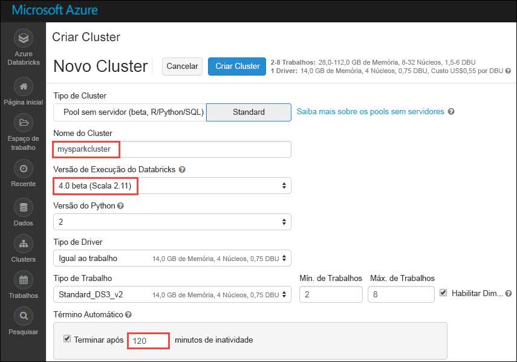

# <a name="tutorial-sentiment-analysis-on-streaming-data-using-azure-databricks"></a>Tutorial: Análise de sentimento em dados de transmissão usando o Azure Databricks

Neste tutorial, você aprenderá a executar a análise de sentimento quase em tempo real em um fluxo dados usando o Azure Databricks. Configure o sistema de ingestão de dados usando os Hubs de Eventos do Azure. Você pode consumir as mensagens dos Hubs de Eventos no Azure Databricks usando o conector de Hubs de Eventos do Spark. Finalmente, você deve usar as APIs dos Serviços Cognitivos da Microsoft para executar a análise de sentimento nos dados de streaming.

No final deste tutorial, você terá transmitido tweets do Twitter que têm o termo "Azure" neles e executado análise de sentimento nos tweets.

A ilustração a seguir mostra o fluxo do aplicativo:


Este tutorial cobre as seguintes tarefas:

> [!div class="checklist"]
> * Criar um workspace do Azure Databricks
> * Criar um cluster Spark no Azure Databricks
> * Criar um aplicativo do Twitter para acessar dados de streaming
> * Criar blocos de notas no Azure Databricks
> * Anexar bibliotecas para Hubs de Eventos e API do Twitter
> * Criar uma conta dos Serviços Cognitivos da Microsoft e recuperar a chave de acesso
> * Enviar tweets para Hubs de Eventos
> * Ler tweets de Hubs de Eventos
> * Executar análise de sentimento em tweets

Se você não tiver uma assinatura do Azure, [crie uma conta gratuita](https://azure.microsoft.com/free/) antes de começar.

## <a name="prerequisites"></a>pré-requisitos

Antes de iniciar este tutorial, verifique se você atende aos seguintes requisitos:
- Um namespace dos Hubs de Eventos do Azure.
- Um Hub de Eventos dentro do namespace.
- Cadeia de conexão para acessar o namespace dos Hubs de Eventos. A cadeia de conexão deve ter um formato semelhante a `Endpoint=sb://<namespace>.servicebus.windows.net/;SharedAccessKeyName=<key name>;SharedAccessKey=<key value>`.
- Nome da política de acesso e chave da política compartilhados para os Hubs de Eventos.

Você pode atender a esses requisitos executando as etapas no artigo [Criar um namespace dos Hubs de Eventos do Azure e um hub de eventos](../event-hubs/event-hubs-create.md).

## <a name="log-in-to-the-azure-portal"></a>Faça logon no Portal do Azure

Faça logon no [Portal do Azure](https://portal.azure.com/).

## <a name="create-an-azure-databricks-workspace"></a>Criar um workspace do Azure Databricks

Nesta seção, você deve cria um workspace do Azure Databricks usando o Portal do Azure.

1. No Portal do Azure, selecione **Criar um recurso** > **Dados + Análise** > **Azure Databricks**.

    

3. Em **Serviço do Azure Databricks**, forneça os valores para criar um workspace do Databricks.

    

    Forneça os seguintes valores:

    |Propriedade  |DESCRIÇÃO  |
    |---------|---------|
    |**Nome do workspace**     | Forneça um nome para seu workspace do Databricks        |
    |**Assinatura**     | Na lista suspensa, selecione sua assinatura do Azure.        |
    |**Grupo de recursos**     | Especifique se deseja criar um novo grupo de recursos ou usar um existente. Um grupo de recursos é um contêiner que mantém os recursos relacionados a uma solução do Azure. Para obter mais informações, consulte [Visão geral do Grupo de Recursos do Azure](../azure-resource-manager/resource-group-overview.md). |
    |**Localidade**     | Selecione **Leste dos EUA 2**. Para outras regiões disponíveis, consulte [serviços do Azure por região](https://azure.microsoft.com/regions/services/).        |
    |**Tipo de preço**     |  Escolha entre o cluster **Standard** e o **Premium**. Para saber mais sobre essas camadas, confira [Página de preços do Databricks](https://azure.microsoft.com/pricing/details/databricks/).       |

    Selecione **Fixar no painel** e depois **Criar**.

4. A criação da conta leva alguns minutos. Durante a criação da conta, o portal exibe o bloco **Enviando a implantação para o Azure Databricks** no lado direito. Talvez seja necessário rolar diretamente no painel para ver o bloco. Também é exibida na parte superior da tela de uma barra de progresso. Você pode assistir a área de andamento.

    

## <a name="create-a-spark-cluster-in-databricks"></a>Criar um cluster Spark no Databricks

1. No portal do Azure, vá para o workspace do Databricks que você criou e selecione **Inicializar Workspace**.

2. Você é redirecionado para o portal do Azure Databricks. No portal, selecione **Cluster**.

    

3. Na página **Novo cluster**, forneça os valores para criar um cluster.

    

    Aceite todos os outros valores padrão que não sejam o seguinte:

    * Insira um nome para o cluster.
    * Neste artigo, crie um cluster com o tempo de execução **4.0 (beta)**.
    * Verifique se você marcou a caixa de seleção **Terminar depois de \_\_ minutos de inatividade**. Forneça uma duração (em minutos) para encerrar o cluster caso ele não esteja sendo usado.

    Selecione **Criar cluster**. Quando o cluster está em execução, você pode anexar blocos de notas a ele e executar trabalhos do Spark.

## <a name="create-a-twitter-application"></a>Criar um aplicativo do Twitter

Para receber uma transmissão de tweets, você deve criar um aplicativo no Twitter. Siga as etapas para criar um aplicativo do Twitter e registre os valores necessários para concluir este tutorial.

1. Em um navegador da Web, vá para [Gerenciamento de Aplicativo do Twitter](https://apps.twitter.com/) e selecione **Criar Novo Aplicativo**.

    

2. Na página **Criar um aplicativo**, forneça os detalhes para o novo aplicativo e selecione **Criar seu aplicativo do Twitter**.

    

3. Na página do aplicativo, selecione a guia **Chaves e Tokens de Acesso** e copie os valores de **Chave do Consumidor** e **Segredo do Consumidor**. Além disso, selecione **Criar meu token de acesso** para gerar os tokens de acesso. Copie os valores do **Token de Acesso** e do **Segredo do Token de Acesso**.

    

Salve os valores recuperados do aplicativo do Twitter. Mais tarde, você precisará desses valores neste tutorial.

## <a name="attach-libraries-to-spark-cluster"></a>Anexar bibliotecas do cluster Spark

Neste tutorial, você usará as APIs do Twitter para enviar tweets aos Hubs de Eventos. Também usará o [Conector de Hubs de Eventos do Apache Spark](https://github.com/Azure/azure-event-hubs-spark) para ler e gravar dados nos Hubs de Eventos do Azure. Para usar essas APIs como parte do cluster, adicione-as como bibliotecas do Azure Databricks, depois as associe ao seu cluster Spark. As instruções a seguir mostram como adicionar a biblioteca à pasta **Compartilhada** no workspace.

1.  No workspace do Azure Databricks, selecione **Workspace**, depois clique com botão direito do mouse em **Compartilhado**. No menu de contexto, selecione **Criar** > **Biblioteca**.

    

2. Na página Nova Biblioteca, em **Fonte**, selecione **Coordenada Maven**. Em **Coordenada**, insira a coordenada para o pacote que deseja adicionar. Estas são as coordenadas Maven para as bibliotecas usadas neste tutorial:

    * Conector dos Hubs de Eventos do Spark – `com.microsoft.azure:azure-eventhubs-spark_2.11:2.3.5`
    * API do Twitter – `org.twitter4j:twitter4j-core:4.0.6`

    

3. Selecione **Criar Biblioteca**.

4. Selecione a pasta em que você adicionou a biblioteca e selecione o nome da biblioteca.

    

5. Na página da biblioteca, selecione o cluster no qual deseja usar a biblioteca. Assim que a biblioteca for associada ao cluster com êxito, o status será alterado imediatamente para **Anexada**.

    

6. Repita essas etapas para o pacote do Twitter, `twitter4j-core:4.0.6`.

## <a name="get-a-cognitive-services-access-key"></a>Obter uma chave de acesso dos Serviços Cognitivos

Neste tutorial, você usará as [APIs de Análise de Texto dos Serviços Cognitivos da Microsoft](../cognitive-services/text-analytics/overview.md) para executar a análise de sentimento em um fluxo de tweets em tempo quase real. Antes de usar as APIs, é necessário criar uma conta dos Serviços Cognitivos da Microsoft no Azure e recuperar uma chave de acesso para usar as APIs de Análise de Texto.

1. Entre no [Portal do Azure](https://portal.azure.com/).

2. Selecione **+ Criar um recurso**.

3. No Azure Marketplace, selecione **IA + Serviços Cognitivos** > **API de Análise de Texto**.

    

4. Na caixa de diálogo **Criar**, forneça os seguintes valores:

    

    - Insira um nome para a conta dos Serviços Cognitivos.
    - Selecione a assinatura do Azure na qual a conta é criada.
    - Selecione um local do Azure.
    - Selecione um tipo de preço para o serviço. Para saber mais sobre preços dos Serviços Cognitivos, confira a [página de preços](https://azure.microsoft.com/pricing/details/cognitive-services/).
    - Especifique se deseja criar um grupo de recursos ou selecionar um existente.

    Selecione **Criar**.

5. Depois que a conta é criada, na guia **Visão geral**, selecione **Mostrar chaves de acesso**.

    

    Além disso, copie uma parte da URL do ponto de extremidade, conforme mostrado na captura de tela. Você precisa dessa URL no tutorial.

6. Em **Gerenciar chaves**, selecione o ícone de cópia em relação à chave que você deseja usar.

    

7. Salve os valores para a URL do ponto de extremidade e a chave de acesso recuperada nesta etapa. Você precisará dele posteriormente neste tutorial.

## <a name="create-notebooks-in-databricks"></a>Criar blocos de notas no Databricks

Nesta seção, você criará dois blocos de notas no workspace do Databricks com os seguintes nomes

- **SendTweetsToEventHub** – um bloco de notas de produtor que você usa para obter tweets do Twitter e transmiti-los para Hubs de Eventos.
- **AnalyzeTweetsFromEventHub** – um bloco de anotações do consumidor que você usa para ler os tweets dos Hubs de Eventos e executar análise de sentimento.

1. No painel esquerdo, escolha **Workspace**. Na lista suspensa **Workspace**, selecione **Criar**e selecione **Bloco de Anotações**.

    

2. Na caixa de diálogo **Criar Bloco de Notas**, insira **SendTweetsToEventHub**, selecione **Scala** como a linguagem e selecione o cluster Spark criado anteriormente.

    

    Selecione **Criar**.

3. Repita as etapas para criar o bloco de notas de **AnalyzeTweetsFromEventHub**.

## <a name="send-tweets-to-event-hubs"></a>Enviar tweets para Hubs de Eventos

No notebook **SendTweetsToEventHub**, cole o código a seguir e substitua o espaço reservado por valores do namespace de Hubs de Eventos e do aplicativo do Twitter criado anteriormente. Esse bloco de anotações transmite tweets com a palavra-chave “Azure” para os Hubs de Eventos em tempo real.

```scala
import java.util._
import scala.collection.JavaConverters._
import com.microsoft.azure.eventhubs._
import java.util.concurrent._

val namespaceName = "<EVENT HUBS NAMESPACE>"
val eventHubName = "<EVENT HUB NAME>"
val sasKeyName = "<POLICY NAME>"
val sasKey = "<POLICY KEY>"
val connStr = new ConnectionStringBuilder()
            .setNamespaceName(namespaceName)
            .setEventHubName(eventHubName)
            .setSasKeyName(sasKeyName)
            .setSasKey(sasKey)

val pool = Executors.newFixedThreadPool(1)
val eventHubClient = EventHubClient.create(connStr.toString(), pool)

def sendEvent(message: String) = {
  val messageData = EventData.create(message.getBytes("UTF-8"))
  eventHubClient.get().send(messageData)
  System.out.println("Sent event: " + message + "\n")
}

import twitter4j._
import twitter4j.TwitterFactory
import twitter4j.Twitter
import twitter4j.conf.ConfigurationBuilder

// Twitter configuration!
// Replace values below with yours

val twitterConsumerKey = "<CONSUMER KEY>"
val twitterConsumerSecret = "<CONSUMER SECRET>"
val twitterOauthAccessToken = "<ACCESS TOKEN>"
val twitterOauthTokenSecret = "<TOKEN SECRET>"

val cb = new ConfigurationBuilder()
  cb.setDebugEnabled(true)
  .setOAuthConsumerKey(twitterConsumerKey)
  .setOAuthConsumerSecret(twitterConsumerSecret)
  .setOAuthAccessToken(twitterOauthAccessToken)
  .setOAuthAccessTokenSecret(twitterOauthTokenSecret)

val twitterFactory = new TwitterFactory(cb.build())
val twitter = twitterFactory.getInstance()

// Getting tweets with keyword "Azure" and sending them to the Event Hub in realtime!

val query = new Query(" #Azure ")
query.setCount(100)
query.lang("en")
var finished = false
while (!finished) {
  val result = twitter.search(query)
  val statuses = result.getTweets()
  var lowestStatusId = Long.MaxValue
  for (status <- statuses.asScala) {
    if(!status.isRetweet()){
      sendEvent(status.getText())
    }
    lowestStatusId = Math.min(status.getId(), lowestStatusId)
    Thread.sleep(2000)
  }
  query.setMaxId(lowestStatusId - 1)
}

// Closing connection to the Event Hub
 eventHubClient.get().close()
```

Para executar o bloco de notas, pressione **SHIFT+ENTER**. Você verá uma saída, conforme mostrado no snippet de código a seguir. Cada evento na saída é um tweet ingerido pelos Hubs de Eventos.

    Sent event: @Microsoft and @Esri launch Geospatial AI on Azure https://t.co/VmLUCiPm6q via @geoworldmedia #geoai #azure #gis #ArtificialIntelligence

    Sent event: Public preview of Java on App Service, built-in support for Tomcat and OpenJDK
    https://t.co/7vs7cKtvah
    #cloudcomputing #Azure

    Sent event: 4 Killer #Azure Features for #Data #Performance https://t.co/kpIb7hFO2j by @RedPixie

    Sent event: Migrate your databases to a fully managed service with Azure SQL Database Managed Instance | #Azure | #Cloud https://t.co/sJHXN4trDk

    Sent event: Top 10 Tricks to #Save Money with #Azure Virtual Machines https://t.co/F2wshBXdoz #Cloud

    ...
    ...

## <a name="read-tweets-from-event-hubs"></a>Ler tweets de Hubs de Eventos

No bloco de notas de **AnalyzeTweetsFromEventHub**, cole o código a seguir e substitua os espaços reservados por valores dos Hubs de Eventos do Azure que você criou anteriormente. Este bloco de anotações lê os tweets transmitidos anteriormente aos Hubs de Eventos usando o bloco de anotações  **SendTweetsToEventHub**.

```scala
import org.apache.spark.eventhubs._

// Build connection string with the above information
val connectionString = ConnectionStringBuilder("<EVENT HUBS CONNECTION STRING>")
  .setEventHubName("<EVENT HUB NAME>")
  .build

val customEventhubParameters =
  EventHubsConf(connectionString)
  .setMaxEventsPerTrigger(5)

val incomingStream = spark.readStream.format("eventhubs").options(customEventhubParameters.toMap).load()

incomingStream.printSchema

// Sending the incoming stream into the console.
// Data comes in batches!
incomingStream.writeStream.outputMode("append").format("console").option("truncate", false).start().awaitTermination()
```

Você obterá a seguinte saída:

    root
     |-- body: binary (nullable = true)
     |-- offset: long (nullable = true)
     |-- seqNumber: long (nullable = true)
     |-- enqueuedTime: long (nullable = true)
     |-- publisher: string (nullable = true)
     |-- partitionKey: string (nullable = true)

    -------------------------------------------
    Batch: 0
    -------------------------------------------
    +------+------+--------------+---------------+---------+------------+
    |body  |offset|sequenceNumber|enqueuedTime   |publisher|partitionKey|
    +------+------+--------------+---------------+---------+------------+
    |[50 75 62 6C 69 63 20 70 72 65 76 69 65 77 20 6F 66 20 4A 61 76 61 20 6F 6E 20 41 70 70 20 53 65 72 76 69 63 65 2C 20 62 75 69 6C 74 2D 69 6E 20 73 75 70 70 6F 72 74 20 66 6F 72 20 54 6F 6D 63 61 74 20 61 6E 64 20 4F 70 65 6E 4A 44 4B 0A 68 74 74 70 73 3A 2F 2F 74 2E 63 6F 2F 37 76 73 37 63 4B 74 76 61 68 20 0A 23 63 6C 6F 75 64 63 6F 6D 70 75 74 69 6E 67 20 23 41 7A 75 72 65]                              |0     |0             |2018-03-09 05:49:08.86 |null     |null        |
    |[4D 69 67 72 61 74 65 20 79 6F 75 72 20 64 61 74 61 62 61 73 65 73 20 74 6F 20 61 20 66 75 6C 6C 79 20 6D 61 6E 61 67 65 64 20 73 65 72 76 69 63 65 20 77 69 74 68 20 41 7A 75 72 65 20 53 51 4C 20 44 61 74 61 62 61 73 65 20 4D 61 6E 61 67 65 64 20 49 6E 73 74 61 6E 63 65 20 7C 20 23 41 7A 75 72 65 20 7C 20 23 43 6C 6F 75 64 20 68 74 74 70 73 3A 2F 2F 74 2E 63 6F 2F 73 4A 48 58 4E 34 74 72 44 6B]            |168   |1             |2018-03-09 05:49:24.752|null     |null        |
    +------+------+--------------+---------------+---------+------------+

    -------------------------------------------
    Batch: 1
    -------------------------------------------
    ...
    ...

Como a saída está em um modo binário, use o snippet de código a seguir para convertê-la em cadeia de caracteres.

```scala
import org.apache.spark.sql.types._
import org.apache.spark.sql.functions._

// Event Hub message format is JSON and contains "body" field
// Body is binary, so we cast it to string to see the actual content of the message
val messages =
  incomingStream
  .withColumn("Offset", $"offset".cast(LongType))
  .withColumn("Time (readable)", $"enqueuedTime".cast(TimestampType))
  .withColumn("Timestamp", $"enqueuedTime".cast(LongType))
  .withColumn("Body", $"body".cast(StringType))
  .select("Offset", "Time (readable)", "Timestamp", "Body")

messages.printSchema

messages.writeStream.outputMode("append").format("console").option("truncate", false).start().awaitTermination()
```

Agora a saída é semelhante ao seguinte snippet de código:

    root
     |-- Offset: long (nullable = true)
     |-- Time (readable): timestamp (nullable = true)
     |-- Timestamp: long (nullable = true)
     |-- Body: string (nullable = true)

    -------------------------------------------
    Batch: 0
    -------------------------------------------
    +------+-----------------+----------+-------+
    |Offset|Time (readable)  |Timestamp |Body
    +------+-----------------+----------+-------+
    |0     |2018-03-09 05:49:08.86 |1520574548|Public preview of Java on App Service, built-in support for Tomcat and OpenJDK
    https://t.co/7vs7cKtvah
    #cloudcomputing #Azure          |
    |168   |2018-03-09 05:49:24.752|1520574564|Migrate your databases to a fully managed service with Azure SQL Database Managed Instance | #Azure | #Cloud https://t.co/sJHXN4trDk    |
    |0     |2018-03-09 05:49:02.936|1520574542|@Microsoft and @Esri launch Geospatial AI on Azure https://t.co/VmLUCiPm6q via @geoworldmedia #geoai #azure #gis #ArtificialIntelligence|
    |176   |2018-03-09 05:49:20.801|1520574560|4 Killer #Azure Features for #Data #Performance https://t.co/kpIb7hFO2j by @RedPixie                                                    |
    +------+-----------------+----------+-------+
    -------------------------------------------
    Batch: 1
    -------------------------------------------
    ...
    ...

Agora você transmitiu dados dos Hubs de Eventos do Azure para o Azure Databricks quase em tempo real usando o conector dos Hubs de Eventos para o Apache Spark. Para obter mais informações sobre como usar o conector dos Hubs de Eventos para o Spark, veja a [documentação do conector](https://github.com/Azure/azure-event-hubs-spark/tree/master/docs).

## <a name="run-sentiment-analysis-on-tweets"></a>Executar análise de sentimento em tweets

Nesta seção, você pode executar análise de sentimento nos tweets recebidos pela API do Twitter. Para esta seção, você deve adicionar os snippets de código ao mesmo bloco de anotações **AnalyzeTweetsFromEventHub**.

Comece adicionando uma nova célula de código ao bloco de anotações e cole o snippet de código abaixo. Esse snippet de código define os tipos de dados para trabalhar com a API de Idioma e Sentimento.

```scala
import java.io._
import java.net._
import java.util._

case class Language(documents: Array[LanguageDocuments], errors: Array[Any]) extends Serializable
case class LanguageDocuments(id: String, detectedLanguages: Array[DetectedLanguages]) extends Serializable
case class DetectedLanguages(name: String, iso6391Name: String, score: Double) extends Serializable

case class Sentiment(documents: Array[SentimentDocuments], errors: Array[Any]) extends Serializable
case class SentimentDocuments(id: String, score: Double) extends Serializable

case class RequestToTextApi(documents: Array[RequestToTextApiDocument]) extends Serializable
case class RequestToTextApiDocument(id: String, text: String, var language: String = "") extends Serializable
```

Adicione uma nova célula de código e cole o snippet de código abaixo. Esse snippet de código define um objeto que contém funções para chamar a API de Análise de Texto para executar a detecção do idioma e a análise de sentimento. Substitua os espaços reservados, `<PROVIDE ACCESS KEY HERE>` e `<PROVIDE REGION HERE>`, pelos valores recuperados para sua conta dos Serviços Cognitivos.

```scala
import javax.net.ssl.HttpsURLConnection
import com.google.gson.Gson
import com.google.gson.GsonBuilder
import com.google.gson.JsonObject
import com.google.gson.JsonParser
import scala.util.parsing.json._

object SentimentDetector extends Serializable {

    // Cognitive Services API connection settings
    val accessKey = "<PROVIDE ACCESS KEY HERE>"
    val host = "https://<PROVIDE REGION HERE>.api.cognitive.microsoft.com"
    val languagesPath = "/text/analytics/v2.0/languages"
    val sentimentPath = "/text/analytics/v2.0/sentiment"
    val languagesUrl = new URL(host+languagesPath)
    val sentimenUrl = new URL(host+sentimentPath)
    val g = new Gson

    def getConnection(path: URL): HttpsURLConnection = {
        val connection = path.openConnection().asInstanceOf[HttpsURLConnection]
        connection.setRequestMethod("POST")
        connection.setRequestProperty("Content-Type", "text/json")
        connection.setRequestProperty("Ocp-Apim-Subscription-Key", accessKey)
        connection.setDoOutput(true)
        return connection
    }

    def prettify (json_text: String): String = {
        val parser = new JsonParser()
        val json = parser.parse(json_text).getAsJsonObject()
        val gson = new GsonBuilder().setPrettyPrinting().create()
        return gson.toJson(json)
    }

    // Handles the call to Cognitive Services API.
    def processUsingApi(request: RequestToTextApi, path: URL): String = {
        val requestToJson = g.toJson(request)
        val encoded_text = requestToJson.getBytes("UTF-8")
        val connection = getConnection(path)
        val wr = new DataOutputStream(connection.getOutputStream())
        wr.write(encoded_text, 0, encoded_text.length)
        wr.flush()
        wr.close()

        val response = new StringBuilder()
        val in = new BufferedReader(new InputStreamReader(connection.getInputStream()))
        var line = in.readLine()
        while (line != null) {
            response.append(line)
            line = in.readLine()
        }
        in.close()
        return response.toString()
    }

    // Calls the language API for specified documents.
    def getLanguage (inputDocs: RequestToTextApi): Option[Language] = {
        try {
            val response = processUsingApi(inputDocs, languagesUrl)
            // In case we need to log the json response somewhere
            val niceResponse = prettify(response)
            // Deserializing the JSON response from the API into Scala types
            val language = g.fromJson(niceResponse, classOf[Language])
            if (language.documents(0).detectedLanguages(0).iso6391Name == "(Unknown)")
                return None
            return Some(language)
        } catch {
            case e: Exception => return None
        }
    }

    // Calls the sentiment API for specified documents. Needs a language field to be set for each of them.
    def getSentiment (inputDocs: RequestToTextApi): Option[Sentiment] = {
        try {
            val response = processUsingApi(inputDocs, sentimenUrl)
            val niceResponse = prettify(response)
            // Deserializing the JSON response from the API into Scala types
            val sentiment = g.fromJson(niceResponse, classOf[Sentiment])
            return Some(sentiment)
        } catch {
            case e: Exception => return None
        }
    }
}
```

Adicione outra célula para definir uma UDF (função definida pelo usuário) de Spark que determina o sentimento.

```scala
// User Defined Function for processing content of messages to return their sentiment.
val toSentiment =
    udf((textContent: String) =>
        {
            val inputObject = new RequestToTextApi(Array(new RequestToTextApiDocument(textContent, textContent)))
            val detectedLanguage = SentimentDetector.getLanguage(inputObject)
            detectedLanguage match {
                case Some(language) =>
                    if(language.documents.size > 0) {
                        inputObject.documents(0).language = language.documents(0).detectedLanguages(0).iso6391Name
                        val sentimentDetected = SentimentDetector.getSentiment(inputObject)
                        sentimentDetected match {
                            case Some(sentiment) => {
                                if(sentiment.documents.size > 0) {
                                    sentiment.documents(0).score.toString()
                                }
                                else {
                                    "Error happened when getting sentiment: " + sentiment.errors(0).toString
                                }
                            }
                            case None => "Couldn't detect sentiment"
                        }
                    }
                    else {
                        "Error happened when getting language" + language.errors(0).toString
                    }
                case None => "Couldn't detect language"
            }
        }
    )
```

Adicione uma célula de código final para preparar um dataframe com o conteúdo do tweet e o sentimento associado a ele.

```scala
// Prepare a dataframe with Content and Sentiment columns
val streamingDataFrame = incomingStream.selectExpr("cast (body as string) AS Content").withColumn("Sentiment", toSentiment($"Content"))

// Display the streaming data with the sentiment
streamingDataFrame.writeStream.outputMode("append").format("console").option("truncate", false).start().awaitTermination()
```

Você deverá algo semelhante ao seguinte snippet:

    -------------------------------------------
    Batch: 0
    -------------------------------------------
    +--------------------------------+------------------+
    |Content                         |Sentiment         |
    +--------------------------------+------------------+
    |Public preview of Java on App Service, built-in support for Tomcat and OpenJDK
    https://t.co/7vs7cKtvah   #cloudcomputing #Azure          |0.7761918306350708|
    |Migrate your databases to a fully managed service with Azure SQL Database Managed Instance | #Azure | #Cloud https://t.co/sJHXN4trDk    |0.8558163642883301|
    |@Microsoft and @Esri launch Geospatial AI on Azure https://t.co/VmLUCiPm6q via @geoworldmedia #geoai #azure #gis #ArtificialIntelligence|0.5               |
    |4 Killer #Azure Features for #Data #Performance https://t.co/kpIb7hFO2j by @RedPixie                                                    |0.5               |
    +--------------------------------+------------------+

Um valor perto **1** na coluna **Sentimento** sugere uma ótima experiência com o Azure. Um valor perto de **0** sugere problemas que os usuários enfrentam ao trabalhar com o Microsoft Azure.

É isso! Usando o Azure Databricks, você transmitiu com êxito dados para os Hubs de Eventos do Azure, consumiu os dados de fluxo usando o conector dos Hubs de Eventos e executou análise de sentimento nos dados de streaming quse em tempo real.

## <a name="clean-up-resources"></a>Limpar recursos

Depois de terminar de executar o tutorial, você poderá encerrar o cluster. Para isso, no workspace do Azure Databricks, no painel esquerdo, selecione **Clusters**. No cluster que deseja encerrar, mova o cursor sobre o botão de reticências na coluna **Ações** e selecione o ícone **Terminar**.


Se você não encerrar o cluster manualmente, ele será interrompido automaticamente, desde que você tenha selecionado a caixa de seleção **Terminar depois de \_\_ minutos de inatividade** ao criar o cluster. Nesse caso, o cluster será interrompido automaticamente se ficar inativo durante o tempo especificado.

## <a name="next-steps"></a>Próximas etapas
Neste tutorial, você aprendeu a usar o Azure Databricks para transmitir dados para os Hubs de Eventos do Azure e ler os dados de streaming dos Hubs de Eventos em tempo real. Você aprendeu como:
> [!div class="checklist"]
> * Criar um workspace do Azure Databricks
> * Criar um cluster Spark no Azure Databricks
> * Criar um aplicativo do Twitter para acessar dados de streaming
> * Criar blocos de notas no Azure Databricks
> * Adicionar e anexar bibliotecas para Hubs de Eventos e API do Twitter
> * Criar uma conta dos Serviços Cognitivos da Microsoft e recuperar a chave de acesso
> * Enviar tweets para Hubs de Eventos
> * Ler tweets de Hubs de Eventos
> * Executar análise de sentimento em tweets

Avance para o próximo tutorial a fim de saber mais sobre como executar tarefas de aprendizado de máquina usando o Azure Databricks.

> [!div class="nextstepaction"]
>[Aprendizado de máquina usando o Azure Databricks ](https://docs.azuredatabricks.net/spark/latest/mllib/decision-trees.html)
