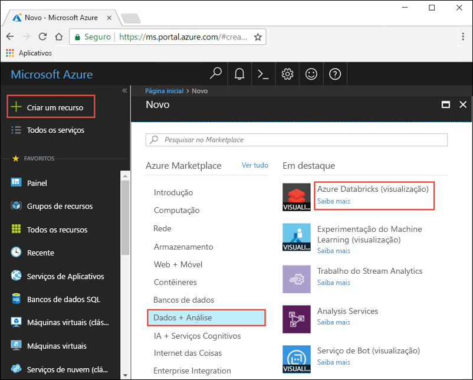

# <a name="tutorial-stream-data-into-azure-databricks-using-event-hubs"></a>Tutorial: Transmitir dados para o Azure Databricks usando Hubs de Eventos

> [!IMPORTANT]
> A criação do aplicativo Twitter não está mais disponível por meio de [apps.twitter.com](https://apps.twitter.com/). Este tutorial está em processo de atualização para inclusão da nova API do Twitter.

Neste tutorial, você conectará um sistema de ingestão de dados do Azure Databricks para transmitir dados a um cluster do Apache Spark em tempo quase real. Configure o sistema de ingestão de dados usando Hubs de Eventos do Azure, depois conecte-o ao Azure Databricks para processar as mensagens sendo recebidas. Para acessar uma transmissão de dados em tempo real, use APIs do Twitter para incluir tweets nos Hubs de Eventos. Assim que tiver os dados no Azure Databricks, é possível executar trabalhos analíticos para analisar melhor os dados. 

No final deste tutorial, você terá transmitido tweets do Twitter (que têm o termo “Azure” neles) e lê os tweets no Azure Databricks.

A ilustração a seguir mostra o fluxo do aplicativo:


Este tutorial cobre as seguintes tarefas:

> [!div class="checklist"]
> * Criar um workspace do Azure Databricks
> * Criar um cluster Spark no Azure Databricks
> * Criar um aplicativo do Twitter para acessar dados de streaming
> * Criar blocos de notas no Azure Databricks
> * Anexar bibliotecas para Hubs de Eventos e a API do Twitter
> * Enviar tweets para Hubs de Eventos
> * Ler tweets de Hubs de Eventos

Se você não tiver uma assinatura do Azure, [crie uma conta gratuita](https://azure.microsoft.com/free/) antes de começar.

> [!Note]
> Este tutorial não pode ser realizado usando a **Assinatura de avaliação gratuita do Azure**.
> Para usar uma conta gratuita para criar o cluster do Azure Databricks, antes de criar o cluster, vá até o seu perfil e altere sua assinatura para **pré-pago**. Para saber mais, confira [Conta gratuita do Azure](https://azure.microsoft.com/free/).

## <a name="prerequisites"></a>Pré-requisitos

Antes de iniciar este tutorial, verifique se você atende aos seguintes requisitos:
- Um namespace dos Hubs de Eventos do Azure.
- Um Hub de Eventos dentro do namespace.
- Cadeia de conexão para acessar o namespace dos Hubs de Eventos. A cadeia de conexão deve ter um formato semelhante a `Endpoint=sb://<namespace>.servicebus.windows.net/;SharedAccessKeyName=<key name>;SharedAccessKey=<key value>`.
- Nome da política de acesso e chave da política compartilhados para os Hubs de Eventos.

Você pode atender a esses requisitos executando as etapas no artigo [Criar um namespace dos Hubs de Eventos do Azure e um hub de eventos](../event-hubs/event-hubs-create.md).

## <a name="log-in-to-the-azure-portal"></a>Faça logon no Portal do Azure

Faça logon no [Portal do Azure](https://portal.azure.com/).

## <a name="create-an-azure-databricks-workspace"></a>Criar um workspace do Azure Databricks

Nesta seção, você deve cria um workspace do Azure Databricks usando o Portal do Azure.

1. No Portal do Azure, selecione **Criar um recurso** > **Dados + Análise** > **Azure Databricks**.

    

3. Em **Serviço do Azure Databricks**, forneça os valores para criar um workspace do Databricks.

    

    Forneça os seguintes valores:

    |Propriedade  |DESCRIÇÃO  |
    |---------|---------|
    |**Nome do workspace**     | Forneça um nome para seu workspace do Databricks        |
    |**Assinatura**     | Na lista suspensa, selecione sua assinatura do Azure.        |
    |**Grupo de recursos**     | Especifique se deseja criar um novo grupo de recursos ou usar um existente. Um grupo de recursos é um contêiner que mantém os recursos relacionados a uma solução do Azure. Para obter mais informações, consulte [Visão geral do Grupo de Recursos do Azure](../azure-resource-manager/resource-group-overview.md). |
    |**Localidade**     | Selecione **Leste dos EUA 2**. Para outras regiões disponíveis, consulte [serviços do Azure por região](https://azure.microsoft.com/regions/services/).        |
    |**Tipo de preço**     |  Escolha entre o cluster **Standard** e o **Premium**. Para saber mais sobre essas camadas, confira [Página de preços do Databricks](https://azure.microsoft.com/pricing/details/databricks/).       |

    Selecione **Fixar no painel** e depois **Criar**.

4. A criação da conta leva alguns minutos. Durante a criação da conta, o portal exibe o bloco **Enviando a implantação para o Azure Databricks** no lado direito. Talvez seja necessário rolar diretamente no painel para ver o bloco. Também é exibida na parte superior da tela de uma barra de progresso. Você pode assistir a área de andamento.

    

## <a name="create-a-spark-cluster-in-databricks"></a>Criar um cluster Spark no Databricks

1. No portal do Azure, vá para o workspace do Databricks que você criou e selecione **Inicializar Workspace**.

2. Você é redirecionado para o portal do Azure Databricks. No portal, selecione **Cluster**.

    

3. Na página **Novo cluster**, forneça os valores para criar um cluster.

    

    Aceite todos os outros valores padrão que não sejam o seguinte:

   * Insira um nome para o cluster.
   * Neste artigo, crie um cluster com o tempo de execução **4.0**.
   * Verifique se você marcou a caixa de seleção **Terminar depois de \_\_ minutos de inatividade**. Forneça uma duração (em minutos) para encerrar o cluster caso ele não esteja sendo usado.

     Selecione **Criar cluster**. Quando o cluster está em execução, você pode anexar blocos de notas a ele e executar trabalhos do Spark.

## <a name="create-a-twitter-application"></a>Criar um aplicativo do Twitter

Para receber uma transmissão de tweets, crie um aplicativo no Twitter. Siga as instruções para criar um aplicativo do Twitter e registre os valores necessários para concluir este tutorial.

1. Em um navegador da Web, vá para [Gerenciamento de aplicativo do Twitter](https://apps.twitter.com/) e selecione **Criar novo aplicativo**.

    

2. Na página **Criar um aplicativo**, forneça os detalhes para o novo aplicativo e selecione **Criar seu aplicativo do Twitter**.

    

3. Na página do aplicativo, selecione a guia **Chaves e Tokens de Acesso** e copie os valores de **Chave de Consumo** e **Segredo do Consumidor**. Além disso, selecione **Criar meu token de acesso** para gerar os tokens de acesso. Copie os valores do **Token de Acesso** e do **Segredo do Token de Acesso**.

    

Salve os valores recuperados do aplicativo do Twitter. Mais tarde, você precisará desses valores neste tutorial.

## <a name="attach-libraries-to-spark-cluster"></a>Anexar bibliotecas do cluster Spark

Neste tutorial, você usará as APIs do Twitter para enviar tweets aos Hubs de Eventos. Também usará o [Conector de Hubs de Eventos do Apache Spark](https://github.com/Azure/azure-event-hubs-spark) para ler e gravar dados nos Hubs de Eventos do Azure. Para usar essas APIs como parte do cluster, adicione-as como bibliotecas do Azure Databricks, depois as associe ao seu cluster Spark. As instruções a seguir mostram como adicionar a biblioteca à pasta **Compartilhada** no workspace.

1. No workspace do Azure Databricks, selecione **Workspace**, depois clique com botão direito do mouse em **Compartilhado**. No menu de contexto, selecione **Criar** > **Biblioteca**.

   

2. Na página Nova Biblioteca, em **Fonte**, selecione **Coordenada Maven**. Em **Coordenada**, insira a coordenada para o pacote que deseja adicionar. Estas são as coordenadas Maven para as bibliotecas usadas neste tutorial:

   * Conector dos Hubs de Eventos do Spark – `com.microsoft.azure:azure-eventhubs-spark_2.11:2.3.1`
   * API do Twitter – `org.twitter4j:twitter4j-core:4.0.6`

     

3. Selecione **Criar Biblioteca**.

4. Selecione a pasta em que você adicionou a biblioteca e selecione o nome da biblioteca.

    

5. Na página da biblioteca, selecione o cluster no qual deseja usar a biblioteca. Assim que a biblioteca for associada ao cluster com êxito, o status será alterado imediatamente para **Anexada**.

    

6. Repita essas etapas para o pacote do Twitter, `twitter4j-core:4.0.6`.

## <a name="create-notebooks-in-databricks"></a>Criar blocos de notas no Databricks

Nesta seção, você criará dois blocos de notas no workspace do Databricks com os seguintes nomes:

- **SendTweetsToEventHub** – um bloco de notas de produtor que você usa para obter tweets do Twitter e transmiti-los para Hubs de Eventos.
- **ReadTweetsFromEventHub** – um bloco de notas do consumidor que você usa para ler os tweets dos Hubs de Eventos.

1. No painel esquerdo, escolha **Workspace**. Na lista suspensa **Workspace**, selecione **Criar** > **Notebook**.

    

2. Na caixa de diálogo **Criar Bloco de Notas**, insira **SendTweetsToEventHub**, selecione **Scala** como a linguagem e selecione o cluster Spark criado anteriormente.

    

    Selecione **Criar**.

3. Repita as etapas para criar o bloco de notas de **ReadTweetsFromEventHub**.

## <a name="send-tweets-to-event-hubs"></a>Enviar tweets para Hubs de Eventos

No notebook **SendTweetsToEventHub**, cole o código a seguir e substitua os espaços reservados por valores do namespace dos Hubs de Eventos e do aplicativo Twitter criado anteriormente. Esse bloco de anotações transmite tweets com a palavra-chave “Azure” para os Hubs de Eventos em tempo real.

```scala
    import java.util._
    import scala.collection.JavaConverters._
    import com.microsoft.azure.eventhubs._
    import java.util.concurrent._

    val namespaceName = "<EVENT HUBS NAMESPACE>"
    val eventHubName = "<EVENT HUB NAME>"
    val sasKeyName = "<POLICY NAME>"
    val sasKey = "<POLICY KEY>"
    val connStr = new ConnectionStringBuilder()
                .setNamespaceName(namespaceName)
                .setEventHubName(eventHubName)
                .setSasKeyName(sasKeyName)
                .setSasKey(sasKey)

    val pool = Executors.newFixedThreadPool(1)
    val eventHubClient = EventHubClient.create(connStr.toString(), pool)

    def sendEvent(message: String) = {
      val messageData = EventData.create(message.getBytes("UTF-8"))
      eventHubClient.get().send(messageData)
      System.out.println("Sent event: " + message + "\n")
    }

    import twitter4j._
    import twitter4j.TwitterFactory
    import twitter4j.Twitter
    import twitter4j.conf.ConfigurationBuilder

    // Twitter configuration!
    // Replace values below with yours

    val twitterConsumerKey = "<CONSUMER KEY>"
    val twitterConsumerSecret = "<CONSUMER SECRET>"
    val twitterOauthAccessToken = "<ACCESS TOKEN>"
    val twitterOauthTokenSecret = "<TOKEN SECRET>"

    val cb = new ConfigurationBuilder()
      cb.setDebugEnabled(true)
      .setOAuthConsumerKey(twitterConsumerKey)
      .setOAuthConsumerSecret(twitterConsumerSecret)
      .setOAuthAccessToken(twitterOauthAccessToken)
      .setOAuthAccessTokenSecret(twitterOauthTokenSecret)

    val twitterFactory = new TwitterFactory(cb.build())
    val twitter = twitterFactory.getInstance()

    // Getting tweets with keyword "Azure" and sending them to the Event Hub in realtime!

    val query = new Query(" #Azure ")
    query.setCount(100)
    query.lang("en")
    var finished = false
    while (!finished) {
      val result = twitter.search(query)
      val statuses = result.getTweets()
      var lowestStatusId = Long.MaxValue
      for (status <- statuses.asScala) {
        if(!status.isRetweet()){
          sendEvent(status.getText())
        }
        lowestStatusId = Math.min(status.getId(), lowestStatusId)
        Thread.sleep(2000)
      }
      query.setMaxId(lowestStatusId - 1)
    }

    // Closing connection to the Event Hub
    eventHubClient.get().close()
```

Para executar o bloco de notas, pressione **SHIFT + ENTER**. Você verá uma saída como o snippet de código abaixo. Cada evento na saída é um tweet contendo o termo “Azure” sendo incluído nos Hubs de Eventos.

    Sent event: @Microsoft and @Esri launch Geospatial AI on Azure https://t.co/VmLUCiPm6q via @geoworldmedia #geoai #azure #gis #ArtificialIntelligence

    Sent event: Public preview of Java on App Service, built-in support for Tomcat and OpenJDK
    https://t.co/7vs7cKtvah
    #cloudcomputing #Azure

    Sent event: 4 Killer #Azure Features for #Data #Performance https://t.co/kpIb7hFO2j by @RedPixie

    Sent event: Migrate your databases to a fully managed service with Azure SQL Database Managed Instance | #Azure | #Cloud https://t.co/sJHXN4trDk

    Sent event: Top 10 Tricks to #Save Money with #Azure Virtual Machines https://t.co/F2wshBXdoz #Cloud

    ...
    ...

## <a name="read-tweets-from-event-hubs"></a>Ler tweets de Hubs de Eventos

No bloco de notas de **ReadTweetsFromEventHub**, cole o código a seguir e substitua os espaços reservados por valores dos Hubs de Eventos do Azure que você criou anteriormente. Este bloco de anotações lê os tweets transmitidos anteriormente aos Hubs de Eventos usando o bloco de anotações  **SendTweetsToEventHub**.

```scala
    import org.apache.spark.eventhubs._

    // Build connection string with the above information
    val connectionString = ConnectionStringBuilder("<EVENT HUBS CONNECTION STRING>")
      .setEventHubName("<EVENT HUB NAME>")
      .build

    val customEventhubParameters =
      EventHubsConf(connectionString)
      .setMaxEventsPerTrigger(5)

    val incomingStream = spark.readStream.format("eventhubs").options(customEventhubParameters.toMap).load()

    incomingStream.printSchema

    // Sending the incoming stream into the console.
    // Data comes in batches!
    incomingStream.writeStream.outputMode("append").format("console").option("truncate", false).start().awaitTermination()
```

Você obterá a seguinte saída:


    root
     |-- body: binary (nullable = true)
     |-- offset: long (nullable = true)
     |-- seqNumber: long (nullable = true)
     |-- enqueuedTime: long (nullable = true)
     |-- publisher: string (nullable = true)
     |-- partitionKey: string (nullable = true)

    -------------------------------------------
    Batch: 0
    -------------------------------------------
    +------+------+--------------+---------------+---------+------------+
    |body  |offset|sequenceNumber|enqueuedTime   |publisher|partitionKey|
    +------+------+--------------+---------------+---------+------------+
    |[50 75 62 6C 69 63 20 70 72 65 76 69 65 77 20 6F 66 20 4A 61 76 61 20 6F 6E 20 41 70 70 20 53 65 72 76 69 63 65 2C 20 62 75 69 6C 74 2D 69 6E 20 73 75 70 70 6F 72 74 20 66 6F 72 20 54 6F 6D 63 61 74 20 61 6E 64 20 4F 70 65 6E 4A 44 4B 0A 68 74 74 70 73 3A 2F 2F 74 2E 63 6F 2F 37 76 73 37 63 4B 74 76 61 68 20 0A 23 63 6C 6F 75 64 63 6F 6D 70 75 74 69 6E 67 20 23 41 7A 75 72 65]                              |0     |0             |2018-03-09 05:49:08.86 |null     |null        |
    |[4D 69 67 72 61 74 65 20 79 6F 75 72 20 64 61 74 61 62 61 73 65 73 20 74 6F 20 61 20 66 75 6C 6C 79 20 6D 61 6E 61 67 65 64 20 73 65 72 76 69 63 65 20 77 69 74 68 20 41 7A 75 72 65 20 53 51 4C 20 44 61 74 61 62 61 73 65 20 4D 61 6E 61 67 65 64 20 49 6E 73 74 61 6E 63 65 20 7C 20 23 41 7A 75 72 65 20 7C 20 23 43 6C 6F 75 64 20 68 74 74 70 73 3A 2F 2F 74 2E 63 6F 2F 73 4A 48 58 4E 34 74 72 44 6B]            |168   |1             |2018-03-09 05:49:24.752|null     |null        |
    +------+------+--------------+---------------+---------+------------+

    -------------------------------------------
    Batch: 1
    -------------------------------------------
    ...
    ...

Como a saída está em um modo binário, use o snippet de código a seguir para convertê-la em cadeia de caracteres.

```scala
    import org.apache.spark.sql.types._
    import org.apache.spark.sql.functions._

    // Event Hub message format is JSON and contains "body" field
    // Body is binary, so we cast it to string to see the actual content of the message
    val messages =
      incomingStream
      .withColumn("Offset", $"offset".cast(LongType))
      .withColumn("Time (readable)", $"enqueuedTime".cast(TimestampType))
      .withColumn("Timestamp", $"enqueuedTime".cast(LongType))
      .withColumn("Body", $"body".cast(StringType))
      .select("Offset", "Time (readable)", "Timestamp", "Body")

    messages.printSchema

    messages.writeStream.outputMode("append").format("console").option("truncate", false).start().awaitTermination()
```

Agora a saída é semelhante ao seguinte snippet de código:

    root
     |-- Offset: long (nullable = true)
     |-- Time (readable): timestamp (nullable = true)
     |-- Timestamp: long (nullable = true)
     |-- Body: string (nullable = true)

    -------------------------------------------
    Batch: 0
    -------------------------------------------
    +------+-----------------+----------+-------+
    |Offset|Time (readable)  |Timestamp |Body
    +------+-----------------+----------+-------+
    |0     |2018-03-09 05:49:08.86 |1520574548|Public preview of Java on App Service, built-in support for Tomcat and OpenJDK
    https://t.co/7vs7cKtvah
    #cloudcomputing #Azure          |
    |168   |2018-03-09 05:49:24.752|1520574564|Migrate your databases to a fully managed service with Azure SQL Database Managed Instance | #Azure | #Cloud https://t.co/sJHXN4trDk    |
    |0     |2018-03-09 05:49:02.936|1520574542|@Microsoft and @Esri launch Geospatial AI on Azure https://t.co/VmLUCiPm6q via @geoworldmedia #geoai #azure #gis #ArtificialIntelligence|
    |176   |2018-03-09 05:49:20.801|1520574560|4 Killer #Azure Features for #Data #Performance https://t.co/kpIb7hFO2j by @RedPixie                                                    |
    +------+-----------------+----------+-------+
    -------------------------------------------
    Batch: 1
    -------------------------------------------
    ...
    ...

É isso! Usando o Azure Databricks, você transmitiu dados em tempo quase real para Hubs de Eventos do Azure com êxito. Depois você consumiu os dados de transmissão usando o conector dos Hubs de Eventos do Apache Spark. Para obter mais informações sobre como usar o conector dos Hubs de Eventos para o Spark, veja a [documentação do conector](https://github.com/Azure/azure-event-hubs-spark/tree/master/docs).

## <a name="clean-up-resources"></a>Limpar recursos

Depois de terminar de executar o tutorial, você poderá encerrar o cluster. Para isso, no workspace do Azure Databricks, no painel esquerdo, selecione **Clusters**. No cluster que deseja encerrar, mova o cursor sobre o botão de reticências na coluna **Ações** e selecione o ícone **Terminar**.


Se você não encerrar o cluster manualmente, ele será interrompido automaticamente, desde que você tenha selecionado a caixa de seleção **Terminar depois de \_\_ minutos de inatividade** ao criar o cluster. Nesse caso, o cluster será interrompido automaticamente se ficar inativo durante o tempo especificado.

## <a name="next-steps"></a>Próximas etapas
Neste tutorial, você aprendeu como:

> [!div class="checklist"]
> * Criar um workspace do Azure Databricks
> * Criar um cluster Spark no Azure Databricks
> * Criar um aplicativo do Twitter para gerar dados de streaming
> * Criar blocos de notas no Azure Databricks
> * Adicionar bibliotecas para Hubs de Eventos e a API do Twitter
> * Enviar tweets para Hubs de Eventos
> * Ler tweets de Hubs de Eventos

Avance para o próximo tutorial para saber mais sobre como executar a análise de sentimento nos dados transmitidos usando o Azure Databricks e a [API de Serviços Cognitivos da Microsoft](../cognitive-services/text-analytics/overview.md).

> [!div class="nextstepaction"]
>[Análise de sentimento em dados de streaming usando o Azure Databricks](databricks-sentiment-analysis-cognitive-services.md)
