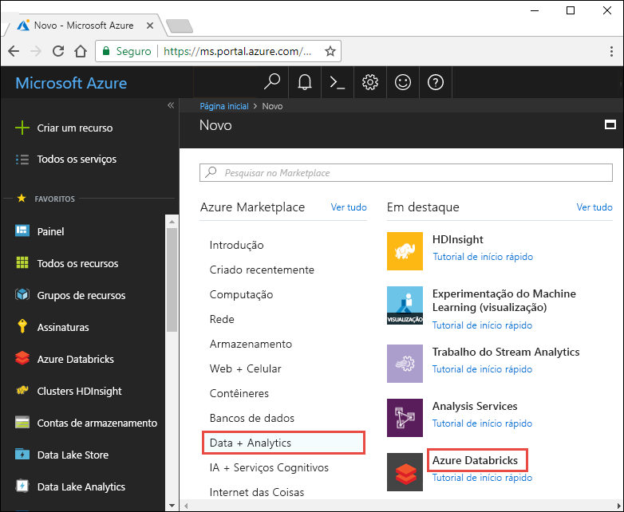
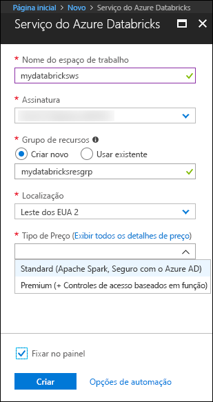
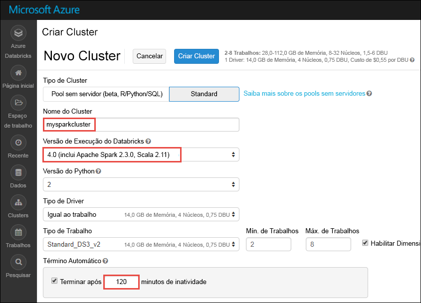
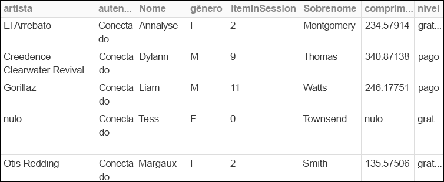
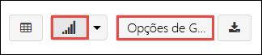
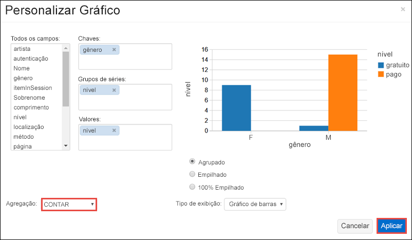
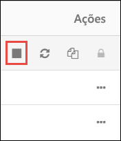

# <a name="quickstart-run-a-spark-job-on-azure-databricks-using-the-azure-portal"></a>Início rápido: executar um trabalho de Spark no Azure Databricks usando o portal do Azure

O início rápido mostra como criar um espaço de trabalho do Azure Databricks e um cluster do Apache Spark dentro desse espaço de trabalho. Por fim, você sabe como executar um trabalho do Spark no cluster do Databricks. Para obter mais informações sobre o Azure Databricks, consulte [O que é o Azure Databricks?](what-is-azure-databricks.md)

## <a name="log-in-to-the-azure-portal"></a>Faça logon no Portal do Azure

Faça logon no [Portal do Azure](https://portal.azure.com).

## <a name="create-a-databricks-workspace"></a>Criar um espaço de trabalho do Databricks

Nesta seção, você deve cria um espaço de trabalho do Azure Databricks usando o Portal do Azure. 

1. No Portal do Azure, clique em **+**, depois em **Dados + Análise** e em **Azure Databricks (versão prévia)**. 

    

2. Em **Azure Databricks (versão prévia)**, clique em **Criar**.

3. Em **Serviço do Azure Databricks**, forneça os seguintes valores:

    

    * Para **Nome do espaço de trabalho**, forneça um nome para seu espaço de trabalho do Databricks.
    * Para **Assinatura**, na lista suspensa, selecione sua assinatura do Azure.
    * Para **Grupo de recursos**, especifique se deseja criar um novo grupo de recursos ou usar um existente. Um grupo de recursos é um contêiner que mantém os recursos relacionados a uma solução do Azure. Para obter mais informações, consulte [Visão geral do Grupo de Recursos do Azure](../azure-resource-manager/resource-group-overview.md).
    * Para **Local**, selecione **Leste dos EUA 2**. Para outras regiões disponíveis, consulte [serviços do Azure por região](https://azure.microsoft.com/regions/services/).

4. Clique em **Criar**.

## <a name="create-a-spark-cluster-in-databricks"></a>Criar um cluster Spark no Databricks

1. No Portal do Azure, vá para o espaço de trabalho do Databricks que você criou e clique em **Inicializar o espaço de trabalho**.

2. Você é redirecionado para o portal do Azure Databricks. No portal, clique em **Cluster**.

    

3. Na página **Novo cluster**, forneça os valores para criar um cluster.

    

    * Insira um nome para o cluster.
    * Verifique se você selecionou caixa de seleção **Terminar depois de ___ minutos de atividade**. Forneça uma duração (em minutos) para encerrar o cluster caso ele não esteja sendo usado.
    * Aceite todos os outros valores padrão. 
    * Clique em **Criar cluster**. Quando o cluster está em execução, você pode anexar blocos de notas a ele e executar trabalhos do Spark.

Para obter mais informações sobre como criar clusters, consulte [Criar um cluster Spark no Azure Databricks](https://docs.azuredatabricks.net/user-guide/clusters/create.html).

## <a name="run-a-spark-sql-job"></a>Executar um trabalho SQL do Spark

Antes de iniciar esta seção, você deve concluir o seguinte:

* [Criar uma conta de Armazenamento do Azure](../storage/common/storage-create-storage-account.md#create-a-storage-account). 
* Baixar um arquivo JSON de exemplo [do Github](https://github.com/Azure/usql/blob/master/Examples/Samples/Data/json/radiowebsite/small_radio_json.json). 
* Carregar o arquivo JSON de exemplo na conta de armazenamento do Azure que você criou. Você pode usar o [Gerenciador de Armazenamento do Microsoft Azure](../vs-azure-tools-storage-manage-with-storage-explorer.md) para carregar arquivos.

Execute as seguintes etapas para criar um bloco de notas em Databricks, configurar o bloco de notas para ler dados de uma conta de armazenamento de Blob do Azure e executar um trabalho SQL do Spark nos dados.

1. No painel esquerdo, clique em **Espaço de trabalho**. Na lista suspensa do **Espaço de trabalho**, clique em **Criar** e depois em **Bloco de notas**.

    

2. Na caixa de diálogo **Criar Bloco de Notas**, insira um nome, selecione **Scala** como a linguagem e selecione o cluster Spark criado anteriormente.

    

    Clique em **Criar**.

3. No trecho de código a seguir, substitua `{YOUR STORAGE ACCOUNT NAME}` pelo nome da conta de armazenamento do Azure que você criou e `{YOUR STORAGE ACCOUNT ACCESS KEY}` pela sua chave de acesso da conta de armazenamento. Cole o trecho de código em uma célula vazia no bloco de notas e pressione SHIFT + ENTER para executar a célula do código. Esse trecho de código configura o bloco de notas para ler dados de um armazenamento de Blob do Azure.

       spark.conf.set("fs.azure.account.key.{YOUR STORAGE ACCOUNT NAME}.blob.core.windows.net", "{YOUR STORAGE ACCOUNT ACCESS KEY}")
    
    Para instruções sobre como recuperar sua chave da conta de armazenamento, consulte [Gerenciar chaves de acesso de armazenamento](../storage/common/storage-create-storage-account.md#manage-your-storage-account)

    > [!NOTE]
    > Você também pode usar o Azure Data Lake Store com um cluster Spark no Azure Databricks. Para obter instruções, consulte [Usar Data Lake Store com Azure Databricks](https://go.microsoft.com/fwlink/?linkid=864084).

4. Execute uma instrução SQL para criar uma tabela temporária usando dados do arquivo de dados JSON de exemplo, **small_radio_json.json**. No trecho de código a seguir, substitua os valores de espaço reservado pelo nome do seu contêiner e o nome da conta de armazenamento. Cole o trecho de código em uma célula de código no bloco de notas e pressione SHIFT + ENTER. No trecho de código, `path` indica o local do arquivo JSON de exemplo que você carregou na sua Conta de armazenamento do Azure.

    ```sql
    %sql 
    CREATE TEMPORARY TABLE radio_sample_data
    USING json
    OPTIONS (
     path "wasbs://{YOUR CONTAINER NAME}@{YOUR STORAGE ACCOUNT NAME}.blob.core.windows.net/small_radio_json.json"
    )
    ```

    Assim que o comando for concluído com êxito, você terá todos os dados do arquivo JSON como uma tabela no cluster do Databricks.

    O comando mágico de linguagem `%sql` permite que você execute um código SQL do bloco de notas, mesmo que o bloco seja de outro tipo. Para obter mais informações, consulte [Combinar linguagens em um bloco de notas](https://docs.azuredatabricks.net/user-guide/notebooks/index.html#mixing-languages-in-a-notebook).

5. Vamos examinar um instantâneo dos dados do JSON de exemplo para entender melhor a consulta executada. Cole o trecho de código a seguir em uma célula de código e pressione **SHIFT+ENTER**.

    ```sql
    %sql 
    SELECT * from radio_sample_data
    ```

6. Você verá uma saída tabular como mostrado na seguinte captura de tela (somente algumas colunas são mostradas):

    

    Entre outros detalhes, os dados de exemplo capturam o gênero do público de um canal de rádio (nome da coluna: **gênero**) e se a sua assinatura é gratuita ou paga (nome da coluna: **nível**).

7. Agora crie uma representação visual dos dados para mostrar quantos usuários têm contas gratuitas e quantos são assinantes pagantes para cada gênero. Na parte inferior da saída tabular, clique no ícone de **Gráfico de barras** e depois em **Opções de plotagem**.

    

8. Em **Personalizar plotagem**, arraste e solte valores conforme mostrado na captura de tela.

    

    * Definir **Chaves** como **gênero**.
    * Definir **Agrupamentos de série** como **nível**.
    * Definir **Valores** como **nível**.
    * Definir **Agregação** como **CONTAGEM**.

    Clique em **Aplicar**.

9. A saída mostra a representação visual, conforme ilustrado na seguinte captura de tela:

     

## <a name="clean-up-resources"></a>Limpar recursos

Ao criar o cluster Spark, se você marcou a caixa de seleção **Terminar depois de ___ minutos de atividade**, o cluster terminará automaticamente caso fique inativo durante o tempo especificado.

Se não tiver marcado essa caixa de seleção, você deve encerrar o cluster manualmente. Para isso, no espaço de trabalho do Azure Databricks, no painel esquerdo, clique em **Clusters**. Para o cluster que deseja encerrar, mova o cursor sobre o botão de reticências na coluna **Ações** e clique no ícone **Terminar**.



## <a name="next-steps"></a>Próximas etapas

Neste artigo, você criou um cluster Spark no Azure Databricks e executou um trabalho do Spark usando os dados no armazenamento do Azure. Você também pode examinar [Fontes de dados do Spark](https://docs.azuredatabricks.net/spark/latest/data-sources/index.html) para saber como importar dados de outras fontes de dados para o Azure Databricks. Avance para o próximo artigo para saber como usar o Azure Data Lake Store com o Azure Databricks.

> [!div class="nextstepaction"]
>[Usar o Data Lake Store com o Azure Databricks](https://go.microsoft.com/fwlink/?linkid=864084)
