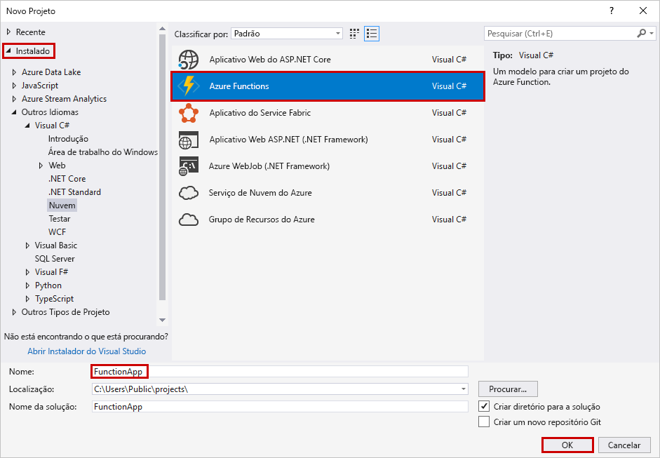
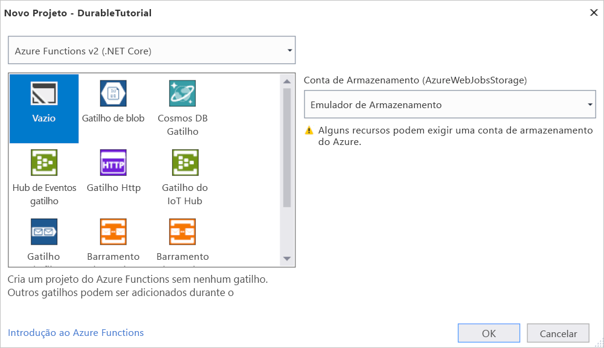
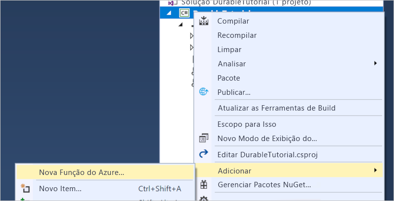
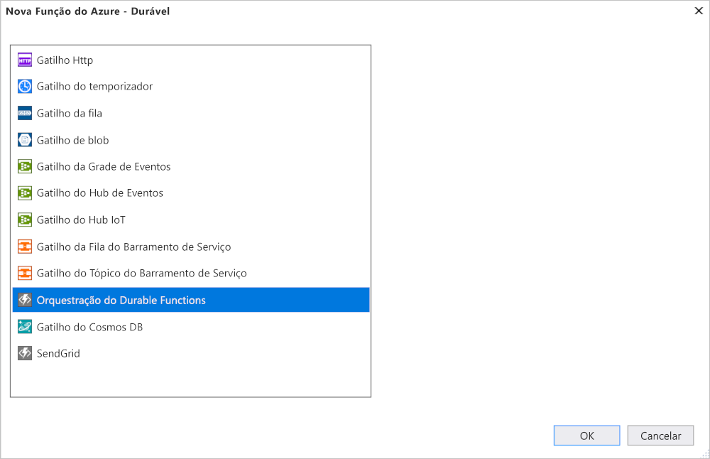

# <a name="create-your-first-durable-function-in-c"></a>Criar sua primeira função durável em C\#

*Durable Functions* são uma extensão do [Azure Functions](../functions-overview.md) que permitem que você escreva funções com estado em um ambiente sem servidor. A extensão gerencia estado, pontos de verificação e reinicializações para você.

Neste artigo, você aprenderá a usar as ferramentas do Visual Studio 2017 para Azure Functions para criar e testar localmente uma função durável "hello world".  Essa função orquestrará e encadeará chamadas para outras funções. Em seguida, você publicará o código de função no Azure. Essas ferramentas estão disponíveis como parte da carga de trabalho de desenvolvimento do Azure no Visual Studio 2017.


## <a name="prerequisites"></a>Pré-requisitos

Para concluir este tutorial:

* Instalar o [Visual Studio 2017](https://azure.microsoft.com/downloads/). Garanta que a carga de trabalho de **desenvolvimento do Azure** também seja instalada.

* Verifique se você tem as [ferramentas mais recentes do Azure Functions](../functions-develop-vs.md#check-your-tools-version).

* Verifique se você tem o [Emulador de Armazenamento do Azure](../../storage/common/storage-use-emulator.md) instalado e em execução.

[!INCLUDE [quickstarts-free-trial-note](../../../includes/quickstarts-free-trial-note.md)]

## <a name="create-a-function-app-project"></a>Crie um projeto de aplicativo de funções

O modelo do Azure Functions cria um projeto que pode ser publicado em um aplicativo de funções no Azure. Um aplicativo de funções permite a você agrupar funções como uma unidade lógica para o gerenciamento, implantação e compartilhamento de recursos.

1. No Visual Studio, selecione **Novo** > **Projeto** no menu **Arquivo**.

2. No diálogo **Novo Projeto**, selecione **Instalado**, expanda **Visual C#** > **Cloud**, selecione **Azure Functions**, digite um **Nome** para seu projeto e clique em **OK**. O nome do aplicativo de funções deve ser válido como um namespace do C# e, portanto, não use outros caracteres não alfanuméricos, hífens ou sublinhados.

    

3. Use as configurações conforme especificado na tabela que acompanha a imagem.

    

    | Configuração      | Valor sugerido  | DESCRIÇÃO                      |
    | ------------ |  ------- |----------------------------------------- |
    | **Versão** | Azure Functions 2.x <br />(.NET Core) | Cria um projeto de função que usa o tempo de execução versão 2.x do Azure Functions, que dá suporte ao .NET Core. O Azure Functions 1.x dá suporte ao .NET Framework. Para obter mais informações, consulte [Como direcionar para versões de tempo de execução do Azure Functions](../functions-versions.md).   |
    | **Modelo** | Vazio | Cria um aplicativo de funções vazio. |
    | **Conta de armazenamento**  | Emulador de Armazenamento | Uma conta de armazenamento é necessária para o gerenciamento de estado de uma função durável. |

4. Clique em **OK** para criar um projeto de função vazio. Este projeto tem os arquivos de configuração básicos necessários para executar suas funções.

## <a name="add-functions-to-the-app"></a>Adicionar funções ao aplicativo

As etapas a seguir usam um modelo para criar o código da durable function no projeto.

1. Clique com o botão direito do mouse no Visual Studio e escolha **Adicionar** > **Novo Azure Function**.

    

2. Verifique se o **Azure Function** está marcado no menu Adicionar e nomeie seu arquivo C#.  Pressione **Adicionar**.

3. Escolha o modelo **Orquestração de Durable Functions** e clique em **OK**

      

Uma nova durable function será adicionada ao aplicativo.  Abra o novo arquivo .cs para exibir o conteúdo. Essa durable function é um exemplo simples de encadeamento de funções com os seguintes métodos:  

| Método | FunctionName | DESCRIÇÃO |
| -----  | ------------ | ----------- |
| **`RunOrchestrator`** | `<file-name>` | Gerencia a orquestração durável. Nesse caso, a orquestração é iniciada, cria uma lista e adiciona o resultado de três chamadas de função à lista.  Quando as três chamadas de função são concluídas, ela retorna a lista. |
| **`SayHello`** | `<file-name>_Hello` | A função retorna uma saudação. Essa é a função que contém a lógica de negócios que está sendo orquestrada. |
| **`HttpStart`** | `<file-name>_HttpStart` | Uma [função disparada por HTTP](../functions-bindings-http-webhook.md) que inicia uma instância da orquestração e retorna uma resposta de status de verificação. |

Agora que você criou seu projeto de função e uma função durável, poderá testá-la em seu computador local.

## <a name="test-the-function-locally"></a>Testar a função localmente

As Ferramentas Principais do Azure Functions permitem executar um projeto do Azure Functions no seu computador de desenvolvimento local. Você precisa instalar essas ferramentas na primeira vez em que inicia uma função no Visual Studio.

1. Para testar sua função, pressione F5. Se solicitado, aceite a solicitação do Visual Studio para baixar e instalar as ferramentas principais (CLI) do Azure Functions. Você também precisará habilitar a exceção de firewall de forma que as ferramentas possam lidar com solicitações HTTP.

2. Copie a URL da sua função da saída de tempo de execução do Azure Functions.

    

3. Cole a URL da solicitação HTTP na barra de endereços do navegador e execute a solicitação. O exemplo a seguir mostra a resposta no navegador à solicitação GET local retornada pela função:

    

    A resposta é o resultado inicial da função HTTP informando que a orquestração durável foi iniciada com êxito.  A resposta ainda não é o resultado final da orquestração.  A resposta inclui algumas URLs úteis.  Por enquanto, vamos consultar o status da orquestração.

4. Copie o valor da URL para `statusQueryGetUri`, cole-o na barra de endereços do navegador e execute a solicitação.

    A solicitação consultará a instância de orquestração do status. Uma resposta eventual deverá ser exibida e será semelhante ao seguinte.  Isso mostra que a instância foi concluída e inclui os resultados ou saídas da função durável.

    ```json
    {
        "instanceId": "d495cb0ac10d4e13b22729c37e335190",
        "runtimeStatus": "Completed",
        "input": null,
        "customStatus": null,
        "output": [
            "Hello Tokyo!",
            "Hello Seattle!",
            "Hello London!"
        ],
        "createdTime": "2018-11-08T07:07:40Z",
        "lastUpdatedTime": "2018-11-08T07:07:52Z"
    }
    ```

5. Para interromper a depuração, pressione **Shift + F5**.

Após verificar se a função foi executada corretamente no computador local, é hora de publicar o projeto no Azure.

## <a name="publish-the-project-to-azure"></a>Publicar o projeto no Azure

Você deve ter um aplicativo de funções em sua assinatura do Azure antes de publicar seu projeto. Você pode criar um aplicativo de funções diretamente no Visual Studio.

[!INCLUDE [Publish the project to Azure](../../../includes/functions-vstools-publish.md)]

## <a name="test-your-function-in-azure"></a>Testar sua função no Azure

1. Copie a URL base do aplicativo de funções da página de perfil de publicação. Substitua a parte `localhost:port` da URL que você usou ao testar a função localmente pela nova URL base.

    A URL que chama a função HTTP durável deve estar no seguinte formato:

        http://<APP_NAME>.azurewebsites.net/api/<FUNCTION_NAME>_HttpStart

2. Cole essa nova URL para a solicitação HTTP na barra de endereços do navegador. Ao usar o aplicativo publicado, você deve obter a mesma resposta de status como antes.

## <a name="next-steps"></a>Próximas etapas

Você usou o Visual Studio Code para criar e publicar um aplicativo de funções C# durável.

> [!div class="nextstepaction"]
> [Saiba mais sobre os padrões comuns de função durável.](durable-functions-concepts.md)
