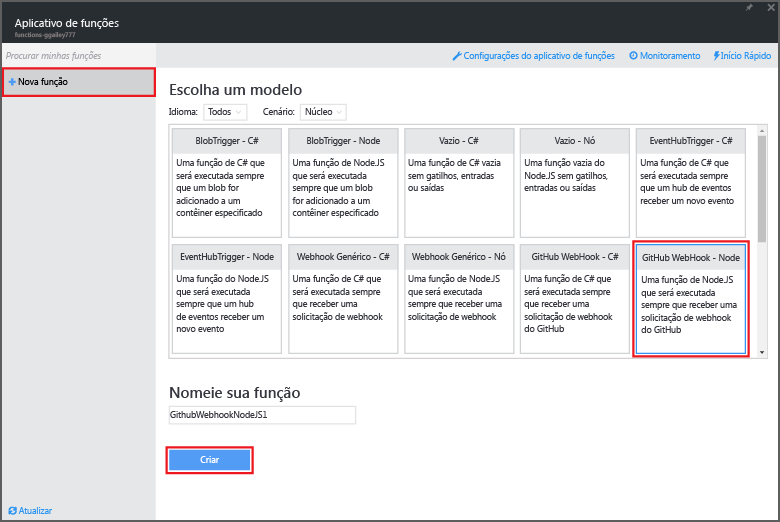
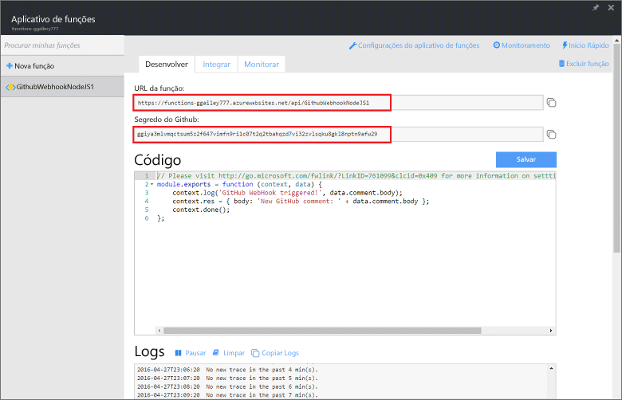
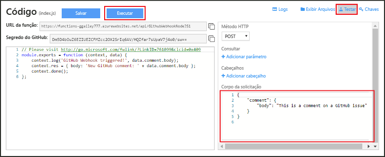
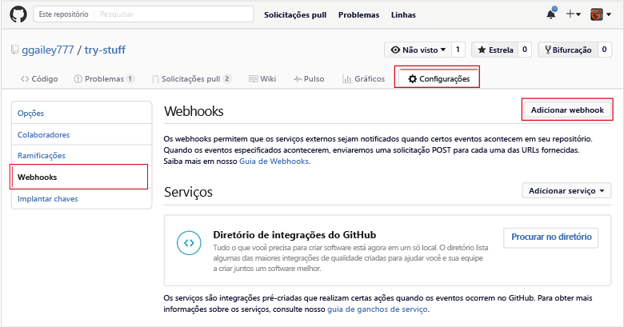
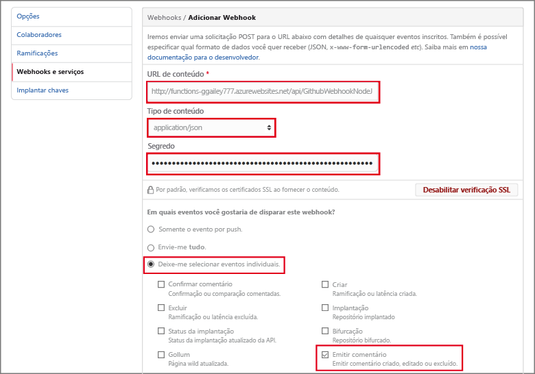

# Criar um webhook ou um Azure Function de API
O Azure Functions é uma experiência de computação sob demanda controlada por evento que permite que você crie unidades de código agendadas ou disparadas, que serão implementadas em diversas linguagens de programação. Para saber mais sobre o Azure Functions, veja a [Visão geral do Azure Functions](functions-overview.md).

Este tópico mostra como criar uma função do JavaScript que é invocada por um webhook do GitHub. A nova função é criada com base em um modelo predefinido no portal do Azure Functions. Você também pode assistir a um vídeo curto para ver como essas etapas são executadas no portal.

As etapas gerais neste tutorial também podem ser usadas para criar uma função no c# ou F # em vez de JavaScript. 

## Assista ao vídeo
O vídeo a seguir mostra como executar as etapas básicas deste tutorial 

>[!VÍDEO https://channel9.msdn.com/Series/Windows-Azure-Web-Sites-Tutorials/Create-a-Web-Hook-or-API-Azure-Function/player]
>
>

## Pré-requisitos

Para concluir este tutorial, você precisará do seguinte:

+ Uma conta ativa do Azure. Se você ainda não tiver uma conta, poderá [inscrever-se em uma conta gratuita do Azure](https://azure.microsoft.com/free/).  
 Você também pode usar o [tente funções](https://functions.azure.com/try) experiência para concluir este tutorial sem uma conta do Azure.
+ Uma conta do GitHub. Você pode [inscrever-se para uma conta gratuita do GitHub](https://github.com/join), se você ainda não tiver um. 

## Criar uma função disparada por webhook por meio do modelo
Um aplicativo de função hospeda a execução de suas funções no Azure. 

1. Vá para o [portal do Azure Functions](https://functions.azure.com/signin) e entre com sua conta do Azure.

2. Se você tiver um aplicativo de funções existente para usar, selecione-o em **Seus aplicativos de função** e clique em **Abrir**. Para criar um aplicativo de funções, digite um **Nome** exclusivo para ele ou aceite o que foi gerado, selecione sua **Região** preferencial e clique em **Criar + introdução**. 

3. No aplicativo de função, clique em **+ Nova Função** > **Webhook do GitHub - JavaScript** > **Criar**. Essa etapa cria uma função com um nome padrão de acordo com o modelo especificado. Como alternativa, você pode criar um c# ou função F #.
   
     

4. Em **Desenvolver**, observe a função express.js de exemplo na janela **Código**. Essa função recebe uma solicitação do GitHub de um webhook de comentário do problema, registra o texto do problema e envia uma resposta ao webhook como `New GitHub comment: <Your issue comment text>`.

     

1. Copie e salve a **URL de Função** e os valores do **Segredo do GitHub**. Você usará esses valores na próxima seção para configurar o webhook no GitHub. 

2. Clique em **Testar**, observe o corpo JSON predefinido de um comentário do problema no **Corpo da solicitação** e clique em **Executar**. 

    
   
    > [!NOTE]
    > Você sempre poderá testar uma nova função baseada em modelo direitamente na guia **Desenvolver** fornecendo todos os dados JSON de corpo esperados e clicando no botão **Executar**. Nesse caso, o modelo tem um corpo predefinido para um comentário do problema. 

Em seguida, você criará o webhook real no repositório GitHub.

## Configurar o webhook
1. No GitHub, navegue até um repositório de sua propriedade. Você também pode usar todos os repositórios que você tenha bifurcado.
 
2. Clique em **Configurações** > **Webhooks e serviços** > **Adicionar webhook**.
   
       

3. Cole a URL e o segredo em sua função **carga URL** e **segredo** e selecione **application/json** para **tipo de conteúdo**.

4. Clique em **deixe-me selecionar eventos individuais**, selecione **emitir comentário**e clique em **adicionar webhook**.
   
     

Neste momento, o webhook do GitHub é configurado para disparar a função quando um novo comentário do problema é adicionado.  
Agora é hora de testá-lo.

## Testar a função
1. No seu repositório GitHub, abra o **problemas** guia em uma nova janela do navegador.

2. Na nova janela, clique em **novo problema**, digite um título e clique em **enviar novo problema**. Também é possível abrir um problema existente.

2. No problema, digite um comentário e clique em **Comentar**. 

3. Na outra janela GitHub, clique em **editar** ao lado de seu novo webhook, role para baixo até **entregas recente**e verificar que foi enviada uma solicitação webhook e se o corpo da resposta é `New GitHub comment: <Your issue comment text>`.

3. Novamente no portal do Functions, role para baixo até os logs e veja se a função foi disparada e se o valor `New GitHub comment: <Your issue comment text>` foi gravado nos logs de transmissão.

## Próximas etapas
Veja estes tópicos para obter mais informações sobre o Azure Functions.

* [Referência do desenvolvedor do Azure Functions](functions-reference.md)  
  Referência do programador para codificação de funções.
* [Testando o Azure Functions](functions-test-a-function.md)  
  Descreve várias ferramentas e técnicas para testar suas funções.
* [Como escalar o Azure Functions](functions-scale.md)  
  Discute os planos de serviço disponíveis com o Azure Functions, incluindo o plano de hospedagem de consumo e como escolher o plano certo.  

[!INCLUDE [Getting Started Note](../../includes/functions-get-help.md)]

