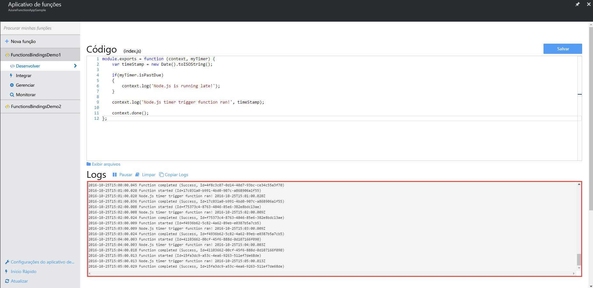
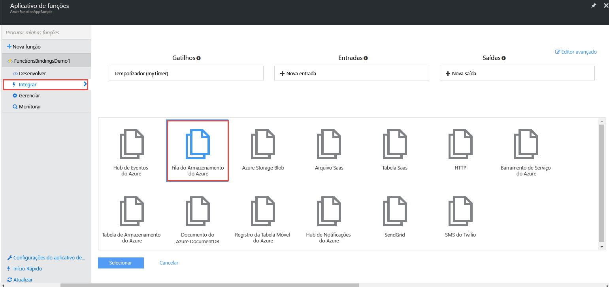
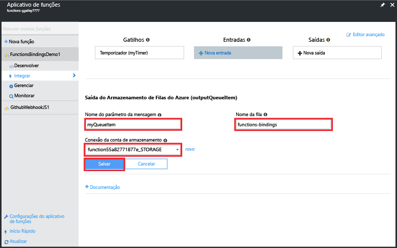
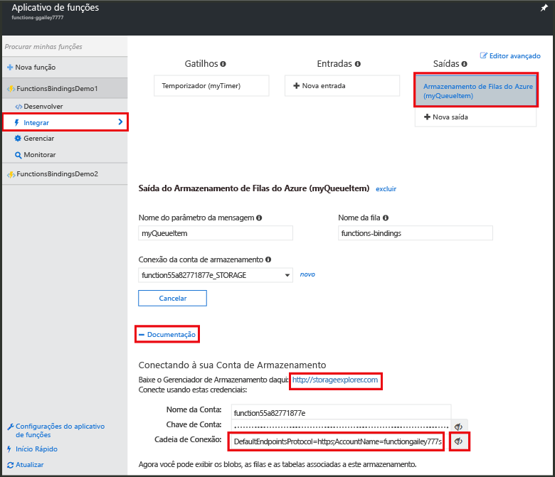
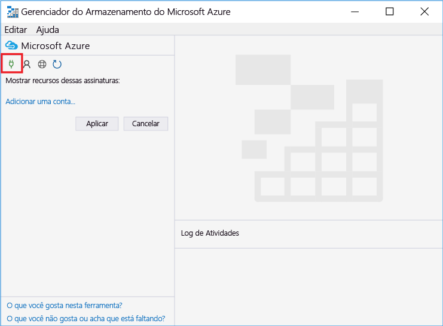
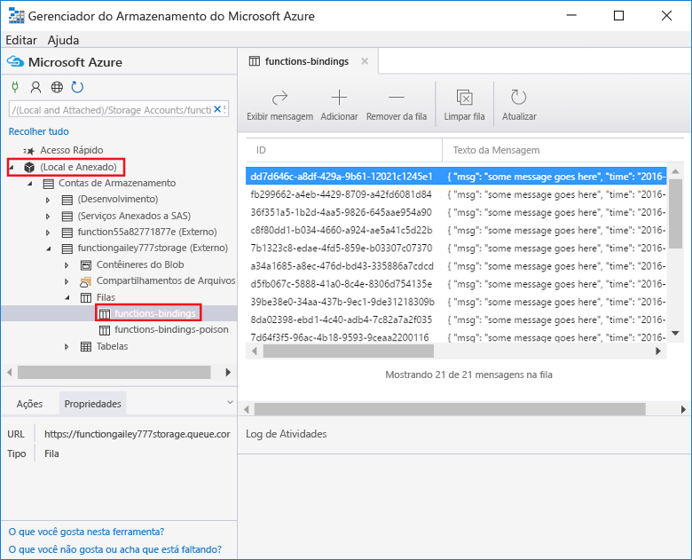
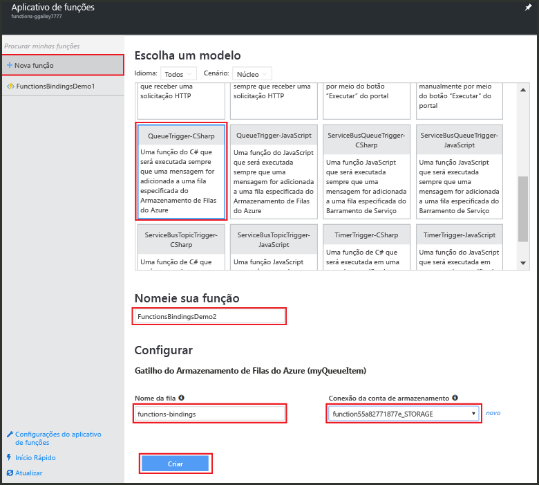
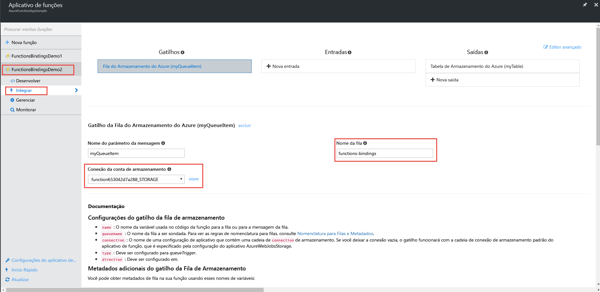
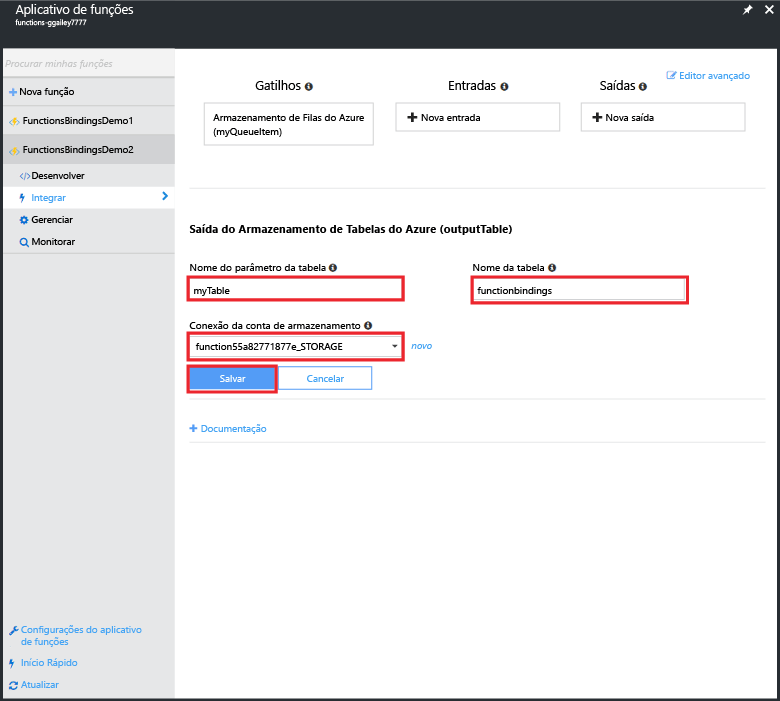
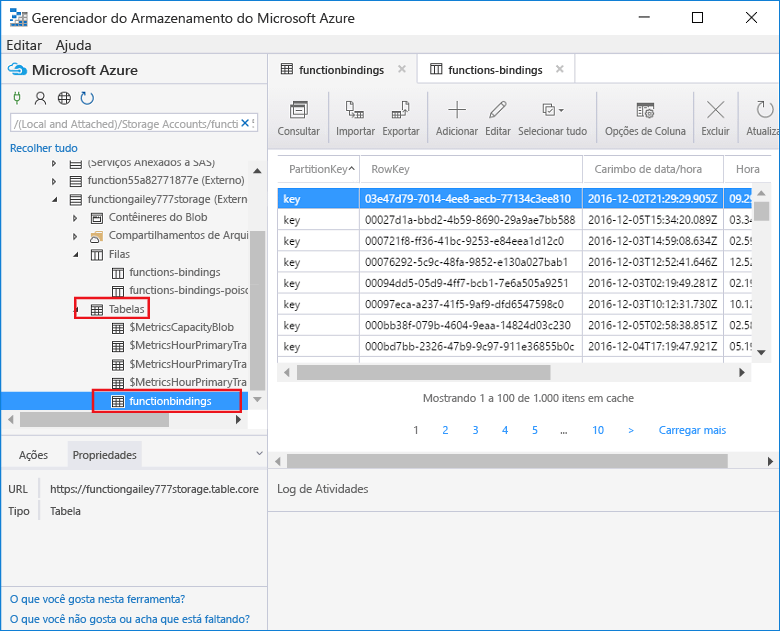

# <a name="use-azure-functions-to-create-a-function-that-connects-to-other-azure-services"></a>Use as Azure Functions para criar uma função que se conecta a outros serviços do Azure

Este tópico mostra como você pode criar uma função nas Azure Functions que escuta mensagens em uma fila do Armazenamento do Azure e copia as mensagens para linhas em uma tabela do Armazenamento do Azure. Uma função disparada por temporizador é usada para carregar as mensagens na fila. Uma segunda função lê da fila e grava as mensagens na tabela. Ambas a fila e a tabela são criadas para você por Azure Functions com base nas definições de associação. 

Para tornar as coisas mais interessantes, uma função é escrita em JavaScript e a outra é escrita em script C#. Isso demonstra como um aplicativo de funções pode ter funções em várias linguagens. 

Você pode ver esse cenário demonstrado em um [vídeo no Channel 9](https://channel9.msdn.com/Series/Windows-Azure-Web-Sites-Tutorials/Create-an-Azure-Function-which-binds-to-an-Azure-service/player).

## <a name="create-a-function-that-writes-to-the-queue"></a>Criar uma função que grava na fila

Antes de você se conectar a uma fila de armazenamento, você precisa criar uma função que carrega a fila de mensagens. Essa função de JavaScript usa um gatilho de temporizador que grava uma mensagem na fila a cada 10 segundos. Se você ainda não tiver uma conta do Azure, confira a experiência [Experimentar o Azure Functions](https://functions.azure.com/try) ou [crie sua conta gratuita do Azure](https://azure.microsoft.com/free/).

1. Acesse o Portal do Azure e localize o aplicativo de funções.

2. Clique em **Nova Função** > **TimerTrigger-JavaScript**. 

3. Nomeie a função como **FunctionsBindingsDemo1**, insira um valor da expressão cron `0/10 * * * * *` para **Schedule** e, em seguida, clique em **Criar**.
   
    

    Você criou uma função disparada por temporizador que é executada a cada 10 segundos.

5. Na guia **Desenvolver**, clique em **Logs** e exiba a atividade do log. Você vê uma entrada de log gravada a cada 10 segundos.
   
    

## <a name="add-a-message-queue-output-binding"></a>Adicionar uma associação de saída de fila de mensagens

1. Na guia **Integrar**, escolha **Nova Saída** > **Armazenamento de Filas do Azure** > **Selecionar**.

    

2. Insira `myQueueItem` para **Nome de parâmetro de mensagem** e `functions-bindings` para **Nome da fila**, selecione uma **Conexão da conta de armazenamento** existente ou clique em **nova** para criar uma conexão de conta de armazenamento e, em seguida, clique em **Salvar**.  

    

1. De volta à função **Desenvolver**, acrescente o seguinte código à função:
   
    ```javascript
   
    function myQueueItem() 
    {
        return {
            msg: "some message goes here",
            time: "time goes here"
        }
    }
   
    ```
2. Localize a instrução *if* ao redor da linha 9 da função e insira o código a seguir após essa instrução.
   
    ```javascript
   
    var toBeQed = myQueueItem();
    toBeQed.time = timeStamp;
    context.bindings.myQueueItem = toBeQed;
   
    ```  
   
    Esse código cria um **myQueueItem** e define sua propriedade **time** com o carimbo de data/hora atual. Em seguida, ele adiciona o novo item de fila à associação **myQueueItem** do contexto.

3. Clique em **Salvar e Executar**.

## <a name="view-storage-updates-by-using-storage-explorer"></a>Exibir atualizações de armazenamento usando o Gerenciador de Armazenamento
Você pode verificar se a função está funcionando por meio da exibição de mensagens na fila que você criou.  Você pode se conectar à sua fila de armazenamento usando o Cloud Explorer no Visual Studio. No entanto, o portal torna fácil conectar-se à sua conta de armazenamento usando o Gerenciador de Armazenamento do Microsoft Azure.

1. Na guia **Integrar**, clique em sua fila de associação de saída > **Documentação**, exiba novamente a cadeia de conexão para sua conta de armazenamento e copie o valor. Você pode usar esse valor para conectar-se à sua conta de armazenamento.

    


2. Se você ainda não fez isso, baixe e instale o [Gerenciador de Armazenamento do Microsoft Azure](http://storageexplorer.com). 
 
3. No Gerenciador de Armazenamento, clique em conectar ao ícone de Armazenamento do Azure, cole a cadeia de conexão no campo e conclua o assistente.

    

4. Em **Local e anexado**, expanda **Contas de Armazenamento** > sua conta de armazenamento > **Filas** > **funções-associações** e verifique se as mensagens são gravadas na fila.

    

    Se a fila não existe ou está vazia, provavelmente há um problema com o código ou a associação de função.

## <a name="create-a-function-that-reads-from-the-queue"></a>Criar uma função que lê da fila

Agora que você tem mensagens sendo adicionadas à fila, você pode criar outra função que lê da fila e grava as mensagens permanentemente uma tabela de Armazenamento do Azure.

1. Clique em **Nova Função** > **QueueTrigger-CSharp**. 
 
2. Nomeie a função `FunctionsBindingsDemo2`, insira **funções-associações** no campo **Nome da Fila**, selecione uma conta de armazenamento existente ou crie uma e, em seguida, clique em **Criar**.

     

3. (Opcional) Você pode verificar se a nova função funciona exibindo a nova fila no Gerenciador de Armazenamento como antes. Você também pode usar o Cloud Explorer no Visual Studio.  

4. (Opcional) Atualize a fila **funções-associações** e observe os itens que foram removidos da fila. A remoção ocorre porque a função está associada à fila **funções-associações** como um gatilho de entrada e a função lê a fila. 
 
## <a name="add-a-table-output-binding"></a>Adicionar uma associação de saída da tabela

1. Em FunctionsBindingsDemo2, clique em **Integrar** > **Nova Saída** > **Armazenamento de Tabela do Azure** > **Selecionar**.

     

2. Insira `functionbindings` para **Nome de tabela** e `myTable` para **Nome de parâmetro de tabela**, escolha uma **Conexão da conta de armazenamento** ou crie uma nova e, em seguida, clique em **Salvar**.

    
   
3. Na guia **Desenvolver**, substitua o código de função existente pelo seguinte:
   
    ```cs
    
    using System;
    
    public static void Run(QItem myQueueItem, ICollector<TableItem> myTable, TraceWriter log)
    {    
        TableItem myItem = new TableItem
        {
            PartitionKey = "key",
            RowKey = Guid.NewGuid().ToString(),
            Time = DateTime.Now.ToString("hh.mm.ss.ffffff"),
            Msg = myQueueItem.Msg,
            OriginalTime = myQueueItem.Time    
        };
        
        // Add the item to the table binding collection.
        myTable.Add(myItem);
    
        log.Verbose($"C# Queue trigger function processed: {myItem.RowKey} | {myItem.Msg} | {myItem.Time}");
    }
    
    public class TableItem
    {
        public string PartitionKey {get; set;}
        public string RowKey {get; set;}
        public string Time {get; set;}
        public string Msg {get; set;}
        public string OriginalTime {get; set;}
    }
    
    public class QItem
    {
        public string Msg { get; set;}
        public string Time { get; set;}
    }
    ```
    A classe **TableItem** representa uma linha na tabela de armazenamento e você adiciona o item à coleção `myTable` de objetos **TableItem**. Você deve definir as Propriedades **PartitionKey** e **RowKey** para poder inserir na tabela.

4. Clique em **Salvar**.  Por fim, você pode verificar se a função funciona exibindo a tabela no Gerenciador de Armazenamento ou Visual Studio Cloud Explorer.

5. (Opcional) Na sua conta de armazenamento no Gerenciador de Armazenamento, expanda **Tabelas** > **funções-associações** e verifique se as linhas são adicionadas à tabela. Você pode fazer o mesmo no Cloud Explorer no Visual Studio.

    

    Se a tabela não existe ou está vazia, provavelmente há um problema com o código ou a associação de função. 
 
[!INCLUDE [More binding information](../../includes/functions-bindings-next-steps.md)]

## <a name="next-steps"></a>Próximas etapas
Confira estes tópicos para obter mais informações sobre o Azure Functions:

* [Referência do desenvolvedor do Azure Functions](functions-reference.md)  
  Referência do programador para codificação de funções e definição de gatilhos e de associações.
* [Testando o Azure Functions](functions-test-a-function.md)  
  Descreve várias ferramentas e técnicas para testar suas funções.
* [Como escalar o Azure Functions](functions-scale.md)  
  Discute os planos de serviço disponíveis com o Azure Functions, incluindo o plano de hospedagem de consumo e como escolher o plano certo. 

[!INCLUDE [Getting help note](../../includes/functions-get-help.md)]


