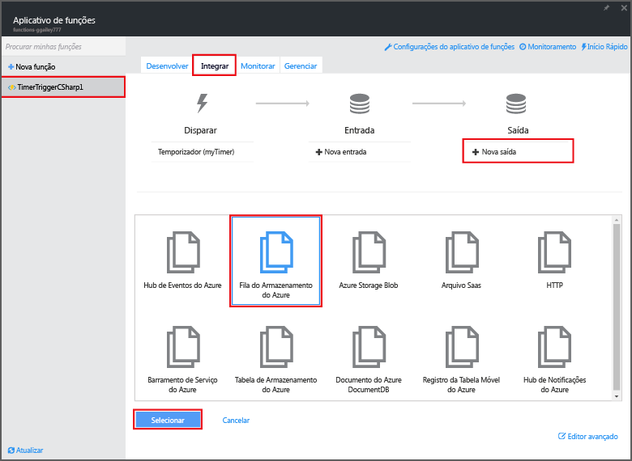

# <a name="create-an-event-processing-azure-function"></a>Criar uma função de processamento de evento do Azure
O Azure Functions é uma experiência de computação sob demanda controlada por evento que permite que você crie unidades de código agendadas ou disparadas, que serão implementadas em uma variedade de linguagens de programação. Para saber mais sobre o Azure Functions, veja a [Visão geral do Azure Functions](functions-overview.md).

Este tópico mostra como criar uma nova função em C#, executada com base em um temporizador de eventos para adicionar mensagens a uma fila de armazenamento. 

## <a name="prerequisites"></a>Pré-requisitos
Antes de criar uma função, você precisa ter uma conta ativa do Azure. Se você ainda não tiver uma conta do Azure, [há contas gratuitas disponíveis](https://azure.microsoft.com/free/).

## <a name="create-a-timer-triggered-function-from-the-template"></a>Criar uma função disparada por temporizador por meio do modelo
Um aplicativo de função hospeda a execução de suas funções no Azure. Antes de criar uma função, você precisa ter uma conta ativa do Azure. Se você ainda não tiver uma conta do Azure, [há contas gratuitas disponíveis](https://azure.microsoft.com/free/). 

1. Vá para o [portal do Azure Functions](https://functions.azure.com/signin) e entre com sua conta do Azure.
2. Se você tiver um aplicativo de funções existente para usar, selecione-o em **Seus aplicativos de função** e clique em **Abrir**. Para criar um novo aplicativo de funções, digite um **Nome** exclusivo para ele ou aceite o que foi gerado, selecione sua **Região** preferencial e clique em **Criar + introdução**. 
3. No aplicativo de funções, clique em **+ Nova Função** > **TimerTrigger - C#** > **Criar**. Isso cria uma função com um nome padrão que é executado na agenda padrão de uma vez a cada minuto. 
   
    
4. Na sua nova função, clique na guia **Integrar** > **Nova Saída** > **Fila de Armazenamento do Azure** > **Selecionar**.
   
    
5. Em **Saída da Fila de Armazenamento do Azure**, selecione uma **conexão da conta do Armazenamento** existente ou crie uma nova e clique em **Salvar**. 
   
    
6. Novamente na guia **Desenvolver**, substitua o script C# na janela **Código** pelo seguinte código:
    ```cs   
    using System;

    public static void Run(TimerInfo myTimer, out string outputQueueItem, TraceWriter log)
    {
        // Add a new scheduled message to the queue.
        outputQueueItem = $"Ping message added to the queue at: {DateTime.Now}.";

        // Also write the message to the logs.
        log.Info(outputQueueItem);
    }
    ```
   
    Este código adiciona uma nova mensagem à fila com a data e a hora atuais quando a função é executada.
7. Clique em **Salvar** e verifique a próxima execução da função nas janelas **Logs**.
8. (Opcional) Navegue até a conta de armazenamento e verifique se as mensagens estão sendo adicionadas à fila.
9. Volte para a guia **Integrar** e altere o campo de agendamento para `0 0 * * * *`. A função agora é executada uma vez a cada hora. 

Este é um exemplo bem simplificado de um gatilho de temporizador e de uma associação de saída de fila de armazenamento. Para saber mais, confira os tópicos [Gatilho de temporizador do Azure Functions](functions-bindings-timer.md) e [Gatilhos e associações do Azure Functions para o Armazenamento do Azure](functions-bindings-storage.md).

## <a name="next-steps"></a>Próximas etapas
Veja estes tópicos para obter mais informações sobre o Azure Functions.

* [Referência do desenvolvedor do Azure Functions](functions-reference.md)  
   Referência do programador para codificação de funções e definição de gatilhos e de associações.
* [Testando o Azure Functions](functions-test-a-function.md)  
   Descreve várias ferramentas e técnicas para testar suas funções.
* [Como escalar o Azure Functions](functions-scale.md)  
  Discute os planos de serviço disponíveis com o Azure Functions, incluindo o plano de hospedagem de consumo e como escolher o plano certo.  

[!INCLUDE [Getting Started Note](../../includes/functions-get-help.md)]


<!--HONumber=Nov16_HO4-->


