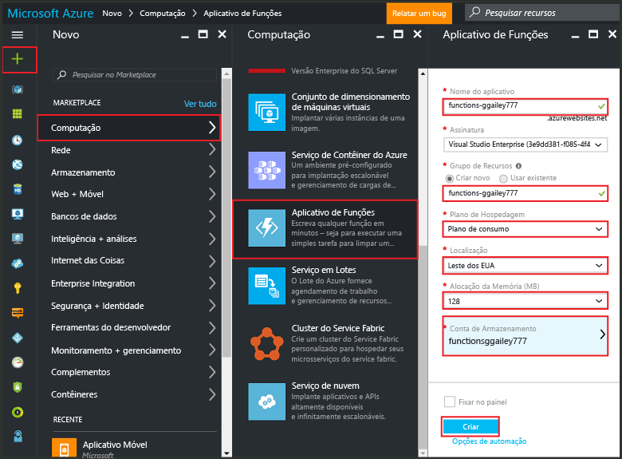
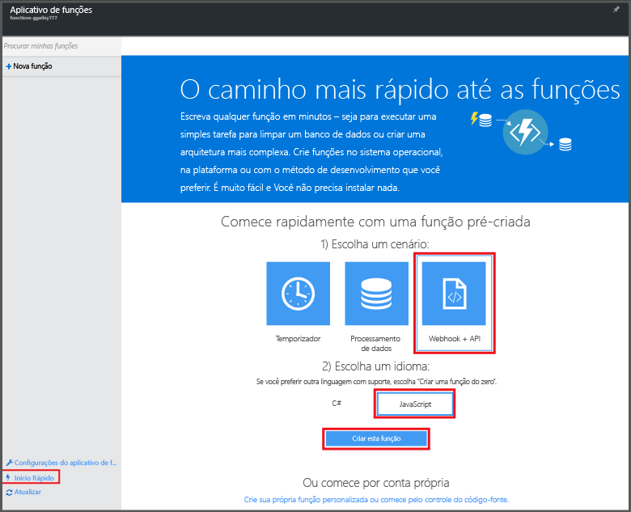

# Criar uma função no portal do Azure
## Visão geral
O Azure Functions consiste em uma experiência de computação sob demanda controlada por eventos que estende a plataforma de aplicativos existente do Azure com recursos para implementar código disparado por eventos que ocorrem em outros serviços do Azure, produtos de SaaS e sistemas locais. Com o Azure Functions, seus aplicativos são dimensionados sob demanda e você paga apenas pelos recursos que consome. O Azure Functions permite que você crie unidades de código agendadas ou disparadas, que serão implementadas em várias linguagens de programação. Para saber mais sobre o Azure Functions, veja a [Visão geral do Azure Functions](functions-overview.md).

Este tópico mostra como usar o portal do Azure para criar uma Azure Function "hello world" simples do Node.js que é invocada por um gatilho HTTP. Antes de criar uma função no portal do Azure, você deve criar um aplicativo de funções explicitamente no Serviço de Aplicativo do Azure. Para que o aplicativo de funções seja criado para você automaticamente, confira [os outros tutoriais de início rápido do Azure Functions](functions-create-first-azure-function.md), que é uma experiência de início rápido mais simples e inclui vídeo.

## Criar um aplicativo de funções
Um aplicativo de funções hospeda a execução de suas funções no Azure. Siga estas etapas para criar um aplicativo de funções no portal do Azure.

Antes de criar sua primeira função, você precisará ter uma conta ativa do Azure. Se ainda não tiver uma conta do Azure, saiba que [há contas gratuitas disponíveis](https://azure.microsoft.com/free/).

1. Vá para o [portal do Azure](https://portal.azure.com) e entre com sua conta do Azure.
2. Clique em **+Novo** > **Computação** > **Aplicativo de Funções**, selecione sua **Assinatura**, digite um **Nome do aplicativo** exclusivo que identifica seu aplicativo de funções e especifique as seguintes configurações:
   
   * **[Grupo de Recursos](../azure-resource-manager/resource-group-overview.md)**: selecione **Criar novo** e digite um nome para seu novo grupo de recursos. Você também pode escolher um grupo de recursos existente; no entanto, é possível que você não consiga criar um Plano do Serviço de Aplicativo com base no consumo para seu aplicativo de funções.
   * **[Plano de hospedagem](../app-service/azure-web-sites-web-hosting-plans-in-depth-overview.md)**, que pode ser um dos seguintes: 
     * **Plano de consumo**: plano padrão para o Azure Functions. Ao escolher um plano de consumo, você também deve escolher o **Local** e definir a **Alocação de Memória** (em MB). Para saber como a alocação de memória afeta os custos, confira [Preços do Azure Functions](https://azure.microsoft.com/pricing/details/functions/). 
     * **Plano do Serviço de Aplicativo**: esse plano exige que você crie um **plano/local para o Serviço de Aplicativo** ou selecione um existente. Essas configurações determinam o [local, os recursos, o custo e os recursos de computação](https://azure.microsoft.com/pricing/details/app-service/) associados ao seu aplicativo.  
   * **Conta de armazenamento**: cada aplicativo de funções requer uma conta de armazenamento. Você pode usar uma conta de armazenamento existente ou criar uma nova. 
     
     

3. Clique em **Criar** para provisionar e implantar o novo aplicativo de funções.  

Agora que o aplicativo de funções está provisionado, você pode criar sua primeira função.

## Criar uma função
Estas etapas criam uma função no guia de início rápido do Azure Functions.

1. Na guia **Início Rápido**, clique em **WebHook + API** e em **JavaScript**; em seguida, clique em **Criar uma função**. Uma nova função predefinida do Node.js é criada. 
   
    

2. (Opcional) Neste ponto no início rápido, é possível fazer um tour rápido pelos recursos do Azure Functions no portal.    Depois de concluir ou ignorar o tour, teste sua nova função usando o gatilho HTTP.

## Testar a função
Como os inícios rápidos do Azure Functions contêm código funcional, você poderá testar imediatamente sua nova função.

1. Na guia **Desenvolver**, examine a janela **Código** e observe que esse código Node.js espera uma solicitação HTTP com um valor *name* passado no corpo da mensagem ou em uma cadeia de consulta. Quando a função é executada, esse valor é retornado na mensagem de resposta.
   
2. Clique em **Testar** para exibir o painel de solicitação de teste HTTP interno para a função.
 
    

2. Na caixa de texto **Corpo da solicitação**, altere o valor da propriedade *name* para seu nome e clique em **Executar**. Veja que a execução é disparada por uma solicitação HTTP de teste, as informações são gravadas em logs de streaming e a resposta "hello" é exibida na **Saída**. 

3. Para disparar a execução da mesma função de outra janela ou guiado navegador, copie o valor de **URL da Função** da guia **Desenvolver** e cole-o na barra de endereços de um navegador. Acrescente o valor de cadeia de caracteres de consulta `&name=yourname` ao URL e pressione inserir. As mesmas informações são gravadas nos logs e o navegador exibe a resposta "hello" como antes.

## Próximas etapas
Este início rápido demonstra uma execução simples de uma função básica disparada por HTTP. Para saber mais sobre como usar o Azure Functions em seus aplicativos, consulte os tópicos a seguir:

* [Referência do desenvolvedor do Azure Functions](functions-reference.md)  
   Referência do programador para codificação de funções e definição de gatilhos e de associações.
* [Testando o Azure Functions](functions-test-a-function.md)  
   Descreve várias ferramentas e técnicas para testar suas funções.
* [Como escalar o Azure Functions](functions-scale.md)  
  Discute os planos de serviço disponíveis com o Azure Functions, incluindo o plano do Serviço de Aplicativo com base no consumo e como escolher o plano certo. 
* [O que é o Serviço de Aplicativo do Azure?](../app-service/app-service-value-prop-what-is.md)  
   O Azure Functions utiliza a plataforma Serviço de Aplicativo do Azure para a funcionalidade básica, como implantações, variáveis de ambiente e diagnóstico. 

[!INCLUDE [Getting Started Note](../../includes/functions-get-help.md)]

<!--HONumber=Nov16_HO3-->

