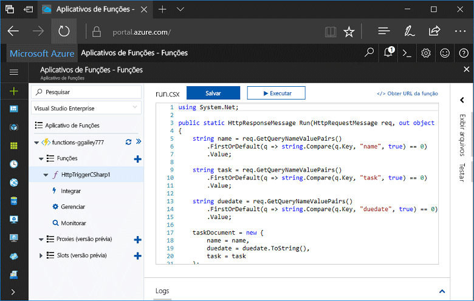
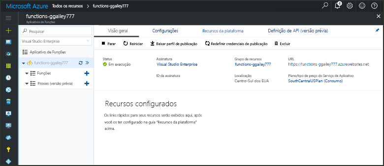
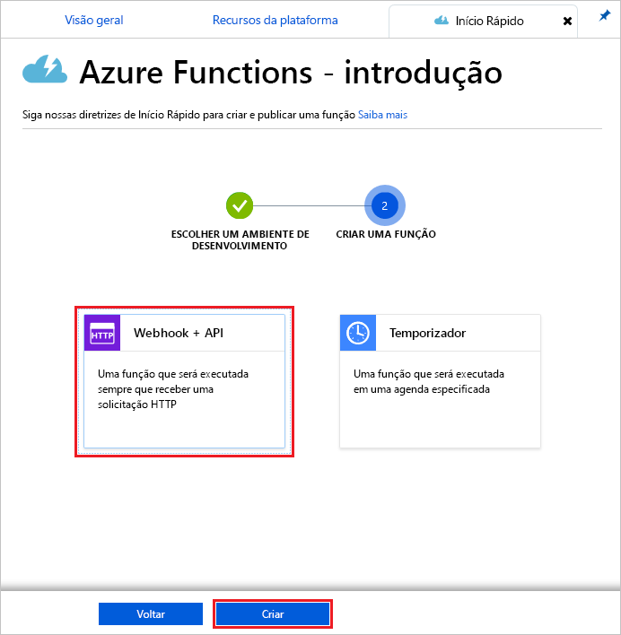
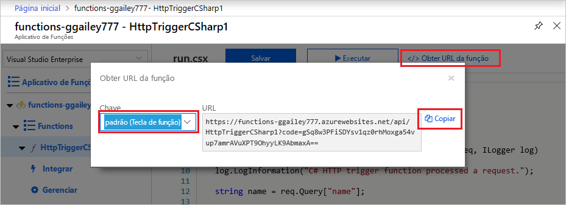
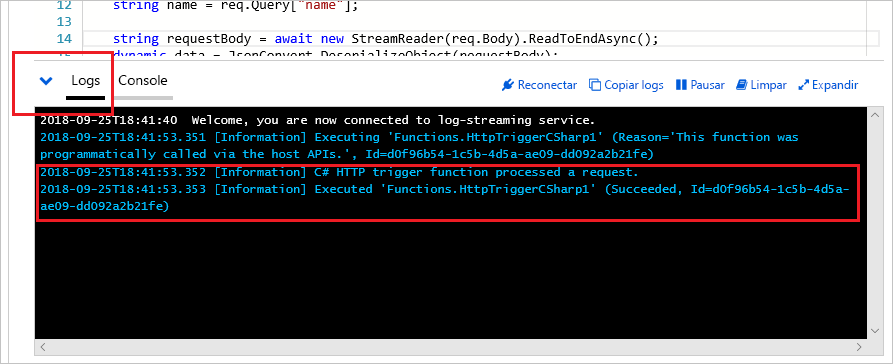

# Criar sua primeira função no portal do Azure

O Azure Functions lhe permite executar seu código em um ambiente sem servidor sem que seja preciso primeiro criar uma VM ou publicar um aplicativo Web. Neste tópico, aprenda a usar o Functions para criar uma função "Olá, Mundo" no Portal do Azure.

[!INCLUDE [quickstarts-free-trial-note](../../includes/quickstarts-free-trial-note.md)]

## Fazer logon no Azure

Faça logon no [Portal do Azure](https://portal.azure.com/).

## Criar um aplicativo de funções

Você deve ter um aplicativo de funções para hospedar a execução de suas funções. Um aplicativo de funções permite a você agrupar funções como uma unidade lógica para facilitar o gerenciamento, implantação e compartilhamento de recursos. 

[!INCLUDE [Create function app Azure portal](../../includes/functions-create-function-app-portal.md)]

[!INCLUDE [functions-portal-favorite-function-apps](../../includes/functions-portal-favorite-function-apps.md)]

Em seguida, crie uma nova função no novo aplicativo de funções.

## Criar uma função disparada por HTTP

1. Expanda seu novo aplicativo de funções, depois clique no botão **+** ao lado de **Functions**.

2.  Na página **Início rápido**, selecione **WebHook + API**, **Escolha uma linguagem** para sua função e clique em **Criar esta função**. 
   
    

Uma função é criada na linguagem escolhida por você usando o modelo de uma função disparada por HTTP. Você pode executar a nova função enviando uma solicitação HTTP.

## Testar a função

1. Em sua nova função, clique em **</> Obter URL da função**, selecione **padrão (Tecla de função)** e clique em **Copiar**. 

    

2. Cole a URL de função na barra de endereços do navegador. Acrescente a cadeia de caracteres de consulta `&name=<yourname>` a esta URL e pressione `Enter` em seu teclado para executar a solicitação. A seguir, um exemplo de resposta retornada pela função no navegador Edge:

    

    A URL da solicitação inclui uma chave que é necessária, por padrão, para acessar sua função via HTTP.   

3. Quando a função é executada, informações de rastreamento são gravadas nos logs. Para ver a saída do rastreamento da execução anterior, volte para sua função no portal e clique na seta para cima na parte inferior da tela para expandir **Logs**. 

   

## Limpar recursos

[!INCLUDE [Clean up resources](../../includes/functions-quickstart-cleanup.md)]

## Próximas etapas

Você criou um aplicativo de funções com uma função simples disparada por HTTP.  

[!INCLUDE [Next steps note](../../includes/functions-quickstart-next-steps.md)]

Para obter mais informações, consulte [Associações HTTP e de webhook do Azure Functions](functions-bindings-http-webhook.md).

