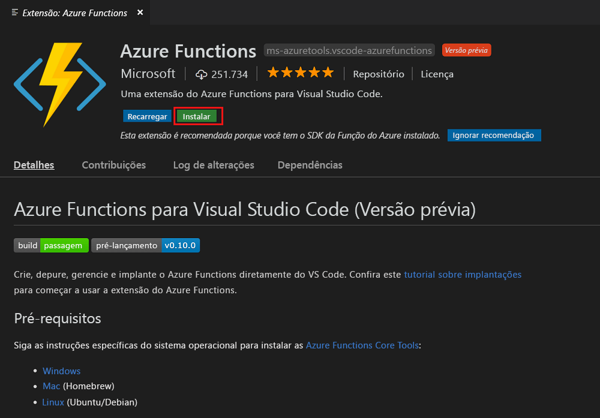
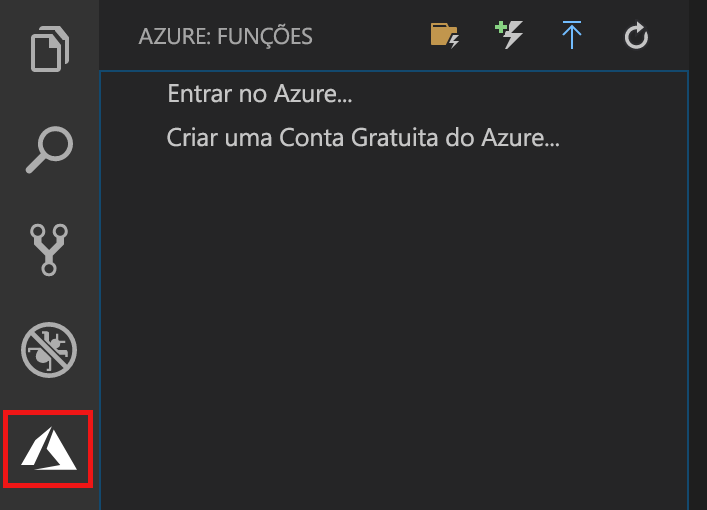
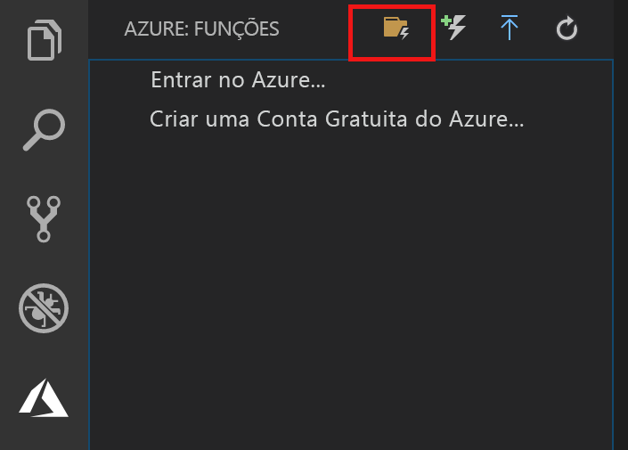
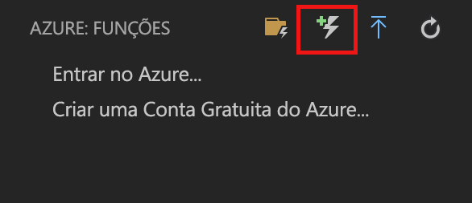
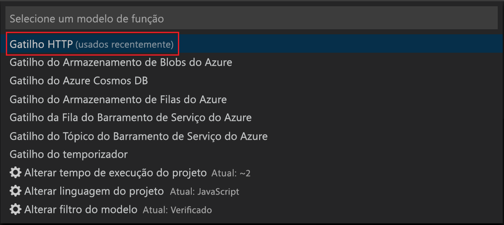
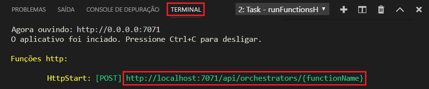
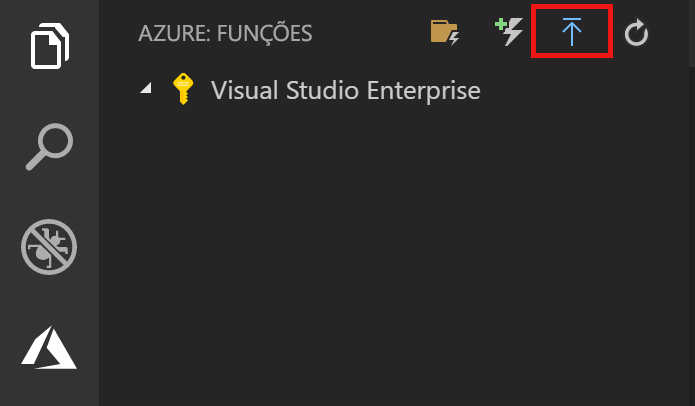
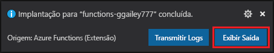

# Criar sua primeira função usando o Visual Studio Code

O Azure Functions lhe permite executar seu código em um ambiente [sem servidor](https://azure.microsoft.com/overview/serverless-computing/) sem que seja preciso primeiro criar uma VM ou publicar um aplicativo Web.

Neste artigo, você aprenderá a usar a [extensão Azure Functions para Visual Studio Code] para criar e testar uma função "hello world" no computador local usando o Microsoft Visual Studio Code. Em seguida, você publicará o código de função no Azure do Visual Studio Code.

A extensão atualmente dá suporte a funções C#, JavaScript e Java. As etapas neste artigo podem variar dependendo de sua escolha de linguagem de programação para o seu projeto do Azure Functions. Atualmente, a extensão está em versão prévia. Para obter mais informações, consulte a página da extensão [Extensão Azure Functions para Visual Studio Code].

## Pré-requisitos

Para concluir este guia de início rápido:

* Instale o [Visual Studio Code](https://code.visualstudio.com/) em uma das [plataformas compatíveis](https://code.visualstudio.com/docs/supporting/requirements#_platforms). Este artigo foi desenvolvido e testado em um dispositivo executando o macOS (High Sierra).

* Instale a versão 2.x do [Azure Functions Core Tools](functions-run-local.md#v2), que ainda está em versão prévia.

* Instale os requisitos específicos para a linguagem de programação escolhida:

    | Linguagem | Extensão |
    | -------- | --------- |
    | **C#** | [C# para Visual Studio Code](https://marketplace.visualstudio.com/items?itemName=ms-vscode.csharp) [Ferramentas da CLI do .NET Core](https://docs.microsoft.com/dotnet/core/tools/?tabs=netcore2x)*   |
    | **Java** | [Depurador para Java](https://marketplace.visualstudio.com/items?itemName=vscjava.vscode-java-debug) [JDK 1.8](http://www.oracle.com/technetwork/java/javase/downloads/index.html) [Maven 3+](https://maven.apache.org/) |
    | **JavaScript** | [Node 8.0+](https://nodejs.org/)  |

    \* Também é requerido pelo Core Tools.

[!INCLUDE [quickstarts-free-trial-note](../../includes/quickstarts-free-trial-note.md)]

## Instalar a extensão Azure Functions

A extensão Azure Functions é usada para criar, testar e implantar funções no Azure.

1. No Visual Studio Code, abra **Extensões** e pesquise por `azure functions`, ou [abra este link no Visual Studio Code](vscode:extension/ms-azuretools.vscode-azurefunctions).

1. Selecione **Instalar** para instalar a extensão no Visual Studio Code. 

    

1. Reinicie o Visual Studio Code e selecione o ícone do Azure na barra Atividade. Você deve ver uma área do Azure Functions na barra lateral.

    

## Criar um projeto do Azure Functions

O modelo de projeto do Azure Functions no Visual Studio Code cria um projeto que pode ser publicado em um aplicativo de funções no Azure. Um aplicativo de funções permite a você agrupar funções como uma unidade lógica para o gerenciamento, implantação e compartilhamento de recursos.

1. No Visual Studio Code, selecione o logotipo do Azure para exibir a área **Azure: Functions** área e, em seguida, selecione o ícone Criar Novo Projeto.

    

1. Escolha um local para seu workspace do projeto e escolha **Selecionar**.

    > [!NOTE]
    > Este artigo foi projetado para ser concluídas fora de um workspace. Nesse caso, não selecione uma pasta de projeto que faz parte de um workspace.

1. Selecione a linguagem de programação para o seu projeto de aplicativo de função. Neste artigo, o JavaScript é usado.
    

1. Quando solicitado, escolha **Adicionar ao workspace**.

O Visual Studio Code cria o projeto de aplicativo de função em um novo workspace. Este projeto contém os arquivos de configuração [host.json](functions-host-json.md) e [local.settings.json](functions-run-local.md#local-settings-file), além de quaisquer arquivos de projeto específicos a uma linguagem. Você também obtém um novo repositório Git na pasta do projeto.

## Crie uma função disparada por HTTP

1. De **Azure: Functions**, escolha o ícone Criar Função.

    

1. Selecione a pasta com seu projeto de aplicativo de funções e selecione o modelo de função **gatilho HTTP**.

    

1. Digite `HTTPTrigger` como o nome da função e pressione Enter, depois selecione autenticação **Anônima**.

    

    Uma função é criada na linguagem escolhida por você usando o modelo de uma função disparada por HTTP.

    

Você pode adicionar associações de entrada e de saída à função modificando o arquivo function.json. Para obter mais informações, consulte [Gatilhos e conceitos de associações do Azure Functions](functions-triggers-bindings.md).

Agora que você criou o seu projeto de função e uma função disparada por HTTP, poderá testá-la em seu computador local.

## Testar a função localmente

As Ferramentas Principais do Azure Functions permitem executar um projeto do Azure Functions no seu computador de desenvolvimento local. É solicitado que você instale essas ferramentas na primeira vez em que inicia uma função no Visual Studio Code.  

1. Para testar sua função, defina um ponto de interrupção no código da função e pressione F5 para iniciar o projeto de aplicativo de funções. A saída do Core Tools é exibida no painel **Terminal**.

1. No painel **Terminal**, copie o ponto de extremidade de URL da sua função disparada por HTTP.

    

1. Cole a URL para a solicitação HTTP na barra de endereços do navegador. Acrescente o valor de cadeia de consulta `?name=<yourname>` a essa URL e execute a solicitação. A execução é pausada quando o ponto de interrupção é atingido.

    

1. Quando você continua a execução, o exemplo a seguir mostra a resposta no navegador à solicitação GET:

    

1. Para interromper a depuração, pressione Shift + F1.

Após verificar se a função foi executada corretamente no computador local, é hora de publicar o projeto no Azure.

## Entrar no Azure

Antes de poder publicar seu aplicativo, você precisa entrar no Azure.

1. Na área **Azure: Functions**, escolha **Entrar no Azure…**. Se você não tiver uma, poderá **Criar uma conta gratuita do Azure**.

    

1. Quando solicitado, selecione **Copiar e abrir**, ou copie o código exibido e abra <https://aka.ms/devicelogin> no seu navegador.

1. Cole o código copiado na página **Logon do dispositivo**, verifique a entrada para o Visual Studio Code e selecione **Continuar**.  

1. Conclua a entrada usando as credenciais da conta do Azure. Depois de entrar com sucesso, você pode fechar o navegador.

## Publicar o projeto no Azure

O Visual Studio Code permite que você publique seu projeto de funções diretamente no Azure. No processo, você criará um aplicativo de funções e recursos relacionados em sua assinatura do Azure. O aplicativo de funções fornece um contexto de execução para suas funções. O projeto é empacotado e implantado para o novo aplicativo de função em sua assinatura do Azure. 

Este artigo pressupõe que você está criando um novo aplicativo de funções. Publicar em um aplicativo de funções existente substitui o conteúdo desse aplicativo no Azure.

1. Na área **Azure: Functions**, selecione o ícone Implantar no aplicativo de funções.

    

1. Escolha a pasta de projeto, que é o seu workspace atual.

1. Se você tiver mais de uma assinatura, escolha aquela que você deseja para hospedar seu aplicativo de funções e, em seguida, escolha **+ Criar novo aplicativo de funções**.

1. Digite um nome globalmente exclusivo que identifica seu aplicativo de funções e pressione Enter. Caracteres válidos para um nome de aplicativo de funções são `a-z`, `0-9` e `-`.

1. Escolha **+ Criar novo grupo de recursos**, digite um nome de grupo de recursos, tal como `myResourceGroup`, e pressione enter. Também é possível usar um grupo de recursos existente.

1. Escolha **+ Criar nova conta de armazenamento**, digite um nome globalmente exclusivo da nova conta de armazenamento usada pelo aplicativo de funções e pressione Enter. Os nomes da conta de armazenamento devem ter entre 3 e 24 caracteres e podem conter apenas números e letras minúsculas. Você também pode usar uma conta existente.

1. Escolha um local em uma [região](https://azure.microsoft.com/regions/) perto de você ou perto de outros serviços acessados pelas suas funções.

    A criação do aplicativo de funções começa após você escolher o local. Uma notificação é exibida depois que seu aplicativo de funções é criado e o pacote de implantação é aplicado.

1. Selecione **Exibir saída** nas notificações para exibir a criação e os resultados da implantação, incluindo os recursos do Azure que você criou.

    

1. Anote a URL do novo aplicativo de funções no Azure. Você pode usar isso para testar sua função depois que o projeto é publicado no Azure.

    

1. De volta na área **Azure: Functions**, você verá o novo aplicativo de funções exibido em sua assinatura. Quando você expandir este nó, você verá as funções no aplicativo de funções, bem como configurações de aplicativo e proxies de função.

    

    No nó do aplicativo de funções, digite Ctrl e clique (com o botão direito do mouse) para escolher executar várias tarefas de gerenciamento e de configuração do aplicativo de funções no Azure. Você também pode optar por exibir o aplicativo de funções no portal do Azure.

## Testar sua função no Azure

1. Copie a URL do gatilho de HTTP do painel **Saída**. Assim como anteriormente, certifique-se de adicionar o valor de cadeia de caracteres de consulta `?name=<yourname>` a essa URL e execute a solicitação.

    A URL que chama a função HTTP disparada deve estar no seguinte formato:

        http://<functionappname>.azurewebsites.net/api/<functionname>?name=<yourname> 

1. Cole essa nova URL para a solicitação HTTP na barra de endereços do navegador. O exemplo a seguir mostra a resposta no navegador à solicitação GET remota retornada pela função: 

    

## Próximas etapas

Você usou o Visual Studio Code para criar um aplicativo de funções com uma função disparada por HTTP simples. Para saber mais sobre como desenvolver funções em uma linguagem de programação específica, consulte os guias de referência de linguagem para [JavaScript](functions-reference-node.md), [.NET](functions-dotnet-class-library.md) ou [Java](functions-reference-java.md).

Em seguida, você talvez queira saber mais sobre depuração e testes locais do Terminal ou do prompt de comando usando o Azure Functions Core Tools.

> [!div class="nextstepaction"]
> [Codificar e testar localmente](functions-run-local.md)

[Azure Functions Core Tools]: functions-run-local.md
[Extensão Azure Functions para Visual Studio Code]: https://marketplace.visualstudio.com/items?itemName=ms-azuretools.vscode-azurefunctions
