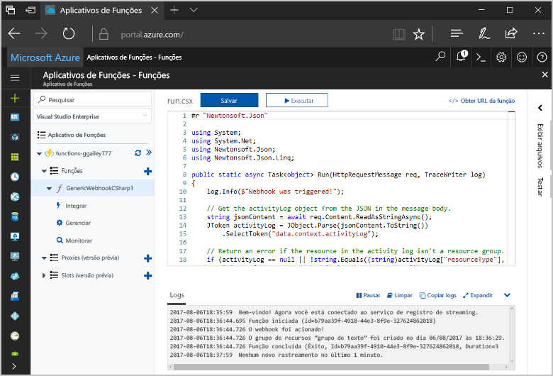
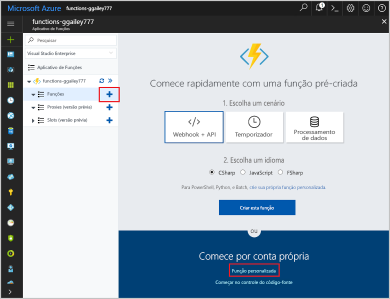
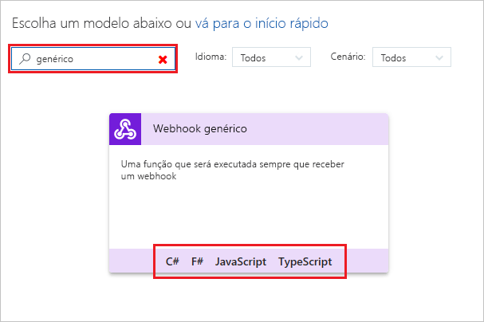
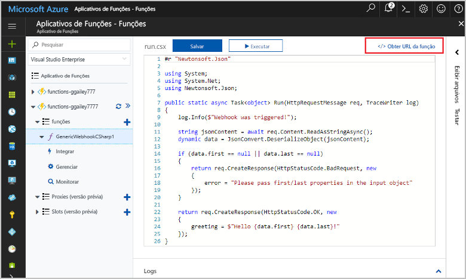
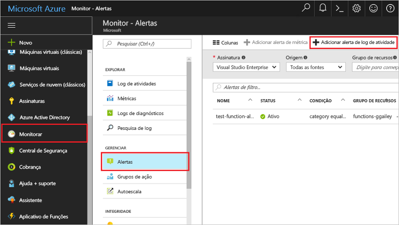
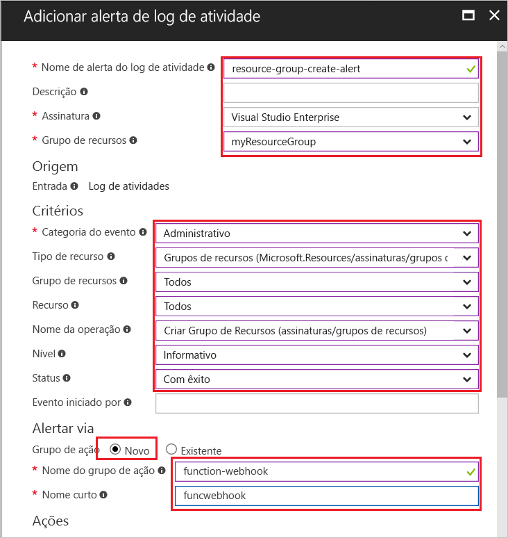
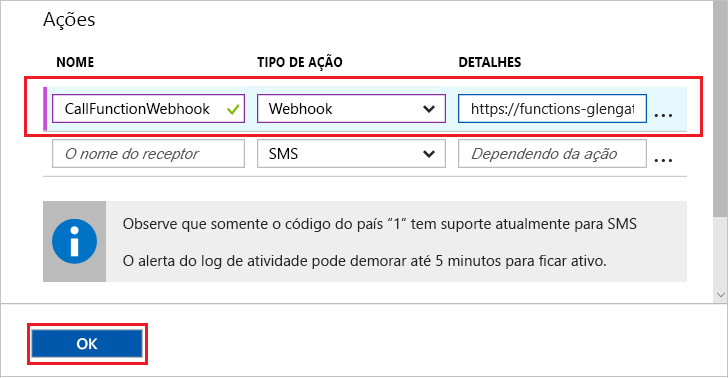
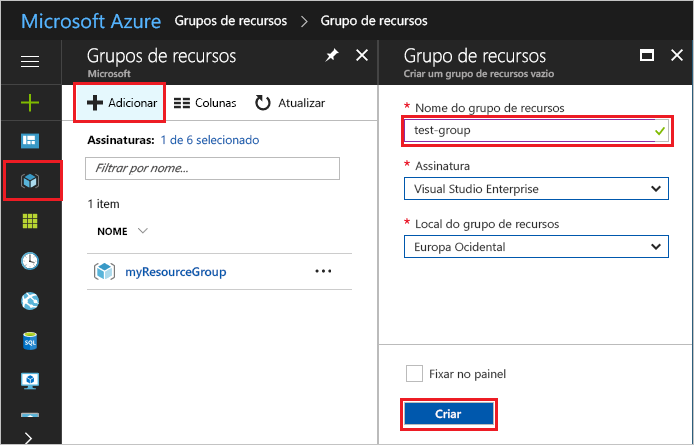
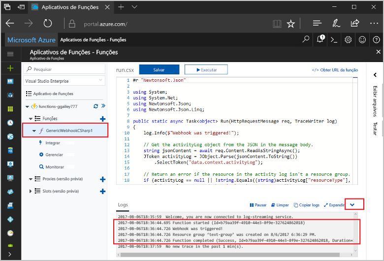

# <a name="create-a-function-triggered-by-a-generic-webhook"></a>Criar uma função disparada por um webhook genérico

O Azure Functions lhe permite executar seu código em um ambiente sem servidor sem que seja preciso primeiro criar uma VM ou publicar um aplicativo Web. Por exemplo, você pode configurar uma função a ser disparada por um alerta gerado pelo Azure Monitor. Este tópico mostra como executar código C# quando um grupo de recursos é adicionado à sua assinatura.   



## <a name="prerequisites"></a>Pré-requisitos 

Para concluir este tutorial:

+ Se você não tiver uma assinatura do Azure, crie uma [conta gratuita](https://azure.microsoft.com/free/?WT.mc_id=A261C142F) antes de começar.

[!INCLUDE [functions-portal-favorite-function-apps](../../includes/functions-portal-favorite-function-apps.md)]

## <a name="create-an-azure-function-app"></a>Criar um Aplicativo de funções do Azure

[!INCLUDE [Create function app Azure portal](../../includes/functions-create-function-app-portal.md)]

Em seguida, crie uma nova função no novo aplicativo de funções.

## <a name="create-function"></a>Criar uma função disparada por um webhook genérico

1. Expanda seu aplicativo de funções e clique no botão **+** ao lado de **Functions**. Se essa função for a primeira em seu aplicativo de funções, selecione **Função personalizada**. Exibe o conjunto completo de modelos de função.

    

2. Selecione o modelo **WebHook genérico - C#**. Digite um nome para sua função C# e selecione **Criar**.

      

2. Em sua nova função, clique em **</> Obter URL de função**. Em seguida, copie e salve o valor. Use esse valor para configurar o webhook. 

    
         
Em seguida, crie um ponto de extremidade de webhook em um alerta do log de atividades no Azure Monitor. 

## <a name="create-an-activity-log-alert"></a>Criar um alerta do log de atividades

1. No Portal do Azure, navegue até o serviço **Monitor**, selecione **Alertas** e clique em **Adicionar alerta do log de atividades**.   

    

2. Use as configurações conforme especificado na tabela:

    

    | Configuração      |  Valor sugerido   | Descrição                              |
    | ------------ |  ------- | -------------------------------------------------- |
    | **Nome do alerta do log de atividades** | resource-group-create-alert | Nome do alerta do log de atividades. |
    | **Assinatura** | Sua assinatura | A assinatura que você está usando para este tutorial. | 
    |  **Grupo de recursos** | myResourceGroup | O grupo de recursos em que os recursos de alerta são implantados. Usar o mesmo grupo de recursos que o aplicativo de funções facilita a limpeza depois de concluir o tutorial. |
    | **Categoria de eventos** | Administrativo | Essa categoria inclui as alterações feitas nos recursos do Azure.  |
    | **Tipo de recurso** | Grupos de recursos | Filtra alertas para atividades de grupo de recursos. |
    | **Grupo de recursos**<br/>e **Recurso** | Todos | Monitore todos os recursos. |
    | **Nome da operação** | Criar grupo de recursos | Filtra alertas para criar operações. |
    | **Level** | Informativo | Inclua os alertas de nível informativo. | 
    | **Status** | Bem-sucedido | Filtra alertas para ações que foram concluídas com êxito. |
    | **Grupo de ações** | Novo | Crie um novo grupo de ações, que define a ação a ser usada quando um alerta for gerado. |
    | **Nome do grupo de ações** | function-webhook | Um nome para identificar o grupo de ações.  | 
    | **Nome curto** | funcwebhook | Um nome curto para o grupo de ações. |  

3. Em **Ações**, adicione uma ação usando as configurações conforme especificado na tabela: 

    

    | Configuração      |  Valor sugerido   | Descrição                              |
    | ------------ |  ------- | -------------------------------------------------- |
    | **Nome** | CallFunctionWebhook | Um nome para a ação. |
    | **Tipo de ação** | webhook | Uma URL do Webhook é chamada em resposta ao alerta. |
    | **Detalhes** | URL da função | Cole na URL do webhook da função que foi copiada anteriormente. |v

4. Clique em **OK** para criar o alerta e o grupo de ações.  

O webhook agora é chamado quando um grupo de recursos é criado na sua assinatura. Em seguida, atualize o código em sua função para tratar os dados do log JSON no corpo da solicitação.   

## <a name="update-the-function-code"></a>Atualizar o código de função

1. Navegue novamente até seu aplicativo de funções no portal e expanda sua função. 

2. Substitua o código de script C# na função, no portal, pelo seguinte código:

    ```csharp
    #r "Newtonsoft.Json"
    
    using System;
    using System.Net;
    using Newtonsoft.Json;
    using Newtonsoft.Json.Linq;
    
    public static async Task<object> Run(HttpRequestMessage req, TraceWriter log)
    {
        log.Info($"Webhook was triggered!");
    
        // Get the activityLog object from the JSON in the message body.
        string jsonContent = await req.Content.ReadAsStringAsync();
        JToken activityLog = JObject.Parse(jsonContent.ToString())
            .SelectToken("data.context.activityLog");
    
        // Return an error if the resource in the activity log isn't a resource group. 
        if (activityLog == null || !string.Equals((string)activityLog["resourceType"], 
            "Microsoft.Resources/subscriptions/resourcegroups"))
        {
            log.Error("An error occured");
            return req.CreateResponse(HttpStatusCode.BadRequest, new
            {
                error = "Unexpected message payload or wrong alert received."
            });
        }
    
        // Write information about the created resource group to the streaming log.
        log.Info(string.Format("Resource group '{0}' was {1} on {2}.",
            (string)activityLog["resourceGroupName"],
            ((string)activityLog["subStatus"]).ToLower(), 
            (DateTime)activityLog["submissionTimestamp"]));
    
        return req.CreateResponse(HttpStatusCode.OK);    
    }
    ```

Agora você pode testar a função criando um novo grupo de recursos em sua assinatura.

## <a name="test-the-function"></a>Testar a função

1. Clique no ícone do grupo de recursos na parte esquerda do Portal do Azure, selecione **+ Adicionar**, digite o **Nome do grupo de recursos** e selecione **Criar** para criar um grupo de recursos vazio.
    
    

2. Volte para a função e expanda a janela **Logs**. Depois que o grupo de recursos é criado, o alerta do log de atividades dispara o webhook e a função é executada. Você vê o nome do novo grupo de recursos gravado nos logs.  

    

3. (Opcional) Volte e exclua o grupo de recursos que você criou. Observe que essa atividade não dispara a função. Isso porque as operações de exclusão são filtradas pelo alerta. 

## <a name="clean-up-resources"></a>Limpar recursos

[!INCLUDE [Next steps note](../../includes/functions-quickstart-cleanup.md)]

## <a name="next-steps"></a>Próximas etapas

Você criou uma função que é executada quando uma solicitação é recebida de um webhook genérico. 

[!INCLUDE [Next steps note](../../includes/functions-quickstart-next-steps.md)]

Para saber mais sobre gatilhos do webhook, veja [Associações HTTP e de webhook do Azure Functions](functions-bindings-http-webhook.md). Para saber mais sobre como desenvolver funções em C#, consulte [Referência do desenvolvedor de script C# do Azure Functions](functions-reference-csharp.md).


