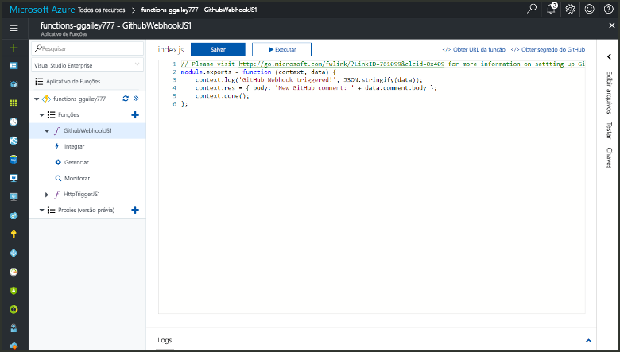
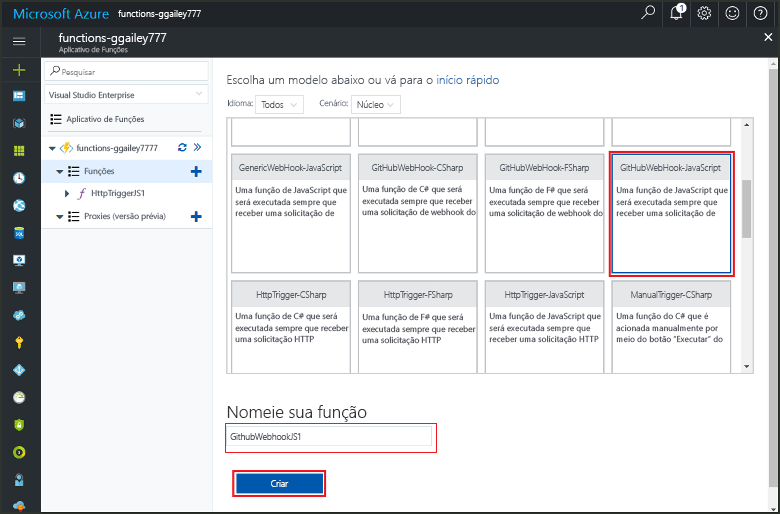
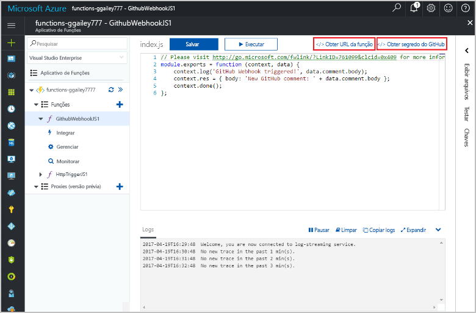

# Criar uma função disparada pelo webhook do GitHub

Saiba como criar uma função que é disparada por um webhook do GitHub. 

Este tópico requer os recursos criados no tópico [Criar sua primeira função no portal do Azure](functions-create-first-azure-function.md).

Você também precisa de uma conta do GitHub. Você pode [inscrever-se para uma conta gratuita do GitHub](https://github.com/join), se você ainda não tiver um. 

Deve levar menos de cinco minutos para concluir todas as etapas neste tópico.

## Localize seu aplicativo de funções    

1. Faça logon no [Portal do Azure](https://portal.azure.com/). 

2. Na barra de pesquisa na parte superior do portal, digite o nome do seu aplicativo de funções e selecione-o na lista.

## Criar uma função disparada pelo webhook do GitHub

1. Em seu aplicativo de funções, clique no botão **+** ao lado de **Funções**, clique no modelo **GitHubWebHook** para o idioma desejado e clique em **Criar**.
   
     

2. Clique em **</> Get function URL**, em seguida, copie e salve os valores. Faça o mesmo para **</> Get GitHub secret**. Você usa esses valores ao criar o webhook no GitHub. 

     
         
Em seguida, você cria o webhook no repositório GitHub. 

## Configurar o webhook
1. No GitHub, navegue até um repositório de sua propriedade. Você também pode usar qualquer repositório que você tenha bifurcado.
 
2. Clique em **Configurações**, em seguida, clique em **Webhooks**, e **Adicionar webhook**.
   
    

3. Cole a URL e o segredo em sua função **carga URL** e **segredo** e selecione **application/json** para **tipo de conteúdo**.

4. Clique em **deixe-me selecionar eventos individuais**, selecione **emitir comentário**e clique em **adicionar webhook**.
   
    

Neste momento, o webhook é configurado para disparar sua função quando um novo comentário do problema é adicionado. 

## Testar a função
1. No seu repositório GitHub, abra a guia **Problemas** em uma nova janela do navegador.

2. Na nova janela, clique em **novo problema**, digite um título e clique em **enviar novo problema**. 

2. No problema, digite um comentário e clique em **Comentar**. 

3. Na outra janela GitHub, clique em **Editar** ao lado de seu novo webhook, role para baixo até **Entregas recente** e verifique se uma solicitação webhook foi processada pela sua função. 
 
    

   A resposta da função deve conter `New GitHub comment: <Your issue comment text>`.

## Próximas etapas

[!INCLUDE [Next steps note](../../includes/functions-quickstart-next-steps.md)]

[!INCLUDE [Getting Started Note](../../includes/functions-get-help.md)]

