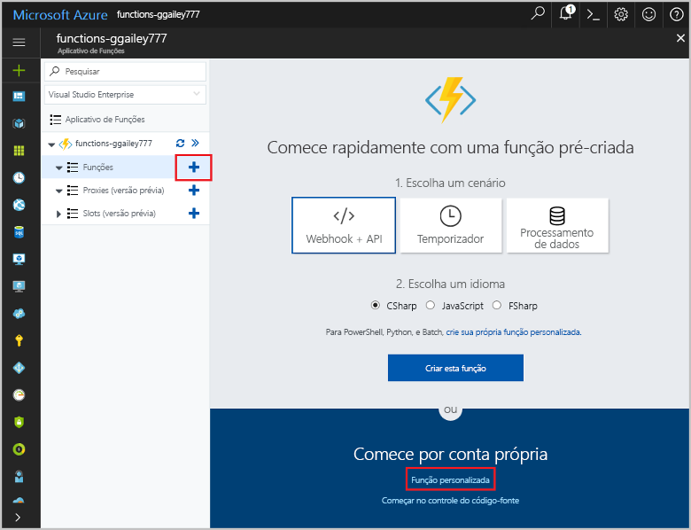
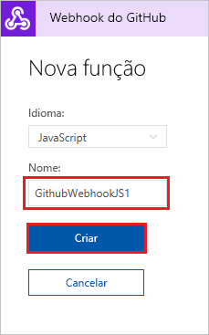

# Criar uma função disparada pelo webhook do GitHub

Saiba como criar uma função que é disparada por uma solicitação de webhook HTTP com um conteúdo específico do GitHub.

## pré-requisitos

+ Uma conta do GitHub com pelo menos um projeto.
+ Uma assinatura do Azure. Se você não tiver uma, crie uma [conta gratuita](https://azure.microsoft.com/free/?WT.mc_id=A261C142F) antes de começar.

## Criar um Aplicativo de funções do Azure

[!INCLUDE [Create function app Azure portal](../../includes/functions-create-function-app-portal.md)]

Em seguida, crie uma nova função no novo aplicativo de funções.

## Criar uma função disparada pelo webhook do GitHub

1. Expanda seu aplicativo de funções e clique no botão **+** ao lado de **Functions**. Se essa for a primeira função em seu aplicativo de funções, selecione **Função personalizada**. Exibe o conjunto completo de modelos de função.

    

2. No campo de pesquisa, digite `github` e depois escolha a linguagem desejada para o modelo de gatilho de webhook do GitHub. 

      

2. Digite um **Nome** para sua função, depois selecione **Criar**. 

      

3. Na sua nova função, clique em **</> Obter URL de função** e depois copie e salve os valores. Faça o mesmo para **</> Get GitHub secret**. Você usa esses valores ao criar o webhook no GitHub.

    

Em seguida, você cria o webhook no repositório GitHub.

## Configurar o webhook

1. No GitHub, navegue até um repositório de sua propriedade. Você também pode usar qualquer repositório que você tenha bifurcado. Se você precisar bifurcar um repositório, use <https://github.com/Azure-Samples/functions-quickstart>.

2. Escolha **Configurações** > **Opções** e verifique se a opção **Problemas** está habilitada em **Recursos**.

   

1. Em **Configurações**, escolha **Webhooks** > **Adicionar webhook**.

    

1. Use as configurações especificadas na tabela a seguir, depois clique em **Adicionar webhook**:

    

| Configuração | Valor sugerido | DESCRIÇÃO |
|---|---|---|
| **URL do conteúdo** | Valor copiado | Usar o valor retornado por **</> Obter URL de função**. |
| **Tipo de conteúdo** | aplicativo/json | A função espera um conteúdo JSON. |
| **Segredo**   | Valor copiado | Use o valor retornado por **</> Obter segredo do GitHub**. |
| Gatilhos de evento | Deixe-me selecionar eventos individuais | Queremos disparar apenas em eventos de comentário do problema.  |
| | Comentário do problema |  |

Neste momento, o webhook é configurado para disparar sua função quando um novo comentário do problema é adicionado.

## Testar a função

1. No seu repositório GitHub, abra a guia **Problemas** em uma nova janela do navegador.

1. Na nova janela, clique em **Novo Problema**, digite um título e clique em **Enviar novo problema**.

1. No problema, digite um comentário e clique em **Comentar**.

    

1. Volte para o portal e exiba os logs. Você deve ver uma entrada de rastreamento com o novo texto de comentário.

     

## Limpar recursos

[!INCLUDE [Next steps note](../../includes/functions-quickstart-cleanup.md)]

## Próximas etapas

Você criou uma função que é disparada quando uma solicitação é recebida de um webhook do GitHub.

[!INCLUDE [Next steps note](../../includes/functions-quickstart-next-steps.md)]

Para saber mais sobre gatilhos do webhook, veja [Associações HTTP e de webhook do Azure Functions](functions-bindings-http-webhook.md).
