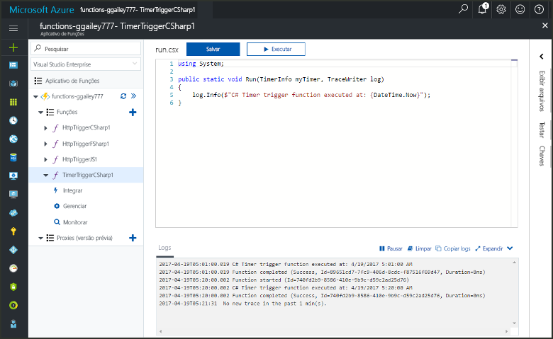
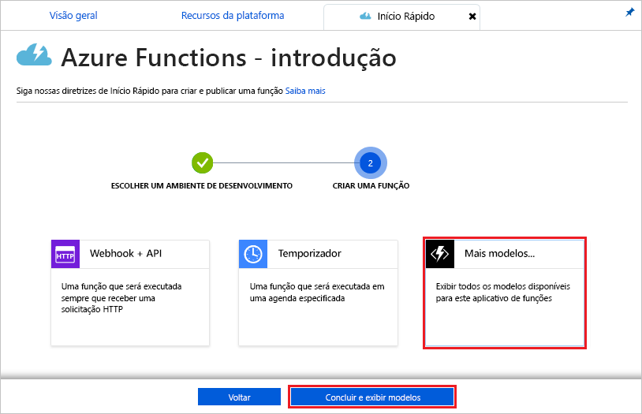
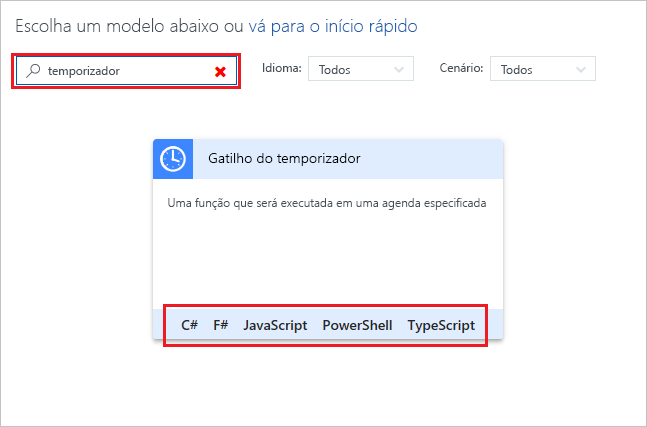
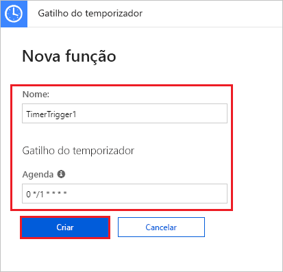
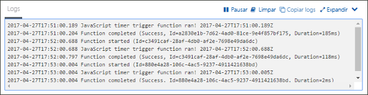
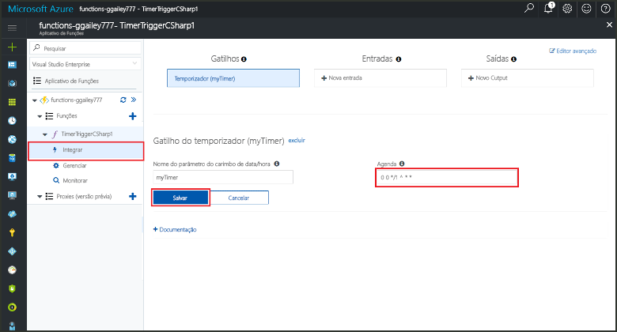

# Criar uma função no Azure que é disparada por um temporizador

Saiba como usar o Azure Functions para criar uma função que é executada com base em uma agendamento definido por você.

## Pré-requisitos

Para concluir este tutorial:

+ Se você não tiver uma assinatura do Azure, crie uma [conta gratuita](https://azure.microsoft.com/free/?WT.mc_id=A261C142F) antes de começar.

[!INCLUDE [functions-portal-favorite-function-apps](../../includes/functions-portal-favorite-function-apps.md)]

## Criar um Aplicativo de funções do Azure

[!INCLUDE [Create function app Azure portal](../../includes/functions-create-function-app-portal.md)]

Em seguida, crie uma nova função no novo aplicativo de funções.

## Criar uma função disparada por temporizador

1. Expanda seu aplicativo de funções e clique no botão **+** ao lado de **Functions**. Se essa for a primeira função em seu aplicativo de funções, selecione **Função personalizada**. Exibe o conjunto completo de modelos de função.

    

2. No campo de pesquisa, digite `timer` e depois escolha a linguagem desejada para o modelo de gatilho de temporizador. 

    

3. Configure o novo gatilho com as configurações conforme especificado na tabela abaixo da imagem.

    

    | Configuração | Valor sugerido | Descrição |
    |---|---|---|
    | **Nome** | Padrão | Define o nome da sua função disparada por temporizador. |
    | **[Agendamento](http://en.wikipedia.org/wiki/Cron#CRON_expression)** | 0 \*/1 \* \* \* \* | Uma [expressão CRON](http://en.wikipedia.org/wiki/Cron#CRON_expression) de seis campos que agenda sua função para ser executada a cada minuto. |

2. Clique em **Criar**. Uma nova função na linguagem de programação escolhida por você e que é executada a cada minuto é criada.

3. Verifique a execução, exibindo informações de rastreamento gravadas nos logs.

    

Agora, você pode alterar o agendamento da função para que ela seja executada com menos frequência, por exemplo, uma vez por hora. 

## Atualizar o agendamento do temporizador

1. Expanda sua função e clique em **Integrar**. É aqui que você define as associações de entrada e saída de sua função e também define o agendamento. 

2. Insira um novo valor de **Agendamento** de `0 0 */1 * * *` e, em seguida, clique em **Salvar**.  

Agora você tem uma função que é executada uma vez a cada hora. 

## Limpar recursos

[!INCLUDE [Next steps note](../../includes/functions-quickstart-cleanup.md)]

## Próximas etapas

Você criou uma função que é executada segundo um agendamento.

[!INCLUDE [Next steps note](../../includes/functions-quickstart-next-steps.md)]

Para obter mais informações sobre gatilhos de temporizador, consulte [Agendar a execução de código com o Azure Functions](functions-bindings-timer.md).