# Criar uma função disparada pelo Armazenamento de Blobs do Azure

Saiba como criar uma função disparada quando arquivos são carregados ou atualizados no Armazenamento de Blobs do Azure.

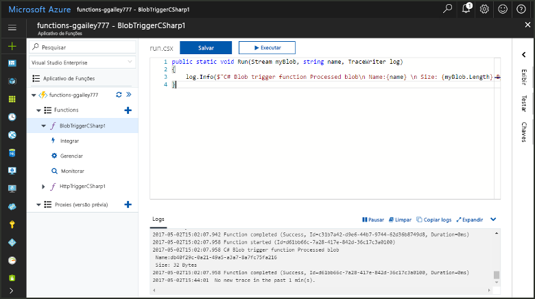

## Pré-requisitos

+ Baixe e instale o [Gerenciador de Armazenamento do Microsoft Azure](https://storageexplorer.com/).
+ Uma assinatura do Azure. Se você não tiver uma, crie uma [conta gratuita](https://azure.microsoft.com/free/?WT.mc_id=A261C142F) antes de começar.

## Criar um Aplicativo de funções do Azure

[!INCLUDE [Create function app Azure portal](../../includes/functions-create-function-app-portal.md)]

Em seguida, crie uma nova função no novo aplicativo de funções.

## Criar uma função disparada pelo Armazenamento de Blobs

1. Expanda seu aplicativo de funções e clique no botão **+** ao lado de **Functions**. Se essa for a primeira função em seu aplicativo de funções, selecione **No portal** e depois **Continuar**. Caso contrário, vá para a etapa três.

   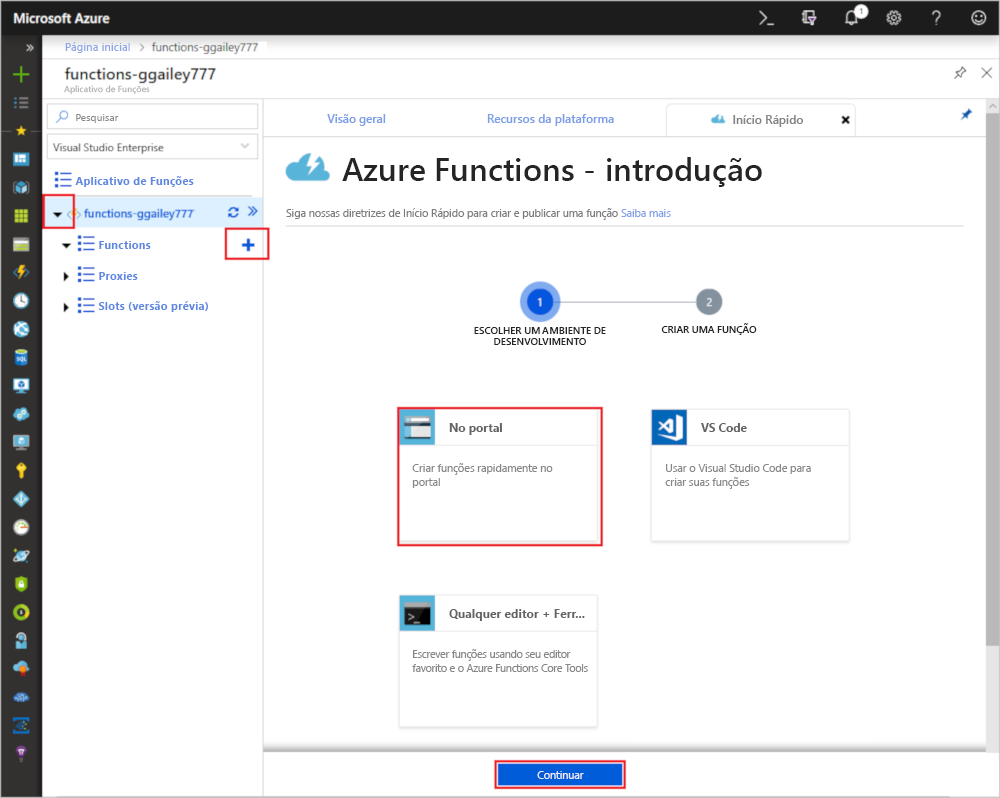

1. Escolha **Mais modelos** e, em seguida, **Concluir e exibir modelos**.

    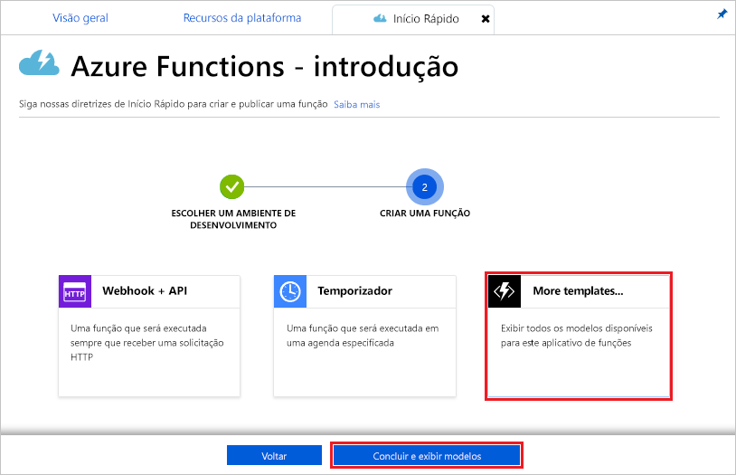

1. No campo de pesquisa, digite `blob` e escolha o modelo **Gatilho de blob**.

1. Se solicitado, selecione **Instalar** para instalar a extensão de Armazenamento do Azure em todas as dependências no aplicativo de funções. Após a instalação ser bem-sucedida, selecione **Continuar**.

    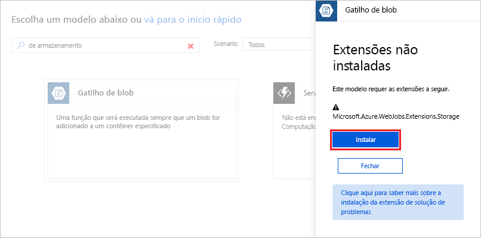

1. Use as configurações conforme especificado na tabela abaixo da imagem.

    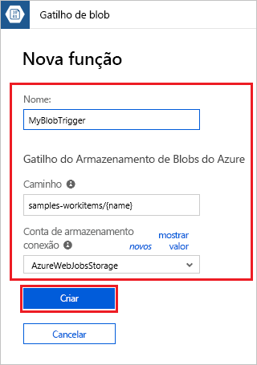

    | Configuração | Valor sugerido | Descrição |
    |---|---|---|
    | **Nome** | Exclusivo no aplicativo de funções | O nome dessa função disparada pelo blob. |
    | **Caminho**   | samples-workitems/{name}    | Local no Armazenamento de Blobs que está sendo monitorada. O nome do arquivo do blob é passado na associação como o parâmetro _name_.  |
    | **Conexão da conta de armazenamento** | AzureWebJobsStorage | Você pode usar a conexão da conta de armazenamento que já está sendo usada por seu aplicativo de funções ou criar uma nova.  |

1. Clique em **Criar** para criar a função.

Em seguida, você pode se conectar à sua conta de armazenamento do Azure e criar o contêiner **samples-workitems**.

## Criar o contêiner

1. Em sua função, clique em **Integrar**, expanda **Documentação**e copie **Nome da conta** e **Chave de conta**. Você usa essas credenciais para conectar-se à conta de armazenamento. Se você já tiver se conectado à conta de armazenamento, vá para a etapa 4.

    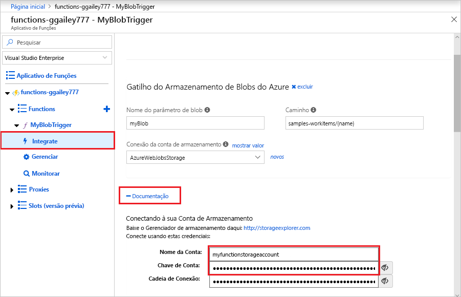

1. Execute a ferramenta [Gerenciador de Armazenamento do Microsoft Azure](https://storageexplorer.com/), clique no ícone conectar-se à esquerda, escolha **Usar um nome e chave de conta de armazenamento** e clique em **Avançar**.

    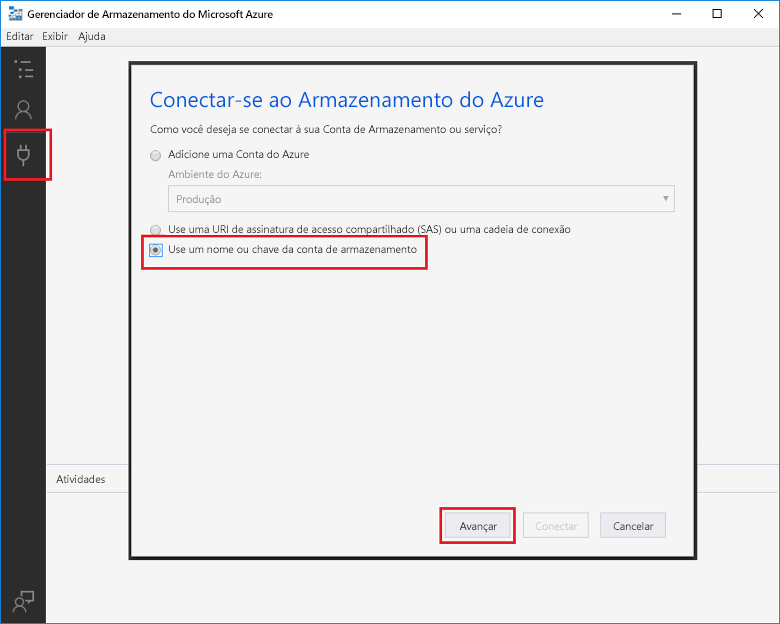

1. Insira o **Nome da conta** e **Chave de conta** da etapa 1, clique em **Avançar** e em **Conectar**. 

    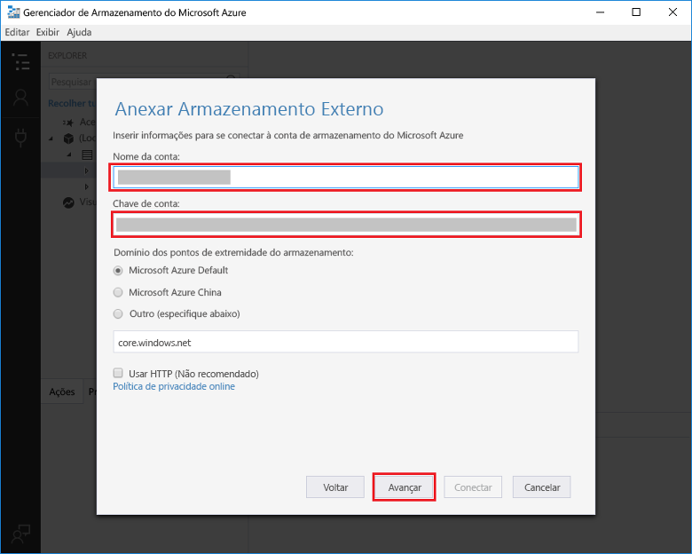

1. Expanda a conta de armazenamento anexada, clique com o botão direito do mouse em **Contêineres de blob**, clique em **Criar contêiner de blob**, digite `samples-workitems` e pressione enter.

    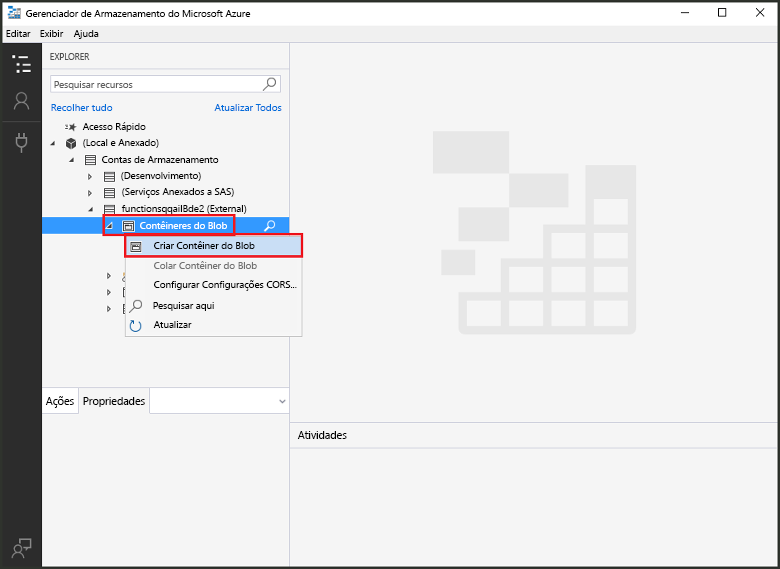

Agora que você tem um contêiner de blob, você pode testar a função carregando um arquivo para o contêiner.

## Testar a função

1. De volta ao Portal do Azure, navegue até sua função, expanda os **Logs** na parte inferior da página e verifique se o streaming de log não está em pausa.

1. No Gerenciador de Armazenamento, expanda sua conta de armazenamento, **Contêineres de blob** e **samples-workitems**. Clique em **Carregar** e depois em **Carregar arquivos...**.

    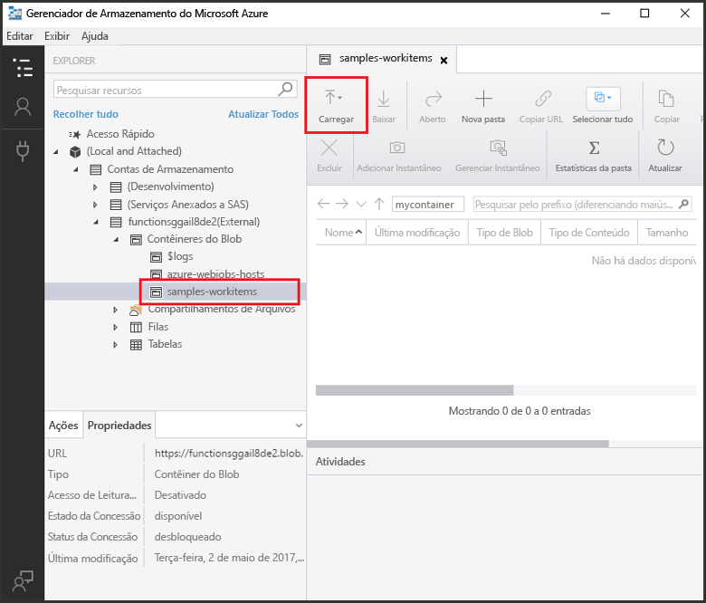

1. Na caixa de diálogo **Carregar arquivos**, clique no campo **Arquivos**. Navegue até um arquivo em seu computador local, por exemplo, um arquivo de imagem, selecione-o e clique em **Abrir** e depois em **Carregar**.

1. Volte para os logs de função e verifique se o blob foi lido.

   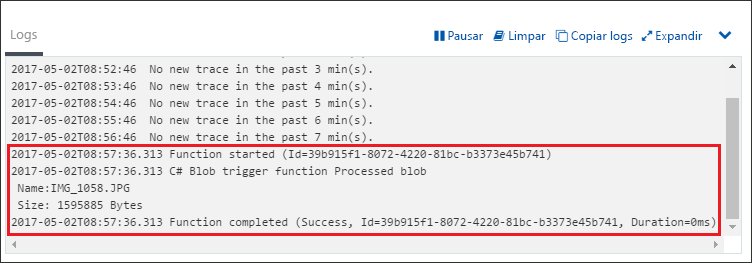

    >[!NOTE]
    > Quando seu aplicativo de funções é executado no plano de consumo padrão, pode haver um atraso de até vários minutos entre o blob que está sendo adicionado ou atualizado e a função sendo disparada. Se você precisar de baixa latência em suas funções disparadas por blob, considere executar seu aplicativo de funções em um Plano do Serviço de Aplicativo.

## Limpar recursos

[!INCLUDE [Next steps note](../../includes/functions-quickstart-cleanup.md)]

## Próximas etapas

Você criou uma função que é executada quando um blob é adicionado a um Armazenamento de Blobs ou atualizado nele. Para obter mais informações sobre gatilhos de armazenamento de blobs, consulte [Associações de Armazenamento de Blobs do Azure Functions](functions-bindings-storage-blob.md).

[!INCLUDE [Next steps note](../../includes/functions-quickstart-next-steps.md)]