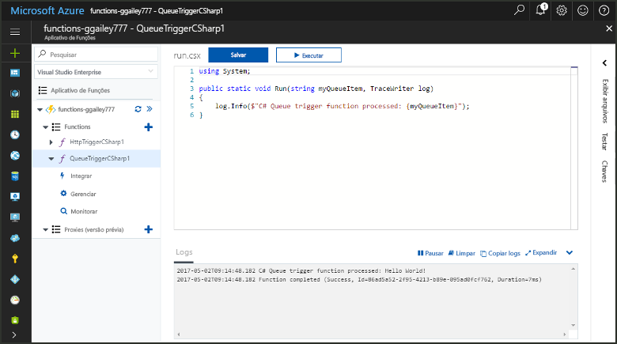
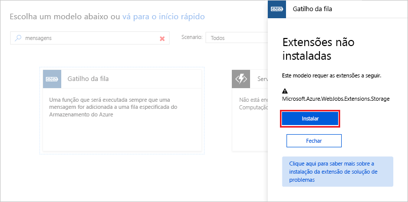
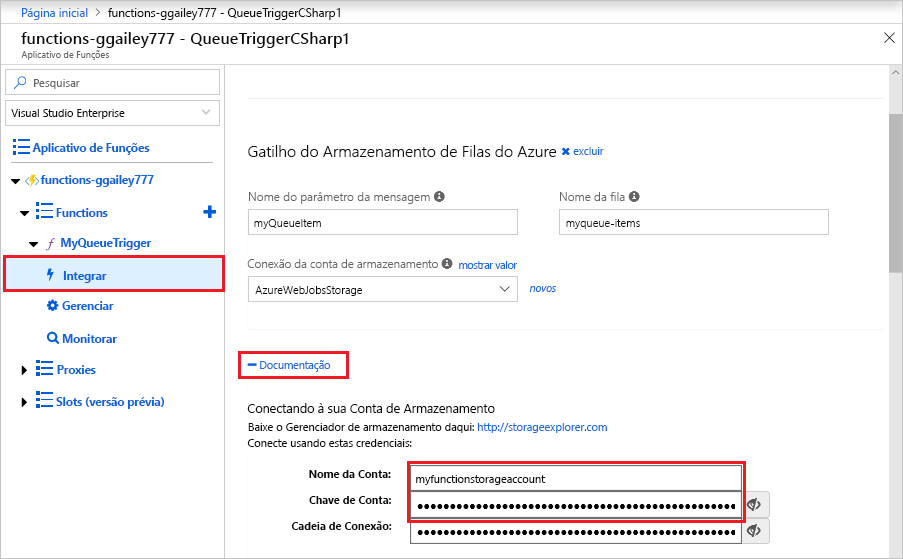
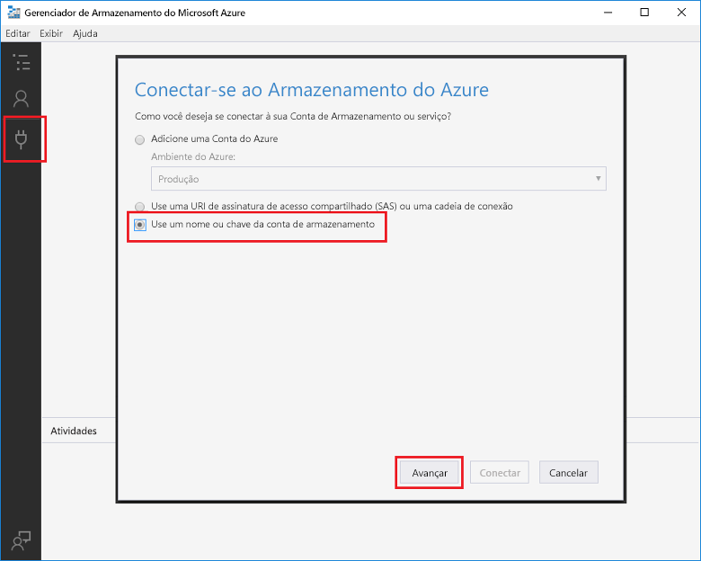
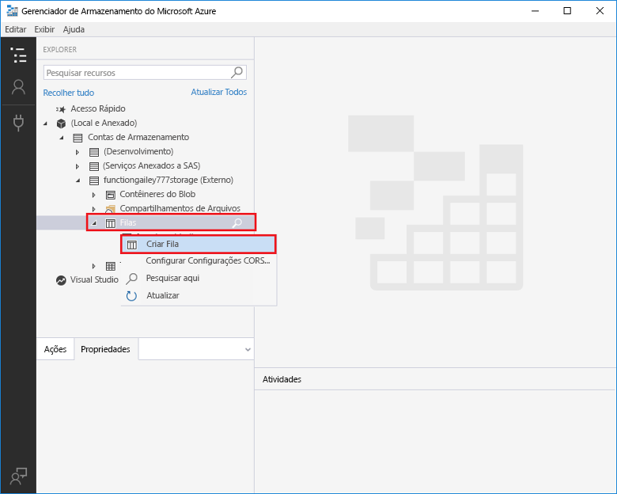
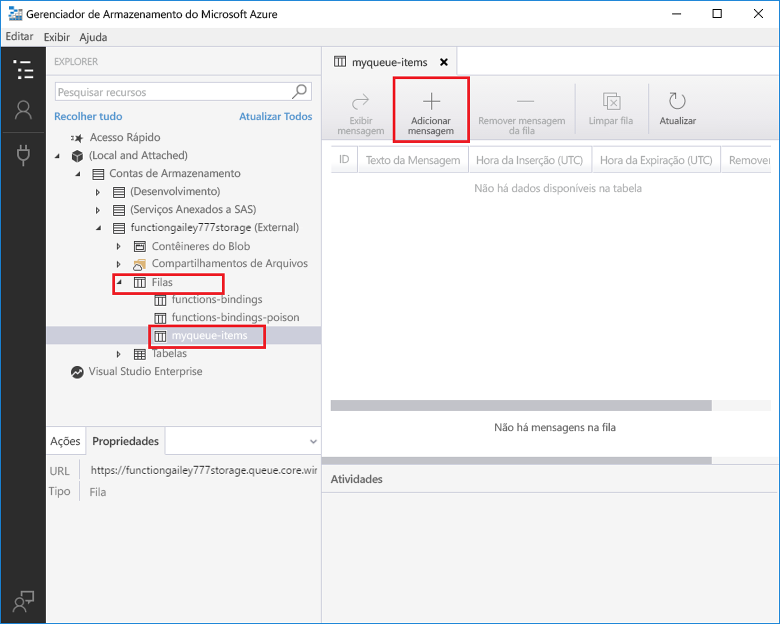
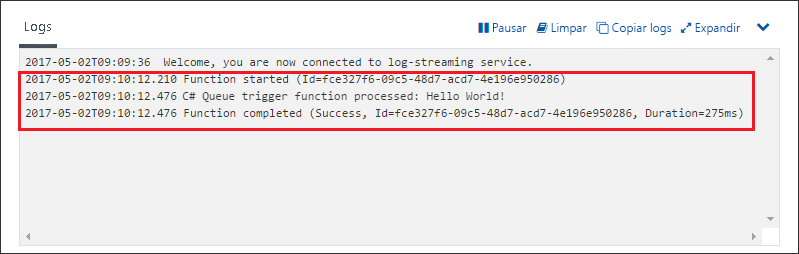

# Criar uma função disparada pelo Armazenamento de Filas do Azure

Saiba como criar uma função disparada quando as mensagens são enviadas para uma fila do Armazenamento do Azure.

Deve levar menos de cinco minutos para concluir todas as etapas neste tópico.

## Pré-requisitos

Antes de executar este exemplo, você deve executar o seguinte:

- Baixe e instale o [Gerenciador de Armazenamento do Microsoft Azure](http://storageexplorer.com/).

Se você não tiver uma assinatura do Azure, crie uma [conta gratuita](https://azure.microsoft.com/free/?WT.mc_id=A261C142F) antes de começar.

[!INCLUDE [functions-portal-favorite-function-apps](../../includes/functions-portal-favorite-function-apps.md)]

## Criar um Aplicativo de funções do Azure

[!INCLUDE [Create function app Azure portal](../../includes/functions-create-function-app-portal.md)]

Em seguida, crie uma nova função no novo aplicativo de funções.

## Criar uma função disparada por Filas

Expanda seu aplicativo de funções, clique no botão **+** ao lado de **Funções**, clique no modelo **QueueTrigger** para a linguagem de programação desejada. Use então as configurações especificadas na tabela e, em seguida, clique em **Criar**.

| Configuração | Valor sugerido | Descrição |
|---|---|---|
| **Nome da fila**   | myqueue-items    | Nome da fila à qual se conectar em sua conta de armazenamento. |
| **Conexão da conta de armazenamento** | AzureWebJobStorage | Você pode usar a conexão da conta de armazenamento que já está sendo usada por seu aplicativo de funções ou criar uma nova.  |
| **Nomeie sua função** | Exclusivo no aplicativo de funções | O nome dessa função disparada por filas. |

Em seguida, você pode se conectar à sua conta de armazenamento do Azure e criar a fila de armazenamento **myqueue-items**.

## Criar a fila

1. Em sua função, clique em **Integrar**, expanda **Documentação**e copie **Nome da conta** e **Chave de conta**. Você usa essas credenciais para conectar-se à conta de armazenamento. Se você já tiver se conectado à conta de armazenamento, vá para a etapa 4.

    v

1. Execute a ferramenta [Gerenciador de Armazenamento do Microsoft Azure](http://storageexplorer.com/), clique no ícone conectar-se à esquerda, escolha **Usar um nome e chave de conta de armazenamento** e clique em **Avançar**.

    

1. Insira o **Nome da conta** e **Chave de conta** da etapa 1, clique em **Avançar** e em **Conectar**.

    

1. Expanda a conta de armazenamento anexada, clique com o botão direito do mouse em **Filas**, clique em **Criar fila**, digite `myqueue-items` e pressione enter.

    

Agora que você tem uma fila de armazenamento, você pode testar a função adicionando uma mensagem à fila.

## Testar a função

1. De volta ao Portal do Azure, navegue até sua função, expanda os **Logs** na parte inferior da página e verifique se o streaming de log não está em pausa.

1. No Gerenciador de Armazenamento, expanda sua conta de armazenamento, **Filas** e **myqueue-items**; em seguida, clique em **Adicionar mensagem**.

    

1. Digite sua mensagem "Olá, Mundo!" em **Texto da mensagem** e clique em **OK**.

1. Aguarde alguns segundos, depois volte para seus logs de função e verifique se a nova mensagem foi lida da fila.

    

1. No Gerenciador de Armazenamento, clique em **Atualizar** e verifique se a mensagem foi processada e se não está mais na fila.

## Limpar recursos

[!INCLUDE [Next steps note](../../includes/functions-quickstart-cleanup.md)]

## Próximas etapas

Você criou uma função que é executada quando uma mensagem é adicionada a uma fila de armazenamento.

[!INCLUDE [Next steps note](../../includes/functions-quickstart-next-steps.md)]

Para obter mais informações sobre gatilhos de Armazenamento de Filas, consulte [Associações de fila do Armazenamento do Azure Functions](functions-bindings-storage-queue.md).
