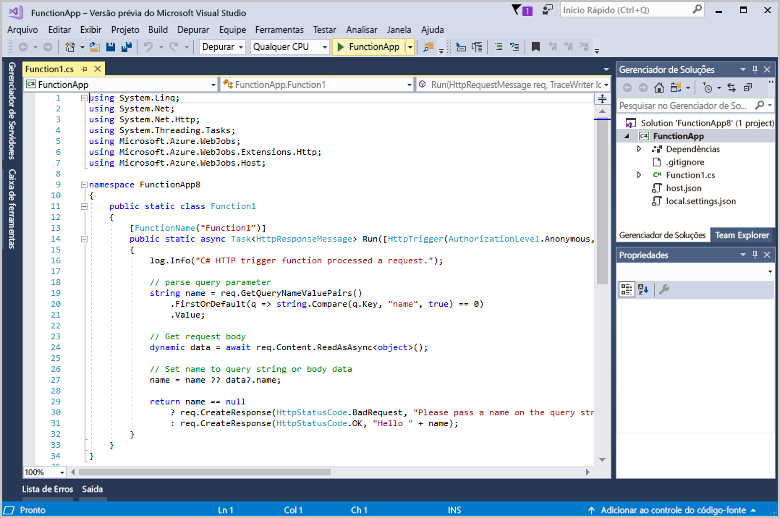

# Criar sua primeira função usando o Visual Studio

O Azure Functions lhe permite executar seu código em um ambiente [sem servidor](https://azure.microsoft.com/overview/serverless-computing/) sem que seja preciso primeiro criar uma VM ou publicar um aplicativo Web.

Neste tópico, você aprenderá a usar as ferramentas do Visual Studio 2017 para Azure Functions para criar e testar uma função "hello world" localmente. Em seguida, você publicará o código de função no Azure. Essas ferramentas estão disponíveis como parte da carga de trabalho de desenvolvimento do Azure no Visual Studio 2017 versão 15.3 ou posterior.

## Pré-requisitos

Para concluir este tutorial, instale:

* [Visual Studio 2017 versão 15.4](https://www.visualstudio.com/vs/) ou uma versão posterior, incluindo a carga de trabalho de **desenvolvimento do Azure**.

    
    
[!INCLUDE [quickstarts-free-trial-note](../../includes/quickstarts-free-trial-note.md)] 

## Criar um projeto do Azure Functions no Visual Studio

[!INCLUDE [Create a project using the Azure Functions template](../../includes/functions-vstools-create.md)]

Agora que você criou o projeto, poderá criar sua primeira função.

## Criar a função

1. No **Gerenciador de Soluções**, clique com o botão direito do mouse no nó do projeto e selecione **Adicionar** > **Novo Item**. Selecione **Azure Function**, insira `HttpTriggerCSharp.cs` para **Nome** e clique em **Adicionar**.

2. Selecione **HttpTrigger**, selecione **Anônimo** para **Direitos de Acesso** e clique em **OK**. A função criada é acessada por uma solicitação HTTP de qualquer cliente. 

    

    Um arquivo de código é adicionado ao seu projeto que contém uma classe que implementa o código de função. Esse código é baseado em um modelo, que recebe um valor de nome e ecoa esse valor novamente. O atributo **FunctionName** define o nome da sua função. O atributo **HttpTrigger** indica a mensagem que dispara a função. 

    

Agora que você criou uma função disparada por HTTP, poderá testá-la em seu computador local.

## Testar a função localmente

As Ferramentas Principais do Azure Functions permitem executar o projeto do Azure Functions no seu computador de desenvolvimento local. Você precisa instalar essas ferramentas na primeira vez em que inicia uma função no Visual Studio.  

1. Para testar sua função, pressione F5. Se solicitado, aceite a solicitação do Visual Studio para baixar e instalar as ferramentas principais (CLI) do Azure Functions.  Você também precisará habilitar a exceção de firewall de forma que as ferramentas possam lidar com solicitações HTTP.

2. Copie a URL da sua função da saída de tempo de execução do Azure Functions.  

    

3. Cole a URL para a solicitação HTTP na barra de endereços do navegador. Acrescente o valor de cadeia de consulta `?name=<yourname>` a essa URL e execute a solicitação. O exemplo a seguir mostra a resposta no navegador à solicitação GET local retornada pela função: 

    

4. Para interromper a depuração, clique no botão **Parar** na barra de ferramentas do Visual Studio.

Após verificar se a função foi executada corretamente no computador local, é hora de publicar o projeto no Azure.

## Publicar o projeto no Azure

Você deve ter um aplicativo de funções em sua assinatura do Azure antes de publicar seu projeto. Você pode criar um aplicativo de funções diretamente no Visual Studio.

[!INCLUDE [Publish the project to Azure](../../includes/functions-vstools-publish.md)]

## Testar sua função no Azure

1. Copie a URL base do aplicativo de funções da página de perfil de publicação. Substitua a parte `localhost:port` da URL que você usou ao testar a função localmente pela nova URL base. Como anteriormente, acrescente o valor de cadeia de consulta `?name=<yourname>` a essa URL e execute a solicitação.

    A URL que chama a função disparada por HTTP é mais ou menos assim:

        http://<functionappname>.azurewebsites.net/api/<functionname>?name=<yourname> 

2. Cole essa nova URL para a solicitação HTTP na barra de endereços do navegador. O exemplo a seguir mostra a resposta no navegador à solicitação GET remota retornada pela função: 

    
 
## Próximas etapas

Você usou o Visual Studio para criar um aplicativo de funções C# com uma função disparada por HTTP simples. 

+ Para saber como configurar seu projeto para dar suporte a outros tipos de gatilhos e associações, consulte a seção [Configurar o projeto para desenvolvimento local](functions-develop-vs.md#configure-the-project-for-local-development) em [Ferramentas do Azure Functions para Visual Studio](functions-develop-vs.md).
+ Para saber mais sobre o local de teste e a depuração usando as Ferramentas Principais do Azure Functions, confira [Codificar e testar o Azure Functions localmente](functions-run-local.md). 
+ Para saber mais sobre como desenvolver funções como bibliotecas de classes do .NET, veja [Como usar bibliotecas de classes do .NET com o Azure Functions](functions-dotnet-class-library.md). 

