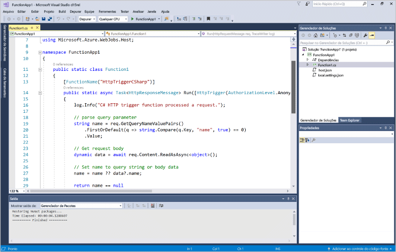
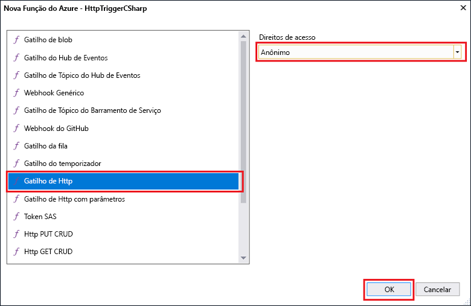

# Criar sua primeira função usando o Visual Studio

O Azure Functions lhe permite executar seu código em um ambiente sem servidor sem que seja preciso primeiro criar uma VM ou publicar um aplicativo Web.

> [!IMPORTANT]
> Este tópico usa uma Versão Prévia do Visual Studio para concluir as etapas. Certifique-se de que você instalou a [Versão prévia 15.3 do Visual Studio 2017](https://www.visualstudio.com/vs/preview/) antes de avançar.

Neste tópico, você aprenderá a usar as Ferramentas do Azure Functions para Visual Studio 2017 a fim de criar e testar uma função de "Olá, Mundo" localmente. Em seguida, você publicará o código de função no Azure.

## Pré-requisitos

Para concluir este tutorial, instale:

* [Versão prévia do Visual Studio 2017 15.3](https://www.visualstudio.com/vs/preview/), incluindo a carga de trabalho **Desenvolvimento do Azure**.

    

[!INCLUDE [quickstarts-free-trial-note](../../includes/quickstarts-free-trial-note.md)]

## Instalar as Ferramentas do Azure Functions para Visual Studio 2017

Antes de começar, você deve baixar e instalar as Ferramentas do Azure Functions para Visual Studio 2017. Essas ferramentas podem ser usadas apenas com a Versão prévia do Visual Studio 2017 15.3 ou uma versão posterior. Se você já instalou as Ferramentas do Azure Functions, poderá ignorar esta seção.

[!INCLUDE [Install the Azure Functions Tools for Visual Studio](../../includes/functions-install-vstools.md)]   

## Criar um projeto do Azure Functions no Visual Studio

[!INCLUDE [Create a project using the Azure Functions template](../../includes/functions-vstools-create.md)]

Agora que você criou o projeto, poderá criar sua primeira função.

## Criar a função

No **Gerenciador de Soluções**, clique com o botão direito do mouse no nó do projeto e selecione **Adicionar** > **Novo Item**. Selecione **Azure Function** e clique em **Adicionar**.

Selecione **HttpTrigger**, digite um **Nome da Função**, selecione **Anônimo** para **Direitos de Acesso**e clique em **Criar**. A função criada é acessada por uma solicitação HTTP de qualquer cliente. 

Agora que você criou uma função disparada por HTTP, poderá testá-la em seu computador local.

## Testar a função localmente

[!INCLUDE [Test the function locally](../../includes/functions-vstools-test.md)]

Copie a URL da sua função da saída de tempo de execução do Azure Functions.  

 Cole a URL para a solicitação HTTP na barra de endereços do navegador. Acrescente o valor de cadeia de consulta `&name=<yourname>` a essa URL e execute a solicitação. O exemplo a seguir mostra a resposta no navegador à solicitação GET local retornada pela função: 

Para interromper a depuração, clique no botão **Parar** na barra de ferramentas do Visual Studio.

Após verificar se a função foi executada corretamente no computador local, é hora de publicar o projeto no Azure.

## Publicar o projeto no Azure

Você deve ter um aplicativo de funções em sua assinatura do Azure antes de publicar seu projeto. Você pode criar um aplicativo de funções diretamente no Visual Studio.

[!INCLUDE [Publish the project to Azure](../../includes/functions-vstools-publish.md)]

## Testar sua função no Azure

Copie a URL base do aplicativo de funções da página de perfil de publicação. Substitua a parte `localhost:port` da URL que você usou ao testar a função localmente pela nova URL base. Como anteriormente, acrescente o valor de cadeia de consulta `&name=<yourname>` a essa URL e execute a solicitação.

A URL que chama a função disparada por HTTP é mais ou menos assim:

    http://<functionappname>.azurewebsites.net/api/<functionname>?name=<yourname> 

Cole essa nova URL para a solicitação HTTP na barra de endereços do navegador. O exemplo a seguir mostra a resposta no navegador à solicitação GET remota retornada pela função: 

 
## Próximas etapas

Você usou o Visual Studio para criar um aplicativo de funções C# com uma função disparada por HTTP simples. 

[!INCLUDE [functions-quickstart-next-steps](../../includes/functions-quickstart-next-steps.md)]

Para saber mais sobre o local de teste e a depuração usando as Ferramentas Principais do Azure Functions, confira [Codificar e testar o Azure Functions localmente](functions-run-local.md). Para saber mais sobre como desenvolver funções como bibliotecas de classes do .NET, veja [Como usar bibliotecas de classes do .NET com o Azure Functions](functions-dotnet-class-library.md). 

