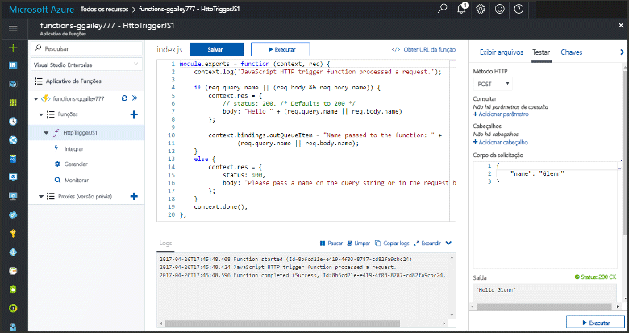

# <a name="add-messages-to-an-azure-storage-queue-using-functions"></a>Adicionar mensagens a uma fila do Armazenamento do Azure usando o Functions

No Azure Functions, associações de entrada e saída fornecem uma maneira declarativa para se conectar a dados de serviço externo de sua função. Neste tópico, aprenda como atualizar uma função existente, adicionando uma associação de saída que envia mensagens para o Armazenamento de Filas do Azure.  



## <a name="prerequisites"></a>Pré-requisitos 

[!INCLUDE [Previous topics](../../includes/functions-quickstart-previous-topics.md)]

Você também precisa baixar e instalar o [Gerenciador do Armazenamento do Microsoft Azure](http://storageexplorer.com/). 

[!INCLUDE [functions-portal-favorite-function-apps](../../includes/functions-portal-favorite-function-apps.md)] 

## <a name="add-binding"></a>Adicionar uma associação de saída
 
1. Expanda seu aplicativo de funções e sua função.

2. Clique em **Integrar** e em **+ Nova saída**, em seguida, clique em **Armazenamento de filas do Azure** e clique em **Selecionar**.
    
    

3. Use então as configurações especificadas na tabela e, em seguida, clique em **Salvar**: 

    

    | Configuração      |  Valor sugerido   | Descrição                              |
    | ------------ |  ------- | -------------------------------------------------- |
    | **Nome da fila**   | myqueue-items    | Nome da fila à qual se conectar em sua conta de armazenamento. |
    | **Conexão da conta de armazenamento** | AzureWebJobStorage | Você pode usar a conexão da conta de armazenamento que já está sendo usada por seu aplicativo de funções ou criar uma nova.  |
    | **Nome do parâmetro de mensagem** | outQueueItem | O nome do parâmetro de associação de saída. | 

Agora que você tem uma associação de saída definida, você precisa atualizar o código para usar a associação para adicionar mensagens a uma fila.  

## <a name="update-the-function-code"></a>Atualizar o código de função

1. Clique em sua função para exibir o código de função no editor. 

2. Para uma função C#, atualize sua definição de função como demonstrado a seguir para adicionar o parâmetro de associação de armazenamento **outQueueItem**. Ignore esta etapa para uma função JavaScript.

    ```cs   
    public static async Task<HttpResponseMessage> Run(HttpRequestMessage req, 
        ICollector<string> outQueueItem, TraceWriter log)
    {
        ....
    }
    ```

3. Adicione o código a seguir à função logo antes do método retornar. Use o trecho de código apropriado para a linguagem de programação de sua função.

    ```javascript
    context.bindings.outQueueItem = "Name passed to the function: " + 
                (req.query.name || req.body.name);
    ```

    ```cs
    outQueueItem.Add("Name passed to the function: " + name);     
    ```

4. Clique em **Salvar** para salvar as alterações.

O valor passado para o gatilho HTTP é incluído em uma mensagem adicionada à fila.
 
## <a name="test-the-function"></a>Testar a função 

1. Depois que as alterações de código forem salvas, clique em **Executar**. 

    

2. Confira os logs para verificar se a função foi bem-sucedida. Uma nova fila denominada **outqueue** é criada na sua conta de armazenamento pelo tempo de execução do Functions quando a associação de saída é usada pela primeira vez.

Em seguida, você pode se conectar à sua conta de armazenamento para verificar a nova fila e a mensagem que você adicionou a ela. 

## <a name="connect-to-the-queue"></a>Conectar-se à fila

Ignore as três primeiras etapas se você já tiver instalado o Gerenciador de Armazenamento e o conectado à sua conta de armazenamento.    

1. Em sua função, clique em **Integrar** e na nova associação de saída **Armazenamento de Filas do Azure**, em seguida, expanda **Documentação**. Copie o **Nome da conta** e a **Chave de conta**. Você usa essas credenciais para conectar-se à conta de armazenamento.
 
    

2. Execute a ferramenta [Gerenciador de Armazenamento do Microsoft Azure](http://storageexplorer.com/), clique no ícone conectar-se à esquerda, escolha **Usar um nome e chave de conta de armazenamento** e clique em **Avançar**.

    
    
3. Insira o **Nome da conta** e **Chave de conta** da etapa 1, clique em **Avançar** e em **Conectar**. 
  
    

4. Expanda a conta de armazenamento anexada, clique com o botão direito do mouse em **Filas** e verifique se uma fila chamada **myqueue-items** existe. Você também deverá ver uma mensagem já presente na fila.  
 
    
 

## <a name="clean-up-resources"></a>Limpar recursos

[!INCLUDE [Next steps note](../../includes/functions-quickstart-cleanup.md)]

## <a name="next-steps"></a>Próximas etapas

Você adicionou uma associação de saída a uma função existente. 

[!INCLUDE [Next steps note](../../includes/functions-quickstart-next-steps.md)]

Para obter mais informações sobre associação a Armazenamento de Filas, consulte [Associações de fila do Armazenamento do Azure Functions](functions-bindings-storage-queue.md). 


