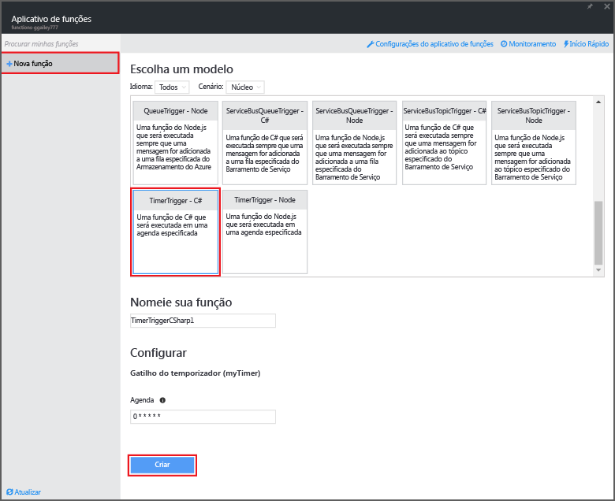

<properties
   pageTitle="Usar o Azure Functions para executar uma tarefa de limpeza agendada | Microsoft Azure"
   description="Use o Azure Functions para criar uma função C# executada com base em um temporizador de eventos."
   services="functions"
   documentationCenter="na"
   authors="ggailey777"
   manager="erikre"
   editor=""
   tags=""
   />

<tags
   ms.service="functions"
   ms.devlang="multiple"
   ms.topic="article"
   ms.tgt_pltfrm="multiple"
   ms.workload="na"
   ms.date="09/26/2016"
   ms.author="glenga"/>
   

# Usar o Azure Functions para executar uma tarefa de limpeza agendada

Este tópico mostra como usar o Azure Functions para criar uma nova função em C# que é executada com base em um temporizador de evento para limpar linhas em uma tabela de banco de dados. A nova função é criada com base em um modelo predefinido no portal do Azure Functions. Para dar suporte a esse cenário, você também precisa definir uma cadeia de conexão de banco de dados como uma configuração do Serviço de Aplicativo no aplicativo de funções. 

## Pré-requisitos 

Antes de criar uma função, você precisa ter uma conta ativa do Azure. Se ainda não tiver uma conta do Azure, saiba que [há contas gratuitas disponíveis](https://azure.microsoft.com/free/).

Este tópico demonstra um comando Transact-SQL que executa uma operação de limpeza em massa na tabela chamada *TodoItems* em um Banco de Dados SQL. Essa mesma tabela TodoItems é criada quando você conclui o [Tutorial de início rápido dos Aplicativos Móveis do Serviço de Aplicativo do Azure](../app-service-mobile/app-service-mobile-ios-get-started.md). Você também pode usar um banco de dados de exemplo. Se optar por usar uma tabela diferente, você precisará modificar o comando.

Você pode obter a cadeia de conexão usada por um back-end de Aplicativo Móvel no portal em **Todas as configurações** > **Configurações do aplicativo** > **Cadeias de conexão** > **Mostrar valores da cadeia de conexão** > **MS_TableConnectionString**. Você também pode obter a cadeia de conexão diretamente de um Banco de Dados SQL no portal em **Todas as configurações** > **Propriedades** > **Mostrar cadeias de conexão do banco de dados** > **ADO.NET (Autenticação SQL)**.

Esse cenário usa uma operação em massa no banco de dados. Para que sua função processe operações CRUD individuais em uma tabela dos Aplicativos Móveis, você deve usar a associação de tabela móveis.

## Definir uma cadeia de conexão do Banco de Dados SQL no aplicativo de funções

Um aplicativo de função hospeda a execução de suas funções no Azure. É uma prática recomendada armazenar cadeias de conexão e outros segredos nas configurações do seu aplicativo de funções. Isso impede a divulgação acidental quando seu código de função acabar em um repositório em algum lugar. 

1. Vá para o [portal do Azure Functions](https://functions.azure.com/signin) e entre com sua conta do Azure.

2. Se você tiver um aplicativo de funções existente para usar, selecione-o em **Seus aplicativos de função** e clique em **Abrir**. Para criar um novo aplicativo de funções, digite um **Nome** exclusivo para ele ou aceite o que foi gerado, selecione sua **Região** preferencial e clique em **Criar + introdução**. 

3. No seu aplicativo de funções, clique em **Configurações do aplicativo de funções** > **Ir para configurações do Serviço de Aplicativo**. 

    

4. Em seu aplicativo de funções, clique em **Todas as configurações**, role para baixo até **Configurações do aplicativo**, depois, em **Cadeias de conexão**, digite `sqldb_connection` para **Nome**, cole a cadeia de conexão em **Valor**, clique em **Salvar** e feche a folha do aplicativo de funções para retornar para o portal de Funções.

    

Agora, você pode adicionar o código de função C# que conecta ao Banco de Dados SQL.

## Criar uma função disparada por temporizador por meio do modelo

1. No aplicativo de funções, clique em **+ Nova Função** > **TimerTrigger - C#** > **Criar**. Isso cria uma função com um nome padrão que é executado na agenda padrão de uma vez a cada minuto. 

    

2. No painel **Código** na guia **Desenvolver**, adicione as seguintes referências de assembly na parte superior do código de função existente:

        #r "System.Configuration"
        #r "System.Data"

3. Adicione as instruções `using` a seguir à função:

        using System.Configuration;
        using System.Data.SqlClient;
        using System.Threading.Tasks; 

4. Substitua a função **Run** existente por este código:

        public static async Task Run(TimerInfo myTimer, TraceWriter log)
        {
            var str = ConfigurationManager.ConnectionStrings["sqldb_connection"].ConnectionString;
            using (SqlConnection conn = new SqlConnection(str))
            {
                conn.Open();
                var text = "DELETE from dbo.TodoItems WHERE Complete='True'";
                using (SqlCommand cmd = new SqlCommand(text, conn))
                {
                    // Execute the command and log the # rows deleted.
                    var rows = await cmd.ExecuteNonQueryAsync();
                    log.Info($"{rows} rows were deleted");
                }
            }
        }

5. Clique em **Salvar**, observe nas janelas de **Logs** a execução da próxima função e observe o número de linhas excluídas da tabela TodoItems.

6. (Opcional) Usando o [Aplicativo de início rápido dos Aplicativos Móveis](../app-service-mobile/app-service-mobile-ios-get-started.md), marque itens adicionais como "concluídos", retorne para a janela **Logs** e veja o mesmo número de linhas ser excluído pela função durante a próxima execução. 

##Próximas etapas

Veja estes tópicos para obter mais informações sobre o Azure Functions.

+ [Referência do desenvolvedor do Azure Functions](functions-reference.md)  
 Referência do programador para codificação de funções e definição de gatilhos e de associações.
+ [Testando o Azure Functions](functions-test-a-function.md)  
 Descreve várias ferramentas e técnicas para testar suas funções.
+ [Como escalar o Azure Functions](functions-scale.md)  
 Discute os planos de serviço disponíveis com o Azure Functions, incluindo o plano de serviço Dinâmico, e como escolher o plano certo.  

[AZURE.INCLUDE [Getting Started Note](../../includes/functions-get-help.md)]

<!--HONumber=Oct16_HO2-->

