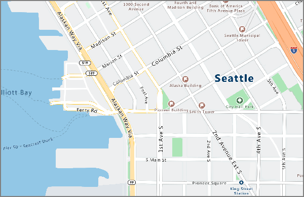
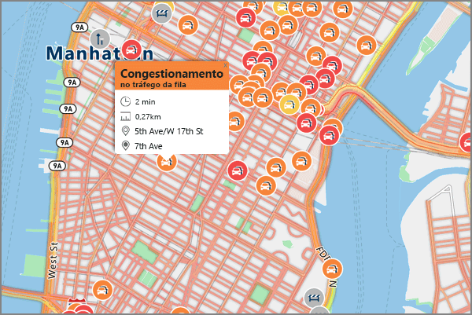

# <a name="an-introduction-to-azure-maps"></a>Uma introdução aos Mapas do Azure
Os Mapas do Azure são um portfólio de serviços geoespaciais que inclui APIs de serviço para Mapas, Pesquisa, Roteamento, Tráfego e Fusos Horários. O portfólio de serviços permite que você use ferramentas conhecidas para desenvolver rapidamente soluções de escala que integram informações de localização às soluções do Azure. Os Mapas do Azure fornecem aos desenvolvedores de todos os setores recursos avançados geoespaciais, contendo os novos dados de mapeamento fundamentais para fornecer um contexto geográfico para aplicativos Web e móveis. Os Mapas do Azure são um conjunto de APIs REST acompanhado por um controle JavaScript baseado na Web para tornar o desenvolvimento fácil, flexível e portátil em várias mídias. 

O vídeo a seguir apresenta os Mapas do Azure:

<iframe src="https://channel9.msdn.com/Shows/Azure-Friday/Azure-Location-Based-Services/player" width="960" height="540" allowFullScreen frameBorder="0"></iframe>

Os Mapas do Azure são compostos por cinco serviços principais para reforçar os aplicativos Azure que exigem contexto geográfico. Cada uma desses serviços é explicado detalhadamente.

O **Serviço de renderização** foi concebido para os desenvolvedores criarem aplicativos Web e móveis baseados em mapeamento. O serviço usa imagens gráficas de varredura de alta qualidade, disponíveis em 19 de níveis de zoom ou imagens de mapa do formato de vetor totalmente personalizável.



O **Serviço de roteiros** contém cálculos robustos de geometria de infraestrutura do mundo real e várias instruções de modo de transporte. Ele permite que os desenvolvedores calculem as instruções entre vários modos de viagem como carro, caminhão, bicicleta ou caminhada. O serviço também pode considerar entradas como condições de tráfego, restrições de peso ou transporte de material perigoso.


O **Serviço de pesquisa** foi concebido para que os desenvolvedores procurem por endereços, locais, listagens de negócios por nome ou categoria e outras informações geográficas. O Serviço de Pesquisa também pode [inverter os endereços código geográfico](https://en.wikipedia.org/wiki/Reverse_geocoding) e fazer o cruzamento de ruas baseado em um valor de latitude/longitude. 


O **Serviço de fuso horário** permite consultar informações de fuso horário atuais, históricos e informações futuras de fuso horário usando qualquer um dos pares de latitude-longitude ou uma [ID IANA](http://www.iana.org/). O Serviço de Fuso Horário também permite converter IDs de fuso horário do Microsoft Windows em fusos horários IANA, buscar uma diferença de fuso horário em relação ao UTC e obter a hora atual em um fuso horário respectivo. Uma resposta JSON normal para uma consulta para o Serviço de Fuso Horário é semelhante ao exemplo a seguir:

```JSON
{
    "Version": "2017c",
    "ReferenceUtcTimestamp": "2017-11-20T23:09:48.686173Z",
    "TimeZones": [{
        "Id": "America/Los_Angeles",
        "ReferenceTime": {
            "Tag": "PST",
            "StandardOffset": "-08:00:00",
            "DaylightSavings": "00:00:00",
            "WallTime": "2017-11-20T15:09:48.686173-08:00",
            "PosixTzValidYear": 2017,
            "PosixTz": "PST+8PDT,M3.2.0,M11.1.0"
        }
    }]
}
```

O **Serviço de tráfego** é um conjunto de serviços Web projetado para os desenvolvedores criarem aplicativos Web e móveis que exigem tráfego. O serviço fornece dois tipos de dados:
* Fluxo de tráfego: velocidades observadas em tempo real e tempos de deslocamento para todas as estradas principais na rede. 
* Incidentes de Tráfego: uma visão precisa sobre as obstruções e incidentes de tráfego na malha de ruas.



Os Mapas do Azure foram criados para mobilidade e podem ligar aplicativos de plataforma cruzada já que o modelo de programação é independente e dá suporte à saída JSON por meio de APIs REST. Além disso, os Mapas do Azure oferecem um controle de mapa de JavaScript conveniente com um modelo de programação simples para um desenvolvimento rápido e fácil de aplicativos Web e móveis. 

Os Mapas do Azure usam um esquema de autenticação baseada em chave, então acessar os serviços é uma questão de navegar até o [Portal do Azure](http://portal.azure.com) e criar uma conta dos Mapas do Azure. Sua conta é fornecida com duas chaves geradas previamente para você. Comece integrando esses recursos de localização diretamente em seus aplicativos usando qualquer uma de suas chaves nas solicitações para o serviço dos Mapas do Azure.

## <a name="unsupported-regions"></a>Regiões sem suporte
A API de Mapas do Azure não está disponível no momento em alguns países. Verifique seu endereço IP atual e se o local de seu endereço de IP não está em um dos países sem suporte abaixo:

* Argentina
* China
* Índia
* Marrocos
* Paquistão
* Coreia do Sul

## <a name="relationship-with-bing-maps"></a>Relação com o Bing Maps
Os mapas descritos neste documento são diferentes daqueles fornecidos pelo Bing Maps. Apesar de praticamente compartilharem a mesma funcionalidade, os dois serviços são diferentes e não estão relacionados. Esse serviço do Azure não afeta a oferta de produto ou roteiros do Bing Maps.

A meta da Microsoft é fornecer opções à comunidade de desenvolvedores em termos de oferta de serviços de localização. A tabela a seguir contém orientações para desenvolvedores que estão decidindo qual serviço usar: 

| Cenário | Use os Mapas do Azure ao… | Use o Bing Maps quando… |
| ------------- | ------------- | ------------- |
| Ambiente de desenvolvimento | Criar ou coordenar com outros serviços do Azure | Usar uma nuvem de terceiros ou outro ambiente de desenvolvedor |
| Estágio de desenvolvimento  | O Azure Mapas é otimizado para testes iniciais e desenvolvimento de prova de conceito | Um SLA de nível empresarial é necessário para um ambiente de produção |
| Opções de preços | Opções preliminares de preço do desenvolvedor forem suficientes | Preços personalizados para nível corporativo forem necessários |
| Ambiente de casos de uso | O uso dentro do veículo for necessário | O uso dentro do veículo não for necessário |
| Cobertura geográfica | A cobertura na Índia, na China, no Japão e na Coreia do Sul não for necessária | A cobertura de mapa na Índia, na China, no Japão e na Coreia do Sul for necessária |
| Conteúdo de mapeamento | Mapas de superfície padrão forem suficientes | Imagens de satélite, aéreas e da rua forem necessárias |
| Fonte de mapa subjacente | Dados de mapeamento TomTom forem preferenciais | Dados de mapeamento HERE forem preferenciais |

Inscreva-se hoje mesmo em uma [conta dos Mapas do Azure](http://aka.ms/azurelbsportal).

## <a name="next-steps"></a>Próximas etapas

Agora você tem uma visão geral dos Mapas do Azure. A próxima etapa é testar um aplicativo de exemplo mostrando o serviço.

> [!div class="nextstepaction"]
> [Inicie uma demonstração de mapa de pesquisa interativa](quick-demo-map-app.md)

