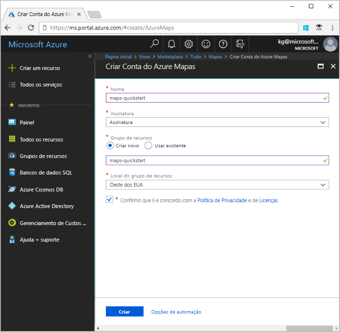
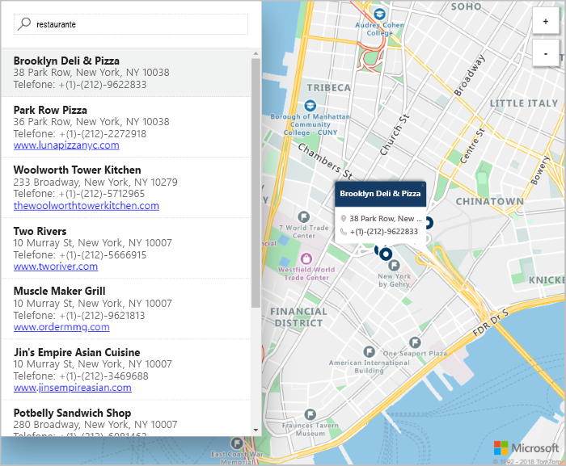

# Iniciar um pesquisa de mapa interativo usando os Mapas do Azure

Este artigo demonstra os recursos dos Mapas do Azure para criar um mapa que fornece aos usuários uma experiência de pesquisa interativa. Ele também orienta você pelas etapas básicas da criação da sua própria conta do Mapas e na obtenção da chave de conta a ser usada no aplicativo Web de demonstração. 

Se você não tiver uma assinatura do Azure, crie uma [conta gratuita](https://azure.microsoft.com/free/?WT.mc_id=A261C142F) antes de começar.

## Faça logon no Portal do Azure

Faça logon no [Portal do Azure](https://portal.azure.com/).

## Criar uma conta e obter sua chave

1. No canto superior esquerdo do [portal do Azure](https://portal.azure.com), clique em **Criar um recurso**.
2. No campo *Pesquisar no Marketplace*, digite **Mapas**.
3. Nos *Resultados*, selecione **Mapas**. Clique no botão **Criar** que aparece abaixo do mapa. 
4. Na página **Criar Conta dos Mapas**, insira os seguintes valores:
    - O *Nome* da sua nova conta. 
    - A *Assinatura* que você deseja usar para a conta.
    - O *Grupo de recursos* dessa conta. Você pode optar por *Criar novo* ou *Usar existente* em relação ao grupo de recursos.
    - Selecione a *Localização do grupo de recursos*.
    - Leia a *Política de Privacidade* e de *Licença* e marque a caixa de seleção para aceitar os termos. 
    - Por fim, clique no botão **Criar**.

    

5. Após a criação da conta, abra-a e encontre a seção de configurações no menu da conta. Clique em **Chaves** para ver as chaves primária e secundária da sua conta dos Mapas do Azure. Copie o valor de **Chave Primária** para a área de transferência local a ser usada na seção a seguir. 

## Fazer o download do aplicativo

1. Baixe ou copie o conteúdo do arquivo [interactiveSearch.html](https://github.com/Azure-Samples/azure-maps-samples/blob/master/src/interactiveSearch.html).
2. Salvar o conteúdo deste arquivo localmente como **AzureMapDemo.html** e abra-o em um editor de texto.
3. Procure a cadeia de caracteres `<insert-key>` e a substitua pelo valor de **Chave Primária** obtido na seção anterior. 

## Iniciar o aplicativo

1. Abra o arquivo **AzureMapDemo.html** em um navegador de sua escolha.
2. Observe o mapa mostrado da cidade de Brasília. Amplie e reduza para ver como o mapa renderiza automaticamente com mais ou menos informações, dependendo do nível de zoom. 
3. Altere o centro padrão do mapa. No arquivo **AzureMapDemo.html**, procure a variável chamada **center**. Substitua o par de valores de latitude e longitude dessa variável pelos novos valores **[-74.0060, 40.7128]**. Salve o arquivo e atualize seu navegador. 
3. Teste a experiência de pesquisa interativa. Na caixa de pesquisa no canto superior esquerdo do aplicativo Web de demonstração, pesquise **restaurantes**. 
4. Mova o mouse sobre a lista de endereços/locais que aparecem abaixo da caixa de pesquisa e observe como o pino correspondente no mapa mostra informações sobre esse local. Para preservar a privacidade de empresas particulares, são mostrados endereços e nomes fictícios. 

    

## Limpar recursos

Os tutoriais entram em detalhes sobre como usar e configurar os Mapas com sua conta. Se você planeja continuar nos tutoriais, não limpe os recursos criados neste início rápido. Caso contrário, use as etapas a seguir para excluir todos os recursos criados por este Guia de Início Rápido.

1. Feche o navegador que está executando o aplicativo Web **AzureMapDemo.html**.
2. No menu à esquerda no Portal do Azure, clique em **Todos os recursos** e selecione sua conta dos Mapas. Na parte superior da folha **Todos os recursos**, clique em **Excluir**.

## Próximas etapas

Neste início rápido, você criou sua conta dos Mapas e iniciou um aplicativo de demonstração. Para aprender a criar seu próprio aplicativo usando as APIs dos Mapas, continue no próximo tutorial.

> [!div class="nextstepaction"]
> [Pesquisar pontos de interesse com os Mapas](./tutorial-search-location.md)
