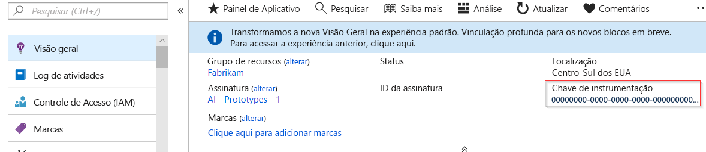
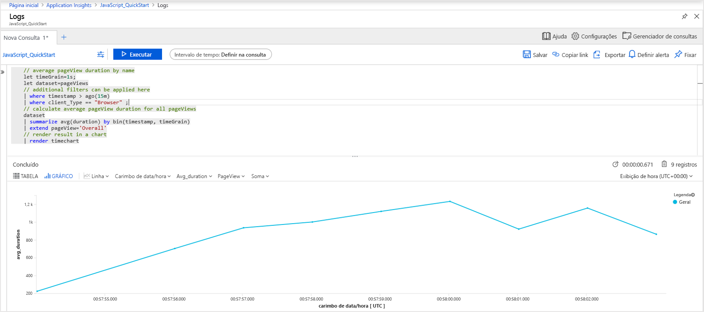
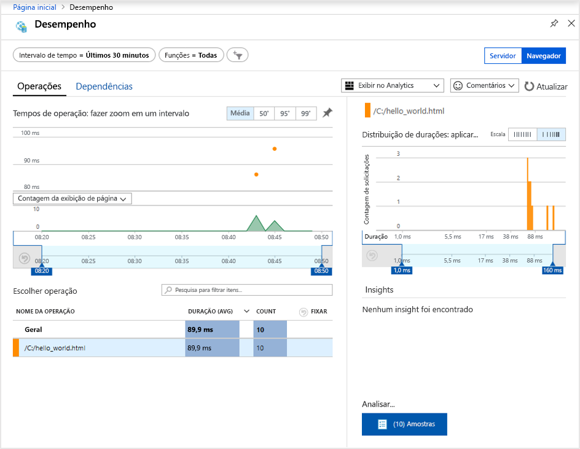
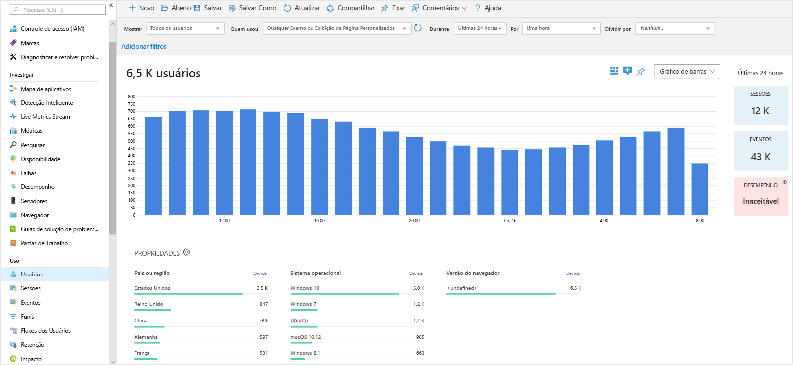
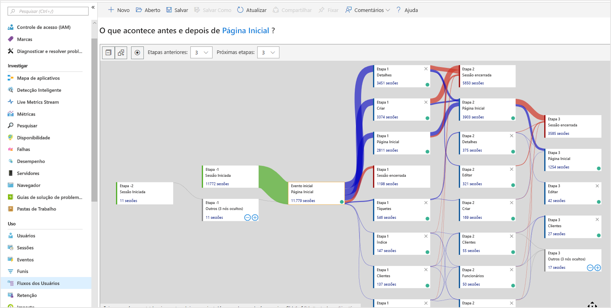

# <a name="start-monitoring-your-website"></a>Iniciar o monitoramento do site

Com o Application Insights do Azure Monitor, você pode monitorar facilmente o site quanto à sua disponibilidade, desempenho e uso. Você também pode identificar e diagnosticar erros rapidamente em seu aplicativo sem esperar que um usuário os relate. O Application Insights fornece monitoramento do lado do servidor, assim como capacidades de monitoramento do lado do cliente/navegador.

Este início rápido mostrará como adicionar o [SDK de JavaScript do Application Insights de software livre](https://github.com/Microsoft/ApplicationInsights-JS) que permite que você entenda a experiência do lado do cliente/navegador para os visitantes do site.

## <a name="prerequisites"></a>Pré-requisitos

Para concluir este guia de início rápido:

- É necessária uma assinatura do Azure.

Se você não tiver uma assinatura do Azure, crie uma conta [gratuita](https://azure.microsoft.com/free/) antes de começar.

## <a name="sign-in-to-the-azure-portal"></a>Entre no Portal do Azure

Entre no [Portal do Azure](https://portal.azure.com/).

## <a name="enable-application-insights"></a>Habilitar o Application Insights

O Application Insights pode coletar dados de telemetria de qualquer aplicativo conectado à Internet, sendo executado localmente ou na nuvem. Use as etapas a seguir para começar a exibir esses dados.

1. Selecione **Criar um recurso** > **Ferramentas de Gerenciamento** > **Application Insights**.

   Uma caixa de configuração é exibida. Use a tabela a seguir para preencher os campos de entrada.

    | Configurações        | Valor           | DESCRIÇÃO  |
   | ------------- |:-------------|:-----|
   | **Nome**      | Valor Globalmente Exclusivo | Nome que identifica o aplicativo que você está monitorando |
   | **Tipo de Aplicativo** | Aplicativo geral | O tipo do aplicativo que você está monitorando |
   | **Grupo de recursos**     | myResourceGroup      | Nome para o novo grupo de recursos no qual hospedar dados do Application Insights |
   | **Localidade** | Leste dos EUA | Escolher uma localização perto de você ou perto onde seu aplicativo está hospedado |

2. Clique em **Criar**.

## <a name="create-an-html-file"></a>Criar um arquivo HTML

1. No computador local, crie um arquivo chamado ``hello_world.html``. Neste exemplo, o arquivo será colocado na raiz da unidade C: em ``C:\hello_world.html``.
2. Copie o script abaixo em ``hello_world.html``:

    ```html
    <!DOCTYPE html>
    <html>
    <head>
    <title>Azure Monitor Application Insights</title>
    </head>
    <body>
    <h1>Azure Monitor Application Insights Hello World!</h1>
    <p>You can use the Application Insights JavaScript SDK to perform client/browser-side monitoring of your website. To learn about more advanced JavaScript SDK configurations visit the <a href="https://github.com/Microsoft/ApplicationInsights-JS/blob/master/API-reference.md" title="API Reference">API reference</a>.</p>
    </body>
    </html>
    ```

## <a name="configure-app-insights-sdk"></a>Configurar o SDK do Application Insights

1. Selecione **Visão Geral** > **Essentials** > Copiar a **Chave de Instrumentação** do aplicativo.

   

2. Adicione o seguinte script ao seu ``hello_world.html`` antes da marca ``</head>`` de fechamento:

   ```javascript
      <script type="text/javascript">
        var appInsights=window.appInsights||function(a){
            function b(a){c[a]=function(){var b=arguments;c.queue.push(function(){c[a].apply(c,b)})}}var c={config:a},d=document,e=window;setTimeout(function(){var b=d.createElement("script");b.src=a.url||"https://az416426.vo.msecnd.net/scripts/a/ai.0.js",d.getElementsByTagName("script")[0].parentNode.appendChild(b)});try{c.cookie=d.cookie}catch(a){}c.queue=[];for(var f=["Event","Exception","Metric","PageView","Trace","Dependency"];f.length;)b("track"+f.pop());if(b("setAuthenticatedUserContext"),b("clearAuthenticatedUserContext"),b("startTrackEvent"),b("stopTrackEvent"),b("startTrackPage"),b("stopTrackPage"),b("flush"),!a.disableExceptionTracking){f="onerror",b("_"+f);var g=e[f];e[f]=function(a,b,d,e,h){var i=g&&g(a,b,d,e,h);return!0!==i&&c["_"+f](a,b,d,e,h),i}}return c
        }({
            instrumentationKey: "xxxxxxxx-xxxx-xxxx-xxxx-xxxxxxxx"
        });
        
        window.appInsights=appInsights,appInsights.queue&&0===appInsights.queue.length&&appInsights.trackPageView();
</script>
   ```

3. Edite ``hello_world.html`` e adicione a chave de instrumentação.

4. Abra ``hello_world.html`` em uma sessão do navegador local. Isso criará uma única exibição de página. Você pode atualizar seu navegador para gerar vários modos de exibição de página de teste.

## <a name="start-monitoring-in-the-azure-portal"></a>Iniciar o monitoramento no Portal do Azure

1. Agora você pode reabrir a página **Visão Geral** do Application Insights no Portal do Azure, na qual você recuperou sua chave de instrumentação, para exibir detalhes sobre o seu aplicativo em execução atualmente. Os quatro gráficos padrão da página Visão geral limitam-se aos dados do aplicativo do lado do servidor. Uma vez que estamos instrumentando as interações do lado do cliente/navegador com o SDK do JavaScript este modo de exibição específico não se aplica, a menos que também tenhamos um SDK do lado do servidor instalado.

2. Clique no  **Analytics**.  Isso abre o **Analytics**, que fornece uma linguagem de consulta avançada para analisar todos os dados coletados pelo Application Insights. Para exibir dados relacionados às solicitações de navegador do lado do cliente, execute a seguinte consulta:

    ```kusto
    // average pageView duration by name
    let timeGrain=1s;
    let dataset=pageViews
    // additional filters can be applied here
    | where timestamp > ago(15m)
    | where client_Type == "Browser" ;
    // calculate average pageView duration for all pageViews
    dataset
    | summarize avg(duration) by bin(timestamp, timeGrain)
    | extend pageView='Overall'
    // render result in a chart
    | render timechart
    ```

   

3. Volte para a página **Visão geral**. Clique em **Navegador** no cabeçalho **Investigar**, em seguida, selecione **desempenho** Aqui você encontra métricas relacionadas ao desempenho do seu site. Também há um modo de exibição correspondente para a análise de falhas e exceções em seu site. Você pode clicar em **Exemplos** para analisar os detalhes de cada transação individual. A partir daqui, você pode acessar a experiência dos [detalhes da transação de ponta a ponta](../../azure-monitor/app/transaction-diagnostics.md).

   

4. Para começar a explorar as [ferramentas de análise de comportamento do usuário](../../azure-monitor/app/usage-overview.md), no menu principal do Application Insights, selecione [**Usuários**](../../azure-monitor/app/usage-segmentation.md) no cabeçalho **Usuários**. Uma vez que estamos testando de um único computador, veremos dados apenas para um usuário. Para um site ao vivo, a distribuição de usuários será semelhante ao seguinte:

     

5. Se tivéssemos instrumentado um site mais complexo com várias páginas, outra ferramenta útil é [**Fluxos dos Usuários**](../../azure-monitor/app/usage-flows.md). Com **Fluxos dos Usuários** você pode rastrear a caminho que os visitantes percorrem dentro das várias partes do seu site.

  

Para saber sobre configurações mais avançadas para o monitoramento de sites, confira a [referência da API do SDK de JavaScript](https://github.com/Microsoft/ApplicationInsights-JS/blob/master/API-reference.md).

## <a name="clean-up-resources"></a>Limpar recursos

Se você planeja continuar trabalhando com inícios rápidos subsequentes ou com os tutoriais, não limpe os recursos criados nesse início rápido. Caso contrário, siga estas etapas para excluir todos os recursos criados por esse guia de início rápido no portal do Azure.

1. No menu à esquerda no Portal do Azure, clique em **Grupos de recursos** e clique em **myResourceGroup**.
2. Em sua página de grupo de recursos, clique em **Excluir**, digite **myResourceGroup** na caixa de texto e clique **Excluir**.

## <a name="next-steps"></a>Próximas etapas

> [!div class="nextstepaction"]
> [Localizar e diagnosticar problemas de desempenho](https://docs.microsoft.com/azure/application-insights/app-insights-analytics)
