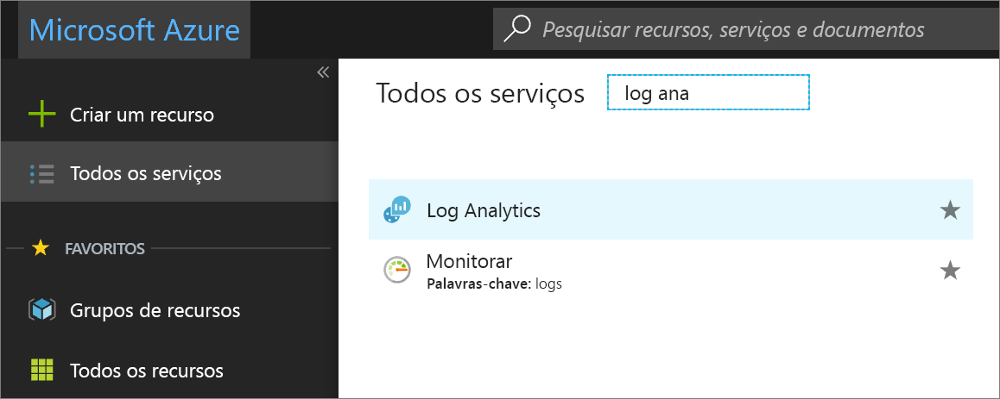
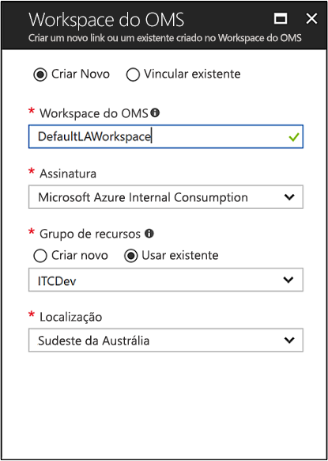
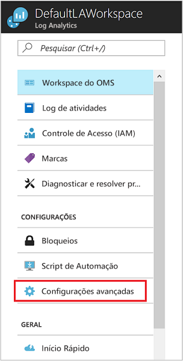
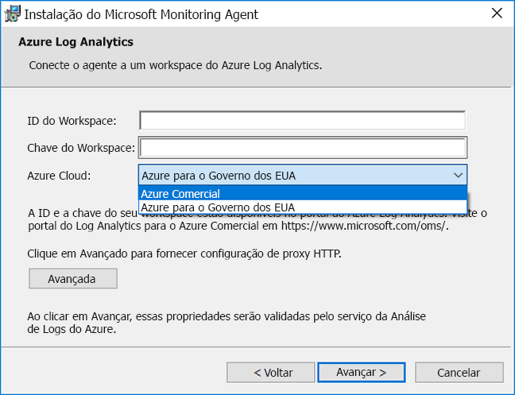
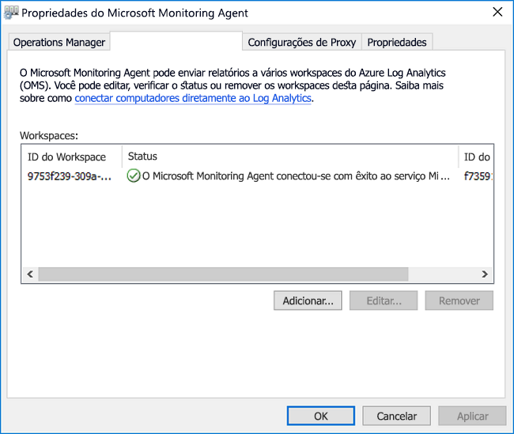
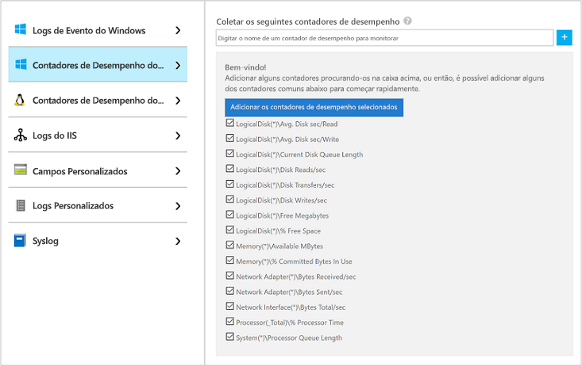
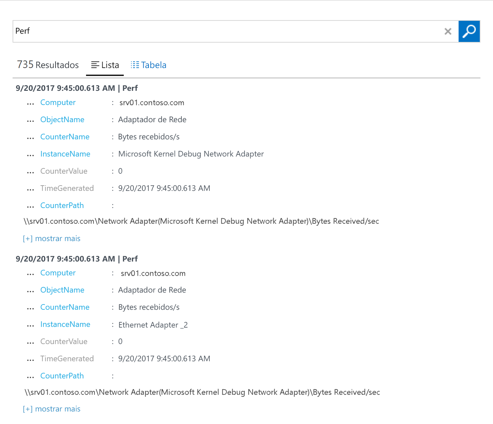

# Configurar o agente do Log Analytics para computadores Windows em um ambiente híbrido
O [Azure Log Analytics](../../azure-monitor/platform/agent-windows.md) pode coletar dados diretamente dos computadores Windows físicos ou virtuais em seu datacenter ou de outro ambiente de nuvem um único repositório para correlação e análise detalhadas.  Este guia de início rápido mostra como configurar e coletar dados do computador Windows com algumas etapas simples.  Para VMs Windows do Azure, consulte o tópico a seguir [Coletar dados sobre máquinas virtuais do Azure](../../azure-monitor/learn/quick-collect-azurevm.md).  

Para entender a configuração com suporte, revise [suporte para sistemas operacionais Windows](../../azure-monitor/platform/log-analytics-agent.md#supported-windows-operating-systems) e [configuração de firewall de rede](../../azure-monitor/platform/log-analytics-agent.md#network-firewall-requirements).
 
Se você não tiver uma assinatura do Azure, crie uma [conta gratuita](https://azure.microsoft.com/free/?WT.mc_id=A261C142F) antes de começar.

## Entre no portal do Azure
Entre no Portal do Azure em [https://portal.azure.com](https://portal.azure.com). 

## Criar um workspace
1. No portal do Azure, clique em **Todos os serviços**. Na lista de recursos, digite **Log Analytics**. Quando você começa a digitar, a lista é filtrada com base em sua entrada. Selecione **Log Analytics**.

    
  
2. Clique em **Criar** e, em seguida, selecione opções para os seguintes itens:

   * Forneça um nome para o novo **Espaço de Trabalho do Log Analytics**, como *DefaultLAWorkspace*. 
   * Selecione uma **Assinatura** a vincular escolhendo uma na lista suspensa, se a selecionada por padrão não é adequada.
   * Para **Grupo de Recursos**, selecione um grupo de recursos existente que contém uma ou mais máquinas virtuais do Azure.  
   * Selecione o **Local** no qual as VMs serão implantadas.  Para obter mais informações, consulte em quais [regiões o Log Analytics está disponível](https://azure.microsoft.com/regions/services/).  
   * Se você estiver criando um workspace em uma nova assinatura feita depois de 2 de abril de 2018, ele usará o plano de preços *por GB* e a opção de selecionar um tipo de preço não estará disponível.  Se você estiver criando um workspace para uma assinatura existente feita antes de 2 de abril ou uma assinatura associada a uma inscrição de EA existente, selecione seu tipo de preço preferido.  Para obter mais informações sobre os tipos específicos, consulte [Detalhes de preço do Log Analytics](https://azure.microsoft.com/pricing/details/log-analytics/).

           

3. Depois de fornecer as informações necessárias no painel **Espaço de Trabalho do Log Analytics**, clique em **OK**.  

Enquanto as informações são verificadas e o workspace é criado, você pode acompanhar seu progresso no menu **Notificações**. 

## Obter a ID do workspace e a chave
Antes de instalar o Microsoft Monitoring Agent para Windows, você precisa da ID e da chave do seu espaço de trabalho do Log Analytics.  Essas informações são exigidas pelo assistente de instalação para configurar adequadamente o agente e garantir que ele pode se comunicar com êxito com o Log Analytics.  

1. No Portal do Azure, clique em **Todos os serviços**, localizado no canto superior esquerdo. Na lista de recursos, digite **Log Analytics**. Quando você começa a digitar, a lista é filtrada com base em sua entrada. Selecione **Log Analytics**.
2. Na lista de workspaces do Log Analytics, selecione *DefaultLAWorkspace* criado anteriormente.
3. Selecione **Configurações avançadas**.

    
  
4. Selecione **Fontes Conectadas** e depois **Servidores Windows**.   
5. O valor à direita da **ID do Workspace** e **Chave Primária**. Copie e cole os dois em seu editor favorito.   

## Instalar o agente para Windows
As etapas a seguir instalam e configuram o agente para o Log Analytics do Azure e a nuvem do Azure Government usando a instalação para o Microsoft Monitoring Agent em seu computador.  

1. Continuando do conjunto de etapas anterior, na página **Servidores Windows**, selecione a versão apropriada de **Baixar Agente do Windows** a ser baixada com base na arquitetura do processador do sistema operacional Windows.
2. Execute a Instalação para instalar o agente no seu computador.
2. Na página de **Boas-vindas**, clique em **Avançar**.
3. Na página **Termos de Licença**, leia a licença e clique em **Aceito**.
4. Na página **Pasta de Destino**, altere ou mantenha a pasta de instalação padrão e clique em **Avançar**.
5. Na página **Opções de Instalação do Agente**, escolha a opção de conectar o agente ao Azure Log Analytics e clique em **Avançar**.   
6. Na página **Log Analytics do Azure**, faça o seguinte:
   1. Cole a **ID do Workspace** e a **Chave do Workspace (Chave Primária)** que você copiou anteriormente.  Caso o computador deva se reportar a um espaço de trabalho do Log Analytics na nuvem do Azure Governamental, selecione **Governo dos EUA do Azure** na lista suspensa do **Azure Cloud**.  
   2. Caso o computador precise se comunicar por meio de um servidor proxy ao serviço Log Analytics, clique em **Avançado** e forneça a URL e o número da porta do servidor proxy.  Caso seu servidor proxy exija autenticação, digite o nome de usuário e a senha para se autenticar com o servidor proxy e clique em **Avançar**.  
7. Clique em **Avançar** depois de ter terminado de fornecer as configurações necessárias.

    

8. Na página **Pronto para Instalar**, revise suas escolhas e clique em **Instalar**.
9. Na página **Configuração concluída com êxito**, clique em **Concluir**.

Após concluir, o **Microsoft Monitoring Agent** aparecerá no **Painel de Controle**. Você pode revisar sua configuração e verificar se o agente está conectado ao Log Analytics. Quando conectado, na guia **Azure Log Analytics**, o agente exibe a mensagem: **O Microsoft Monitoring Agent se conectou com êxito ao serviço de Log Analytics da Microsoft.**   

## Coletar dados de desempenho e eventos
O Log Analytics pode coletar eventos dos logs de eventos do Windows e de contadores de desempenho que você especificar para análise geração de relatórios de prazo mais longo e realizar uma ação quando determinada condição for detectada.  Siga estas etapas para configurar a coleta de eventos do log de eventos do Windows e de vários contadores de desempenho comuns para começar.  

1. No portal do Azure, clique em **Mais serviços** encontrado no canto inferior esquerdo. Na lista de recursos, digite **Log Analytics**. Quando você começa a digitar, a lista é filtrada com base em sua entrada. Selecione **Log Analytics**.
2. Selecione **Configurações avançadas**.

    
 
3. Selecione **Dados** e, em seguida, **Logs de Eventos do Windows**.  
4. Adicione um novo log de eventos digitando o nome do log.  Digite **Sistema** e, em seguida, clique no sinal de adição **+**.  
5. Na tabela, verifique as severidades **Erro** e **Aviso**.   
6. Clique em **Salvar** na parte superior da página para salvar a configuração.
7. Selecione **Contadores de Desempenho do Windows** para habilitar a coleta de contadores de desempenho em um computador Windows. 
8. Quando você configura os contadores de desempenho do Windows para um novo espaço de trabalho do Log Analytics pela primeira vez, você tem a opção de criar rapidamente vários contadores comuns. Eles são listados com uma caixa de seleção ao lado de cada um.

    .
    
    Clique em **Adicionar os contadores de desempenho selecionados**.  Eles são adicionados e predefinidos com um intervalo de amostragem de coleta de dez segundos. 

9. Clique em **Salvar** na parte superior da página para salvar a configuração.

## Exibir os dados coletados
Agora que você habilitou a coleta de dados, vamos executar um exemplo simples de pesquisa de logs para ver alguns dados do computador de destino.  

1. No portal do Azure, no workspace selecionado, clique no bloco **Pesquisa de Logs**.  
2. No painel Pesquisa de Logs, no campo de consulta, digite `Perf` e pressione Enter ou clique no botão de pesquisa à direita do campo de consulta.
 
    

    Por exemplo, a consulta na imagem a seguir retornou 735 Registros de desempenho.

    

## Limpar recursos
Quando não for mais necessário, você poderá remover o agente do computador Windows e excluir o espaço de trabalho do Log Analytics.  

Para remover o agente, execute as etapas a seguir.

1. Abra o **Painel de controle**.
2. Abra **Programas e Recursos**.
3. Em **Programas e Recursos**, selecione **Microsoft Monitoring Agent** e clique em **Desinstalar**.

Para excluir o espaço de trabalho, selecione o espaço de trabalho do Log Analytics criado anteriormente e, na página de recursos, clique em **Excluir**.

## Próximas etapas
Agora que você está coletando dados operacionais e de desempenho do computador Linux local, você pode facilmente começar a explorar, analisar e agir em relação aos dados coletados *gratuitamente*.  

Para saber como exibir e analisar os dados, continue lendo o tutorial.   

> [!div class="nextstepaction"]
> [Exibir ou analisar dados no Log Analytics](tutorial-viewdata.md)
