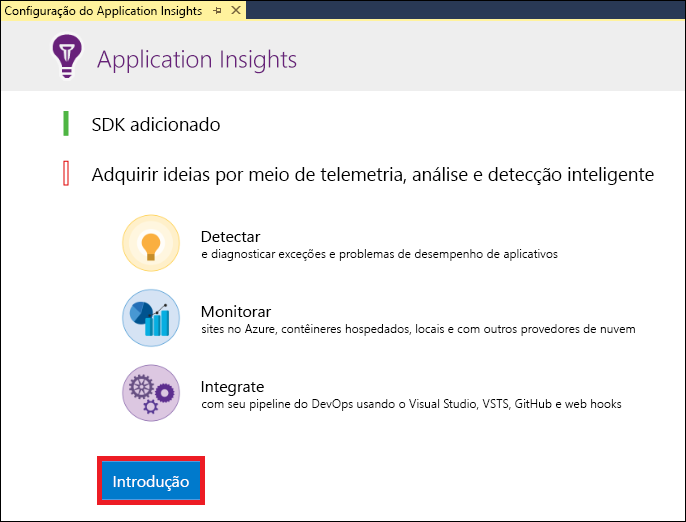
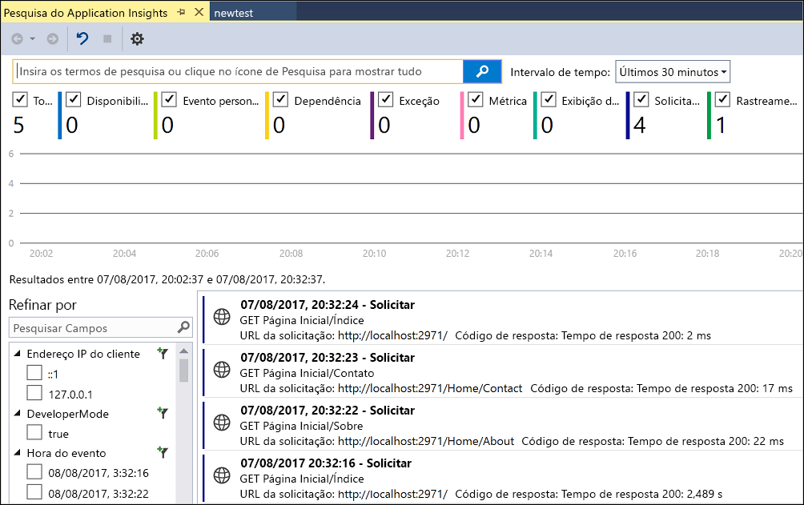
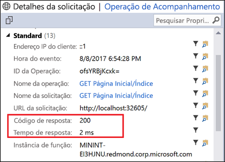
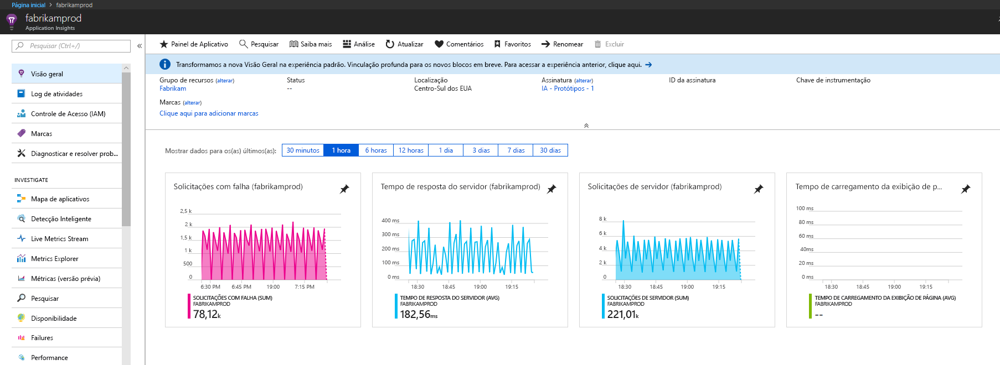
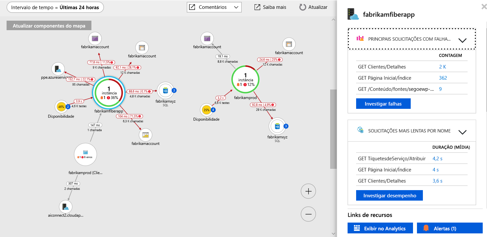
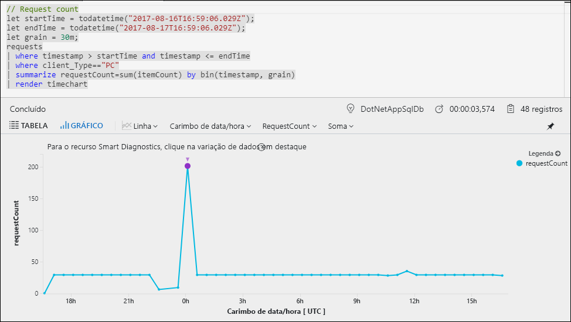
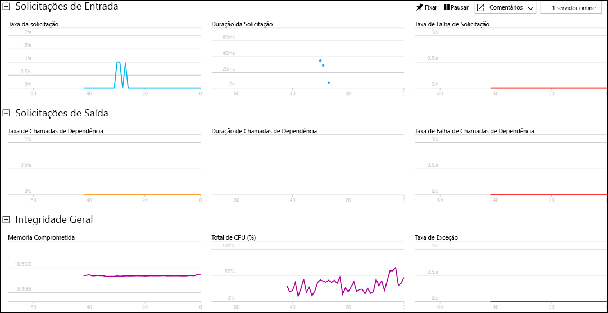

# <a name="start-monitoring-your-aspnet-web-application"></a>Começar a monitorar o aplicativo Web ASP.NET

Com o Azure Application Insights, você pode monitorar facilmente o aplicativo Web quanto à sua disponibilidade, desempenho e uso.  Você também pode identificar e diagnosticar erros rapidamente em seu aplicativo sem esperar que um usuário os relate.  Com as informações coletadas do Application Insights sobre o desempenho e a eficiência do seu aplicativo, você pode fazer escolhas informadas para manter e aprimorar seu aplicativo.

Este guia de início rápido mostra como adicionar o Application Insights a um aplicativo Web ASP.NET existente e começar a analisar as estatísticas em tempo real, que é apenas um dos vários métodos que você pode usar para analisar o aplicativo. Se você não tiver um aplicativo Web ASP.NET, você poderá criar um seguindo o [guia de início rápido Criar um aplicativo Web ASP.NET](../../app-service/app-service-web-get-started-dotnet-framework.md).

## <a name="prerequisites"></a>Pré-requisitos
Para concluir este guia de início rápido:

- Instale o [Visual Studio 2017](https://www.visualstudio.com/downloads/) com as cargas de trabalho a seguir:
    - Desenvolvimento Web e ASP.NET
    - Desenvolvimento do Azure


Se você não tiver uma assinatura do Azure, crie uma conta [gratuita](https://azure.microsoft.com/free/) antes de começar.

## <a name="enable-application-insights"></a>Habilitar o Application Insights

1. Abra o projeto no Visual Studio 2017.
2. Selecione **Configurar o Application Insights** no menu Projeto. O Visual Studio adiciona o SDK do Application Insights ao aplicativo.

    > [!IMPORTANT]
    > O processo para adicionar o Application Insights varia de acordo com o tipo de modelo do ASP.NET. Se você estiver usando o modelo **Vazio** ou **Aplicativo Móvel do Azure**, selecione **Projeto** > **Adicionar Application Insights Telemetry**. Para todos os outros modelos do ASP.NET, consulte as instruções na etapa acima. 

3. Clique em **Introdução** (versões anteriores do Visual Studio têm um botão **Iniciar Gratuitamente** em vez disso).

    

4. Selecione sua assinatura e clique em **Registrar**.

5. Execute o aplicativo selecionando **Iniciar Depuração** do menu **Depurar** ou pressionando a tecla F5.

## <a name="confirm-app-configuration"></a>Confirmar configuração do aplicativo

O Application Insights coleta dados de telemetria para seu aplicativo, independentemente do local em que ele está sendo executado. Use as etapas a seguir para começar a exibir esses dados.

1. Abra o Application Insights clicando em **Exibir** -> **Outras Janelas** -> **Pesquisa do Application Insights**.  Você pode ver a telemetria da sessão atual.<BR><br>

2. Clique na primeira solicitação na lista (GET Home/Index neste exemplo) para ver os detalhes da solicitação. Observe que o tempo de resposta e o código de status são ambos incluídos, juntamente com outras informações importantes sobre a solicitação.<br><br>

## <a name="start-monitoring-in-the-azure-portal"></a>Iniciar o monitoramento no Portal do Azure

Agora você pode abrir o Application Insights no Portal do Azure para exibir vários detalhes sobre o aplicativo em execução.

1. Clique com o botão direito do mouse na pasta **Connected Services Application Insights** no Gerenciador de Soluções e clique em **Abrir Portal do Application Insights**.  Você pode ver algumas informações sobre seu aplicativo e uma variedade de opções.

    

2. Clique em **Mapa do aplicativo** para obter um layout visual das relações de dependência entre os componentes do aplicativo.  Cada componente mostra KPIs como alertas, desempenho, falhas e carregamento.

    

3. Clique no ícone **Análise do Aplicativo**  em um dos componentes do aplicativo.  Isso abre a **Análise do Application Insights**, que fornece uma linguagem de consulta avançada para analisar todos os dados coletados pelo Application Insights.  Nesse caso, uma consulta que renderiza a contagem de solicitações como um gráfico é gerada para você.  Você pode escrever suas próprias consultas para analisar outros dados.

    

4. Volte para a página **Visão geral** e clique em **Live Stream**.  Isso mostra estatísticas em tempo real sobre o seu aplicativo conforme ele é executado.  Isso inclui informações como o número de solicitações de entrada, a duração dessas solicitações e eventuais falhas que ocorram.  Você também pode inspecionar as métricas de desempenho críticas, tais como processador e memória.

    

    Se você está pronto para hospedar seu aplicativo no Azure, você pode publicá-lo agora. Siga as etapas descritas no [Guia de início rápido criar um aplicativo Web ASP.NET](../../app-service/app-service-web-get-started-dotnet.md#update-the-app-and-redeploy).

5. Se você usar o Visual Studio para adicionar o monitoramento do Application Insights, você pode adicionar automaticamente o monitoramento do lado do cliente. Para adicionar manualmente o monitoramento no lado do cliente manualmente para um aplicativo adicione o seguinte JavaScript ao seu aplicativo:

```html
<!-- 
To collect user behavior analytics about your application, 
insert the following script into each page you want to track.
Place this code immediately before the closing </head> tag,
and before any other scripts. Your first data will appear 
automatically in just a few seconds.
-->
<script type="text/javascript">
var appInsights=window.appInsights||function(a){
  function b(a){c[a]=function(){var b=arguments;c.queue.push(function(){c[a].apply(c,b)})}}var c={config:a},d=document,e=window;setTimeout(function(){var b=d.createElement("script");b.src=a.url||"https://az416426.vo.msecnd.net/scripts/a/ai.0.js",d.getElementsByTagName("script")[0].parentNode.appendChild(b)});try{c.cookie=d.cookie}catch(a){}c.queue=[];for(var f=["Event","Exception","Metric","PageView","Trace","Dependency"];f.length;)b("track"+f.pop());if(b("setAuthenticatedUserContext"),b("clearAuthenticatedUserContext"),b("startTrackEvent"),b("stopTrackEvent"),b("startTrackPage"),b("stopTrackPage"),b("flush"),!a.disableExceptionTracking){f="onerror",b("_"+f);var g=e[f];e[f]=function(a,b,d,e,h){var i=g&&g(a,b,d,e,h);return!0!==i&&c["_"+f](a,b,d,e,h),i}}return c
  }({
      instrumentationKey:"<your instrumentation key>"
  });

window.appInsights=appInsights,appInsights.queue&&0===appInsights.queue.length&&appInsights.trackPageView();
</script>
```

Para saber mais, visite o repositório do GitHub para nosso [SDK do JavaScript de software livre](https://github.com/Microsoft/ApplicationInsights-JS).

## <a name="next-steps"></a>Próximas etapas
Nesse guia de início rápido, você habilitou o seu aplicativo para monitoramento pelo Azure Application Insights.  Continue para os tutoriais para aprender a usá-lo para monitorar as estatísticas e detectar problemas em seu aplicativo.

> [!div class="nextstepaction"]
> [Tutoriais do Azure Application Insights](tutorial-runtime-exceptions.md)
