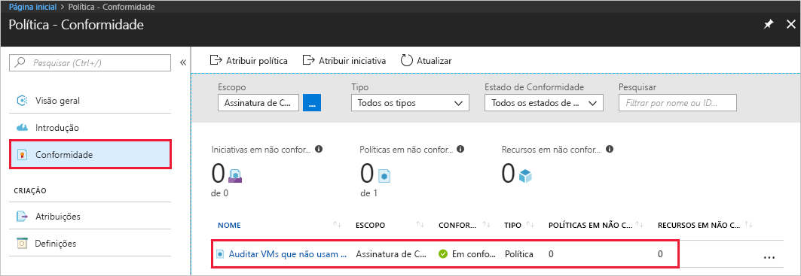

# <a name="create-a-policy-assignment-to-identify-non-compliant-resources-in-your-azure-environment-with-the-azure-cli"></a>Crie uma atribuição de política para identificar recursos sem conformidade em seu ambiente do Azure com a CLI do Azure

A primeira etapa para compreender a conformidade no Azure é saber qual é a situação de seus recursos atuais. Este guia de início rápido orienta você no processo de criação de uma atribuição de política para identificar máquinas virtuais que não estão usando discos gerenciados.

No final deste processo, você terá identificado com êxito quais máquinas virtuais não estão usando discos gerenciados e são, portanto, *sem conformidade*.
.

Se você não tiver uma assinatura do Azure, crie uma conta [gratuita](https://azure.microsoft.com/free/) antes de começar.

[!INCLUDE [cloud-shell-try-it.md](../../includes/cloud-shell-try-it.md)]

Se você optar por instalar e usar a CLI localmente, este guia de início rápido exigirá a execução da CLI do Azure versão 2.0.4 ou posterior. Execute `az --version` para encontrar a versão. Se você precisa instalar ou atualizar, consulte [Instalar a CLI 2.0 do Azure]( /cli/azure/install-azure-cli).

## <a name="opt-in-to-azure-policy"></a>Aceitar a Política do Azure

Agora o Azure Policy está disponível em Visualização Pública e é necessário registrar-se para solicitar acesso.

1. Vá até a Política do Azure em https://aka.ms/getpolicy e selecione **Inscrever-se** no painel esquerdo.

   

2. Aceite a Política do Azure selecionando na lista **Assinatura** as assinaturas com que gostaria de trabalhar. Em seguida, selecione **Registrar**.

   

   Sua solicitação é aprovada automaticamente para versão prévia. Aguarde até 30 minutos para o sistema processar seu registro.

## <a name="create-a-policy-assignment"></a>Criar uma atribuição de política

Neste guia de início rápido, criamos uma atribuição de política e atribuímos a definição Auditar máquinas virtuais sem Managed Disks. Esta definição de política identifica recursos que não são compatíveis com as condições configuradas na definição de política.

Siga estas etapas para criar uma nova atribuição de política.

Exiba todas as definições de política e encontre a definição de política "Auditar máquinas virtuais sem Managed Disks":

```azurecli
az policy definition list
```

A Política do Azure vem com definições de políticas internas que você pode usar. Você verá definições de políticas internas como:

- Impor marca e seu valor
- Aplicar marca e seu valor
- Requer o SQL Server versão 12.0

Em seguida, forneça as informações abaixo e execute o seguinte comando para atribuir a definição de política:

- **Nome** de exibição da atribuição de política. Nesse caso, vamos usar *Auditar máquinas virtuais sem Managed Disks*.
- **Política** – trata-se da definição da política, com base naquela que você está usando para criar a atribuição. Nesse caso, é a definição de política – *Auditar máquinas virtuais sem Managed Disks*
- Um **escopo** – um escopo determina em quais recursos ou agrupamento de recursos a atribuição de política é imposta. Pode variar de uma assinatura a grupos de recursos.

  Use a assinatura (ou grupo de recursos) que você registrou anteriormente quando aceitou a Política do Azure. Neste exemplo, estamos usando a ID de assinatura – **bc75htn-a0fhsi-349b-56gh-4fghti-f84852** e o nome do grupo de recursos – **FabrikamOMS**. Não deixe de alterá-las para a ID da assinatura e o nome do grupo de recursos com que você está trabalhando.

O comando deve ter esta aparência:

```azurecli
az policy assignment create --name Audit Virtual Machines without Managed Disks Assignment --policy Audit Virtual Machines without Managed Disks --scope /subscriptions/
bc75htn-a0fhsi-349b-56gh-4fghti-f84852/resourceGroups/FabrikamOMS
```

Uma atribuição de política é uma política que foi atribuída para entrar em vigor em um escopo específico. Esse escopo também pode variar de um grupo de gerenciamento a um grupo de recursos.

## <a name="identify-non-compliant-resources"></a>Identificar recursos sem conformidade

Para exibir os recursos que não tem conformidade com essa nova atribuição:

1. Navegue de volta até a página da Política do Azure.
2. Selecione **Conformidade** no painel esquerdo e pesquise a **Atribuição de Política** criada por você.

   

   Se houver recursos sem conformidade com essa nova atribuição, eles aparecerão na guia **Recursos sem conformidade**, como mostrado acima.

## <a name="clean-up-resources"></a>Limpar recursos

Outros guias desta coleção dão continuidade a este guia de início rápido. Se você planeja continuar trabalhando com os tutoriais subsequentes, não limpe os recursos criados neste guia de início rápido. Se você não planeja continuar, exclua a atribuição criada executando este comando:

```azurecli
az policy assignment delete –name  Assignment --scope /subscriptions/ bc75htn-a0fhsi-349b-56gh-4fghti-f84852 resourceGroups/ FabrikamOMS
```

## <a name="next-steps"></a>Próximas etapas

Neste guia de início rápido, você atribuiu uma definição de política para identificar recursos sem conformidade em seu ambiente do Azure.

Para saber mais sobre a atribuição de políticas, para garantir que os recursos que você criar no **futuro** estejam em conformidade, continue com o tutorial:

> [!div class="nextstepaction"]
> [Criando e gerenciando políticas](./create-manage-policy.md)
