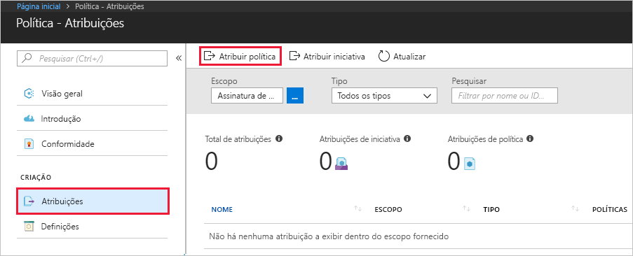
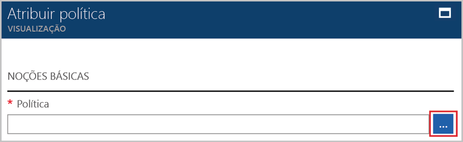
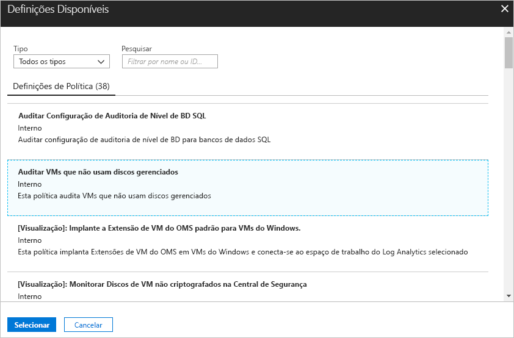
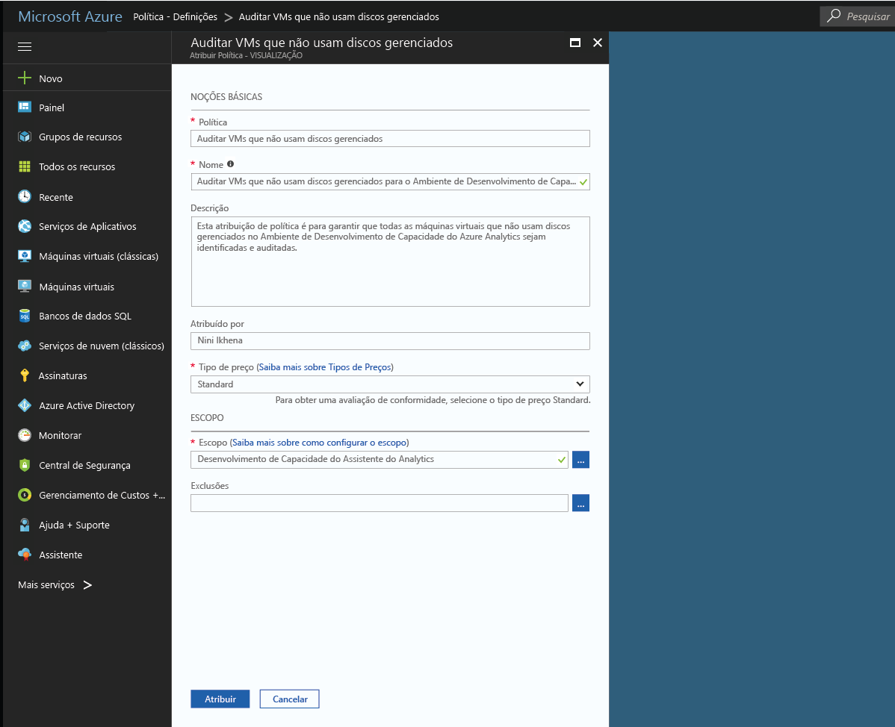
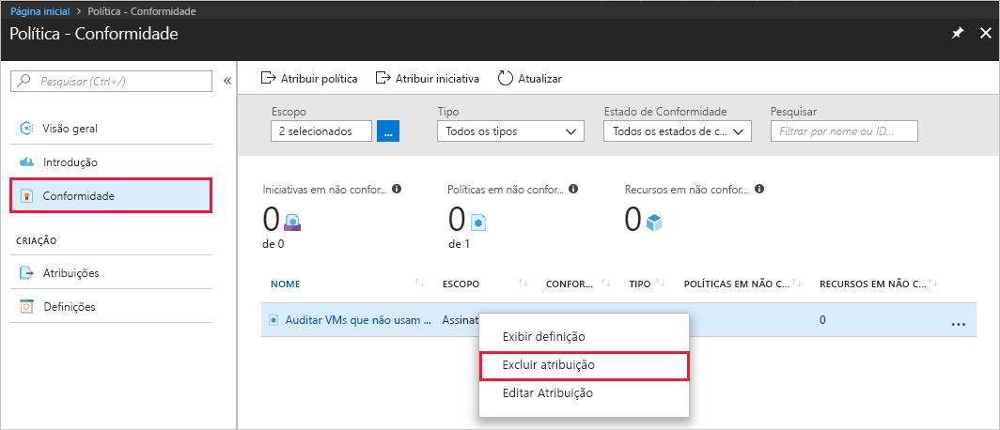

# Criar uma atribuição de política para identificar recursos sem conformidade em seu ambiente do Azure
A primeira etapa para compreender a conformidade no Azure é identificar o status de seus recursos. Este guia de início rápido orienta você no processo de criação de uma atribuição de política para identificar máquinas virtuais que não estão usando discos gerenciados.

No final deste processo, você identificará com êxito quais máquinas virtuais não estão usando discos gerenciados. Eles *não estão em conformidade* com a atribuição da política.

Se você não tiver uma assinatura do Azure, crie uma [conta gratuita](https://azure.microsoft.com/free/?WT.mc_id=A261C142F) antes de começar.

## Criar uma atribuição de política

Neste guia de início rápido, você cria uma atribuição de política e atribuímos a definição da política *Auditar máquinas virtuais sem Managed Disks*.

1. Selecione **Atribuições** no painel esquerdo da página de Política do Azure.
2. Selecione **Atribuir Política** na parte superior do painel **Atribuições**.

   

3. Na página **Atribuir Política**, clique no  ao lado do campo **Política** para abrir a lista de definições disponíveis.

   

   A Política do Azure vem com definições de políticas internas que você pode usar. Você verá definições de políticas internas como:

   - Impor marca e seu valor
   - Aplicar marca e seu valor
   - Requer o SQL Server versão 12.0

    Para uma lista completa de todas as políticas internas disponíveis, veja [Modelos de política](json-samples.md).

4. Pesquise suas definições de política para encontrar a definição *Auditar VMs que não usam discos gerenciados*. Clique na política e clique em **Selecionar**.

   

5. Forneça um **Nome** de exibição para a atribuição de política. Nesse caso, vamos usar *Auditar VMs que não usam discos gerenciados*. Você também pode adicionar uma **Descrição**opcional. A descrição fornece detalhes sobre como a atribuição de política identifica todas as máquinas virtuais que não usam discos gerenciados.
6. Altere o tipo de preço para **Standard** para garantir que a política seja aplicada aos recursos existentes.

   Há dois tipos de preço na Política do Azure – *Gratuito* e *Standard*. Com a camada Gratuita, você só pode impor políticas para recursos futuros, enquanto com a Standard, você também pode impô-las para recursos existentes para compreender melhor seu estado de conformidade. Para saber mais sobre os preços, veja [Preços do Azure Policy](https://azure.microsoft.com/pricing/details/azure-policy/).

7. Selecione o **Escopo** a que você gostaria que a política fosse aplicado.  Um escopo determina em quais recursos ou agrupamento de recursos a atribuição de política é imposta. Pode variar de uma assinatura a grupos de recursos.
8. Selecione a assinatura (ou grupo de recursos) que você registrou anteriormente. Neste exemplo, é usada a assinatura **Azure Analytics Capacity Dev**, mas suas opções poderão ser diferentes. Clique em **Selecionar**.

   

9. Deixe **Exclusões** em branco por enquanto e, em seguida, clique em **Atribuir**.

Agora, você está pronto para identificar recursos sem conformidade para compreender o estado de conformidade de seu ambiente.

## Identificar recursos sem conformidade

Selecione **Conformidade** no painel esquerdo e pesquise a atribuição de política criada por você.

Se houver recursos sem conformidade com essa nova atribuição, aparecem em **Recursos sem conformidade**.

Quando uma condição é avaliada em relação a seus recursos existentes e resulta ser verdadeira, então esses recursos são marcados como em não conformidade com a política. A imagem do exemplo anterior exibe os recursos não compatíveis. A tabela a seguir mostra como as diferentes ações da política funcionam com a avaliação da condição para o estado de conformidade resultante. Embora você não veja a lógica de avaliação no portal do Azure, os resultados do estado de conformidade são mostrados. O resultado do estado de conformidade pode ser ou compatível ou incompatível.

|Recurso  |Se a condição na política for avaliada como  |Ação na política   |Estado de conformidade  |
|-----------|---------|---------|---------|
|Exists     |True     |Negar     |Sem conformidade |
|Exists     |Falso    |Negar     |Em conformidade     |
|Exists     |True     |Acrescentar   |Sem conformidade |
|Exists     |Falso    |Acrescentar   |Em conformidade     |
|Exists     |True     |Audit    |Sem conformidade |
|Exists     |Falso    |Audit    |Sem conformidade |

## Limpar recursos

Outros guias desta coleção dão continuidade a este guia de início rápido. Se você planeja continuar trabalhando com os tutoriais subsequentes, não limpe os recursos criados neste guia de início rápido. Caso contrário, siga estas etapas para excluir todos os recursos criados por esse início rápido no Portal do Azure.
1. Selecione **Atribuições** no painel esquerdo.
2. Procure a atribuição que você criou e, em seguida, clique com o botão direito.

   

3.  Selecione **Excluir Atribuição**.

## Próximas etapas

Neste guia de início rápido, você atribuiu uma definição de política para um escopo. A definição de política garante que todos os recursos no escopo estão em conformidade e identifica quais não estão.

Para saber mais sobre a atribuição de políticas, para garantir que recursos que você criar no **futuro** estejam em conformidade, continue com o tutorial:

> [!div class="nextstepaction"]
> [Criando e gerenciando políticas](./create-manage-policy.md)
