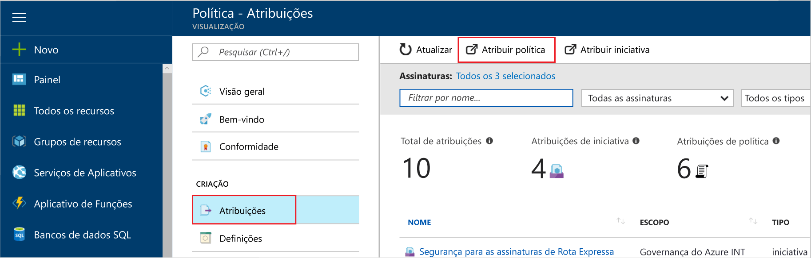

# <a name="create-and-manage-policies-to-enforce-compliance"></a>Criar e gerenciar políticas para impor a conformidade

Compreender como criar e gerenciar políticas no Azure é importante para manter a conformidade com padrões corporativos e com contratos de nível de serviço. Neste tutorial, você aprenderá a usar a Política do Azure para realizar algumas das tarefas mais comuns relacionadas à criação, à atribuição e ao gerenciamento de políticas em sua organização, como:

> [!div class="checklist"]
> * Atribuir uma política para impor uma condição para os recursos que você criar no futuro
> * Criar e atribuir uma definição de iniciativa para acompanhar a conformidade de vários recursos
> * Resolver um recurso negado ou sem conformidade
> * Implementar uma nova política em toda a organização

Se você não tiver uma assinatura do Azure, crie uma [conta gratuita](https://azure.microsoft.com/free/?WT.mc_id=A261C142F) antes de começar.

## <a name="opt-in-to-azure-policy"></a>Aceitar a Política do Azure

A Política do Azure está disponível na versão prévia limitada e, portanto, você precisa se registrar para solicitar acesso.

1. Vá até a Política do Azure em https://aka.ms/getpolicy e selecione **Inscrever-se** no painel esquerdo.

   

2. Aceite a Política do Azure selecionando na lista **Assinatura** as assinaturas com que gostaria de trabalhar. Em seguida, selecione **Registrar**.

   A lista de assinatura inclui todas as suas assinaturas do Azure.

   

   Dependendo da demanda, pode levar alguns dias para aceitarmos sua solicitação de registro. Após sua solicitação ser aceita, você receberá um email informando que pode começar a usar o serviço.

## <a name="assign-a-policy"></a>Atribuir uma política

A primeira etapa para impor a conformidade com a Política do Azure é atribuir uma definição de política. Uma definição de política define sob quais condições a política será aplicada e qual ação será tomada. Neste exemplo, nós atribuímos uma definição de política interna chamada *Exigir SQL Server versão 12.0* para impor a condição de que todos os bancos de dados do SQL Server devem ser a v12.0 para estar em conformidade.

1. Inicie o serviço de Política do Azure no portal do Azure procurando e selecionando **Política** no painel esquerdo.

   

2. Selecione **Atribuições** no painel esquerdo da página de Política do Azure. Uma atribuição é uma política que foi atribuída para entrar em vigor em um escopo específico.
3. Selecione **Atribuir Política** na parte superior do painel **Atribuições**.

   

4. Na página **Atribuir Política**, clique no  ao lado do campo **Política** para abrir a lista de definições disponíveis.

   

5. Selecione **Exigir SQL Server versão 12.0**.

   

6. Forneça um **Nome** de exibição para a atribuição de política. Neste caso, vamos usar *Exigir SQL Server versão 12.0*. Você também pode adicionar uma **Descrição**opcional. A descrição fornece detalhes sobre como essa atribuição de política garante que todos os servidores SQL criados nesse ambiente sejam da versão 12.0.
7. Altere o tipo de preço para **Standard** para garantir que a política seja aplicada aos recursos existentes.

   Há dois tipos de preço na Política do Azure – *Gratuito* e *Standard*. Com a camada Gratuita, você só pode impor políticas para recursos futuros, enquanto com a Standard, você também pode impô-las para recursos existentes para compreender melhor seu estado de conformidade. Como estamos na versão prévia limitada, ainda não lançamos um modelo de preços, de modo que você não receberá uma fatura por selecionar a opção *Standard*. Para saber mais sobre os preços, veja: [Preços da Política do Azure](https://acom-milestone-ignite.azurewebsites.net/pricing/details/azure-policy/).

8. Selecione o **Escopo** – a assinatura (ou grupo de recursos) que você registrou anteriormente quando aceitou a Política do Azure. Um escopo determina em quais recursos ou agrupamento de recursos a atribuição de política é imposta. Pode variar de uma assinatura a grupos de recursos.

   Para este exemplo, estamos usando esta assinatura – **Azure Analytics Capacity Dev**. Sua assinatura será diferente.

10. Selecione **Atribuir**.

## <a name="implement-a-new-custom-policy"></a>Implementar uma nova política personalizada

Agora que atribuímos a definição de política, vamos criar uma nova política para reduzir custos, garantindo que VMs criadas em seu ambiente não possam estar na série G. Dessa forma, sempre que um usuário na organização tentar criar uma VM na série G, a solicitação será negada.

1. Selecione **Definição** em **Criação** no painel esquerdo.

   

2. Selecione **+ Definição de Política**.
3. Insira o seguinte:

   - O nome da definição de política – *Exigir SKUs de VM menores que a série G*
   - A descrição do que a definição de política se destina a fazer – Esta definição de política impõe que todas as VMs criadas nesse escopo tenham SKUs menores que a série G para reduzir o custo.
   - A assinatura em que a definição de política operará – neste caso, nossa definição de política operará em **Advisor Analytics Capacity Dev**. Sua lista de assinaturas será diferente.
   - Escreva o código JSON com:
      - Os parâmetros da política.
      - As regras/condições da política, nesse caso – tamanho do SKU de VM igual a série G
      - O efeito da política, neste caso – **Negar**.

   Esta deve ser a aparência do JSON

```json
{
    "policyRule": {
      "if": {
        "allOf": [
          {
            "field": "type",
            "equals": "Microsoft.Compute/virtualMachines"
          },
          {
            "field": "Microsoft.Compute/virtualMachines/sku.name",
            "like": "Standard_G*"
          }
        ]
      },
      "then": {
        "effect": "deny"
      }
    }
}
```

<!-- Update the following link to the top level samples page
-->
   Para exibir exemplos de código json, consulte este artigo – [Modelos do Azure Policy](json-samples.md)

4. Selecione **Salvar**.

## <a name="create-a-policy-definition-with-rest-api"></a>Criar uma definição de política com a API REST

É possível criar uma política com a API REST para definições de política. A API REST permite que você crie e exclua as definições de políticas e obtenha informações sobre as definições existentes.
Para criar uma definição de política, use o exemplo a seguir:

```
PUT https://management.azure.com/subscriptions/{subscription-id}/providers/Microsoft.authorization/policydefinitions/{policyDefinitionName}?api-version={api-version}

```
Inclua um corpo de solicitação semelhante ao exemplo a seguir:

```
{
  "properties": {
    "parameters": {
      "allowedLocations": {
        "type": "array",
        "metadata": {
          "description": "The list of locations that can be specified when deploying resources",
          "strongType": "location",
          "displayName": "Allowed locations"
        }
      }
    },
    "displayName": "Allowed locations",
    "description": "This policy enables you to restrict the locations your organization can specify when deploying resources.",
    "policyRule": {
      "if": {
        "not": {
          "field": "location",
          "in": "[parameters('allowedLocations')]"
        }
      },
      "then": {
        "effect": "deny"
      }
    }
  }
}
```

## <a name="create-a-policy-definition-with-powershell"></a>Criar uma definição de política com o PowerShell

Antes de continuar com o exemplo do PowerShell, certifique-se de ter instalado a versão mais recente do Azure PowerShell. Parâmetros de política foram adicionados na versão 3.6.0. Se você tiver uma versão mais antiga, os exemplos retornam um erro indicando que o parâmetro não pode ser encontrado.

Você pode criar uma definição de política usando o cmdlet `New-AzureRmPolicyDefinition`.

Para criar uma definição de política de um arquivo, passe o caminho para o arquivo. Para um arquivo externo, use o exemplo a seguir:

```
$definition = New-AzureRmPolicyDefinition `
    -Name denyCoolTiering `
    -DisplayName "Deny cool access tiering for storage" `
    -Policy 'https://raw.githubusercontent.com/Azure/azure-policy-samples/master/samples/Storage/storage-account-access-tier/azurepolicy.rules.json'
```

Para um arquivo local, use o exemplo a seguir:

```
$definition = New-AzureRmPolicyDefinition `
    -Name denyCoolTiering `
    -Description "Deny cool access tiering for storage" `
    -Policy "c:\policies\coolAccessTier.json"
```

Para criar uma definição de política com uma regra embutida, use o exemplo a seguir:

```
$definition = New-AzureRmPolicyDefinition -Name denyCoolTiering -Description "Deny cool access tiering for storage" -Policy '{
  "if": {
    "allOf": [
      {
        "field": "type",
        "equals": "Microsoft.Storage/storageAccounts"
      },
      {
        "field": "kind",
        "equals": "BlobStorage"
      },
      {
        "not": {
          "field": "Microsoft.Storage/storageAccounts/accessTier",
          "equals": "cool"
        }
      }
    ]
  },
  "then": {
    "effect": "deny"
  }
}'
```

A saída é armazenada em um objeto `$definition`, que é usado durante a atribuição da política.
O exemplo a seguir cria uma definição de política que inclui parâmetros:

```
$policy = '{
    "if": {
        "allOf": [
            {
                "field": "type",
                "equals": "Microsoft.Storage/storageAccounts"
            },
            {
                "not": {
                    "field": "location",
                    "in": "[parameters(''allowedLocations'')]"
                }
            }
        ]
    },
    "then": {
        "effect": "Deny"
    }
}'

$parameters = '{
    "allowedLocations": {
        "type": "array",
        "metadata": {
          "description": "The list of locations that can be specified when deploying storage accounts.",
          "strongType": "location",
          "displayName": "Allowed locations"
        }
    }
}'

$definition = New-AzureRmPolicyDefinition -Name storageLocations -Description "Policy to specify locations for storage accounts." -Policy $policy -Parameter $parameters
```

## <a name="view-policy-definitions"></a>Exibir definições de políticas

Para visualizar todas as definições de política em sua assinatura, utilize o seguinte comando:

```
Get-AzureRmPolicyDefinition
```

Ele retorna todas as definições de política disponíveis, incluindo políticas internas. Cada política é retornada no seguinte formato:

```
Name               : e56962a6-4747-49cd-b67b-bf8b01975c4c
ResourceId         : /providers/Microsoft.Authorization/policyDefinitions/e56962a6-4747-49cd-b67b-bf8b01975c4c
ResourceName       : e56962a6-4747-49cd-b67b-bf8b01975c4c
ResourceType       : Microsoft.Authorization/policyDefinitions
Properties         : @{displayName=Allowed locations; policyType=BuiltIn; description=This policy enables you to
                     restrict the locations your organization can specify when deploying resources. Use to enforce
                     your geo-compliance requirements.; parameters=; policyRule=}
PolicyDefinitionId : /providers/Microsoft.Authorization/policyDefinitions/e56962a6-4747-49cd-b67b-bf8b01975c4c
```

## <a name="create-a-policy-definition-with-azure-cli"></a>Criar uma definição de política com a CLI do Azure

Você pode criar uma definição de política usando a CLI do Azure com o comando de definição de política.
Para criar uma definição de política com uma regra embutida, use o exemplo a seguir:

```
az policy definition create --name denyCoolTiering --description "Deny cool access tiering for storage" --rules '{
  "if": {
    "allOf": [
      {
        "field": "type",
        "equals": "Microsoft.Storage/storageAccounts"
      },
      {
        "field": "kind",
        "equals": "BlobStorage"
      },
      {
        "not": {
          "field": "Microsoft.Storage/storageAccounts/accessTier",
          "equals": "cool"
        }
      }
    ]
  },
  "then": {
    "effect": "deny"
  }
}'
```

## <a name="view-policy-definitions"></a>Exibir definições de políticas

Para visualizar todas as definições de política em sua assinatura, utilize o seguinte comando:

```
az policy definition list
```

Ele retorna todas as definições de política disponíveis, incluindo políticas internas. Cada política é retornada no seguinte formato:

```
{                                                            
  "description": "This policy enables you to restrict the locations your organization can specify when deploying resources. Use to enforce your geo-compliance requirements.",                      
  "displayName": "Allowed locations",
  "id": "/providers/Microsoft.Authorization/policyDefinitions/e56962a6-4747-49cd-b67b-bf8b01975c4c",
  "name": "e56962a6-4747-49cd-b67b-bf8b01975c4c",
  "policyRule": {
    "if": {
      "not": {
        "field": "location",
        "in": "[parameters('listOfAllowedLocations')]"
      }
    },
    "then": {
      "effect": "Deny"
    }
  },
  "policyType": "BuiltIn"
}
```

## <a name="create-and-assign-an-initiative-definition"></a>Criar e atribuir uma definição de iniciativa

Com uma definição de iniciativa, você pode agrupar várias definições de política para alcançar uma meta geral. Você cria uma definição de iniciativa para garantir que os recursos dentro do escopo da definição fiquem em conformidade com as definições de política que compõem a definição da iniciativa.  Consulte a [Visão Geral da Política do Azure](./azure-policy-introduction.md) para obter mais informações sobre definições de iniciativas.

### <a name="create-an-initiative-definition"></a>Criar uma definição de iniciativa

1. Selecione **Definições** em **Criação** no painel esquerdo.

   

2. Selecione **Definição de Iniciativa** na parte superior da página, esta opção leva você para o formulário **Definição de Iniciativa**.
3. Insira o nome e a descrição da iniciativa.

   Neste exemplo, como queremos garantir que os recursos estejam em conformidade com as definições de política sobre a manutenção da segurança, o nome da iniciativa seria **Manter Segurança** e a descrição seria: **Esta iniciativa foi criada para lidar com todas as definições de política associadas à proteção de recursos**.

   

4. Percorra a lista de **Definições Disponíveis** e selecione as definições de política que você deseja adicionar a essa iniciativa. Para nossa iniciativa **Manter Segurança**, adicione as seguintes definições de política internas:
   - Requer o SQL Server versão 12.0
   - Monitorar aplicativos Web desprotegidos na central de segurança.
   - Monitorar redes permissivas na central de segurança.
   - Monitorar possíveis listas de permissões de aplicativo na central de segurança.
   - Monitorar discos de VMs não criptografadas na central de segurança.

   

   Após selecionar as definições de política na lista, você poderá vê-las em **Políticas e parâmetros**, conforme mostrado acima.

5. Selecione **Criar**.

### <a name="assign-an-initiative-definition"></a>Atribuir uma definição de iniciativa

1. Vá até a guia **Definições** em **Criação**.
2. Pesquise a definição de **Manter Segurança** que você criou.
3. Selecione a definição da iniciativa e, em seguida, selecione **Atribuir**.

   

4. Preencha o formulário de **Atribuição** digitando:
   - nome: Atribuição Manter segurança
   - descrição: esta atribuição de iniciativa é voltada para impor este grupo de definições de política à assinatura **Azure Advisor Capacity Dev**
   - tipo de preço: Standard
   - escopo a que você deseja que essa atribuição seja aplicada: **Azure Advisor Capacity Dev**

5. Selecione **Atribuir**.

## <a name="resolve-a-non-compliant-or-denied-resource"></a>Resolver um recurso negado ou sem conformidade

Seguindo o exemplo acima, após atribuir a definição de política para exigir o SQL Server versão 12.0, um SQL Server criado com uma versão diferente seria recusado. Nesta seção, veremos como resolver uma tentativa negada de criar um SQL Server de uma versão diferente solicitando uma exclusão.

1. Selecione **Atribuições** no painel esquerdo.
2. Navegue por todas as atribuições de política e inicie a atribuição *Exigir SQL Server versão 12.0*.
3. Solicite uma exclusão para os grupos de recursos em que você está tentando criar o SQL Server. Nesse caso, excluiremos Microsoft.Sql/servers/databases: *baconandbeer/Cheetos* e *baconandbeer/Chorizo*.

   

   Outras maneiras de resolver um recurso negado incluem: contatar o contato associado à política se você tiver uma justificativa forte para precisar que o SQL Server seja criado e editar a política diretamente se você tiver acesso a ela.

4. Selecione **Salvar**.

Nesta seção, você resolveu a recusa de sua tentativa de criar um SQL Server com a versão 12.0, solicitando uma exclusão para os recursos.

## <a name="clean-up-resources"></a>Limpar recursos

Se você planeja continuar trabalhando com os tutoriais subsequentes, não limpe os recursos criados neste guia. Se não planejar continuar, use as etapas a seguir para excluir as atribuições ou definições criadas acima:

1. Selecione **Definições** (ou **Atribuições** se você estiver tentando excluir uma atribuição) no painel esquerdo.
2. Pesquisar pela nova iniciativa ou definição de política (ou atribuição) que acabou de criar.
3. Selecione as reticências no final da definição ou da atribuição e selecione **Excluir Definição** (ou **Excluir Atribuição**).

## <a name="next-steps"></a>Próximas etapas

Neste tutorial, você fez o seguinte com sucesso:

> [!div class="checklist"]
> * Atribuiu uma política para impor uma condição para os recursos que você criar no futuro
> * Criou e atribuiu uma definição de iniciativa para acompanhar a conformidade de vários recursos
> * Resolveu um recurso negado ou sem conformidade
> * Implementou uma nova política em toda a organização

Para saber mais sobre as estruturas das definições de políticas, consulte este artigo:

> [!div class="nextstepaction"]
> [Estrutura de definição do Azure Policy](policy-definition.md)
