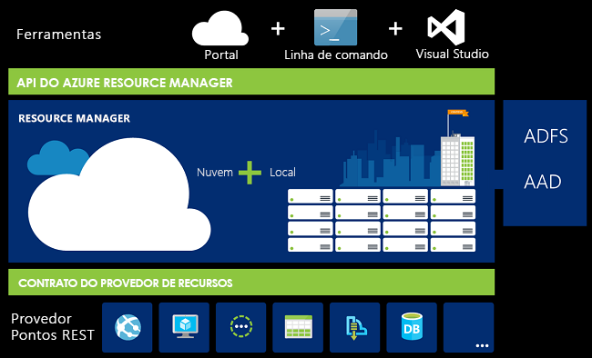
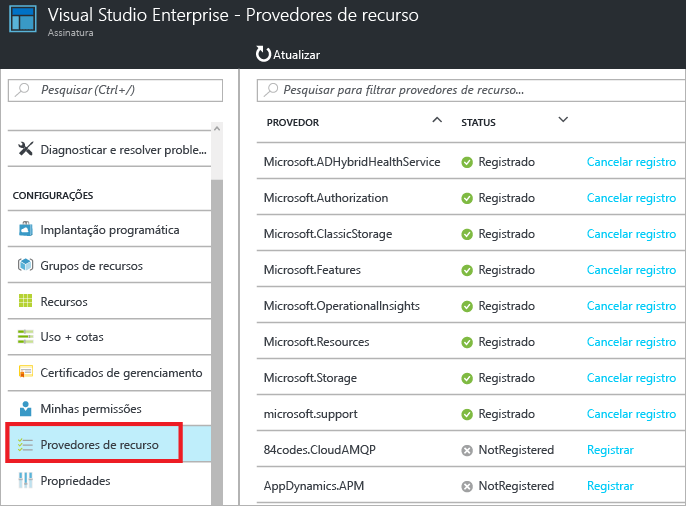
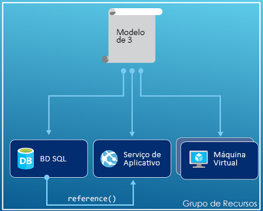
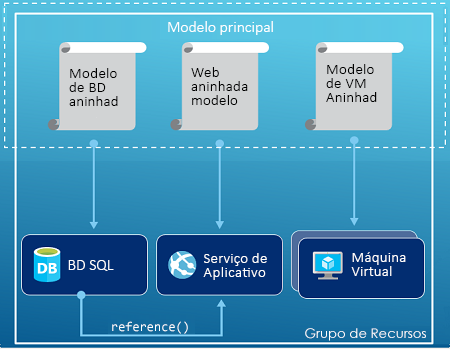
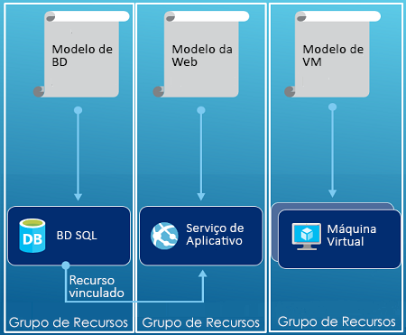

# Visão geral do Azure Resource Manager
A infraestrutura do seu aplicativo geralmente é composta de vários componentes; talvez uma máquina virtual, uma conta de armazenamento e uma rede virtual, ou aplicativo Web, banco de dados, servidor de banco de dados e serviços de terceiros. Tais componentes não são vistos como entidades separadas, em vez disso, eles são mostrados como partes relacionadas e interdependentes de uma única entidade. Você deseja implantar, gerenciar e monitorá-los como um grupo. O Azure Resource Manager permite trabalhar com os recursos da sua solução como um grupo. Você pode implantar, atualizar ou excluir todos os recursos da sua solução em uma única operação coordenada. Usar um modelo para a implantação e esse modelo pode ser útil para ambientes diferentes, como teste, preparação e produção. O Gerenciador de Recursos fornece recursos de segurança, auditoria e marcação para ajudá-lo a gerenciar seus recursos após a implantação. 

## Terminologia
Se você for um novo usuário do Azure Resource Manager, há alguns termos com os quais talvez você não esteja familiarizado.

* **recurso** -um item gerenciável que está disponível por meio do Azure. Alguns recursos comuns são uma máquina virtual, conta de armazenamento, aplicativo Web, banco de dados e rede virtual, mas há muito mais.
* **grupo de recursos** - Um contêiner que mantém os recursos relacionados a uma solução do Azure. O grupo de recursos pode incluir todos os recursos para a solução ou apenas os recursos que você deseja gerenciar como um grupo. Você decide como deseja alocar recursos para grupos de recursos com base no que faz mais sentido para sua organização. Confira [Grupos de recursos](#resource-groups).
* **provedor de recursos** - Um provedor de recursos é um serviço que fornece os recursos que você pode implantar e gerenciar por meio do Gerenciador de Recursos. Cada provedor de recursos oferece operações para trabalhar com os recursos implantados. Alguns provedores de recursos comuns são Microsoft.Compute que fornece o recurso de máquina virtual, Microsoft.Storage que fornece o recurso de conta de armazenamento e Microsoft.Web que fornece recursos relacionados aos aplicativos Web. Confira [Provedores de recursos](#resource-providers).
* **Modelo do Resource Manager** - Um arquivo JSON (JavaScript Object Notation) que define um ou mais recursos para implantação em um grupo de recursos. Ele também define as dependências entre os recursos implantados. O modelo pode ser usado para implantar os recursos de forma consiste e repetida. Confira [Implantação de modelo](#template-deployment).
* **sintaxe declarativa** - sintaxe que permite a declaração "Isso é o que pretendo criar" sem precisar escrever a sequência de comandos de programação para criá-la. O modelo do Resource Manager é um exemplo de sintaxe declarativa. No arquivo, você define as propriedades da infraestrutura a ser implantada no Azure. 

## Os benefícios de usar o Gerenciador de Recursos
O Gerenciador de Recursos fornece vários benefícios:

* Você pode implantar, gerenciar e monitorar todos os recursos da sua solução como um grupo em vez de tratá-los individualmente.
* Você pode implantar a solução repetidamente em todo seu ciclo de vida de desenvolvimento e com a confiança de que seus recursos serão implantados em um estado consistente.
* Você pode gerenciar sua infraestrutura por meio de modelos declarativos em vez de scripts.
* Você pode definir as dependências entre os recursos para que eles sejam implantados na ordem correta.
* Você pode aplicar o controle de acesso a todos os serviços no grupo de recursos, pois o RBAC (Controle de Acesso Baseado em Função) é integrado nativamente à plataforma de gerenciamento.
* Você pode aplicar marcas aos recursos para organizar de modo lógico todos os recursos em sua assinatura.
* Você pode esclarecer a cobrança da sua organização exibindo os custos para um grupo de recursos que compartilha a mesma marcação.  

O Gerenciador de Recursos fornece uma nova maneira de implantar e gerenciar suas soluções. Se você usou o modelo de implantação anterior e quiser saber mais sobre as alterações, confira [Noções básicas sobre a implantação do Gerenciador de Recursos e a implantação clássica](resource-manager-deployment-model.md).

## Camada de gerenciamento consistente
O Resource Manager fornece uma camada de gerenciamento consistente para as tarefas executadas por meio do Azure PowerShell, CLI do Azure, portal do Azure, API REST e ferramentas de desenvolvimento. Todas as ferramentas usam um conjunto comum de operações. Use as ferramentas que funcionam melhor para você e possam ser usados alternadamente sem confusão. 

A imagem a seguir mostra como todas as ferramentas interagem com a mesma API do Azure Resource Manager. A API passa as solicitações para o serviço do Gerenciador de Recursos, que autentica e autoriza as solicitações. O Gerenciador de Recursos, em seguida, encaminha as solicitações para os provedores de recursos apropriado.

## Diretrizes
As sugestões a seguir ajudarão você a aproveitar ao máximo o Gerenciador de Recursos quando estiver trabalhando com suas soluções.

1. Defina e implante a sua infraestrutura através de sintaxe declarativa em modelos do Gerenciador de Recursos, e não de comandos imperativos.
2. Defina todas as etapas de implantação e configuração no modelo. Você não deve ter nenhuma etapa manual para configurar sua solução.
3. Execute comandos imperativos para gerenciar os recursos, como iniciar ou interromper um aplicativo ou máquina.
4. Organize recursos com o mesmo ciclo de vida em um grupo de recursos. Use marcas para as demais organizações de recursos.

Para recomendações sobre modelos, consulte [Práticas recomendadas para criar modelos do Azure Resource Manager](resource-manager-template-best-practices.md).

Para obter orientação sobre como as empresas podem usar o Resource Manager para gerenciar assinaturas de forma eficaz, consulte [Azure enterprise scaffold – controle de assinatura prescritivas](resource-manager-subscription-governance.md).

## Grupos de recursos
Existem alguns fatores importantes a considerar ao definir seu grupo de recursos:

1. Todos os recursos no grupo devem compartilhar o mesmo ciclo de vida. Você os implanta, atualiza e exclui juntos. Se um recurso, como um servidor de banco de dados, precisar existir em um ciclo de implantação diferente, ele deve ser de outro grupo de recursos.
2. Cada recurso só pode existir em um grupo de recursos.
3. Você pode adicionar ou remover um recurso de um grupo de recursos a qualquer momento.
4. Você pode mover um recurso de um grupo de recursos para outro grupo. Para saber mais, confira [Mover recursos para um novo grupo de recursos ou assinatura](resource-group-move-resources.md).
5. Um grupo de recursos pode conter recursos que residem em regiões diferentes.
6. Um grupo de recursos pode ser usado para definir o escopo de controle de acesso para ações administrativas.
7. Um recurso pode interagir com recursos em outros grupos de recursos. Essa interação é comum quando dois recursos estão relacionados, mas não compartilham o mesmo ciclo de vida (por exemplo, aplicativos Web que se conectam a um banco de dados).

Ao criar um grupo de recursos, você precisará fornecer um local para ele. Você pode estar se perguntando: "Por que um grupo de recursos precisa de um local? E, se os recursos podem ter locais diferentes do grupo de recursos, por que o local do grupo de recursos importa?" O grupo de recursos armazena metadados sobre os recursos. Portanto, quando você especifica um local para o grupo de recursos, especifica onde os metadados são armazenados. Por motivos de conformidade, você precisa fazer com que os dados sejam armazenados em determinada região.

## Provedores de recursos
Cada provedor de recursos oferece um conjunto de recursos e operações para trabalhar com um serviço do Azure. Por exemplo, se você quer armazenar chaves e segredos, trabalhe com o provedor de recursos **Microsoft.KeyVault** . Este provedor de recursos oferece um tipo de recurso chamado **cofres** para criar o cofre da chave e um tipo de recurso chamado **cofres/segredos** para criar um segredo no cofre de chaves. 

Antes de começar a implantação de recursos, você deve ter uma compreensão dos provedores de recursos disponíveis. Conhecer os nomes dos provedores de recursos e dos recursos ajuda a definir os recursos que você deseja implantar no Azure.

Você pode ver todos os provedores de recursos por meio do portal. Na folha de sua assinatura, selecione **Provedores de recursos**:

Você recupera todos os provedores de recursos com o seguinte cmdlet do PowerShell:

    Get-AzureRmResourceProvider -ListAvailable

Ou, com a CLI do Azure, você recupera todos os provedores de recursos com o seguinte comando:

    azure provider list

Você pode verificar a lista retornada para encontrar os provedores de recursos que precisa usar.

Para obter detalhes sobre um provedor de recursos, adicione o namespace do provedor ao comando. O comando retorna os tipos de recursos com suporte para o provedor de recursos e os locais e as versões de API com suporte para cada tipo de recurso. O seguinte cmdlet do PowerShell obtém os detalhes sobre Microsoft.Compute:

    (Get-AzureRmResourceProvider -ProviderNamespace Microsoft.Compute).ResourceTypes

Ou, com a CLI do Azure, recupere os tipos de recursos, locais e versões de API com suporte para Microsoft.Compute, com o seguinte comando:

    azure provider show Microsoft.Compute --json > c:\Azure\compute.json

Para obter mais informações, confira [Provedores do Gerenciador de Recursos, regiões, versões de API e esquemas](resource-manager-supported-services.md).

## Implantação de modelo
Com o Gerenciador de Recursos, você pode criar um modelo (no formato JSON) que define a infraestrutura e a configuração de sua solução do Azure. Usando um modelo, você pode implantar a solução repetidamente em todo seu ciclo de vida e com a confiança de que seus recursos serão implantados em um estado consistente. Quando você cria uma solução no Portal, ela inclui automaticamente um modelo de implantação. Você não precisa criar seu modelo do zero, pois é possível iniciar com o modelo da sua solução e personalizá-lo para atender às suas necessidades específicas. Você pode recuperar um modelo de um grupo de recursos existente exportando o estado atual do grupo de recursos ou exibindo o modelo usado para determinada implantação. A exibição do [modelo exportado](resource-manager-export-template.md) é uma maneira útil de saber mais sobre a sintaxe do modelo.

Para saber mais sobre o formato do modelo e como construí-lo, confira [Criando modelos do Azure Resource Manager](resource-group-authoring-templates.md) e [Passo a passo de modelos do Gerenciador de Recursos](resource-manager-template-walkthrough.md).

O Gerenciador de Recursos processa o modelo como qualquer outra solicitação (confira a imagem da [Camada de gerenciamento consistente](#consistent-management-layer)). Ele analisa o modelo e converte sua sintaxe em operações da API REST para provedores de recurso apropriado. Por exemplo, quando o Gerenciador de Recursos recebe um modelo com a seguinte definição de recurso:

    "resources": [
      {
        "apiVersion": "2016-01-01",
        "type": "Microsoft.Storage/storageAccounts",
        "name": "mystorageaccount",
        "location": "westus",
        "sku": {
          "name": "Standard_LRS"
        },
        "kind": "Storage",
        "properties": {
        }
      }
      ]

Converte a definição para a seguinte operação de API REST, que é enviada para o provedor de recursos Microsoft.Storage:

    PUT
    https://management.azure.com/subscriptions/{subscriptionId}/resourceGroups/{resourceGroupName}/providers/Microsoft.Storage/storageAccounts/mystorageaccount?api-version=2016-01-01
    REQUEST BODY
    {
      "location": "westus",
      "properties": {
      }
      "sku": {
        "name": "Standard_LRS"
      },   
      "kind": "Storage"
    }

Como você define grupos de recursos e modelos é de sua responsabilidade e de como você deseja gerenciar a sua solução. Por exemplo, você pode implantar seu aplicativo de três camadas por meio de um único modelo para um único grupo de recursos.

Mas, você não precisa definir toda a sua infraestrutura em um único modelo. Muitas vezes, faz sentido dividir seus requisitos de implantação em um conjunto de modelos com destinação e fins específicos. Você pode reutilizar esses modelos facilmente para soluções diferentes. Para implantar uma solução específica, você deve criar um modelo mestre que vincule todos os modelos necessários. A imagem a seguir mostra como implantar uma solução de três camadas com o modelo pai que inclui três modelos aninhados.

Ao prever suas camadas com ciclos de vida separados, você pode implantar os três níveis para separar grupos de recursos. Observe que os recursos ainda podem ser vinculados aos recursos em outros grupos de recursos.

Para obter mais sugestões sobre a criação de modelos, confira [Padrões para a criação de modelos do Azure Resource Manager](best-practices-resource-manager-design-templates.md). Para obter informações sobre modelos aninhados, confira [Usando modelos vinculados com o Azure Resource Manager](resource-group-linked-templates.md).

Para uma série de quatro partes sobre como automatizar a implantação, consulte [automatizar implantações de aplicativo para máquinas virtuais do Azure](../virtual-machines/virtual-machines-windows-dotnet-core-1-landing.md?toc=%2fazure%2fvirtual-machines%2fwindows%2ftoc.json). Esta série aborda a arquitetura do aplicativo, acesso e segurança, disponibilidade e escala e implantação de aplicativos.

O Azure Resource Manager analisa as dependências para garantir que os recursos sejam criados na ordem correta. Se um recurso depende de um valor de outro recurso (como uma máquina virtual que precisa de uma conta de armazenamento para discos), você pode definir uma dependência. Para saber mais, confira [Definindo as dependências nos modelos do Gerenciador de Recursos do Azure](resource-group-define-dependencies.md).

Você também pode usar o modelo para atualizações de infraestrutura. Por exemplo, você pode adicionar um recurso à sua solução e adicionar regras de configuração para os recursos que já foram implantados. Se o modelo especificar a criação de um recurso, mas esse recurso já existir, o Azure Resource Manager executará uma atualização em vez de criar um novo ativo. O Azure Resource Manager atualiza o ativo existente para o mesmo estado de um novo.  

O Gerenciador de Recursos do Azure fornece extensões para cenários que precisam de operações adicionais, como a instalação de um software específico que não está incluído na configuração. Se você já estiver usando um serviço de gerenciamento de configuração, como DSC, Chef ou Puppet, poderá continuar trabalhando com esse serviço usando as extensões. Para obter informações sobre extensões de máquina virtual, confira [Sobre recursos e extensões de máquina virtual](../virtual-machines/virtual-machines-windows-extensions-features.md?toc=%2fazure%2fvirtual-machines%2fwindows%2ftoc.json). 

Finalmente, o modelo se torna parte do código-fonte do seu aplicativo. Você pode adicioná-lo ao repositório de código-fonte e atualizá-lo conforme a evolução de seu aplicativo. Você pode editar o modelo com o Visual Studio.

Depois de definir o modelo, você está pronto para implantar os recursos para o Azure. Para obter os comandos para implantar os recursos, confira:

* [Implantar recursos com modelos do Resource Manager e o Azure PowerShell](resource-group-template-deploy.md)
* [Implantar recursos com modelos do Resource Manager e a CLI do Azure](resource-group-template-deploy-cli.md)
* [Implantar recursos com modelos do Resource Manager e o portal do Azure](resource-group-template-deploy-portal.md)
* [Implantar recursos com modelos do Resource Manager e a API REST do Resource Manager](resource-group-template-deploy-rest.md)

## Marcas
O Gerenciador de Recursos fornece um recurso de marcação que permite classificar os recursos de acordo com suas necessidades de gerenciamento ou de cobrança. Use as marcas quando você tiver um conjunto complexo de grupos de recursos e recursos e precisar visualizar os ativos da maneira que fizer mais sentido. Por exemplo, você pode marcar os recursos que servem para uma função semelhante em sua organização ou pertencem ao mesmo departamento. Sem marcas, os usuários de sua organização podem criar vários recursos que podem ser difíceis de identificar e gerenciar mais tarde. Por exemplo, você pode querer excluir todos os recursos de um projeto específico. Se esses recursos não estão marcados para o projeto, você precisa encontrá-los manualmente. A marcação pode ser uma maneira importante de reduzir custos desnecessários em sua assinatura. 

Recursos não precisam residir no mesmo grupo de recursos para compartilhar uma marca. Você pode criar sua própria taxonomia de marca para garantir que todos os usuários na sua organização usem marcas comuns em vez de aplicarem marcas ligeiramente diferentes inadvertidamente (como por exemplo, "Dept" em vez de "Departamento").

O exemplo a seguir mostra uma marca aplicada a uma máquina virtual.

    "resources": [    
      {
        "type": "Microsoft.Compute/virtualMachines",
        "apiVersion": "2015-06-15",
        "name": "SimpleWindowsVM",
        "location": "[resourceGroup().location]",
        "tags": {
            "costCenter": "Finance"
        },
        ...
      }
    ]

Para recuperar todos os recursos com um valor de marca, use o seguinte cmdlet do PowerShell:

    Find-AzureRmResource -TagName costCenter -TagValue Finance

Ou execute o seguinte comando da CLI do Azure:

    azure resource list -t costCenter=Finance --json

Você também pode exibir os recursos marcados por meio do portal do Azure.

O [relatório de uso](../billing/billing-understand-your-bill.md) para sua assinatura inclui nomes de marca e valores, o que o habilita a dividir os custos por marcas. Para obter mais informações sobre marcas, consulte [Usando marcas para organizar os recursos do Azure](resource-group-using-tags.md).

## Controle de acesso
O Gerenciador de Recursos permite controlar quem tem acesso a ações específicas da sua organização. Ele integra nativamente o RBAC (controle de acesso baseado em função) à plataforma de gerenciamento e aplica esse controle de acesso a todos os serviços em seu grupo de recursos. 

Há dois conceitos principais para entender ao trabalhar com o controle de acesso baseado em função:

* Definições de função - descrevem um conjunto de permissões e podem ser usadas em muitas atribuições.
* Atribuições de função - associam uma definição com uma identidade (usuário ou grupo) para um determinado escopo (assinatura, grupo de recursos ou recurso). A atribuição é herdada por escopos menores.

Você pode adicionar usuários à plataforma predefinida e funções específicas do recurso. Por exemplo, você pode aproveitar a função predefinida chamada Leitor, que permite aos usuários exibir recursos, mas não os alterar. Adicione usuários da sua organização que precisam desse tipo de acesso à função Leitor e aplique a função à assinatura, ao grupo de recursos ou ao recurso.

O Azure fornece as quatro seguintes funções de plataforma:

1. O proprietário pode gerenciar tudo, incluindo o acesso
2. Os colaboradores podem gerenciar tudo, exceto o acesso
3. Os leitores podem ver tudo, mas não podem fazer alterações
4. Administrador de Acesso do Usuário - pode gerenciar o acesso do usuário aos recursos do Azure

O Azure também fornece várias funções específicas de recursos. Alguns tipos comuns são:

1. Colaborador de Máquina Virtual - pode gerenciar máquinas virtuais, mas não concede acesso a elas, e não pode gerenciar a conta de armazenamento ou a rede virtual à qual elas estão conectadas
2. Colaborador de Rede - pode gerenciar todos os recursos de rede, mas não concede acesso a eles
3. Colaborador da Conta de Armazenamento - pode gerenciar contas de armazenamento, mas não concede acesso a elas
4. Colaborador do SQL Server - pode gerenciar servidores SQL e bancos de dados, mas não suas políticas de segurança
5. Colaborador do Site - pode gerenciar sites, mas não os planos da Web aos quais eles estão conectados

Para obter a lista completa de funções e ações permitidas, confira [RBAC: funções internas](../active-directory/role-based-access-built-in-roles.md). Para obter mais informações sobre o controle de acesso baseado em função, consulte [Controle de acesso baseado em função do Azure](../active-directory/role-based-access-control-configure.md). 

Em alguns casos, você deseja executar código ou script que acessa recursos, mas não deseja executá-los usando as credenciais do usuário. Em vez disso, você deseja criar uma identidade chamada entidade de serviço para o aplicativo e atribuir a função apropriada à entidade de serviço. O Gerenciador de Recursos o habilita a criar credenciais para o aplicativo e autenticá-lo de forma programática. Para saber mais sobre como criar entidades de serviço, confira um dos seguintes tópicos:

* [Usar o Azure PowerShell para criar uma entidade de serviço a fim de acessar recursos](resource-group-authenticate-service-principal.md)
* [Usar a CLI do Azure para criar uma entidade de serviço a fim de acessar recursos](resource-group-authenticate-service-principal-cli.md)
* [Usar o portal para criar um aplicativo e entidade de serviço do Active Directory que pode acessar recursos](resource-group-create-service-principal-portal.md)

Você pode bloquear explicitamente recursos essenciais para impedir que os usuários possam excluí-los ou modificá-los. Para saber mais, confira [Bloquear recursos com o Gerenciador de Recursos do Azure](resource-group-lock-resources.md).

## Logs de atividade
O Gerenciador de Recursos registra todas as operações que criam, modificam ou excluem um recurso. É possível usar os logs de atividade para encontrar um erro ao solucionar problemas ou para monitorar como um usuário de sua organização modificou um recurso. Para ver os logs, selecione **Logs de atividade** na folha **Configurações** de um grupo de recursos. Você pode filtrar os logs por muitos valores diferentes, incluindo qual usuário iniciou a operação. Para saber mais sobre como trabalhar com os logs de atividade, confira [Operações de auditoria com o Gerenciador de Recursos](resource-group-audit.md).

## Políticas personalizadas
O Gerenciador de Recursos permite que você crie políticas personalizadas para gerenciar seus recursos. Os tipos de políticas que você cria podem incluir diversos cenários. Você pode impor uma convenção de nomenclatura para recursos, limitar os tipos e instâncias de recursos que podem ser implantados ou limitar quais regiões podem hospedar um tipo de recurso. Você pode exigir um valor de marcação nos recursos para organizar a cobrança por departamentos. Você pode criar políticas para ajudar a reduzir os custos e manter a consistência em sua assinatura. 

Você define políticas com JSON e, em seguida, as aplica à sua assinatura ou em um grupo de recursos. As políticas são diferentes do controle de acesso baseado em função porque são aplicadas a tipos de recursos.

O exemplo a seguir mostra uma política que garante a consistência de marca, especificando que todos os recursos incluem uma marca costCenter.

    {
      "if": {
        "not" : {
          "field" : "tags",
          "containsKey" : "costCenter"
        }
      },
      "then" : {
        "effect" : "deny"
      }
    }

Há muito mais tipos de políticas que você pode criar. Para saber mais, confira [Usar a Política para gerenciar recursos e controlar o acesso](resource-manager-policy.md).

## SDKs
Os SDKs do Azure estão disponíveis em várias linguagens e plataformas.
Cada uma dessas implementações da linguagem está disponível por meio do gerenciador de pacotes do ecossistema e do GitHub.

O código em cada um desses SDKs é gerado a partir de especificações da API RESTful do Azure.
Essas especificações têm o código-fonte aberto e baseiam-se na especificação Swagger 2.0.
O código do SDK é gerado por um projeto de fonte-aberta denominado AutoRest.
O AutoRest transforma essas especificações da API RESTful em bibliotecas de cliente em várias linguagens.
Se você quiser melhorar algum aspecto do código gerado nos SDKs, todo o conjunto de ferramentas para criar os SDKs é aberto, está disponível gratuitamente e baseado em um formato de especificação API amplamente adotado.

Aqui estão nossos repositórios do SDK de software livre. Comentários, problemas e solicitações pull são bem-vindos.

[.NET](https://github.com/Azure/azure-sdk-for-net) | [Java](https://github.com/Azure/azure-sdk-for-java) | [Node.js](https://github.com/Azure/azure-sdk-for-node) | [PHP](https://github.com/Azure/azure-sdk-for-php) | [Python](https://github.com/Azure/azure-sdk-for-python) | [Ruby](https://github.com/Azure/azure-sdk-ruby)

> [!NOTE]
> Se o SDK não fornecer a funcionalidade necessária, você também poderá chamar a [API REST do Azure](https://docs.microsoft.com/rest/api/resources/) diretamente.
> 
> 

## Exemplos
### .NET
* [Gerenciar recursos e grupos de recursos do Azure](https://azure.microsoft.com/documentation/samples/resource-manager-dotnet-resources-and-groups/)
* [Implantar uma VM habilitada para SSH com um modelo](https://azure.microsoft.com/documentation/samples/resource-manager-dotnet-template-deployment/)

### Java
* [Gerenciar recursos do Azure](https://azure.microsoft.com/documentation/samples/resources-java-manage-resource/)
* [Gerenciar grupos de recursos do Azure](https://azure.microsoft.com/documentation/samples/resources-java-manage-resource-group/)
* [Implantar uma VM habilitada para SSH com um modelo](https://azure.microsoft.com/documentation/samples/resources-java-deploy-using-arm-template/)

### Node.js
* [Gerenciar recursos e grupos de recursos do Azure](https://azure.microsoft.com/documentation/samples/resource-manager-node-resources-and-groups/)
* [Implantar uma VM habilitada para SSH com um modelo](https://azure.microsoft.com/documentation/samples/resource-manager-node-template-deployment/)

### Python
* [Gerenciar recursos e grupos de recursos do Azure](https://azure.microsoft.com/documentation/samples/resource-manager-python-resources-and-groups/)
* [Implantar uma VM habilitada para SSH com um modelo](https://azure.microsoft.com/documentation/samples/resource-manager-python-template-deployment/)

### Ruby
* [Gerenciar recursos e grupos de recursos do Azure](https://azure.microsoft.com/documentation/samples/resource-manager-ruby-resources-and-groups/)
* [Implantar uma VM habilitada para SSH com um modelo](https://azure.microsoft.com/documentation/samples/resource-manager-ruby-template-deployment/)

Além desses exemplos, você pode pesquisar os exemplos da galeria.

[.NET](https://azure.microsoft.com/documentation/samples/?service=azure-resource-manager&platform=dotnet) | [Java](https://azure.microsoft.com/documentation/samples/?service=azure-resource-manager&platform=java) | [Node.js](https://azure.microsoft.com/documentation/samples/?service=azure-resource-manager&platform=nodejs) | [Python](https://azure.microsoft.com/documentation/samples/?service=azure-resource-manager&platform=python) | [Ruby](https://azure.microsoft.com/documentation/samples/?service=azure-resource-manager&platform=ruby)

## Próximas etapas
* Para obter uma introdução simples do trabalho com modelos, confira [Exportar um modelo Azure Resource Manager a partir dos recursos existentes](resource-manager-export-template.md).
* Para obter uma explicação mais completa da criação de um modelo, veja [Passo a Passo do Modelo do Resource Manager](resource-manager-template-walkthrough.md).
* Para entender as funções que você pode usar em um modelo, confira [Funções de modelo](resource-group-template-functions.md)
* Para saber mais sobre como usar o Visual Studio com o Resource Manager, veja [Criar e implantar grupos de recursos do Azure com o Visual Studio](vs-azure-tools-resource-groups-deployment-projects-create-deploy.md).
* Para saber mais sobre como usar o VS Code com o Resource Manager, confira [Trabalhando com Modelos do Azure Resource Manager no Visual Studio Code](resource-manager-vs-code.md).

Veja uma demonstração em vídeo desta visão geral:

>[!VIDEO https://channel9.msdn.com/Blogs/Azure-Documentation-Shorts/Azure-Resource-Manager-Overview/player]

[powershellref]: https://docs.microsoft.com/powershell/resourcemanager/azurerm.resources/v3.2.0/azurerm.resources

<!--HONumber=Dec16_HO2-->

