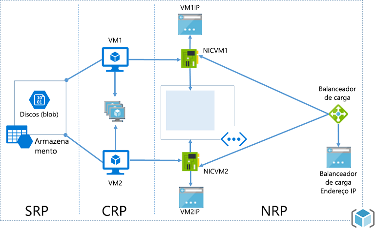
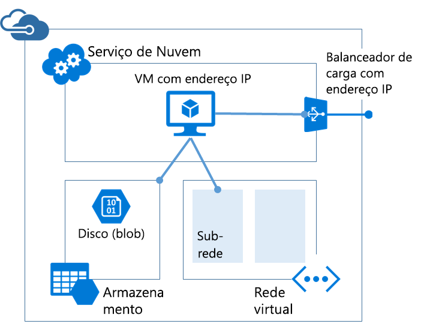

# <a name="azure-resource-manager-vs-classic-deployment-understand-deployment-models-and-the-state-of-your-resources"></a>Azure Resource Manager vs. Implantação clássica: compreenda os modelos de implantação e o estado dos seus recursos
Neste tópico, você aprende sobre o Azure Resource Manager e os modelos de implantação clássicos, o estado dos seus recursos e porque eles foram implantados com um modelo ou outro. O Gerenciador de Recursos e os modelos de implantação clássicos representam duas maneiras de implantar e gerenciar soluções do Azure. Você trabalha com eles através de dois conjuntos diferentes de API e os recursos implantados podem conter diferenças importantes. Os dois modelos não são totalmente compatíveis entre si. Este tópico descreve essas diferenças.

Para simplificar a implantação e o gerenciamento de recursos, a Microsoft recomenda o uso do Gerenciador de Recursos para todos os novos recursos. Se possível, a Microsoft recomenda que você reimplante os recursos existentes por meio do Gerenciador de Recursos.

Se você for um usuário novo do Resource Manager, convém primeiro examinar a terminologia definida no [Visão geral do Azure Resource Manager](resource-group-overview.md).

## <a name="history-of-the-deployment-models"></a>História dos modelos de implantação
Originalmente, o Azure fornecia o modelo de implantação clássico. Nesse modelo, cada recurso existia independentemente; não havia uma maneira de agrupar recursos relacionados. Em vez disso, era necessário controlar manualmente quais recursos compunham sua solução ou aplicativo, e lembrar-se de gerenciá-los em uma abordagem coordenada. Para implantar uma solução, você precisava criar cada recurso individualmente por meio do portal clássico ou criar um script que implantava todos os recursos na ordem correta. Para excluir uma solução, você precisava excluir cada recurso individualmente. Não era possível aplicar e atualizar facilmente políticas de controle de acesso para recursos relacionados. Por fim, você não podia aplicar marcas aos recursos para rotulá-los com os termos que ajudariam a monitorar seus recursos e gerenciar a cobrança.

Em 2014, o Azure introduziu o Resource Manager, que adicionou o conceito de um grupo de recursos. Um grupo de recursos é um contêiner de recursos que compartilham um ciclo de vida comum. O modelo de implantação do Gerenciador de Recursos fornece vários benefícios:

* Você pode implantar, gerenciar e monitorar todos os serviços da sua solução como um grupo, em vez de tratá-los individualmente.
* Você pode implantar a solução repetidamente em todo seu ciclo de vida e com a confiança de que seus recursos serão implantados em um estado consistente.
* Você pode aplicar o controle de acesso a todos os recursos em seu grupo de recursos, e essas políticas são aplicadas automaticamente aos novos recursos adicionados ao grupo de recursos.
* Você pode aplicar marcas aos recursos para organizar de modo lógico todos os recursos em sua assinatura.
* Você pode usar a notação JSON (JavaScript Object Notation) para definir a infraestrutura de sua solução. O arquivo JSON é conhecido como um modelo do Resource Manager.
* Você pode definir as dependências entre os recursos para que eles sejam implantados na ordem correta.

Quando o Gerenciador de Recursos foi adicionado, todos os recursos foram adicionados retroativamente aos grupos de recursos padrão. Se você criar um recurso por meio da implantação clássica agora, ele será criado automaticamente em um grupo de recursos padrão para esse serviço, mesmo que você não tenha especificado esse grupo de recursos na implantação. No entanto, existir apenas em um grupo de recursos não significa que o recurso tenha sido convertido no modelo do Gerenciador de Recursos. Vamos examinar como cada serviço lida com os modelos de implantação na próxima seção. 

## <a name="understand-support-for-the-models"></a>Noções básicas do suporte aos modelos
Ao decidir-se sobre qual modelo de implantação usar para seus recursos, há três cenários que você deve considerar:

1. O serviço oferece suporte ao Resource Manager e fornece um único tipo.
2. O serviço oferece suporte ao Resource Manager, mas fornece dois tipos - um para o Resource Manager e outro para o clássico. Esse cenário aplica-se somente a máquinas virtuais, contas de armazenamento e redes virtuais.
3. O serviço não oferece suporte ao Resource Manager.

Para descobrir se um serviço dá ou não suporte ao Resource Manager, consulte [Provedores e tipos de recursos](resource-manager-supported-services.md).

Se o serviço que você quer usar não der suporte ao Resource Manager, continue usando a implantação clássica.

Se o serviço oferecer suporte ao Resource Manager e **não** for uma máquina virtual, conta de armazenamento ou rede virtual, você poderá usar o Resource Manager sem qualquer complicação.

Para máquinas virtuais, contas de armazenamento e redes virtuais, se o recurso tiver sido criado por meio da implantação clássica, você deverá continuar operando nele no modo clássico. Se a máquina virtual, conta de armazenamento ou rede virtual tiver sido criada por meio da implantação do Resource Manager, você deve continuar usando operações do Resource Manager. Essa distinção pode ficar confusa quando sua assinatura contiver uma mistura de recursos criada por meio do Resource Manager e da implantação clássica. Essa combinação de recursos pode gerar resultados inesperados, pois os recursos não oferecem suporte às mesmas operações.

Em alguns casos, um comando do Gerenciador de Recursos pode recuperar informações sobre um recurso criado por meio da implantação clássica ou pode executar uma tarefa administrativa como mover um recurso clássico para outro grupo de recursos. Porém, esses casos não devem dar a impressão de que o tipo oferece suporte a operações do Gerenciador de Recursos. Por exemplo, suponhamos que você tenha um grupo de recursos que contenha uma máquina virtual que foi criada com implantação clássica. Se você executar o seguinte comando do PowerShell no Resource Manager:

```powershell
Get-AzureRmResource -ResourceGroupName ExampleGroup -ResourceType Microsoft.ClassicCompute/virtualMachines
```

Retorna a máquina virtual:

```powershell
Name              : ExampleClassicVM
ResourceId        : /subscriptions/{guid}/resourceGroups/ExampleGroup/providers/Microsoft.ClassicCompute/virtualMachines/ExampleClassicVM
ResourceName      : ExampleClassicVM
ResourceType      : Microsoft.ClassicCompute/virtualMachines
ResourceGroupName : ExampleGroup
Location          : westus
SubscriptionId    : {guid}
```

No entanto, o cmdlet do Resource Manager **Get-AzureRmVM** retorna apenas as máquinas virtuais implantadas por meio do Gerenciador de Recursos. O comando a seguir não retorna a máquina virtual criada por meio da implantação clássica.

```powershell
Get-AzureRmVM -ResourceGroupName ExampleGroup
```

Somente os recursos criados por meio do Gerenciador de Recursos oferecem suporte a marcas. Não é possível aplicar marcas a recursos clássicos.

## <a name="resource-manager-characteristics"></a>Características do Gerenciador de Recursos
Para ajudá-lo a entender os dois modelos, vamos analisar as características dos tipos de Resource Manager:

* Criado por meio do [Portal do Azure](https://portal.azure.com/).
  
     
  
     Para os recursos Computação, Armazenamento e Rede, você tem a opção de usar a implantação Gerenciador de Recursos ou Clássica. Selecione **Gerenciador de Recursos**.
  
     
* Criado com a versão para Resource Manager dos cmdlets do Azure PowerShell. Esses comandos têm o formato *Verb-AzureRmNoun*.

  ```powershell
  New-AzureRmResourceGroupDeployment
  ```

* Criado por meio da [API REST do Azure Resource Manager](https://docs.microsoft.com/rest/api/resources/) para operações REST.
* Criado por meio de comandos da CLI do Azure executados no modo **arm** .
  
  ```azurecli
  azure config mode arm
  azure group deployment create
  ```

* O tipo de recurso não inclui **(classic)** no nome. A imagem a seguir mostra o tipo como **Conta de armazenamento**.
  
    

## <a name="classic-deployment-characteristics"></a>Características da implantação clássica
Você também pode conhecer o modelo de implantação clássica como o modelo do Gerenciamento de Serviços.

Os recursos criados no modelo de implantação clássica compartilham as seguintes características:

* Criado por meio do [Portal Clássico](https://manage.windowsazure.com)
  
     
  
     Ou pelo portal do Azure, e depois você deve especificar a implantação **Clássica** (para Computação, Armazenamento e Rede).
  
     
* Criado por meio da versão de Gerenciamento de Serviço dos cmdlets do Azure PowerShell. Esses nomes de comandos têm o formato *Verb-AzureNoun*.

  ```powershell
  New-AzureVM
  ```

* Criado por meio da [API REST do Gerenciamento de Serviços](https://msdn.microsoft.com/library/azure/ee460799.aspx) para operações REST.
* Criado por meio de comandos da CLI do Azure executados no modo **asm** .

  ```azurecli
  azure config mode asm
  azure vm create
  ```
   
* O tipo de recurso inclui **(classic)** no nome. A imagem a seguir mostra o tipo como **Conta de armazenamento (clássica)**.
  
    

Você pode usar o Portal do Azure para gerenciar recursos que foram criados por meio da implantação clássica.

## <a name="changes-for-compute-network-and-storage"></a>Alterações de computação, rede e armazenamento
O diagrama a seguir exibe os recursos de computação, rede e armazenamento implantados por meio do Gerenciador de Recursos.



Observe as seguintes relações entre os recursos:

* Todos os recursos existem dentro de um grupo de recursos.
* A máquina virtual depende de uma conta de armazenamento específica definida no provedor de recursos de Armazenamento para armazenar seus discos no armazenamento de blobs (obrigatório).
* A máquina virtual faz referência a uma NIC específica definida no provedor de recursos de Rede (obrigatório) e um conjunto de disponibilidade definido no provedor de recursos de Computação (opcional).
* A NIC faz referência ao endereço IP atribuído à máquina virtual (obrigatório), à sub-rede da rede virtual para a máquina virtual (obrigatório) e a um Grupo de Segurança de Rede (opcional).
* A sub-rede em uma rede virtual faz referência a um Grupo de Segurança de Rede (opcional).
* A instância do balanceador de carga faz referência ao pool de back-end dos endereços IP que incluem a NIC de uma máquina virtual (opcional) e faz referência a um endereço IP público ou privado de um balanceador de carga (opcional).

Aqui estão os componentes e suas relações para a implantação clássica:



A solução clássica para hospedar uma máquina virtual inclui:

* Um serviço de nuvem necessário que atua como contêiner para hospedar máquinas virtuais (computação). Máquinas virtuais são fornecidas automaticamente com uma placa de interface de rede (NIC) e um endereço IP atribuído pelo Azure. Além disso, o serviço de nuvem contém uma instância do balanceador externo de carga, um endereço IP público e pontos de extremidade padrão para permitir o tráfego do PowerShell remoto e de área de trabalho remota para máquinas virtuais baseadas em Windows e tráfego Secure Shell (SSH) para máquinas virtuais baseadas em Linux.
* Uma conta de armazenamento necessária que armazena os VHDs em uma máquina virtual, incluindo sistema operacional e discos de dados temporários e adicionais (armazenamento).
* Uma rede virtual opcional que atua como um contêiner adicional no qual você pode criar uma estrutura de sub-redes e designar a sub-rede na qual a máquina virtual está localizada (rede).

A tabela a seguir descreve as alterações na forma como interagem os provedores de recursos de Computação, Rede e Armazenamento:

| Item | Clássico | Gerenciador de Recursos |
| --- | --- | --- |
| Serviço de Nuvem para Máquinas Virtuais |O Serviço de Nuvem era um contêiner para manter as máquinas virtuais que precisavam de Disponibilidade da plataforma e Balanceamento de Carga. |O Serviço de Nuvem não é mais um objeto necessário para criar uma Máquina Virtual usando o novo modelo. |
| Redes Virtuais |Uma rede virtual é opcional para a máquina virtual. Se for incluída, a rede virtual não pode ser implantada com o Gerenciador de Recursos. |A máquina virtual requer uma rede virtual que foi implantada com o Gerenciador de Recursos. |
| Contas de armazenamento |A máquina virtual necessita de uma conta de armazenamento que armazena os VHDs do sistema operacional e discos de dados temporários e adicionais. |A máquina virtual requer uma conta de armazenamento para armazenar seus discos no armazenamento de blobs. |
| Conjuntos de Disponibilidade |A disponibilidade para a plataforma era indicada por meio da configuração do mesmo "AvailabilitySetName" nas Máquinas Virtuais. A contagem máxima de domínios de falha era 2. |O Conjunto de Disponibilidade é um recurso exposto pelo Provedor Microsoft.Compute. Máquinas Virtuais que exigem alta disponibilidade devem ser incluídas no Conjunto de Disponibilidade. A contagem máxima de domínios de falha agora é 3. |
| Grupos de afinidade |Grupos de Afinidade eram necessários para criar Redes Virtuais. No entanto, com a introdução de Redes Virtuais Regionais, isso não é mais necessário. |Para simplificar, o conceito de Grupos de Afinidade não existe nas APIs expostas por meio do Gerenciador de Recursos do Azure. |
| Balanceamento de Carga |A criação de um Serviço de Nuvem fornece um balanceador de carga implícito para as Máquinas Virtuais implantadas. |O Balanceador de Carga é um recurso exposto pelo provedor Microsoft.Network. A interface de rede principal das Máquinas Virtuais que precisam ter o balanceamento de carga deve fazer referência ao balanceador de carga. Os Balanceadores de Carga podem ser internos ou externos. Uma instância do balanceador de carga faz referência ao pool de back-end dos endereços IP que incluem a NIC de uma máquina virtual (opcional) e faz referência a um endereço IP público ou privado de um balanceador de carga (opcional). [Leia mais.](../virtual-network/resource-groups-networking.md) |
| Endereço IP Virtual |Os Serviços de Nuvem obtém um VIP (Endereço IP Virtual) padrão quando uma VM for adicionada a um serviço de nuvem. O Endereço IP Virtual é o endereço associado ao balanceador de carga implícito. |O Endereço IP público é um recurso exposto pelo provedor Microsoft.Network. O Endereço IP público pode ser Estático (Reservado) ou Dinâmico. IPs Públicos Dinâmicos podem ser atribuídos a um Balanceador de Carga. IPs Públicos podem ser protegidos usando Grupos de Segurança. |
| Endereço IP Reservado |Você pode reservar um endereço IP no Azure e associá-lo a um Serviço de Nuvem para garantir que o Endereço IP seja temporário. |O Endereço IP Público pode ser criado no modo "Estático" e oferece a mesma funcionalidade de um "Endereço IP Reservado". IPs Públicos Estáticos só podem ser atribuídos a um Balanceador de carga no momento. |
| Endereço IP Público (PIP) por VM |Endereços IP Públicos também podem ser associados diretamente a uma VM. |O Endereço IP público é um recurso exposto pelo provedor Microsoft.Network. O Endereço IP público pode ser Estático (Reservado) ou Dinâmico. No entanto, apenas IPs Públicos dinâmicos podem ser atribuídos a uma Interface de Rede para obter um IP Público por VM no momento. |
| Pontos de extremidade |Pontos de Extremidade de Entrada precisam ser configurados em uma Máquina Virtual para que seja aberta a conectividade para determinadas portas. Um dos modos comuns de se conectar a máquinas virtuais, realizado com a configuração de pontos de extremidade de entrada. |Regras NAT de Entrada podem ser configuradas em Balanceadores de Carga para obter a mesma capacidade de habilitar pontos de extremidade em portas específicas para conectar-se às VMs. |
| Nome DNS |Um serviço de nuvem teria um Nome DNS exclusivo implícito. Por exemplo: `mycoffeeshop.cloudapp.net`. |Os nomes DNS são parâmetros opcionais que podem ser especificados em um recurso de Endereço IP Público. O FQDN está no seguinte formato – `<domainlabel>.<region>.cloudapp.azure.com`. |
| Interfaces de Rede |A Interface de Rede Primária e Secundária e suas propriedades foram definidas como a configuração de rede de uma Máquina virtual. |A Interface de Rede é um recurso exposto pelo Provedor Microsoft.Network. O ciclo de vida da Interface de Rede não está vinculado a uma Máquina Virtual. Faz referência ao endereço IP atribuído à máquina virtual (obrigatório), à sub-rede da rede virtual para a máquina virtual (obrigatório) e a um Grupo de Segurança de Rede (opcional). |

Para obter informações sobre como conectar redes virtuais de diferentes modelos de implantação, consulte [Conectar redes virtuais de diferentes modelos de implantação no portal](../vpn-gateway/vpn-gateway-connect-different-deployment-models-portal.md).

## <a name="migrate-from-classic-to-resource-manager"></a>Migrar do clássico para o Gerenciador de Recursos
Se você estiver pronto para migrar seus recursos da implantação clássica para a implantação do Resource Manager, consulte:

1. [Análise técnica aprofundada sobre a migração com suporte da plataforma do clássico para o Azure Resource Manager](../virtual-machines/windows/migration-classic-resource-manager-deep-dive.md)
2. [Platform supported migration of IaaS resources from Classic to Azure Resource Manager (Migração de recursos de IaaS com suporte da plataforma do Clássico para o Azure Resource Manager)](../virtual-machines/windows/migration-classic-resource-manager-overview.md)
3. [Migrar recursos de IaaS do Clássico para o Azure Resource Manager usando o Azure PowerShell](../virtual-machines/windows/migration-classic-resource-manager-ps.md)
4. [Migrar recursos de IaaS do modelo clássico para o Azure Resource Manager usando a CLI do Azure](../virtual-machines/virtual-machines-linux-cli-migration-classic-resource-manager.md)

## <a name="frequently-asked-questions"></a>Perguntas frequentes
**Posso criar uma máquina virtual usando o Azure Resource Manager para implantar em uma rede virtual que foi criada usando a implantação clássica?**

Não há suporte para isso. Não é possível usar o Azure Resource Manager para implantar uma máquina virtual em uma rede virtual que foi criada usando a implantação clássica.

**Posso criar uma máquina virtual usando o Azure Resource Manager por meio de uma imagem do usuário criada usando as APIs de Gerenciamento de Serviços do Azure?**

Não há suporte para isso. No entanto, você pode copiar os arquivos VHD de uma conta de armazenamento criada usando as APIs de Gerenciamento de Serviços e adicioná-los a uma nova conta criada por meio do Azure Resource Manager.

**Qual é o impacto sobre a cota da minha assinatura?**

As cotas para as máquinas virtuais, redes virtuais e contas de armazenamento criadas por meio do Azure Resource Manager são separadas das outras cotas. Cada assinatura obtém cotas para criar os recursos usando as novas APIs. Você pode ler mais sobre as cotas adicionais [aqui](../azure-subscription-service-limits.md).

**Posso continuar a usar meus scripts automatizados para o provisionamento de máquinas virtuais, redes virtuais e contas de armazenamento por meio das APIs do Gerenciador de Recursos?**

Todos os scripts e a automação que você criou continuam a funcionar nas máquinas virtuais e redes virtuais existentes criadas no modo de Gerenciamento de serviço do Azure. No entanto, os scripts devem ser atualizados para usar o novo esquema para criar os mesmos recursos por meio do modo do Gerenciador de Recursos.

**Onde posso encontrar exemplos de modelos do Gerenciador de Recursos do Azure?**

Um conjunto abrangente de modelos iniciais pode ser encontrado em [Modelos de início rápido do Azure Resource Manager](https://azure.microsoft.com/documentation/templates/).

## <a name="next-steps"></a>Próximas etapas
* Para ver um passo a passo da criação do modelo que define uma máquina virtual, uma conta de armazenamento e uma rede virtual, confira [Passo a passo do modelo do Resource Manager](resource-manager-template-walkthrough.md).
* Para ver os comandos para implantar um modelo, veja [Implantar um aplicativo com o modelo do Gerenciador de Recursos do Azure](resource-group-template-deploy.md).

