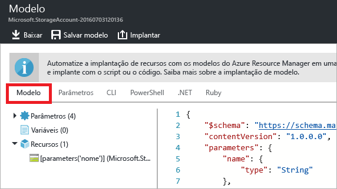
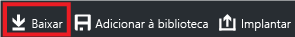
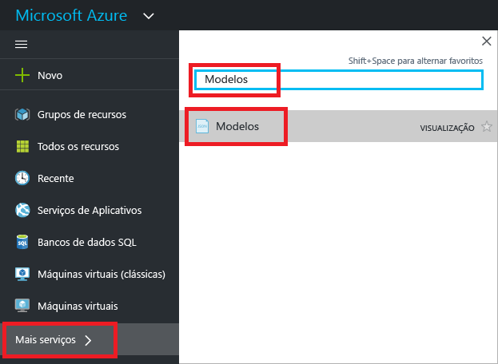
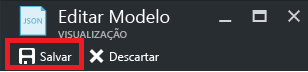

# <a name="export-an-azure-resource-manager-template-from-existing-resources"></a>Exportar um modelo do Azure Resource Manager a partir dos recursos existentes
Neste artigo, você aprenderá a exportar um modelo do Resource Manager de recursos existentes em sua assinatura. Você pode usar esse modelo gerado para compreender melhor a sintaxe do modelo.

Há duas maneiras de exportar um modelo:

* Você pode exportar o **modelo atual usado para a implantação**. O modelo exportado inclui todas as variáveis e parâmetros exatamente como apareceram no modelo original. Essa abordagem é útil quando você implantou recursos por meio do portal e quer ver o modelo para criar tais recursos. Este modelo é facilmente utilizável. 
* Você pode exportar um **modelo gerado que representa o estado atual do grupo de recursos**. O modelo exportado não é baseado em nenhum modelo que você usou para a implantação. Ao contrário, ele cria um modelo que é um instantâneo do grupo de recursos. O modelo exportado tem muitos valores embutidos e provavelmente menos parâmetros do que você normalmente definiria. Essa abordagem é útil quando você modificou o grupo de recursos depois da implantação. Este modelo geralmente requer modificações antes de ser usado.

Este tópico mostra ambas as abordagens por meio do portal.

## <a name="deploy-resources"></a>Implantação de recursos
Vamos começar a implantação de recursos para o Azure que podem ser usados para exportar como um modelo. Se já tiver um grupo de recursos que deseja exportar como um modelo na sua assinatura, você pode ignorar esta seção. O restante deste artigo pressupõe que você implantou o aplicativo web e a solução de banco de dados SQL mostrados nesta seção. Se você usar uma solução diferente, a sua experiência pode ser um pouco diferente, mas as etapas para exportar um modelo são as mesmas. 

1. No [portal do Azure](https://portal.azure.com), selecione **Novo**.
   
      
2. Pesquise **aplicativo Web + SQL** e selecione a partir das opções disponíveis.
   
      

3. Selecione **Criar**.

      

4. Forneça os valores necessários para o aplicativo Web e o banco de dados SQL. Selecione **Criar**.

      

A implantação pode demorar um pouco. Quando a implantação terminar, a sua assinatura conterá a solução.

## <a name="view-template-from-deployment-history"></a>Visualização de modelo do histórico de implantações
1. Vá para a folha do grupo de recursos do novo grupo de recursos. Observe que a folha mostra o resultado da última implantação. Selecione este link.
   
      
2. Você vê um histórico das implantações do grupo. No seu caso, a folha provavelmente lista apenas uma implantação. Selecione essa implantação.
   
     
3. A folha exibe um resumo da implantação. O resumo inclui o status da implantação, suas operações e os valores que você forneceu para os parâmetros. Para ver o modelo usado para a implantação, selecione **Exibir modelo**.
   
     
4. O Resource Manager recupera os seguintes sete arquivos para você:
   
   1. **Modelo** - O modelo que define a infraestrutura de sua solução. Quando você criou a conta de armazenamento por meio do portal, o Gerenciador de Recursos usou um modelo para implantá-la e salvou esse modelo para uma futura referência.
   2. **Parâmetros** - Um arquivo de parâmetro que você pode usar para passar valores durante a implantação. Ele contém os valores que você forneceu durante a primeira implantação. Você pode alterar qualquer um desses valores ao reimplantar o modelo.
   3. **CLI** - Um arquivo de script CLI (interface da linha comando) do Azure que você pode usar para implantar o modelo.
   3. **CLI 2.0** - Um arquivo de script CLI (interface da linha comando) do Azure que você pode usar para implantar o modelo.
   4. **PowerShell** - Um arquivo de script do Azure PowerShell que você pode usar para implantar o modelo.
   5. **.NET** - Uma classe .NET que você pode usar para implantar o modelo.
   6. **Ruby** - uma classe Ruby que você pode usar para implantar o modelo.
      
      Os arquivos estão disponíveis por meio de links na folha. Por padrão, a folha exibe o modelo.
      
       
      
Este modelo é o modelo atual usado para criar seu aplicativo Web e o banco de dados SQL. Observe que ele contém parâmetros que permitem que você forneça valores diferentes durante a implantação. Para saber mais sobre a estrutura de um modelo, confira [Criando modelos do Azure Resource Manager](resource-group-authoring-templates.md).

## <a name="export-the-template-from-resource-group"></a>Exportar o modelo do grupo de recursos
Se você alterou ou adicionou recursos manualmente em diversas implantações, a recuperação de um modelo do histórico de implantações não reflete o estado atual do grupo de recursos. Esta seção mostra como exportar um modelo que reflete o estado atual do grupo de recursos. 

> [!NOTE]
> Você não pode exportar um modelo para um grupo de recursos que tenha mais de 200 recursos.
> 
> 

1. Para exibir o modelo de um grupo de recursos, selecione **Script de automação**.
   
      
   
     O Resource Manager avalia os recursos no grupo de recursos e gera um modelo para esses recursos. Nem todos os tipos de recursos suportam a função para exportar o modelo. Talvez apareça um erro indicando que há um erro com a exportação. Você aprende a lidar com esses problemas na seção [Corrigir os problemas da exportação](#fix-export-issues) .
2. Os seis arquivos que você pode usar para reimplantar a solução ficarão visíveis novamente. No entanto, neste momento, o modelo é um pouco diferente. Observe que o modelo gerado contém menos parâmetros que o modelo da seção anterior. Além disso, neste modelo, muitos dos valores (como o local e valores SKU) são embutidos em código em vez de aceitar um valor de parâmetro. Antes de reutilizar esse modelo, talvez seja interessante editar o modelo para fazer melhor uso dos parâmetros. 
   
3. Você tem algumas opções para continuar a trabalhar com esse modelo. Você pode baixar o modelo e trabalhar nele localmente com um editor de JSON. Ou pode salvar o modelo em sua biblioteca e trabalhar com ele por meio do portal.
   
     Se você estiver familiarizado com o uso de um editor de JSON como o [VS Code](https://code.visualstudio.com/) ou o [Visual Studio](vs-azure-tools-resource-groups-deployment-projects-create-deploy.md), talvez você prefira baixar o modelo localmente e usar o editor. Para trabalhar localmente, selecione **Baixar**.
   
      
   
     Se você não estiver confortável com um editor de JSON, talvez prefira a edição do modelo por meio do portal. O restante deste tópico pressupõe que você tenha salvo o modelo para sua biblioteca no portal. No entanto, você fará as mesmas alterações de sintaxe para o modelo se trabalhar localmente com um editor de JSON ou por meio do portal. Para trabalhar no portal, selecione **Adicionar à biblioteca**.
   
      
   
     Ao adicionar um modelo à biblioteca, atribua um nome e uma descrição ao modelo. Em seguida, selecione **Salvar**.
   
     
4. Para exibir um modelo salvo na biblioteca, selecione **Mais serviços**, digite **Modelos** para filtrar os resultados, selecione **Modelos**.
   
      
5. Selecione o modelo com o nome que você salvou.
   
      

## <a name="customize-the-template"></a>Personalizar o modelo
O modelo exportado funciona bem se você deseja criar o mesmo aplicativo Web e banco de dados SQL para cada implantação. No entanto, o Resource Manager fornece opções para que você possa implantar modelos com muito mais flexibilidade. Este artigo mostra como adicionar parâmetros para o nome e a senha do administrador de banco de dados. Você pode usar essa mesma abordagem para adicionar mais flexibilidade a outros valores no modelo.

1. Para personalizar o modelo, selecione **Editar**.
   
     
2. Selecione o modelo.
   
     
3. Para passar os valores que você talvez queira especificar durante a implantação, adicione os dois parâmetros a seguir na seção **parâmetros** no modelo:

   ```json
   "administratorLogin": {
       "type": "String"
   },
   "administratorLoginPassword": {
       "type": "SecureString"
   },
   ```

4. Para usar os parâmetros novos, substitua a definição do SQL Server na seção **recursos**. Observe que o **administratorLogin** e o **administratorLoginPassword** passaram a usar os valores de parâmetros.

   ```json
   {
       "comments": "Generalized from resource: '/subscriptions/{subscription-id}/resourceGroups/exportsite/providers/Microsoft.Sql/servers/tfserverexport'.",
       "type": "Microsoft.Sql/servers",
       "kind": "v12.0",
       "name": "[parameters('servers_tfserverexport_name')]",
       "apiVersion": "2014-04-01-preview",
       "location": "South Central US",
       "scale": null,
       "properties": {
           "administratorLogin": "[parameters('administratorLogin')]",
           "administratorLoginPassword": "[parameters('administratorLoginPassword')]",
           "version": "12.0"
       },
       "dependsOn": []
   },
   ```

6. Selecione **OK** quando terminar a edição do modelo.
7. Selecione **Salvar** para salvar as alterações no modelo.
   
     
8. Para reimplantar o modelo atualizado, selecione **Implantar**.
   
     
9. Forneça os valores de parâmetros e selecione um novo grupo de recursos para o qual os recursos serão implantados.


## <a name="fix-export-issues"></a>Corrigir os problemas da exportação
Nem todos os tipos de recursos suportam a função para exportar o modelo. Para resolver isso, adicione manualmente os recursos ausentes de volta ao seu modelo. A mensagem de erro inclui os tipos de recursos que não podem ser exportados. Encontre o tipo de recurso em [referência de modelo](/azure/templates/). Por exemplo, para adicionar um gateway de rede virtual manualmente, confira [referência de modelo Microsoft.Network/virtualNetworkGateways ](/azure/templates/microsoft.network/virtualnetworkgateways).

> [!NOTE]
> Você só encontra problemas de exportação quando exporta de um grupo de recursos em vez de seu histórico de implantações. Se sua última implantação apresentar com precisão o estado atual do grupo de recursos, você deverá exportar o modelo do histórico de implantações, em vez do grupo de recursos. Exporte somente a partir de um grupo de recursos quando você fez alterações no grupo de recursos que não são definidas em um único modelo.
> 
> 

## <a name="next-steps"></a>Próximas etapas
Você aprendeu a exportar um modelo a partir dos recursos criados no portal.

* Você pode implantar um modelo por meio do [PowerShell](resource-group-template-deploy.md), da [CLI do Azure](resource-group-template-deploy-cli.md) ou da [API REST](resource-group-template-deploy-rest.md).
* Para ver como exportar um modelo por meio do PowerShell, consulte [Usando o Azure PowerShell com o Azure Resource Manager](powershell-azure-resource-manager.md).
* Para ver como exportar um modelo por meio da CLI do Azure, consulte [Usar a CLI do Azure para Mac, Linux e Windows com o Azure Resource Manager](xplat-cli-azure-resource-manager.md).

