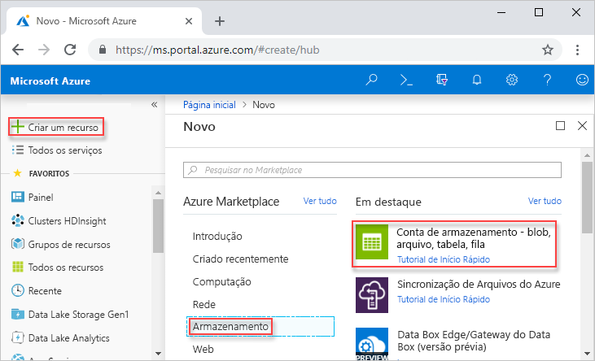
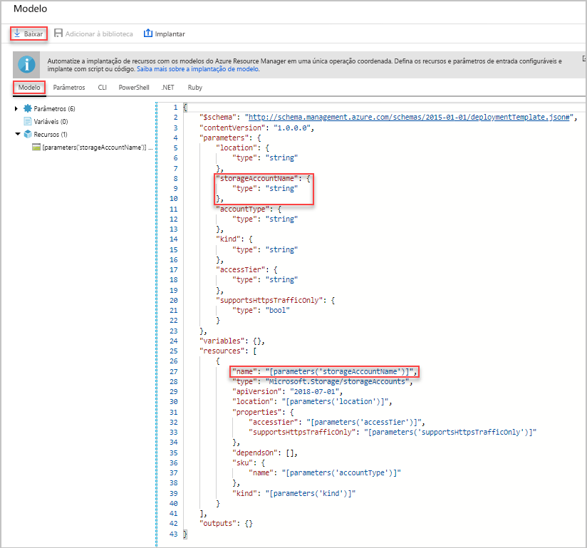
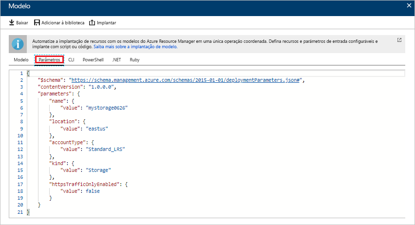
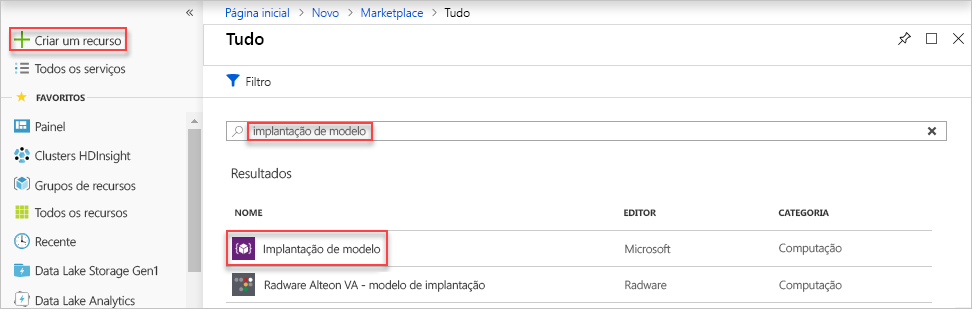
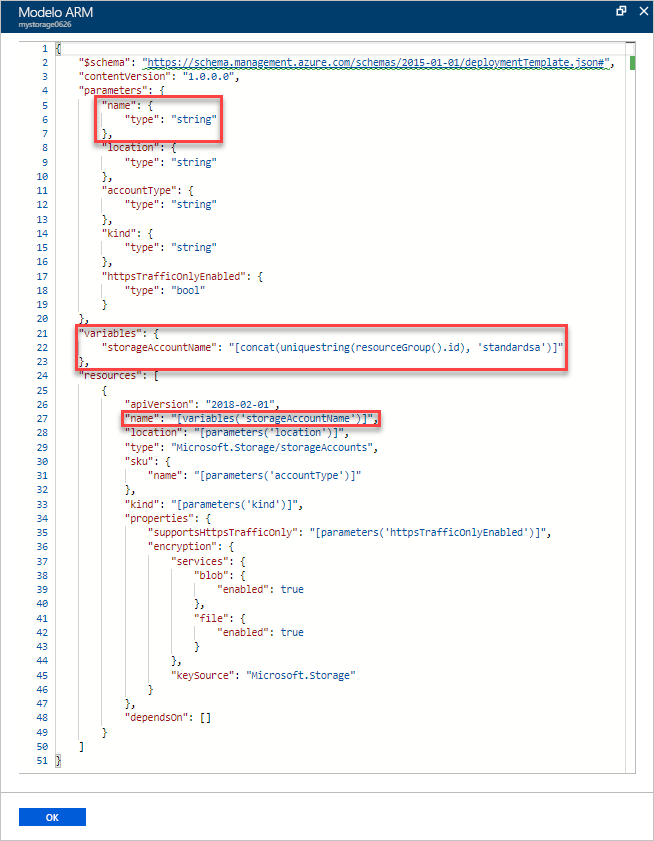
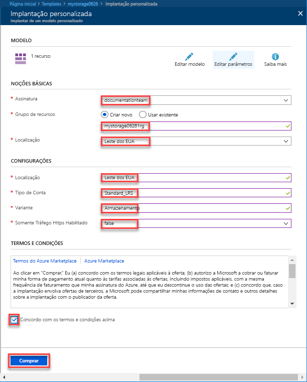
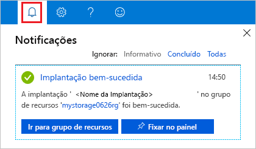
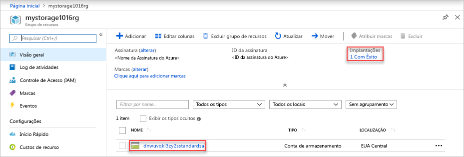

# <a name="quickstart-create-and-deploy-azure-resource-manager-templates-by-using-the-azure-portal"></a>Início Rápido: Criar e implantar modelos do Azure Resource Manager usando o portal do Azure

Saiba como criar seu primeiro modelo do Azure Resource Manager gerando um no portal do Azure e o processo de edição e implantação do modelo a partir do portal do Azure. Os modelos do Resource Manager são arquivos JSON que definem os recursos necessários para implantar sua solução. As instruções neste tutorial criam uma conta do Armazenamento do Azure. Você pode usar o mesmo processo para criar outros recursos do Azure.

Se você não tiver uma assinatura do Azure, [crie uma conta gratuita](https://azure.microsoft.com/free/) antes de começar.

## <a name="generate-a-template-using-the-portal"></a>Gerar um modelo usando o portal do Azure

Nesta seção, você deve criar uma conta de armazenamento usando o portal do Azure. Antes de implantar a conta de armazenamento, você tem a opção de explorar o modelo gerado pelo portal com base em suas configurações. Você pode salvar o modelo e reutilizá-lo no futuro.

1. Entre no [Portal do Azure](https://portal.azure.com).
2. Selecione **Criar um recurso** > **Armazenamento** > **Conta de armazenamento – blob, arquivo, tabela, fila**.

    
3. Insira as seguintes informações. 

    - **Grupo de recursos**: crie um novo grupo de recursos do Azure com o nome de sua escolha. Na captura de tela, o nome do grupo de recursos é *mystorage1016rg*.
    - **Nome**: dê um nome exclusivo à conta de armazenamento. Na captura de tela, o nome é *mystorage1016*.

    Você pode usar valores padrão para as outras propriedades.

    

    > [!NOTE]
    > Alguns dos modelos exportados exigem algumas edições antes da implantação.

4. Selecione **Revisar + criar** na parte inferior da tela. 
5. Selecione **Baixar um modelo para automação** na parte inferior da tela. O portal mostra o modelo gerado:

    

    O painel principal mostra o modelo. É um arquivo JSON com quatro elementos de nível superior - `schema`, `contentVersion`, `parameters` e `resources`. Para obter mais informações, consulte [Noções básicas de estrutura e sintaxe dos modelos do Azure Resource Manager](./resource-group-authoring-templates.md)

    Existem seis parâmetros definidos. Um deles é chamado **storageAccountName**. A segunda parte realçada mostra como usar esse parâmetro no modelo. Na próxima seção, você deve editar o modelo para usar um nome gerado para a conta de armazenamento.

    No modelo, um recurso do Azure é definido. O tipo é [Microsoft.Storage/storageAccounts]. Veja como o recurso é definido e a estrutura da definição.
6. Selecione **Baixar**. Salve **template.json** do pacote baixado em seu computador. Na próxima seção, você pode usar uma ferramenta de implantação de modelo para editar o modelo.
7. Selecione a guia **Parâmetro** para ver os valores fornecidos para os parâmetros. Anote esses valores, você precisará deles na próxima seção quando implantar o modelo.

    

    Usando o modelo e os arquivos de parâmetros, você pode criar uma conta de armazenamento do Azure.

## <a name="edit-and-deploy-the-template"></a>Editar e implantar o modelo

O portal do Azure pode ser usado para executar uma edição básica do modelo. Neste início rápido, você usa uma ferramenta do portal chamada *Implantação de modelo*. Para editar um modelo mais complexo, considere o uso do [Visual Studio Code](./resource-manager-quickstart-create-templates-use-visual-studio-code.md), que fornece funcionalidades mais avançadas de edição.

O Azure exige que cada serviço do Azure tenha um nome exclusivo. A implantação falhará se você inserir um nome de conta de armazenamento que já existe. Para evitar esse problema, você pode usar uma função de modelo chamada `uniquestring()` para gerar um nome de conta de armazenamento exclusivo.

1. No Portal do Azure, selecione **Criar um recurso**.
2. Em **Pesquisar no Marketplace**, digite **implantação de modelo** e pressione **ENTER**.
3. Selecione **Implantação de modelo**.

    
4. Selecione **Criar**.
5. Selecione **Criar seu próprio modelo no editor**.
6. Selecione **Carregar arquivo** e, em seguida, siga as instruções para carregar o template.json que você baixou na última seção.
7. Adicione uma variável como mostrado nesta captura de tela:

    ```json
    "storageAccountName": "[concat(uniquestring(resourceGroup().id), 'standardsa')]"
    ```
    

    Duas funções são usadas aqui: `concat()` e `uniqueString()`.

8. Remova o parâmetro **storageAccountName** realçado na captura de tela anterior.
9. Atualize o elemento de nome do recurso **Storage/storageaccounts** para usar a variável definida recentemente em vez do parâmetro:

    ```json
    "name": "[variables('storageAccountName')]",
    ```

    O modelo final deverá ficar assim:

    ```json
    {
        "$schema": "http://schema.management.azure.com/schemas/2015-01-01/deploymentTemplate.json#",
        "contentVersion": "1.0.0.0",
        "parameters": {
            "location": {
                "type": "string"
            },
            "accountType": {
                "type": "string"
            },
            "kind": {
                "type": "string"
            },
            "accessTier": {
                "type": "string"
            },
            "supportsHttpsTrafficOnly": {
                "type": "bool"
            }
        },
        "variables": {
            "storageAccountName": "[concat(uniquestring(resourceGroup().id), 'standardsa')]"
        },
        "resources": [
            {
                "name": "[variables('storageAccountName')]",
                "type": "Microsoft.Storage/storageAccounts",
                "apiVersion": "2018-07-01",
                "location": "[parameters('location')]",
                "properties": {
                    "accessTier": "[parameters('accessTier')]",
                    "supportsHttpsTrafficOnly": "[parameters('supportsHttpsTrafficOnly')]"
                },
                "dependsOn": [],
                "sku": {
                    "name": "[parameters('accountType')]"
                },
                "kind": "[parameters('kind')]"
            }
        ],
        "outputs": {}
    }
    ```
7. Clique em **Salvar**.
8. Insira os valores a seguir:

    - **Grupo de recursos**: dê um nome exclusivo ao grupo de recursos.
    - **Local**: selecione um local para o grupo de recursos.
    - **Local**: selecione um local para a conta de armazenamento.  Você pode usar o mesmo local do grupo de recursos.
    - **Tipo de conta**: insira **Standard_LRS** para este início rápido.
    - **Variante**: insira **StorageV2** para este início rápido.
    - **Camada de acesso**: insira **Camada de acesso frequente** para este início rápido.
    - **Somente Tráfego HTTPS habilitado**.  Selecione **true** para este início rápido.
    - **Concordo com os termos e as condições declarados acima**: (selecionar)

    Veja uma captura de tela de uma implantação de exemplo:

    

10. Selecione **Comprar**.
11. Selecione o ícone de sino (notificações) na parte superior da tela para ver o status da implantação. Aguarde até a conclusão da implantação.

    

12. Selecione **Ir para o grupo de recursos** no painel de notificação. Você verá uma tela semelhante a:

    

    Veja que a implantação foi bem-sucedida, e há apenas uma conta de armazenamento no grupo de recursos. O nome da conta de armazenamento é uma cadeia de caracteres exclusiva gerada pelo modelo. Para saber mais sobre como usar as contas de armazenamento do Azure, confira [Início Rápido: carregar, baixar e listar blobs usando o portal do Azure](../storage/blobs/storage-quickstart-blobs-portal.md).

## <a name="clean-up-resources"></a>Limpar recursos

Quando os recursos do Azure já não forem necessários, limpe os recursos implantados excluindo o grupo de recursos.

1. No portal do Azure, selecione **Grupos de recursos** no menu esquerdo.
2. No campo **Filtrar por nome**, insira o nome do grupo de recursos.
3. Selecione o nome do grupo de recursos.  Você deverá ver a conta de armazenamento no grupo de recursos.
4. Selecione **Excluir grupo de recursos** no menu superior.

## <a name="next-steps"></a>Próximas etapas

Neste tutorial, você aprendeu a gerar um modelo no portal do Azure e a implantar o modelo usando o portal. O modelo usado neste Início Rápido é um modelo simples com um recurso do Azure. Quando o modelo é complexo, é mais fácil usar o Visual Studio Code ou o Visual Studio para desenvolvê-lo. O próximo início rápido também mostra como implantar modelos usando o Azure PowerShell e a Interface da Linha de Comando (CLI) do Azure.

> [!div class="nextstepaction"]
> [Criar modelos usando o Visual Studio Code](./resource-manager-quickstart-create-templates-use-visual-studio-code.md)
