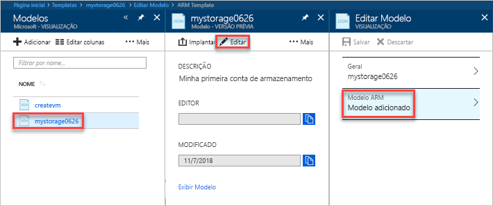

# <a name="quickstart-create-and-deploy-azure-resource-manager-templates-by-using-the-azure-portal"></a>Início Rápido: Criar e implantar modelos do Azure Resource Manager usando o portal do Azure

Saiba como criar seu primeiro modelo do Azure Resource Manager gerando um no portal do Azure e como editar e implantar o modelo no portal.

Os modelos do Resource Manager são arquivos JSON que definem os recursos necessários para implantar sua solução. Para criar um modelo, você não precisa sempre começar do zero. Neste tutorial, você aprenderá a gerar um modelo no portal do Azure. Em seguida, você pode personalizar o modelo e implantá-lo.

As instruções neste tutorial criam uma conta do Armazenamento do Azure. Você pode usar o mesmo processo para criar outros recursos do Azure.

Se você não tiver uma assinatura do Azure, [crie uma conta gratuita](https://azure.microsoft.com/free/) antes de começar.

## <a name="generate-a-template-using-the-portal"></a>Gerar um modelo usando o portal do Azure

Nesta seção, você deve criar uma conta de armazenamento usando o portal do Azure. Antes de implantar a conta de armazenamento, você tem a opção de explorar o modelo gerado pelo portal com base em suas configurações. Você pode salvar o modelo e reutilizá-lo no futuro.

1. Entre no [Portal do Azure](https://portal.azure.com).
2. Selecione **Criar um recurso** > **Armazenamento** > **Conta de armazenamento – blob, arquivo, tabela, fila**.

    
3. Insira as seguintes informações. Selecione as **Opções de automação** em vez de **Criar** na próxima etapa para poder ver o modelo antes da implantação.

    - **Nome**: dê um nome exclusivo à conta de armazenamento. Na captura de tela, o nome é *mystorage0626*.
    - **Grupo de recursos**: crie um novo grupo de recursos do Azure com o nome de sua escolha. Na captura de tela, o nome do grupo de recursos é *mystorage0626rg*.

    Você pode usar valores padrão para as outras propriedades.

    

    > [!NOTE]
    > Alguns dos modelos exportados exigem algumas edições antes da implantação.

4. Selecione **Opções de automação** na parte inferior da tela. O portal mostra o modelo na guia **Modelo**:

    

    O painel principal mostra o modelo. É um arquivo JSON com quatro elementos de nível superior. Para obter mais informações, consulte [Noções básicas de estrutura e sintaxe dos modelos do Azure Resource Manager](./resource-group-authoring-templates.md)

    No elemento **Parâmetro**, há cinco parâmetros definidos. Para ver os valores que você fornece durante a implantação, selecione a guia **Parâmetros**.

    

    Esses valores são o que você configurou na seção anterior. Usando o modelo e os arquivos de parâmetros, você pode criar uma conta de armazenamento do Azure.

5. Na parte superior das guias, há três itens de menu:

    - **Baixar**: baixe o modelo e o arquivo de parâmetros em seu computador local.
    - **Adicionar à biblioteca**: adicione o modelo à biblioteca para que seja reutilizado no futuro.
    - **Implantar**: implante a conta de armazenamento do Azure no Azure.

    Neste tutorial, você deve usar a opção **Adicionar à biblioteca**.

6. Selecione **Adicionar à biblioteca**.
7. Insira **Nome** e **Descrição**e selecione **Salvar**.

> [!NOTE]
> O recurso de biblioteca de modelos está em versão prévia. A maioria das pessoas opta por salvar seus modelos no computador local ou em um armazenamento público, como o Github.  

## <a name="edit-and-deploy-the-template"></a>Editar e implantar o modelo

Nesta seção, você vai abrir o modelo salvo da biblioteca de modelos, editar o modelo no portal e implantar o modelo revisado. Para editar um modelo mais complexo, considere o uso do Visual Studio Code, que fornece funcionalidades mais avançadas de edição.

1. No portal do Azure, selecione **Todos os serviços** no menu à esquerda, insira **Modelo** na caixa de filtro e selecione **Modelo (VERSÃO PRÉVIA)**.

    
2. Selecione o modelo que você salvou na última seção. O nome usado na captura de tela é *mystorage0626*.
3. Selecione **Editar**e selecione **Modelo adicionado**.

    

4. Adicione um elemento **variáveis** e adicione uma variável, conforme mostrado na seguinte captura de tela:

    ```json
    "variables": {
        "storageAccountName": "[concat(uniquestring(resourceGroup().id), 'standardsa')]"
    },
    ```
    

    Duas funções são usadas aqui: *concat()* e *uniqueString()*. O uniqueString() é útil para a criação de um nome exclusivo para um recurso.

5. Remova o parâmetro **name** realçado na captura de tela anterior.
6. Atualize o elemento de nome do recurso **Storage/storageaccounts** para usar a variável definida recentemente em vez do parâmetro:

    ```json
    "name": "[variables('storageAccountName')]",
    ```

    O modelo final deverá ficar assim:

    ```json
    {
        "$schema": "https://schema.management.azure.com/schemas/2015-01-01/deploymentTemplate.json#",
        "contentVersion": "1.0.0.0",
        "parameters": {
            "location": {
                "type": "string"
            },
            "accountType": {
                "type": "string"
            },
            "kind": {
                "type": "string"
            },
            "httpsTrafficOnlyEnabled": {
                "type": "bool"
            }
        },
        "variables": {
            "storageAccountName": "[concat(uniquestring(resourceGroup().id), 'standardsa')]"
        },
        "resources": [
            {
                "apiVersion": "2018-02-01",
                "name": "[variables('storageAccountName')]",
                "location": "[parameters('location')]",
                "type": "Microsoft.Storage/storageAccounts",
                "sku": {
                    "name": "[parameters('accountType')]"
                },
                "kind": "[parameters('kind')]",
                "properties": {
                    "supportsHttpsTrafficOnly": "[parameters('httpsTrafficOnlyEnabled')]",
                    "encryption": {
                        "services": {
                            "blob": {
                                "enabled": true
                            },
                            "file": {
                                "enabled": true
                            }
                        },
                        "keySource": "Microsoft.Storage"
                    }
                },
                "dependsOn": []
            }
        ]
    }
    ```
7. Selecione **OK**e selecione **Salvar** para salvar as alterações.
8. Selecione **Implantar**.
9. Insira os valores a seguir:

    - **Assinatura**: selecione sua assinatura do Azure.
    - **Grupo de recursos**: dê um nome exclusivo ao grupo de recursos.
    - **Local**: selecione um local para o grupo de recursos.
    - **Local**: selecione um local para a conta de armazenamento.  Você pode usar o mesmo local do grupo de recursos.
    - **Tipo de conta**: insira **Standard_LRS** para este início rápido.
    - **Tipo**: insira **Armazenamento** para este início rápido.
    - **Somente Tráfego HTTPS habilitado**.  Selecione **false** para este início rápido.
    - **Concordo com os termos e as condições declarados acima**: (selecionar)

    Veja uma captura de tela de uma implantação de exemplo:

    

10. Selecione **Comprar**.
11. Selecione o ícone de sino (notificações) na parte superior da tela para ver o status da implantação.

## <a name="clean-up-resources"></a>Limpar recursos

Quando os recursos do Azure já não forem necessários, limpe os recursos implantados excluindo o grupo de recursos.

1. No portal do Azure, selecione **Grupos de recursos** no menu esquerdo.
2. No campo **Filtrar por nome**, insira o nome do grupo de recursos.
3. Selecione o nome do grupo de recursos.  Você deverá ver a conta de armazenamento no grupo de recursos.
4. Selecione **Excluir grupo de recursos** no menu superior.

## <a name="next-steps"></a>Próximas etapas

Neste tutorial, você aprendeu a gerar um modelo no portal do Azure e a implantar o modelo usando o portal. O modelo usado neste Início Rápido é um modelo simples com um recurso do Azure. Quando o modelo é complexo, é mais fácil usar o Visual Studio Code ou o Visual Studio para desenvolvê-lo.

> [!div class="nextstepaction"]
> [Criar modelos usando o Visual Studio Code](./resource-manager-quickstart-create-templates-use-visual-studio-code.md)
