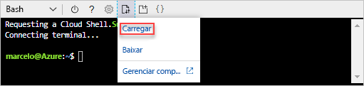
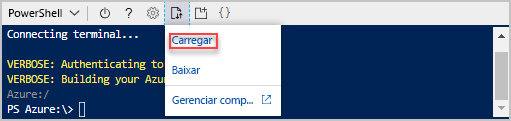

# <a name="quickstart-create-azure-resource-manager-templates-by-using-visual-studio-code"></a>Início Rápido: criar modelos do Azure Resource Manager usando o Visual Studio Code

Saiba como usar o Visual Studio Code e a extensão de Ferramentas do Azure Resource Manager para criar e editar modelos do Azure Resource Manager. Você pode criar modelos do Gerenciador de Recursos no Visual Studio Code sem a extensão, mas a extensão fornece opções de preenchimento automático que simplificam o desenvolvimento do modelo. Para entender os conceitos associados à implantação e ao gerenciamento de soluções do Azure, consulte [Visão geral do Azure Resource Manager](resource-group-overview.md).

Se você não tiver uma assinatura do Azure, [crie uma conta gratuita](https://azure.microsoft.com/free/) antes de começar.

## <a name="prerequisites"></a>Pré-requisitos

Para concluir este artigo, você precisa do seguinte:

- [Visual Studio Code](https://code.visualstudio.com/).
- Extensão das Ferramentas do Gerenciador de Recursos. Para instalar, use estas etapas:

    1. Abra o Visual Studio Code.
    2. Pressione **CTRL+SHIFT+X** para abrir o painel Extensões
    3. Procure **Ferramentas do Azure Resource Manager** e escolha **Instalar**.
    4. Para concluir a instalação da extensão, escolha **Recarregar**.

## <a name="open-a-quickstart-template"></a>Abrir um modelo de Início Rápido

Em vez de criar um modelo do zero, você pode abrir um modelo de [Modelos de Início Rápido do Azure](https://azure.microsoft.com/resources/templates/). Modelos de Início Rápido do Azure é um repositório de modelos do Gerenciador de Recursos.

O modelo usado neste início rápido é chamado [Criar uma conta de armazenamento padrão](https://azure.microsoft.com/resources/templates/101-storage-account-create/). O modelo define um recurso da conta de Armazenamento do Azure.

1. No Visual Studio Code, escolha **Arquivo**>**Abrir Arquivo**.
2. Em **Nome do arquivo**, cole a seguinte URL:

    ```url
    https://raw.githubusercontent.com/Azure/azure-quickstart-templates/master/101-storage-account-create/azuredeploy.json
    ```
3. Escolha **Abrir** para abrir o arquivo.
4. Escolha **Arquivo**>**Salvar como** para salvar o arquivo como **azuredeploy.json** em seu computador local.

## <a name="edit-the-template"></a>Editar o modelo

Para saber como editar um modelo usando o Visual Studio Code, adicione mais um elemento à seção `outputs`.

1. Adicione mais uma saída ao modelo exportado:

    ```json
    "storageUri": {
      "type": "string",
      "value": "[reference(variables('storageAccountName')).primaryEndpoints.blob]"
    }
    ```

    Quando terminar, a seção de saídas terá essa aparência:

    ```json
    "outputs": {
      "storageAccountName": {
        "type": "string",
        "value": "[variables('storageAccountName')]"
      },
      "storageUri": {
        "type": "string",
        "value": "[reference(variables('storageAccountName')).primaryEndpoints.blob]"
      }
    }
    ```

    Se você tiver copiado e colado o código dentro do Visual Studio Code, tente digitar novamente o elemento **value** para experimentar a funcionalidade do IntelliSense da extensão das Ferramentas do Resource Manager.

    

2. Escolha **Arquivo**>**Salvar** para salvar o arquivo.

## <a name="deploy-the-template"></a>Implantar o modelo

Há muitos métodos para implantar modelos.  Neste início rápido, use o Azure Cloud Shell. O Cloud Shell oferece suporte à CLI do Azure e ao Azure PowerShell.

1. Entrar no [Azure Cloud Shell](https://shell.azure.com)

    
2. No canto superior esquerdo do Cloud Shell, é exibido **PowerShell** ou **Bash**. Para usar a CLI, você precisa abrir uma sessão do Bash. Para executar o PowerShell, você precisará abrir uma sessão do PowerShell. Selecione a seta para baixo para alternar entre o Bash e PowerShell. Consulte a captura de tela anterior. Ao alternar, é necessário reiniciar o shell.
3. Escolha **Carregar/fazer o download dos arquivos** e, em seguida, escolha **Carregar**.

    # <a name="clitabcli"></a>[CLI](#tab/CLI)

    
   
    # <a name="powershelltabpowershell"></a>[PowerShell](#tab/PowerShell)
    
    
    
    ---

    É preciso carregar o arquivo de modelo antes de implantá-lo a partir do shell.
5. Selecione o arquivo que você salvou na seção anterior. O nome padrão é **azuredeploy.json**.
6. No Cloud Shell, execute o comando **ls** para verificar se o arquivo foi carregado com êxito. Você também pode usar o comando **cat** para verificar o conteúdo do modelo. A imagem a seguir mostra como executar o comando a partir do Bash.  Você usa os mesmos comandos em uma sessão do PowerShell.

    # <a name="clitabcli"></a>[CLI](#tab/CLI)

    
   
    # <a name="powershelltabpowershell"></a>[PowerShell](#tab/PowerShell)
    
    
    
    ---
7. No Cloud Shell, execute os seguintes comandos. Selecione a guia para mostrar o código do PowerShell ou o código da CLI.

    # <a name="clitabcli"></a>[CLI](#tab/CLI)
    ```azurecli
    echo "Enter the Resource Group name:" &&
    read resourceGroupName &&
    echo "Enter the name for this deployment:" &&
    read deploymentName &&
    echo "Enter the location (i.e. centralus):" &&
    read location &&
    az group create --name $resourceGroupName --location $location &&
    az group deployment create --name $deploymentName --resource-group $resourceGroupName --template-file "azuredeploy.json"
    ```
   
    # <a name="powershelltabpowershell"></a>[PowerShell](#tab/PowerShell)
    
    ```azurepowershell
    $resourceGroupName = Read-Host -Prompt "Enter the Resource Group name"
    $deploymentName = Read-Host -Prompt "Enter the name for this deployment"
    $location = Read-Host -Prompt "Enter the location (i.e. centralus)"
    
    New-AzureRmResourceGroup -Name $resourceGroupName -Location $location
    New-AzureRmResourceGroupDeployment -Name $deploymentName -ResourceGroupName $resourceGroupName -TemplateFile "azuredeploy.json"
    ```
    
    ---

    Atualize o nome do arquivo de modelo se você salvá-lo com um nome diferente de **azuredeploy.json**.

    A captura de tela a seguir mostra uma implantação de exemplo:

    # <a name="clitabcli"></a>[CLI](#tab/CLI)

    
   
    # <a name="powershelltabpowershell"></a>[PowerShell](#tab/PowerShell)
    
    
    
    ---

    O nome da conta de armazenamento e a URL de armazenamento na seção de saídas estão realçadas na captura de tela. Você precisa do nome da conta de armazenamento na próxima etapa.

7. Execute o seguinte comando da CLI ou do PowerShell para listar as contas de armazenamento criadas recentemente:

    # <a name="clitabcli"></a>[CLI](#tab/CLI)
    ```azurecli
    echo "Enter the Resource Group name:" &&
    read resourceGroupName &&
    echo "Enter the Storage Account name:" &&
    read storageAccountName &&
    az storage account show --resource-group $resourceGroupName --name $storageAccountName
    ```
   
    # <a name="powershelltabpowershell"></a>[PowerShell](#tab/PowerShell)
    
    ```azurepowershell
    $resourceGroupName = Read-Host -Prompt "Enter the Resource Group name"
    $storageAccountName = Read-Host -Prompt "Enter the Storage Account name"
    Get-AzureRmStorageAccount -ResourceGroupName $resourceGroupName -Name $storageAccountName
    ```
    
    ---

## <a name="clean-up-resources"></a>Limpar recursos

Quando os recursos do Azure já não forem necessários, limpe os recursos implantados excluindo o grupo de recursos.

1. No portal do Azure, escolha **Grupos de recursos** do menu à esquerda.
2. No campo **Filtrar por nome**, insira o nome do grupo de recursos.
3. Escolha o nome do grupo de recursos.  Você deverá ver um total de seis recursos no grupo de recursos.
4. Escolha **Excluir grupo de recursos** no menu superior.

## <a name="next-steps"></a>Próximas etapas

O foco principal deste início rápido é usar o Visual Studio Code para editar um modelo existente a partir de modelos de Início Rápido do Azure. Você também aprendeu como implantar o modelo usando a CLI ou o PowerShell a partir do Azure Cloud Shell. Os modelos do Início Rápido do Azure podem não oferecer tudo o que você precisa. O próximo tutorial mostra como localizar as informações de referência de modelo para que você possa criar uma conta de armazenamento criptografada do Azure.

> [!div class="nextstepaction"]
> [Criar uma conta de armazenamento criptografada](./resource-manager-tutorial-create-encrypted-storage-accounts.md)
