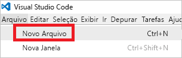

# <a name="use-visual-studio-code-extension-to-create-azure-resource-manager-template"></a>Usar a extensão do Visual Studio Code para criar modelos do Azure Resource Manager
Este artigo mostra os benefícios de instalar e usar a extensão de ferramentas do Azure Resource Manager no Visual Studio Code. Você pode criar modelos do Resource Manager no VS Code sem a extensão, mas a extensão fornece opções de preenchimento automático que simplificam o desenvolvimento do modelo. Ele sugere as funções, parâmetros e variáveis de modelo que estão disponíveis no modelo.

Para concluir este artigo, você precisa do [Visual Studio Code](https://code.visualstudio.com/).

Para entender os conceitos associados à implantação e ao gerenciamento de soluções do Azure, consulte [Visão geral do Azure Resource Manager](resource-group-overview.md).

## <a name="create-the-template"></a>Criar o modelo

Este artigo é baseado no modelo que você criou em [Criar e implantar seu primeiro modelo do Azure Resource Manager](resource-manager-create-first-template.md). Se você já tem esse modelo, pode ignorar esta seção.

1. Se você precisa criar o modelo, inicie o VS Code. Selecione **Arquivo** > **Novo Arquivo**. 

   

2. Copie e cole a seguinte sintaxe JSON em seu arquivo:

   ```json
   {
     "$schema": "http://schema.management.azure.com/schemas/2015-01-01/deploymentTemplate.json#",
     "contentVersion": "1.0.0.0",
     "parameters": {
       "storageSKU": {
         "type": "string",
         "allowedValues": [
           "Standard_LRS",
           "Standard_ZRS",
           "Standard_GRS",
           "Standard_RAGRS",
           "Premium_LRS"
         ],
         "defaultValue": "Standard_LRS",
         "metadata": {
           "description": "The type of replication to use for the storage account."
         }
       },   
       "storageNamePrefix": {
         "type": "string",
         "maxLength": 11,
         "defaultValue": "storage",
         "metadata": {
           "description": "The value to use for starting the storage account name. Use only lowercase letters and numbers."
         }
       }
     },
     "variables": {
       "storageName": "[concat(toLower(parameters('storageNamePrefix')), uniqueString(resourceGroup().id))]"
     },
     "resources": [
       {
         "name": "[variables('storageName')]",
         "type": "Microsoft.Storage/storageAccounts",
         "apiVersion": "2016-01-01",
         "sku": {
           "name": "[parameters('storageSKU')]"
         },
         "kind": "Storage",
         "location": "[resourceGroup().location]",
         "tags": {},
         "properties": {
           "encryption":{
             "services":{
               "blob":{
                 "enabled":true
               }
             },
             "keySource":"Microsoft.Storage"
           }
         }
       }
     ],
     "outputs": {  }
   }
   ```

3. Salve esse arquivo como **azuredeploy.json** em uma pasta local.

   

## <a name="install-the-extension"></a>Instalar a extensão

1. No VS Code, selecione **Extensões**.

   

2. Procure **Ferramentas do Azure Resource Manager** e selecione **Instalar**.

   

3. Para concluir a instalação da extensão, selecione **Recarregar**.

## <a name="edit-the-template"></a>Editar o modelo

1. Abra o arquivo azuredeploy.json.

2. A extensão recupera todas as [funções de modelo](resource-group-template-functions.md) disponíveis. Ele também lê os parâmetros e as variáveis definidas no modelo. Para ver essa funcionalidade, você pode adicionar dois valores à seção de saída. No modelo, substitua a seção de saídas por:

   ```json
   "outputs": { 
       "groupLocation": {
         "type": "string",
         "value": ""
       },
       "storageUri": {
         "type": "string",
         "value": ""
       }
   }
   ```

3. Coloque o cursor dentro das aspas de valor em **groupLocation**. Digite o colchete esquerdo (`[`). Observe que a extensão sugere imediatamente as funções de modelo disponíveis.

   

4. Comece a digitar **resourceGroup**. Quando a função `resourceGroup()` é exibida, pressione Tab ou Enter.

   

5. A extensão preenche a sintaxe da função. A função [resourceGroup](resource-group-template-functions-resource.md#resourcegroup) não aceita parâmetros. Adicione um ponto após o parêntese direito. A extensão fornece as propriedades que estão disponíveis para o objeto retornado pela função `resourceGroup()`. Selecione `location`.

   

6. Depois do **local**, adicione o parêntese direito de fechamento.

   ```json
   "outputs": { 
       "groupLocation": {
         "type": "string",
         "value": "[resourceGroup().location]"
       },
       "storageUri": {
         "type": "string",
         "value": ""
       }
   }
   ```

7. Agora, coloque o cursor dentro das aspas em **storageUri**. Novamente, digite o colchete esquerdo. Comece a digitar a **referência**. Quando essa função estiver selecionada, pressione Tab ou Enter.

   

8. A [referência](resource-group-template-functions-resource.md#reference) aceita a ID de recurso ou o nome do recurso como um parâmetro. Você já tem o nome da conta de armazenamento em uma variável. Digite **var** e selecione Ctrl+espaço. A extensão sugere a função de variáveis.

   

   Pressione Tab ou Enter.

9. A função [variáveis](resource-group-template-functions-deployment.md#variables) requer o nome da variável. Dentro dos parênteses, adicione um sinal de aspas simples. A extensão fornece os nomes das variáveis definidas no modelo.

    

10. Selecione a variável **storageName**. Adicione o colchete direito. O exemplo abaixo mostra a seção de saídas:

   ```json
   "outputs": { 
       "groupLocation": {
         "type": "string",
         "value": "[resourceGroup().location]"
       },
       "storageUri": {
         "type": "string",
         "value": "[reference(variables('storageName'))]"
       }
   }
   ```

O modelo final é:

```json
{
  "$schema": "http://schema.management.azure.com/schemas/2015-01-01/deploymentTemplate.json#",
  "contentVersion": "1.0.0.0",
  "parameters": {
    "storageSKU": {
      "type": "string",
      "allowedValues": [
        "Standard_LRS",
        "Standard_ZRS",
        "Standard_GRS",
        "Standard_RAGRS",
        "Premium_LRS"
      ],
      "defaultValue": "Standard_LRS",
      "metadata": {
        "description": "The type of replication to use for the storage account."
      }
    },   
    "storageNamePrefix": {
      "type": "string",
      "maxLength": 11,
      "defaultValue": "storage",
      "metadata": {
        "description": "The value to use for starting the storage account name. Use only lowercase letters and numbers."
      }
    }
  },
  "variables": {
    "storageName": "[concat(toLower(parameters('storageNamePrefix')), uniqueString(resourceGroup().id))]"
  },
  "resources": [
    {
      "name": "[variables('storageName')]",
      "type": "Microsoft.Storage/storageAccounts",
      "apiVersion": "2016-01-01",
      "sku": {
        "name": "[parameters('storageSKU')]"
      },
      "kind": "Storage",
      "location": "[resourceGroup().location]",
      "tags": {},
      "properties": {
        "encryption":{
          "services":{
            "blob":{
              "enabled":true
            }
          },
          "keySource":"Microsoft.Storage"
        }
      }
    }
  ],
  "outputs": { 
    "groupLocation": {
      "type": "string",
      "value": "[resourceGroup().location]"
    },
    "storageUri": {
      "type": "string",
      "value": "[reference(variables('storageName'))]"
    }
  }
}
```

## <a name="deploy-template"></a>Implantar modelo

Você está pronto para implantar o modelo. Use o PowerShell ou a CLI do Azure para criar um grupo de recursos. Em seguida, implante uma conta de armazenamento para esse grupo de recursos.

* No caso do PowerShell, use os seguintes comandos na pasta que contém o modelo:

   ```powershell
   Login-AzureRmAccount
   
   New-AzureRmResourceGroup -Name examplegroup -Location "South Central US"
   New-AzureRmResourceGroupDeployment -ResourceGroupName examplegroup -TemplateFile azuredeploy.json
   ```

* No caso de uma instalação local da CLI do Azure, use os seguintes comandos na pasta que contém o modelo:

   ```azurecli
   az login

   az group create --name examplegroup --location "South Central US"
   az group deployment create --resource-group examplegroup --template-file azuredeploy.json
   ```

Quando a implantação é concluída, os valores de saída são retornados.

## <a name="clean-up-resources"></a>Limpar recursos

Quando não forem mais necessários, limpe os recursos implantados excluindo o grupo de recursos.

Para o PowerShell, use:

```powershell
Remove-AzureRmResourceGroup -Name examplegroup
```

Para a CLI do Azure, use:

```azurecli
az group delete --name examplegroup
```

## <a name="next-steps"></a>Próximas etapas
* Para saber mais sobre a estrutura de um modelo, confira [Criando modelos do Azure Resource Manager](resource-group-authoring-templates.md).
* Para saber mais sobre as propriedades de uma conta de armazenamento, confira [Referência do modelo de contas de armazenamento](/azure/templates/microsoft.storage/storageaccounts).
* Para exibir modelos completos para muitos tipos diferentes de soluções, consulte os [Modelos de Início Rápido do Azure](https://azure.microsoft.com/documentation/templates/).

