# Criação e implantação de grupos de recurso do Azure por meio do Visual Studio
Com o Visual Studio e o [SDK do Azure](https://azure.microsoft.com/downloads/), você pode criar um projeto que implementa sua infraestrutura e o código no Azure. Por exemplo, você pode definir o host da Web, o site da Web e o banco de dados para seu aplicativo, e implantar essa infraestrutura juntamente com o código. Ou pode definir uma Máquina Virtual, uma Rede Virtual e uma Conta de Armazenamento e implantar essa infraestrutura juntamente com um script que é executado na Máquina Virtual. O projeto de implantação **Grupo de Recursos do Azure** permite a você implantar todos os recursos necessários em uma única operação repetida. Para obter mais informações sobre como implantar e gerenciar seus recursos, confira [Visão geral do Azure Resource Manager](resource-group-overview.md).

Os projetos do Grupo de Recursos do Azure contêm modelos JSON do Azure Resource Manager que definem os recursos que você implanta no Azure. Para saber mais sobre os elementos do modelo do Gerenciador de Recursos, confira [Criando modelos do Gerenciador de Recursos do Azure](resource-group-authoring-templates.md). O Visual Studio permite editar esses modelos e fornece ferramentas que simplificam o trabalho com eles.

Neste tópico, você pode implantar um aplicativo Web e o Banco de Dados SQL. No entanto, as etapas são praticamente as mesmas para qualquer tipo de recurso. Você pode implantar facilmente uma Máquina Virtual e seus recursos relacionados. O Visual Studio fornece muitos modelos iniciais diferentes para implantar cenários comuns.

Este artigo mostra a Atualização 2 do Visual Studio 2015 e o SDK do Microsoft Azure para o .NET 2.9. Se você usar o Visual Studio 2013 com o SDK do Azure 2.9, sua experiência será basicamente a mesma. Você pode usar as versões do SDK do Azure 2.6 ou posterior. No entanto, sua experiência da interface do usuário pode ser diferente da mostrada neste artigo. Recomendamos que você instale a versão mais recente do [SDK do Azure](https://azure.microsoft.com/downloads/) antes de iniciar as etapas. 

## Criar um projeto do Grupo de Recursos do Azure
Neste procedimento, você cria um projeto do Grupo de Recursos do Azure com um modelo do **aplicativo Web + SQL** .

1. No Visual Studio, escolha **Arquivo**, **Novo Projeto**, escolha **C#** ou **Visual Basic**. Então escolha **Nuvem**, e, em seguida, escolha projeto de **Grupo de Recursos do Azure**.
   
    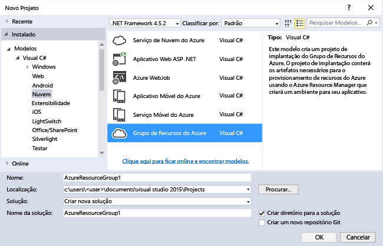
2. Escolha o modelo que você deseja implantar no Gerenciador de Recursos do Azure. Observe que há várias opções diferentes com base no tipo de projeto que você deseja implantar. Para este tópico, escolha o modelo do **aplicativo Web + SQL** .
   
    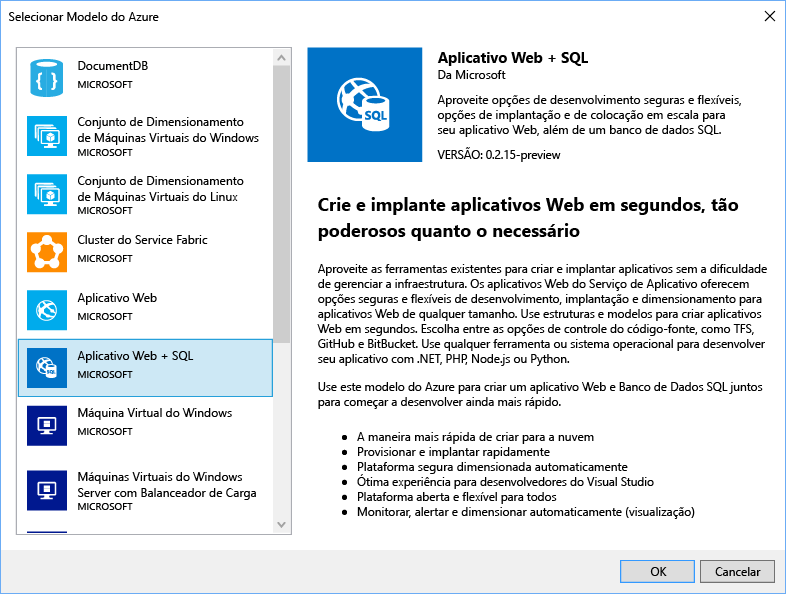
   
    O modelo que você escolhe é apenas um ponto de partida. Você pode adicionar e remover os recursos para atender a seu cenário.
   
   > [!NOTE]
   > O Visual Studio recupera uma lista dos modelos disponíveis online. A lista pode mudar.
   > 
   > 
   
    O Visual Studio cria um projeto de implantação do grupo de recursos para o aplicativo Web e o banco de dados SQL.
3. Para ver o que você criou, expanda os nós no projeto de implantação.
   
    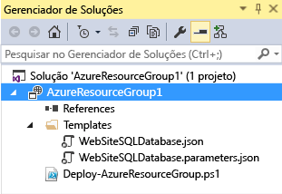
   
    Como escolhemos o modelo do aplicativo Web + SQL para este exemplo, você vê os arquivos a seguir: 
   
   | Nome do arquivo | Descrição |
   | --- | --- |
   | Deploy-AzureResourceGroup.ps1 |Um script do PowerShell que invoca comandos do PowerShell a implantar para o Gerenciador de Recursos do Azure. **Observação** O Visual Studio usa esse script do PowerShell para implantar seu modelo. As alterações feitas no script afetam a implantação no Visual Studio. Portanto, tenha cuidado. |
   | WebSiteSQLDatabase.json |O modelo do Resource Manager que define a infraestrutura que você deseja implantar no Azure e os parâmetros que você pode fornecer durante a implantação. Também define as dependências entre os recursos para que o Resource Manager implante-os na ordem correta. |
   | WebSiteSQLDatabase.parameters.json |Um arquivo de parâmetros que contém os valores necessários ao modelo. Você passa os valores do parâmetro para personalizar cada implantação. |
   
    Todos os projetos de implantação do grupo de recursos do Azure contêm esses arquivos básicos. Outros projetos podem conter arquivos adicionais para dar suporte a outras funcionalidades.

## Personalizar o modelo do Gerenciador de Recursos
Você pode personalizar um projeto de implantação modificando os modelos JSON que descrevem os recursos que você deseja implantar. JSON significa JavaScript Object Notation e é um formato de dados serializados, com o qual é fácil de trabalhar. Os arquivos JSON usam um esquema que você referencia na parte superior de cada arquivo. Se você quiser entender o esquema, poderá baixá-lo e analisá-lo. O esquema define quais elementos são válidos, os tipos e formatos dos campos, os possíveis valores enumerados e assim por diante. Para saber mais sobre os elementos do modelo do Gerenciador de Recursos, confira [Criando modelos do Gerenciador de Recursos do Azure](resource-group-authoring-templates.md).

Para trabalhar em seu modelo, abra o **WebSiteSQLDatabase.json**.

O editor do Visual Studio fornece ferramentas para ajudá-lo a editar o modelo do Resource Manager. A janela **Estrutura de Tópicos JSON** facilita ver os elementos definidos no modelo.

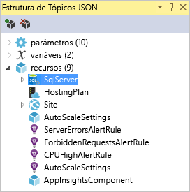

Selecionar qualquer um dos elementos na estrutura de tópicos leva você para essa parte do modelo e destaca o JSON correspondente.

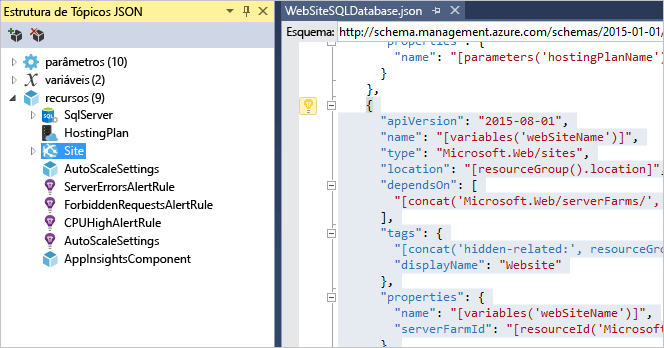

Você pode adicionar um recurso selecionando o botão **Adicionar Recurso** na parte superior da janela Estrutura de Tópicos JSON ou clicando com o botão direito em **recursos** e selecionando **Adicionar Novo Recurso**.

Para este tutorial, selecione **Conta de Armazenamento** e forneça um nome. Forneça um nome que não tenha mais de 11 caracteres e contenha apenas números e letras minúsculas.

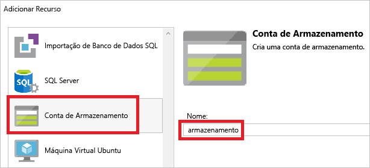

Observe que não só foi adicionado o recurso, mas também um parâmetro para o tipo da conta de armazenamento e uma variável para o nome da conta de armazenamento.

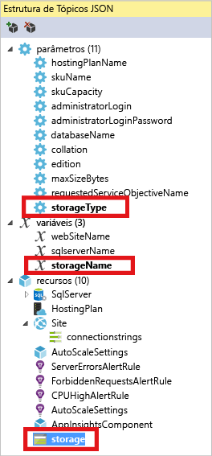

O parâmetro **storageType** é predefinido com os tipos permitidos e um tipo padrão. Você pode deixar esses valores ou editá-los para seu cenário. Se você não quiser permitir que alguém implante uma conta de armazenamento **Premium_LRS** com esse modelo, remova-o dos tipos permitidos. 

    "storageType": {
      "type": "string",
      "defaultValue": "Standard_LRS",
      "allowedValues": [
        "Standard_LRS",
        "Standard_ZRS",
        "Standard_GRS",
        "Standard_RAGRS"
      ]
    }

O Visual Studio também fornece o intellisense para ajudá-lo a entender quais propriedades estão disponíveis ao editar o modelo. Por exemplo, para editar as propriedades de seu plano do Serviço de Aplicativo, navegue até o recurso **HostingPlan** e adicione um valor para as **propriedades**. Observe que o intellisense mostra os valores disponíveis e fornece uma descrição desse valor.

Você pode definir **numberOfWorkers** para 1.

    "properties": {
      "name": "[parameters('hostingPlanName')]",
      "numberOfWorkers": 1
    }

## Implantar o projeto do Grupo de Recursos para o Azure
Agora, você está pronto para implantar seu projeto. Quando você implanta um projeto do Grupo de Recursos do Azure, implanta-o em um grupo de recursos do Azure. Um grupo de recursos é um agrupamento lógico de recursos que compartilham um ciclo de vida comum.

1. No menu de atalho do nó do projeto de implantação, escolha **Implantar** > **New Implantarment**.
   
    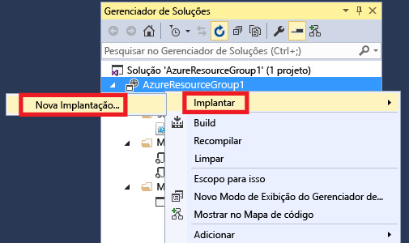
   
    A caixa de diálogo **Implantar no Grupo de Recursos** é exibida.
   
    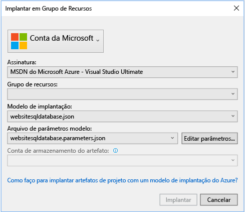
2. Na caixa suspensa de **Grupo de recursos** , escolha um grupo de recursos existente ou crie um novo. Para criar um grupo de recursos, abra a caixa suspensa **Grupo de Recursos** e escolha **Criar Novo**.
   
    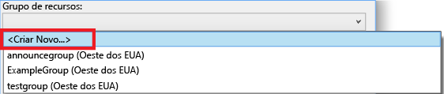
   
    A caixa de diálogo **Criar Grupo de Recursos** é exibida. Forneça ao grupo um nome e local, e selecione o botão **Criar** .
   
    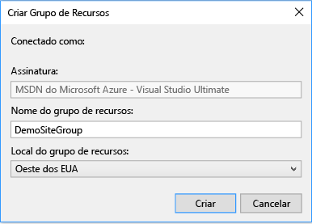
3. Edite os parâmetros da implantação escolhendo o botão **Editar Parâmetros** .
   
    
4. Forneça valores para os parâmetros vazios e selecione o botão **Salvar** . Os parâmetros vazios são **hostingPlanName**, **administratorLogin**, **administratorLoginPassword** e **databaseName**.
   
    **hostingPlanName** : especifica o nome do [plano do Serviço de Aplicativo](../app-service/azure-web-sites-web-hosting-plans-in-depth-overview.md) a ser criado. 
   
    **administratorLogin** especifica o nome de usuário do administrador do SQL Server. Não use nomes comuns de administração como **sa** ou **admin**. 
   
    O **administratorLoginPassword** especifica uma senha para o administrador do SQL Server. A opção **Salvar senhas como texto sem formatação no arquivo de parâmetros** não é segura; portanto, não selecione essa opção. Como a senha não é salva como texto sem formatação, você precisará fornecer essa senha novamente durante a implantação. 
   
    **databaseName** especifica um nome para o banco de dados a ser criado. 
   
    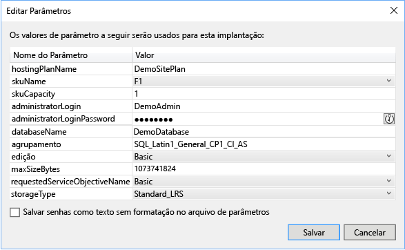
5. Escolha o botão **Implantar** para implantar o projeto no Azure. Um console do PowerShell é aberto fora da instância do Visual Studio. Digite a senha de administrador do SQL Server no console do PowerShell quando for solicitado. **O console do PowerShell pode estar oculto por trás de outros itens ou minimizado na barra de tarefas.**  Procure esse console e selecione-o para fornecer a senha.
   
   > [!NOTE]
   > O Visual Studio pode solicitar que você instale os cmdlets do Azure PowerShell. Você precisa dos cmdlets do Azure PowerShell para implantar com êxito os grupos de recursos. Se solicitado, instale-os.
   > 
   > 
6. A implantação pode demorar alguns minutos. Nas janelas de **Saída** , confira o status da implantação. Quando a implantação tiver sido concluída, a última mensagem indicará uma implantação bem-sucedida com algo semelhante a:
   
        ... 
        18:00:58 - Successfully deployed template 'c:\users\user\documents\visual studio 2015\projects\azureresourcegroup1\azureresourcegroup1\templates\websitesqldatabase.json' to resource group 'DemoSiteGroup'.
7. Em um navegador, abra o [Portal do Azure](https://portal.azure.com/) e entre em sua conta. Para ver o grupo de recursos, selecione **Grupos de recursos** e o grupo de recursos implantado.
   
    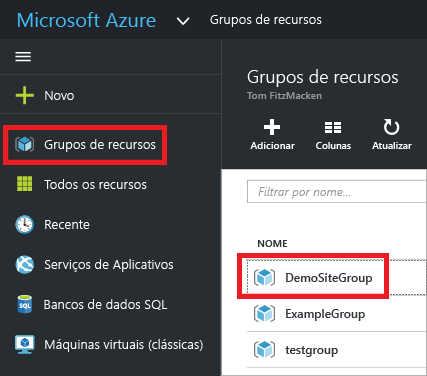
8. Você verá todos os recursos implantados. Observe que o nome da conta de armazenamento não é exatamente o que você especificou ao adicionar esse recurso. A conta de armazenamento deve ser exclusiva. O modelo adiciona automaticamente uma cadeia de caracteres ao nome fornecido a fim de fornecer um nome exclusivo. 
   
    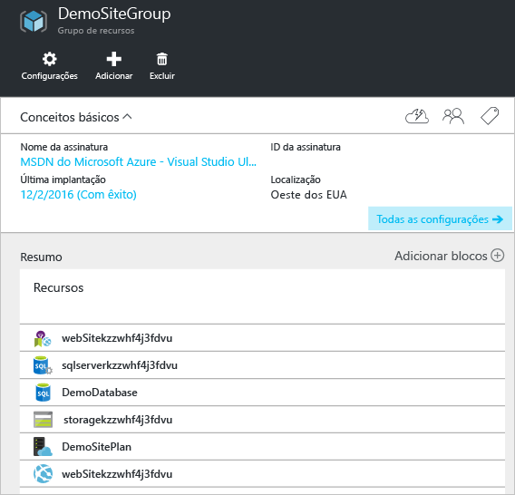
9. Se você fizer alterações e quiser reimplantar seu projeto, escolha o grupo de recursos existente no menu de atalho do projeto do grupo de recursos do Azure. No menu de atalho, escolha **Implantar**, então, escolha o grupo de recursos implantado.
   
    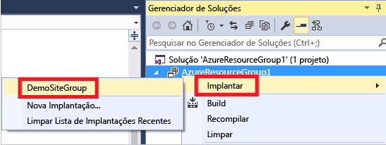

## Implantar o código com sua infraestrutura
Neste ponto, você implantou a infraestrutura de seu aplicativo, mas não há nenhum código real implantado com o projeto. Este tópico mostra como implantar um aplicativo Web e as tabelas do Banco de Dados SQL durante a implantação. Se você estiver implantando uma Máquina Virtual em vez de um aplicativo Web, desejará executar um código no computador como parte da implantação. O processo de implantação do código para um aplicativo Web ou configurar uma Máquina Virtual é quase o mesmo.

1. Adicione esse projeto à sua solução do Visual Studio. Clique com o botão direito na solução e selecione **Adicionar** > **Novo Projeto**.
   
    
2. Adicione um **Aplicativo Web ASP.NET**. 
   
    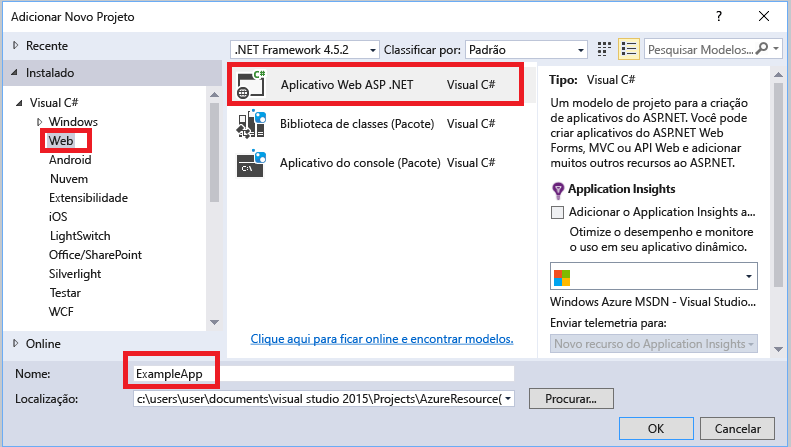
3. Selecione **MVC** e desmarque o campo **Host na nuvem**, pois o projeto do grupo de recursos executa essa tarefa.
   
    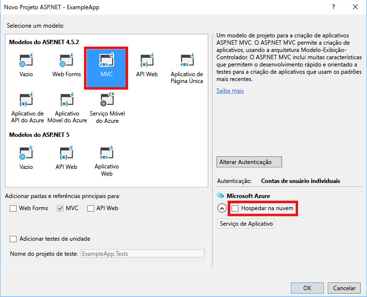
4. Depois que o Visual Studio criar seu aplicativo Web, você poderá ver os dois projetos na solução.
   
    
5. Agora, você precisa certificar-se de que seu projeto de grupo de recursos esteja ciente do novo projeto. Volte ao seu projeto de grupo de recursos (AzureResourceGroup1). Clique com botão direito do mouse em **Referências** e selecione **Adicionar Referência**.
   
    
6. Selecione o projeto de aplicativo Web que você criou.
   
    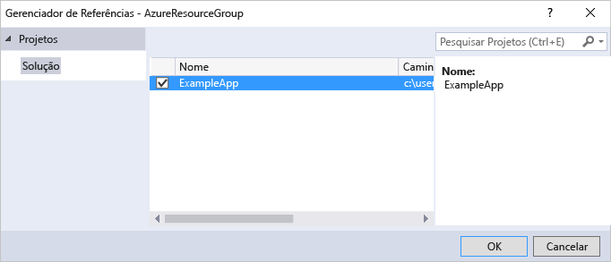
   
    Adicionando uma referência, você vincula o projeto do aplicativo Web ao projeto do grupo de recursos e define três propriedades principais automaticamente. Confira essas propriedades na janela **Propriedades** da referência.
   
      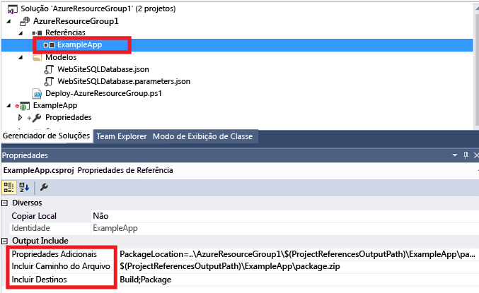
   
    As propriedades são:
   
   * As **Propriedades Adicionais** contêm o local de preparação do pacote de implantação da Web que é enviado para o Armazenamento do Azure. Observe a pasta (ExampleApp) e o arquivo (package.zip). Você fornecerá esses valores como parâmetros ao implantar o aplicativo. 
   * A opção **Incluir Caminho do Arquivo** contém o caminho onde o pacote é criado. A opção **Incluir Destinos** contém o comando que a implantação executa. 
   * O valor padrão **Build;Package** permite que a implantação compile e crie um pacote de implantação da Web (package.zip).  
     
     Não é necessário um perfil de publicação quando a implantação obtém as informações necessárias nas propriedades para criar o pacote.
7. Adicione um recurso ao modelo.
   
    
8. Dessa vez, selecione **Implantação da Web para aplicativos Web**. 
   
    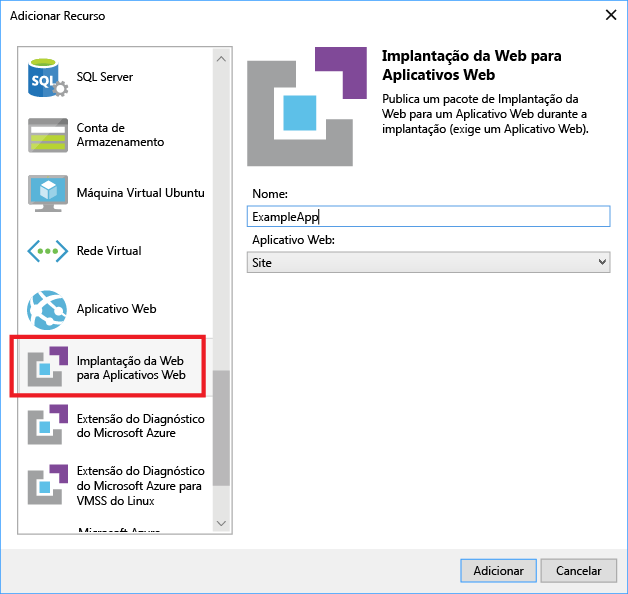
9. Implante novamente o projeto do grupo de recursos para o grupo de recursos. Desta vez, há alguns parâmetros novos. Você não precisa fornecer valores para **_artifactsLocation** ou **_artifactsLocationSasToken** porque o Visual Studio gera automaticamente esses valores. No entanto, você deve definir o nome de pasta e do arquivo para o caminho que contém o pacote de implantação (mostrado como **ExampleAppPackageFolder** e **ExampleAppPackageFileName** na imagem a seguir). Forneça os valores que você viu anteriormente nas propriedades de referência (**ExampleApp** e **package.zip**).
   
    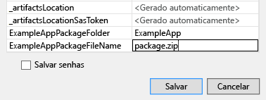
   
    Para a **Conta de armazenamento do artefato**, selecione a conta implantada com esse grupo de recursos.
10. Após a conclusão da implantação, selecione seu aplicativo Web no portal. Clique na URL para navegar até o site.
    
     
11. Observe que você implantou o aplicativo ASP.NET padrão com êxito.
    
     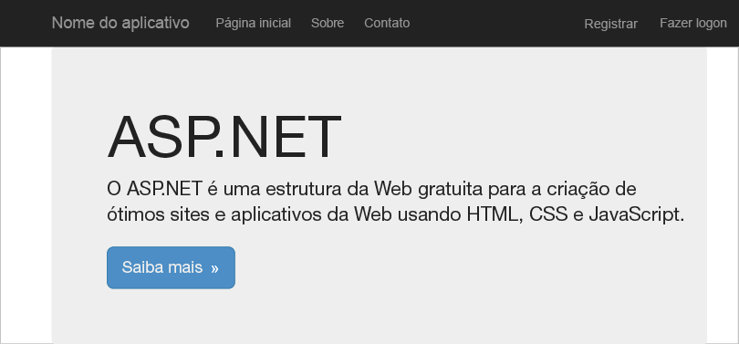

## Próximas etapas
* Para saber mais sobre como gerenciar seus recursos com o portal, consulte [Usando o Portal do Azure para gerenciar os recursos do Azure](resource-group-portal.md).
* Para saber mais sobre os modelos, confira [Criando modelos do Azure Resource Manager](resource-group-authoring-templates.md).

<!--HONumber=Nov16_HO3-->

