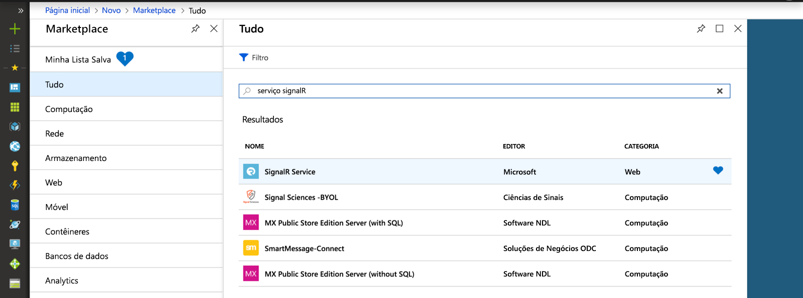
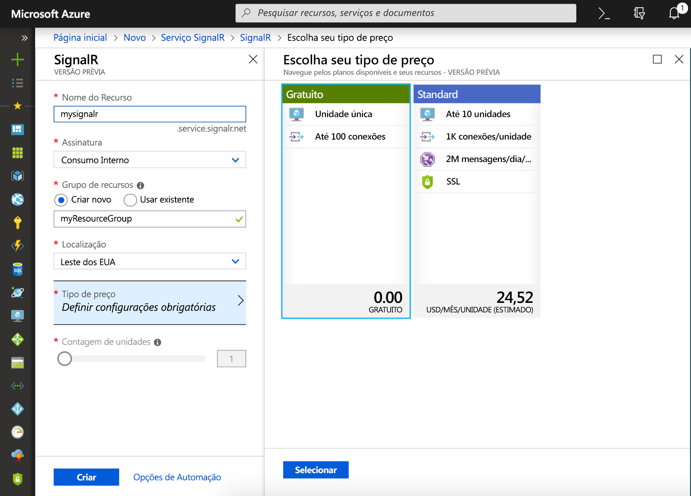

## Criar uma instância do Serviço Azure SignalR

Seu aplicativo vai se conectar a uma instância do Serviço SignalR no Azure.

1. Selecione no botão Novo localizado no canto superior esquerdo do portal do Azure. Na tela Novo, digite *Serviço SignalR* na caixa de pesquisa e pressione Enter.

    

1. Selecione **Serviço SignalR** nos resultados da pesquisa e, em seguida, selecione **Criar**.

1. Insira as configurações a seguir.

    | Configuração      | Valor sugerido  | DESCRIÇÃO                                        |
    | ------------ |  ------- | -------------------------------------------------- |
    | **Nome do recurso** | Nome globalmente exclusivo | Nome que identifica a nova instância do Serviço SignalR. Os caracteres válidos são `a-z`, `0-9` e `-`.  | 
    | **Assinatura** | Sua assinatura | A assinatura sob a qual essa nova instância do Serviço SignalR será criada. | 
    | **[Grupo de Recursos](../../azure-resource-manager/resource-group-overview.md)** |  myResourceGroup | Nome do novo grupo de recursos no qual criar a instância do Serviço SignalR. | 
    | **Localidade** | Oeste dos EUA | Selecione uma [região](https://azure.microsoft.com/regions/) perto de você. |
    | **Tipo de preços** | Grátis | Experimente o Serviço Azure SignalR gratuitamente. |
    | **Contagem de unidades** |  Não aplicável | A contagem de unidade especifica quantas conexões sua instância do Serviço SignalR pode aceitar. Só é configurável na camada Standard. |

    

1. Selecione **Criar** para começar a implantar a instância do Serviço SignalR.

1. Depois que a instância é implantada, abra-a no portal e localize sua página de Configurações. Altere a configuração do Modo de Serviço para *Sem servidor*.

    