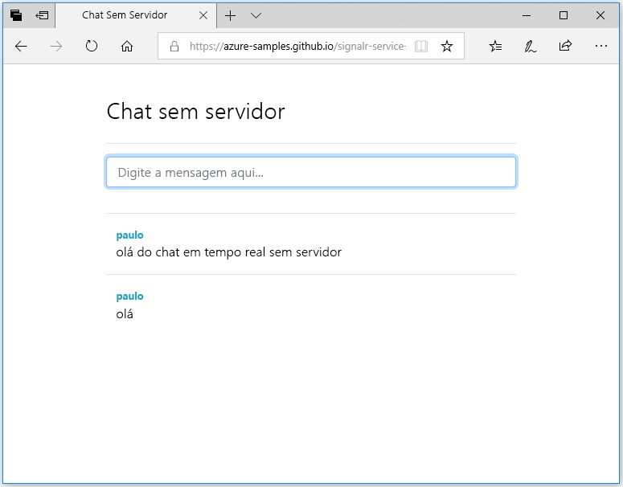

## Executar o aplicativo Web

1. Há um aplicativo Web de página única de exemplo hospedado no GitHub para sua conveniência. Abra seu navegador em [https://azure-samples.github.io/signalr-service-quickstart-serverless-chat/demo/chat/](https://azure-samples.github.io/signalr-service-quickstart-serverless-chat/demo/chat/).

    > [!NOTE]
    > A origem do arquivo HTML está localizada em [/docs/demo/chat/index.html](https://github.com/Azure-Samples/signalr-service-quickstart-serverless-chat/blob/master/docs/demo/chat/index.html).

1. Quando for solicitada a URL base do aplicativo de funções, digite *http://localhost:7071*.

1. Insira um nome de usuário quando solicitado.

1. O aplicativo Web chama a função *GetSignalRInfo* o aplicativo de funções para recuperar as informações de conexão para se conectar ao Serviço Azure SignalR. Quando a conexão for concluída, a caixa de entrada de mensagem de chat será exibida.

1. Digite uma mensagem e pressione Enter. O aplicativo envia a mensagem para a função *SendMessage* no aplicativo Função do Azure, que usa a associação da saída do SignalR para difundir a mensagem para todos os clientes conectados. Se tudo estiver funcionando corretamente, a mensagem deverá aparecer no aplicativo.

    

1. Abra outra instância do aplicativo Web em outra janela do navegador. Você verá que todas as mensagens enviadas serão exibidas em todas as instâncias do aplicativo.