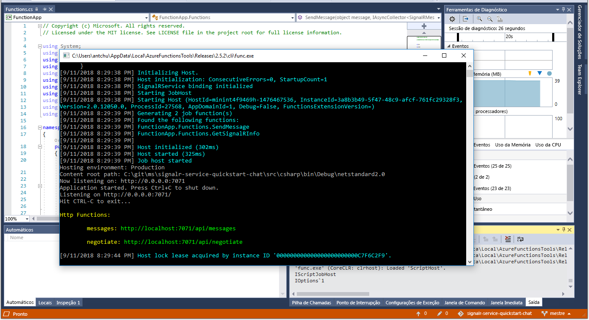

# Início Rápido: crie uma sala de chat com o Azure Functions e o SignalR Service usando C#

O Azure SignalR Service permite adicionar facilmente a funcionalidade em tempo real ao seu aplicativo. O Azure Functions é uma plataforma sem servidor que permite executar seu código sem gerenciar qualquer infraestrutura. Neste início rápido, saiba como usar o SignalR Service e o Functions para criar um aplicativo de chat em tempo real e sem servidor.

## Pré-requisitos

Se você ainda não tem o Visual 2017 Studio instalado, poderá baixar e usar o **Visual Studio 2017 Community Edition** [gratuito](https://www.visualstudio.com/downloads/). Verifique se você habilitou o **desenvolvimento do Azure** durante a instalação do Visual Studio.

[!INCLUDE [quickstarts-free-trial-note](../../includes/quickstarts-free-trial-note.md)]

## Fazer logon no Azure

Entre no portal do Azure em <https://portal.azure.com/> com sua conta do Azure.

[!INCLUDE [Create instance](includes/signalr-quickstart-create-instance.md)]

[!INCLUDE [Clone application](includes/signalr-quickstart-clone-application.md)]

## Configurar e executar o aplicativo do Azure Functions

1. Inicie o Visual Studio e abra a solução na pasta *chat\src\csharp* do repositório clonado.

1. No navegador em que o portal do Azure é aberto, confirme se a instância do SignalR Service implantada anteriormente foi criada com êxito pesquisando pelo nome na caixa de pesquisa na parte superior do portal. Selecione a instância para abri-la.

    

1. Selecione **Chaves** para exibir as cadeias de conexão para a instância do SignalR Service.

1. Selecione e copie a cadeia de conexão primária.

1. No Visual Studio, no Gerenciador de Soluções, renomeie *local.settings.sample.json* como *local.settings.json*.

1. Em **local.settings.json**, cole a cadeia de conexão no valor da configuração **AzureSignalRConnectionString**. Salve o arquivo.

1. Abra **Functions.cs**. Há duas funções de gatilho HTTP nesse aplicativo de funções:

    - **GetSignalRInfo** – usa a associação de entrada *SignalRConnectionInfo* para gerar e retornar informações de conexão válidas.
    - **SendMessage** – recebe uma mensagem de chat no corpo da solicitação e usa a associação de saída *SignalR* para difundir a mensagem a todos os aplicativos cliente conectados.

1. No menu **Depurar**, selecione **Iniciar depuração** para executar o aplicativo.

    

[!INCLUDE [Run web application](includes/signalr-quickstart-run-web-application.md)]

[!INCLUDE [Cleanup](includes/signalr-quickstart-cleanup.md)]

## Próximas etapas

Neste início rápido, você criou e executou um aplicativo sem servidor em tempo real no VS Code. Em seguida, saiba mais sobre como implantar o Azure Functions do VS Code.

> [!div class="nextstepaction"]
> [Implantar o Azure Functions com o VS Code](https://code.visualstudio.com/tutorials/functions-extension/getting-started)