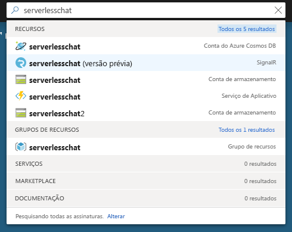
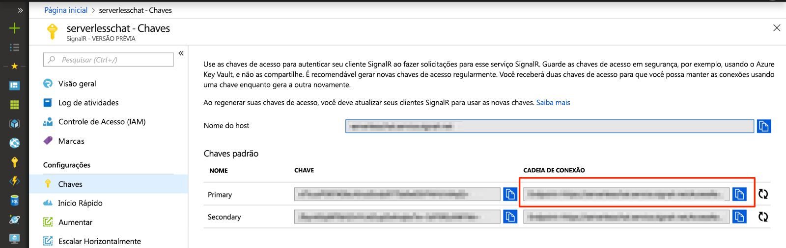

# <a name="quickstart-create-a-chat-room-with-azure-functions-and-signalr-service-using-java"></a>Início Rápido: Criar uma sala de chat com o Azure Functions e o Serviço do SignalR usando Java

O Azure SignalR Service permite adicionar facilmente a funcionalidade em tempo real ao seu aplicativo. O Azure Functions é uma plataforma sem servidor que permite executar seu código sem gerenciar qualquer infraestrutura. Neste início rápido, saiba como usar o SignalR Service e o Functions para criar um aplicativo de chat em tempo real e sem servidor.

## <a name="prerequisites"></a>Pré-requisitos

Este início rápido pode ser executado no macOS, Windows ou Linux.

Certifique-se de ter um editor de código, como [Visual Studio Code](https://code.visualstudio.com/), instalado.

Instale o [Azure Functions Core Tools (v2)](https://github.com/Azure/azure-functions-core-tools#installing) para executar aplicativos do Azure Functions localmente.

> [!NOTE]
> Para usar as associações do Serviço do SignalR em Java, verifique se você está usando a versão 2.4.419 ou posterior do Azure Functions Core Tools (versão do host 2.0.12332).

Para instalar extensões, o Azure Functions Core Tools atualmente exige o [SDK do .NET Core](https://www.microsoft.com/net/download) instalado. No entanto, não é necessário nenhum conhecimento do .NET para criar aplicativos do Azure Functions no JavaScript.

Para desenvolver aplicativos de funções com Java, você deve ter o seguinte instalado:

* [Java Developer Kit](https://www.azul.com/downloads/zulu/), versão 8.
* [Apache Maven](https://maven.apache.org), versão 3.0 ou posterior.

[!INCLUDE [quickstarts-free-trial-note](../../includes/quickstarts-free-trial-note.md)]

## <a name="log-in-to-azure"></a>Fazer logon no Azure

Entre no portal do Azure em <https://portal.azure.com/> com sua conta do Azure.

[!INCLUDE [Create instance](includes/signalr-quickstart-create-instance.md)]

[!INCLUDE [Clone application](includes/signalr-quickstart-clone-application.md)]

## <a name="configure-and-run-the-azure-function-app"></a>Configurar e executar o aplicativo do Azure Functions

1. No navegador em que o portal do Azure é aberto, confirme se a instância do SignalR Service implantada anteriormente foi criada com êxito pesquisando pelo nome na caixa de pesquisa na parte superior do portal. Selecione a instância para abri-la.

    

1. Selecione **Chaves** para exibir as cadeias de conexão para a instância do SignalR Service.

1. Selecione e copie a cadeia de conexão primária.

    

1. No editor de código, abra a pasta *chat/src/java* no repositório clonado.

1. Renomeie *local.settings.sample.json* como *local.settings.json*.

1. Em **local.settings.json**, cole a cadeia de conexão no valor da configuração **AzureSignalRConnectionString**. Salve o arquivo.

1. O arquivo principal que contém as funções está em *src/main/java/com/function/Functions.java*:

    - **negociar** – usa a associação de entrada *SignalRConnectionInfo* para gerar e retornar informações de conexão válidas.
    - **sendMessage** – recebe uma mensagem de chat no corpo da solicitação e usa a associação de saída *SignalR* para difundir a mensagem a todos os aplicativos cliente conectados.

1. No terminal, certifique-se de que você está na pasta *chat/src/java*. Compile o aplicativo de funções.

    ```bash
    mvn clean package
    ```

1. Execute o aplicativo de funções localmente.

    ```bash
    mvn azure-functions:run
    ```

[!INCLUDE [Run web application](includes/signalr-quickstart-run-web-application.md)]

[!INCLUDE [Cleanup](includes/signalr-quickstart-cleanup.md)]

## <a name="next-steps"></a>Próximas etapas

Neste início rápido, você criou e executou um aplicativo sem servidor em tempo real usando o Maven. Em seguida, saiba mais sobre como criar Azure Functions em Java do zero.

> [!div class="nextstepaction"]
> [Criar sua primeira função com Java e Maven](../azure-functions/functions-create-first-java-maven.md)