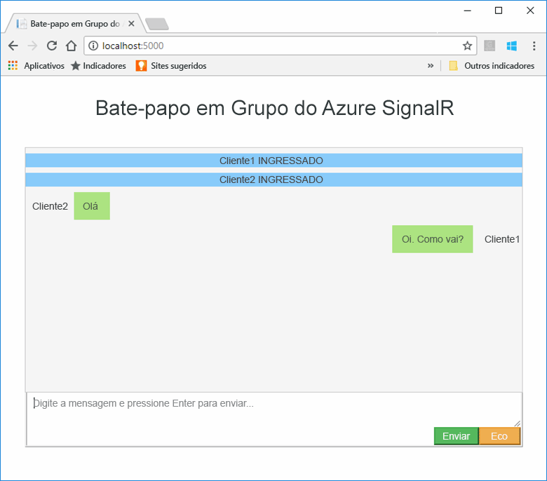
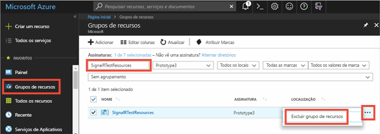

# <a name="quickstart-create-a-chat-room-with-signalr-service"></a>Início Rápido: Criar uma sala de chat com o Serviço SignalR


O Serviço Azure SignalR é um serviço do Azure que ajuda os desenvolvedores a criarem facilmente aplicativos Web com recursos em tempo real. Esse serviço tem base no [SignalR para ASP.NET Core 2.0](https://docs.microsoft.com/aspnet/core/signalr/introduction).

Este artigo mostra como usar o Serviço Azure SignalR. Neste início rápido, você criará um aplicativo de chat usando um Aplicativo Web MVC do ASP.NET Core. Este aplicativo faz uma conexão com o recurso do Serviço Azure SignalR a fim de habilitar atualizações de conteúdo em tempo real. Você hospedará o aplicativo Web localmente e se conectará com vários clientes do navegador. Cada cliente poderá enviar por push as atualizações de conteúdo para todos os outros clientes. 


Você pode usar qualquer editor de código para concluir as etapas deste início rápido. No entanto, o [Visual Studio Code](https://code.visualstudio.com/) é uma opção excelente nas plataformas Windows, macOS e Linux.

O código para este tutorial está disponível para download no [repositório AzureSignalR-samples do GitHub](https://github.com/aspnet/AzureSignalR-samples/tree/master/samples/ChatRoom).  Além disso, a criação dos recursos do Azure usados neste início rápido pode ser feita com o [script Criar um script do Serviço SignalR](scripts/signalr-cli-create-service.md).



[!INCLUDE [quickstarts-free-trial-note](../../includes/quickstarts-free-trial-note.md)]


## <a name="prerequisites"></a>pré-requisitos

* Instalar o [SDK do .NET Core](https://www.microsoft.com/net/download/windows)
* Faça o download ou clone o repositório [AzureSignalR-sample](https://github.com/aspnet/AzureSignalR-samples) do github. 

## <a name="create-an-azure-signalr-resource"></a>Criar um recurso do Azure SignalR

[!INCLUDE [azure-signalr-create](../../includes/signalr-create.md)]

## <a name="create-an-aspnet-core-web-app"></a>Criar um aplicativo Web ASP.NET Core

Nesta seção, você usará a [CLI (interface de linha de comando) do .NET Core](https://docs.microsoft.com/dotnet/core/tools/) para criar um novo projeto de aplicativo Web MVC do ASP.NET Core. A vantagem de usar a CLI do .NET Core sobre o Visual Studio é que ela está disponível nas plataformas Windows, macOS e Linux. 

1. Crie uma nova pasta para o seu projeto. Neste início rápido, a pasta *E:\Testing\chattest* será usada.

2. Na nova pasta, execute o seguinte comando para criar um novo projeto de aplicativo Web MVC do ASP.NET Core:

        dotnet new mvc


## <a name="add-secret-manager-to-the-project"></a>Adicionar o Gerenciador de Segredos ao projeto

Nesta seção, você adicionará a [ferramenta Gerenciador de Segredos](https://docs.microsoft.com/aspnet/core/security/app-secrets) ao seu projeto. A ferramenta Gerenciador de Segredos armazena dados confidenciais para o trabalho de desenvolvimento fora da árvore do seu projeto. Essa abordagem ajuda a impedir o compartilhamento acidental de segredos do aplicativo no código-fonte.

1. Abra seu arquivo *.csproj*. Adicione um elemento `DotNetCliToolReference` para incluir *Microsoft.Extensions.SecretManager.Tools*. Adicione também um elemento `UserSecretsId`, conforme mostrado abaixo e salve o arquivo.

    *chattest.csproj:*

    ```xml
    <Project Sdk="Microsoft.NET.Sdk.Web">
    <PropertyGroup>
        <TargetFramework>netcoreapp2.0</TargetFramework>
        <UserSecretsId>SignalRChatRoomEx</UserSecretsId>
    </PropertyGroup>
    <ItemGroup>
        <PackageReference Include="Microsoft.AspNetCore.All" Version="2.0.0" />
    </ItemGroup>
    <ItemGroup>
        <DotNetCliToolReference Include="Microsoft.VisualStudio.Web.CodeGeneration.Tools" Version="2.0.0" />
        <DotNetCliToolReference Include="Microsoft.Extensions.SecretManager.Tools" Version="2.0.0" />
    </ItemGroup>
    </Project>    
    ```

## <a name="add-azure-signalr-to-the-web-app"></a>Adicionar o Azure SignalR ao aplicativo Web

1. Adicione uma referência ao pacote NuGet `Microsoft.Azure.SignalR` executando o seguinte comando:

        dotnet add package Microsoft.Azure.SignalR -v 1.0.0-*

2. Execute o seguinte comando para restaurar os pacotes para o seu projeto.

        dotnet restore

3. Adicione um segredo chamado *Azure:SignalR:ConnectionString* ao Gerenciador de Segredos. 

    Esse segredo conterá a cadeia de conexão para acessar seu recurso SignalR Service. *Azure:SignalR:ConnectionString* é a chave de configuração padrão que o SignalR procura para estabelecer uma conexão. Substitua o valor no comando abaixo pela cadeia de conexão do recurso Serviço SignalR.

    Este comando deve ser executado no mesmo diretório que o arquivo *.csproj*.

    ```
    dotnet user-secrets set Azure:SignalR:ConnectionString "Endpoint=<Your endpoint>;AccessKey=<Your access key>;"    
    ```

    O Gerenciador de Segredos só será usado para testar o aplicativo Web enquanto ele estiver hospedado localmente. Em um tutorial posterior, você implantará o aplicativo Web de chat no Azure. Após a implantação do aplicativo Web no Azure, você usará uma configuração de aplicativo em vez de armazenar a cadeia de conexão com o Gerenciador de Segredos.

    Esse segredo é acessado com a API de configuração. Os dois-pontos (:) funcionam no nome da configuração com a API de configuração em todas as plataformas com suporte; consulte [Configuração por ambiente](https://docs.microsoft.com/aspnet/core/fundamentals/configuration/index?tabs=basicconfiguration&view=aspnetcore-2.0#configuration-by-environment). 


4. Abra *Startup.cs* e atualize o método `ConfigureServices` para usar o Serviço Azure SignalR chamando o método `services.AddSignalR().AddAzureSignalR()`:

    ```csharp
    public void ConfigureServices(IServiceCollection services)
    {
        services.AddMvc();
        services.AddSignalR().AddAzureSignalR();
    }
    ```

    Ao não passar um parâmetro para `AddAzureSignalR()`, esse código usa a chave de configuração padrão, *Azure:SignalR:ConnectionString*, para a cadeia de conexão do recurso Serviço SignalR.

5. Também no *Startup.cs*, atualize o método `Configure` substituindo a chamada para `app.UseStaticFiles()` pelo código a seguir e salve o arquivo.

    ```csharp
    app.UseFileServer();
    app.UseAzureSignalR(routes =>
    {
        routes.MapHub<Chat>("/chat");
    });
    ```            

### <a name="add-a-hub-class"></a>Adicionar uma classe de hub

No SignalR, um hub é um componente fundamental que expõe um conjunto de métodos que pode ser chamado do cliente. Nesta seção, você definirá uma classe de hub com dois métodos: 

* `Broadcast`: este método transmite uma mensagem a todos os clientes.
* `Echo`: este método envia uma mensagem de volta para o chamador.

Os dois métodos usam a interface `Clients` fornecida pelo SDK do SignalR do ASP.NET Core. Essa interface fornece acesso a todos os clientes conectados, permitindo que você envie o conteúdo por push aos seus clientes.

1. No diretório do projeto, adicione uma nova pasta chamada *Hub*. Adicione um novo arquivo de código de hub denominado *Chat.cs* à nova pasta.

2. Adicione o seguinte código a *Chat.cs* para definir a classe de hub, e salve o arquivo. 

    Atualize o namespace dessa classe se você usou um nome de projeto diferente de *chattest*.

    ```csharp
    using Microsoft.AspNetCore.SignalR;

    namespace chattest
    {

        public class Chat : Hub
        {
            public void BroadcastMessage(string name, string message)
            {
                Clients.All.SendAsync("broadcastMessage", name, message);
            }

            public void Echo(string name, string message)
            {
                Clients.Client(Context.ConnectionId).SendAsync("echo", name, message + " (echo from server)");
            }
        }
    }
    ```

### <a name="add-the-web-app-client-interface"></a>Adicionar a interface de cliente de aplicativo Web

A interface do usuário de cliente para este aplicativo de sala de chat será composta por HTML e JavaScript em um arquivo chamado *index.html* no diretório *wwwroot*.

Copie o arquivo *index.html*, e as pastas *css* e *scripts* da pasta *wwwroot* do [repositório samples](https://github.com/aspnet/AzureSignalR-samples/tree/master/samples/ChatRoom/wwwroot), na pasta *wwwroot* de seu projeto.

O código principal de *index.html*: 

```javascript
var connection = new signalR.HubConnectionBuilder()
                            .withUrl('/chat')
                            .build();
bindConnectionMessage(connection);
connection.start()
    .then(function () {
        onConnected(connection);
    })
    .catch(function (error) {
        console.error(error.message);
    });
```    

O código em *index.html*, chama `HubConnectionBuilder.build()` para fazer uma conexão HTTP com o recurso Azure SignalR.

Se a conexão for bem-sucedida, essa conexão será passada para `bindConnectionMessage`, o que adiciona manipuladores de eventos aos envios por push do conteúdo de entrada para o cliente. 

`HubConnection.start()` inicia a comunicação com o hub. Quando a comunicação é iniciada, o `onConnected()` adiciona os manipuladores de evento do botão. Esses manipuladores usam a conexão para permitir que esse cliente envie por push as atualizações de conteúdo a todos os clientes conectados.

## <a name="add-a-development-runtime-profile"></a>Adicionar um perfil de tempo de execução de desenvolvimento

Nesta seção, você adicionará um ambiente de tempo de execução de desenvolvimento para ASP.NET Core. Para saber mais sobre o ambiente de tempo de execução para ASP.NET Core, consulte [Trabalhar com vários ambientes no ASP.NET Core](https://docs.microsoft.com/aspnet/core/fundamentals/environments).

1. Crie uma nova pasta chamada *Propriedades* em seu projeto.

2. Adicione um novo arquivo chamado *launchSettings.json* à pasta com o conteúdo a seguir, e salve o arquivo.

    ```json
    {
        "profiles" : 
        {
            "ChatRoom": 
            {
                "commandName": "Project",
                "launchBrowser": true,
                "environmentVariables": 
                {
                    "ASPNETCORE_ENVIRONMENT": "Development"
                },
                "applicationUrl": "http://localhost:5000/"
            }
        }
    }
    ```


## <a name="build-and-run-the-app-locally"></a>Compilar e executar o aplicativo localmente

1. Para compilar o aplicativo usando a CLI do .NET Core, execute o seguinte comando no shell de comando:

        dotnet build

2. Após a compilação, execute o seguinte comando para executar o aplicativo Web localmente:

        dotnet run

    O aplicativo será hospedado localmente na porta 5000, conforme configurado em nosso perfil de tempo de execução de desenvolvimento:

        E:\Testing\chattest>dotnet run
        Hosting environment: Development
        Content root path: E:\Testing\chattest
        Now listening on: http://localhost:5000
        Application started. Press Ctrl+C to shut down.    

3. Inicie duas janelas de navegador e navegue até `http://localhost:5000`. Você receberá uma solicitação para inserir seu nome. Insira um nome de cliente para os dois clientes e teste o envio por push do conteúdo da mensagem entre eles usando o botão **Enviar**.

    


## <a name="clean-up-resources"></a>Limpar recursos

Se você for continuar no próximo tutorial, mantenha os recursos criados neste início rápido e reutilize-os no tutorial a seguir.

Caso contrário, se você não for mais usar o aplicativo de exemplo do início rápido, exclua os recursos do Azure criados neste início rápido para evitar encargos. 

> [!IMPORTANT]
> A exclusão de um grupo de recursos é irreversível, e o grupo de recursos e todos os recursos contidos nele são excluídos permanentemente. Não exclua acidentalmente o grupo de recursos ou os recursos incorretos. Se tiver criado os recursos para hospedar este exemplo dentro de um grupo de recursos existente que contém recursos que você quer manter, exclua cada recurso individualmente de suas respectivas folhas, em vez de excluir o grupo de recursos.
> 
> 

Entre no [portal do Azure](https://portal.azure.com) e clique em **Grupos de recursos**.

Na caixa de texto **Filtrar por nome...**, digite o nome do seu grupo de recursos. As instruções deste início rápido usaram um grupo de recursos chamado *SignalRTestResources*. Em seu grupo de recursos, na lista de resultados, clique em **...**, depois em **Excluir grupo de recursos**.

   



Você receberá uma solicitação para confirmar a exclusão do grupo de recursos. Digite o nome do grupo de recursos para confirmar e clique em **Excluir**.
   
Após alguns instantes, o grupo de recursos, e todos os recursos contidos nele, serão excluídos.


## <a name="next-steps"></a>Próximas etapas

Neste início rápido, você criou um novo recurso do Serviço Azure SignalR e o usou com um aplicativo Web do ASP.NET Core para enviar por push as atualizações de conteúdo em tempo real, para vários clientes conectados. Para saber mais sobre como usar o Serviço Azure SignalR, continue no próximo tutorial, que demonstra a autenticação.

> [!div class="nextstepaction"]
> [Autenticação do Serviço Azure SignalR](./signalr-authenticate-oauth.md)


