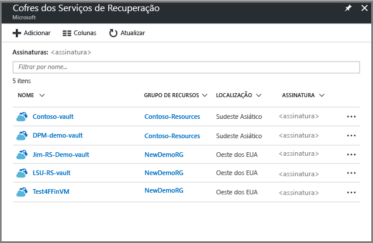
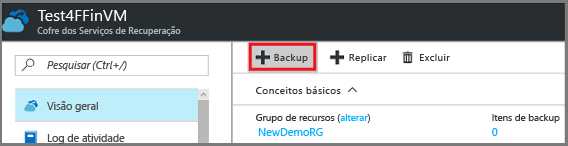
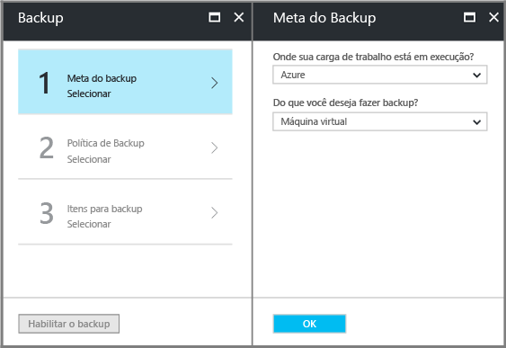
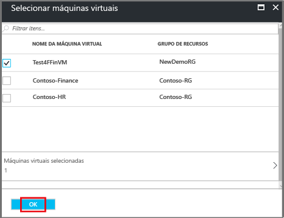
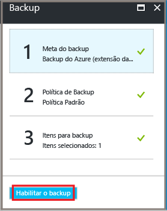

# <a name="back-up-azure-vms-in-a-recovery-services-vault"></a>Fazer backup de máquinas virtuais do Azure em um cofre dos Serviços de Recuperação

Este artigo descreve como fazer backup de VMs do Azure em um cofre de serviços de recuperação, usando o [Backup do Azure](backup-overview.md) service. 

Neste artigo, você aprenderá a:

> [!div class="checklist"]
> * Prepare VMs do Azure.
> * Crie um cofre.
> * Descobrir VMs e configurar uma política de backup.
> * Habilite o backup para VMs do Azure.
> * Executar o backup inicial.


> [!NOTE]
> Este artigo descreve como configurar um cofre e selecione VMs para fazer backup. Isso é útil se você quiser fazer backup de várias VMs. Como alternativa, você pode [fazer backup de uma única VM do Azure](backup-azure-vms-first-look-arm.md) diretamente das configurações de VM.

## <a name="before-you-start"></a>Antes de começar


- [Revisão](backup-architecture.md#architecture-direct-backup-of-azure-vms) a arquitetura de backup de VM do Azure.
- [Saiba mais sobre](backup-azure-vms-introduction.md) backup de VM do Azure e a extensão de backup.
- [Examine a matriz de suporte](backup-support-matrix-iaas.md) antes de configurar o backup.

Além disso, há algumas coisas que você talvez precise fazer em algumas circunstâncias:

- **Instalar o agente de VM na VM**: O Backup do Azure faz backup de VMs do Azure instalando uma extensão para o agente de VM do Azure em execução no computador. Se sua VM foi criada a partir de uma imagem do marketplace do Azure, o agente é instalado e em execução. Se você cria uma VM personalizada ou se você migrar uma máquina local, talvez você precise [instale manualmente o agente](#install-the-vm-agent).
- **Permitir o acesso de saída explicitamente**: Em geral, você não precisa permitir o acesso de rede de saída explicitamente para uma VM do Azure para que ele se comunicar com o Backup do Azure. No entanto, algumas VMs podem apresentar problemas de conexão, mostrando os **ExtensionSnapshotFailedNoNetwork** erro ao tentar se conectar. Se isso acontecer, você deve [permitir o acesso de saída explicitamente](#explicitly-allow-outbound-access), portanto, a extensão de Backup do Azure pode se comunicar com os endereços IP públicos do Azure para o tráfego de backup.


## <a name="create-a-vault"></a>Criar um cofre

 Um cofre armazena backups e pontos de recuperação criados ao longo do tempo e armazena as políticas de backup associadas às máquinas submetidas a backup. Crie um cofre da seguinte maneira:    

1. Entre no [Portal do Azure](https://portal.azure.com/).    
2. Na pesquisa, digite **serviços de recuperação**. Sob **Services**, clique em **cofres dos serviços de recuperação**.   

      <br/> 

3. Na **cofres dos serviços de recuperação** menu, clique em **+ adicionar**.    

        

4. Na **cofre dos Recovery Services**, digite um nome amigável para identificar o cofre.   
    - O nome deve ser exclusivo para a assinatura do Azure.   
    - Ele pode conter caracteres de 2 a 50.    
    - Ele deve começar com uma letra e pode conter apenas letras, números e hifens.   
5. Selecione a assinatura do Azure, grupo de recursos e região geográfica em que o cofre deve ser criado. Em seguida, clique em **Criar**.    
    - Pode levar algum tempo para que o cofre seja criado.  
    - Monitore as notificações de status na área superior direita do portal.   


 Depois que o cofre é criado, ele aparece na lista de cofres dos serviços de recuperação. Se você não encontrar seu cofre, selecione **Atualizar**.
 
    

### <a name="modify-storage-replication"></a>Modificar a replicação de armazenamento

Por padrão, os cofres de uso [armazenamento com redundância geográfica (GRS)](https://docs.microsoft.com/azure/storage/common/storage-redundancy-grs).

- Se o cofre é o mecanismo de backup principal, é recomendável que usar GRS.
- Você pode usar [armazenamento localmente redundante (LRS)](https://docs.microsoft.com/azure/storage/common/storage-redundancy-lrs?toc=%2fazure%2fstorage%2fblobs%2ftoc.json) para uma opção mais barata.

Modificar o tipo de replicação de armazenamento da seguinte maneira:

1. No novo cofre, clique em **propriedades** na **configurações** seção.
2. Na **propriedades**, em **configuração de Backup**, clique em **atualização**.
3. Selecione o tipo de replicação de armazenamento e, em seguida, clique em **salvar**.

      
> [!NOTE]
   > Você não pode modificar o tipo de replicação de armazenamento depois que o cofre está configurado e contém os itens de backup. Se você quiser fazer isso, você precisará recriar o cofre. 

## <a name="apply-a-backup-policy"></a>Aplicar uma política de backup

Configure uma política de backup para o cofre.

1. No cofre, clique em **+ Backup** na **visão geral** seção.

   


2. Na **meta de Backup** > **onde sua carga de trabalho é executada?** selecione **Azure**. Na **o que fazer você deseja fazer backup?** selecionar **Máquina Virtual** >  **Okey**. Isso registra a extensão da VM no cofre.

   

3. Na **Política de Backup**, escolha a política que você deseja associar ao cofre. 
    - A política padrão faz backup da VM, uma vez por dia. Os backups diários são mantidos por 30 dias. Instantâneos de recuperação instantânea são mantidos por dois dias.
    - Se você não quiser usar a política padrão, selecione **criar novo**e criar uma política personalizada, conforme descrito no próximo procedimento.

      

4. Na **selecionar máquinas virtuais**, selecione as VMs que você deseja fazer backup usando a política. Em seguida, clique em **OK**.

   - As VMs selecionadas são validadas.
   - Você só pode escolher máquinas virtuais na mesma região que o cofre.
   - O backup das VMs só pode ser feito em um único cofre.

     

5. Na **Backup**, clique em **habilitar backup**. Isso implantará a política no cofre e nas VMs e instalará a extensão de backup no agente da VM em execução na VM do Azure.
     
     

Depois de habilitar o backup:

- O serviço de Backup instala a extensão de backup independentemente de a VM estar em execução.
- Um backup inicial será executado de acordo com sua agenda de backup.
- Ao executar backups, observe o seguinte:
    - Uma VM que está sendo executado tem maior chance para capturar um ponto de recuperação consistente com o aplicativo.
    - No entanto, mesmo se a VM é desativada é feito backup. Essa VM é conhecida como uma VM offline. Nesse caso, o ponto de recuperação será consistente com falha.
    

### <a name="create-a-custom-policy"></a>Criar uma política personalizada

Se você optou por criar uma nova política de backup, preencha as configurações de política.

1. Na **nome da política**, especifique um nome significativo.
2. Na **agendamento de Backup** especificar quando os backups devem ser obtidos. Você pode fazer backups de diários ou semanais para VMs do Azure.
2. Na **a restauração instantânea**, especifique quanto tempo deseja reter instantâneos localmente para a restauração instantânea.
    - Quando você restaura, feito backup de VM discos são copiados do armazenamento, através da rede para o local de armazenamento de recuperação. Com a restauração instantânea, você pode aproveitar executados durante um trabalho de backup, sem esperar que dados sejam transferidos para o Cofre de backup de instantâneos armazenados localmente.
    - Você pode manter os instantâneos para a restauração instantânea para entre uma a cinco dias. Dois dias é a configuração padrão.
3. Na **período de retenção**, especifique quanto tempo deseja manter seus pontos de backup diários ou semanais.
4. Na **retenção mensal do ponto de backup**, especifique se deseja manter um mensal backup de seus backups diários ou semanais. 
5. Clique em **OK** para salvar a política.

    

> [!NOTE]
   > O Backup do Azure não oferece suporte ao ajuste automático do relógio para alterações de horário de verão para backups de VMs do Azure. Quando ocorrem alterações de tempo, modifica políticas de backup manualmente, conforme necessário.

## <a name="trigger-the-initial-backup"></a>Disparar o backup inicial

O backup inicial será executado de acordo com o agendamento, mas você pode executá-lo imediatamente da seguinte maneira:

1. No menu do cofre, clique em **Itens de backup**.
2. Em **Itens de Backup**, clique em **Máquina Virtual do Azure**.
3. No **itens de Backup** lista, clique nas reticências (...).
4. Clique em **Fazer backup agora**.
5. Na **fazer Backup agora**, use o controle de calendário para selecionar o último dia em que o ponto de recuperação deve ser mantido. Em seguida, clique em **OK**.
6. Monitorar as notificações do portal. Você pode monitorar o andamento do trabalho no painel do cofre > **Trabalhos de Backup** > **Em Andamento**. Dependendo do tamanho da VM, a criação do backup inicial pode demorar um pouco.

## <a name="optional-steps-install-agentallow-outbound"></a>Etapas opcionais (instalar o agente/permitir saída)
### <a name="install-the-vm-agent"></a>Instalar o agente de VM

O Backup do Azure faz backup de VMs do Azure instalando uma extensão para o agente de VM do Azure em execução no computador. Se sua VM foi criada a partir de uma imagem do Marketplace do Azure, o agente é instalado e em execução. Se você cria uma VM personalizada ou se você migrar uma máquina local, você talvez precise instalar o agente manualmente, conforme resumido na tabela.

**VM** | **Detalhes**
--- | ---
**Windows** | 1. [Baixe e instale](https://go.microsoft.com/fwlink/?LinkID=394789&clcid=0x409) o arquivo MSI do agente.<br/><br/> 2. Instale com permissões de administrador no computador.<br/><br/> 3. Verifique se a instalação. Na *C:\WindowsAzure\Packages* na VM, clique com botão direito **WaAppAgent.exe** > **propriedades**. Sobre o **detalhes** guia **versão do produto** deve ser 2.6.1198.718 ou superior.<br/><br/> Se você estiver atualizando o agente, certifique-se de que nenhuma operação de backup está em execução, e [reinstalar o agente](https://go.microsoft.com/fwlink/?LinkID=394789&clcid=0x409).
**Linux** | Instale usando um RPM ou pacote DEB do repositório de pacotes da distribuição. Esse é o método preferencial para instalar e atualizar o agente Linux do Azure. Todos os [provedores de distribuição aprovados](https://docs.microsoft.com/azure/virtual-machines/linux/endorsed-distros) integram o pacote do agente Linux do Azure em suas imagens e repositórios. O agente está disponível no [GitHub](https://github.com/Azure/WALinuxAgent), mas não recomendamos instalá-lo a partir daí.<br/><br/> Se você estiver atualizando o agente, verifique se nenhuma operação de backup está em execução e os binários de atualização.

### <a name="explicitly-allow-outbound-access"></a>Permitir explicitamente o acesso de saída

A extensão de backup em execução na máquina virtual precisa de acesso de saída para os endereços IP públicos do Azure.

- Em geral, você não precisa permitir o acesso de rede de saída explicitamente para uma VM do Azure para que ele se comunicar com o Backup do Azure.
- Se tiver dificuldades com VMs se conectar ou se você vir o erro **ExtensionSnapshotFailedNoNetwork** ao tentar se conectar, você deve permitir o acesso explicitamente para a extensão de backup possa se comunicar ao IP público do Azure endereços para o tráfego de backup. Métodos de acesso são resumidos na tabela a seguir.


**Opção** | **Ação** | **Detalhes** 
--- | --- | --- 
**Configurar regras de NSG** | Permitir os [intervalos de IP do datacenter do Azure](https://www.microsoft.com/download/details.aspx?id=41653).<br/><br/> Em vez de permitir e gerenciar todos os intervalos de endereço, você pode adicionar uma regra que permita o acesso ao serviço de Backup do Azure usando um [marca de serviço](backup-azure-arm-vms-prepare.md#set-up-an-nsg-rule-to-allow-outbound-access-to-azure). | [Saiba mais](../virtual-network/security-overview.md#service-tags) sobre marcas de serviço.<br/><br/> Marcas de serviços simplificam o gerenciamento de acesso e não incorrem em custos adicionais.
**Implantar um proxy** | Implante um servidor de proxy HTTP para rotear o tráfego. | Fornece acesso ao Azure por completo, não somente ao armazenamento.<br/><br/> É permitido o controle granular em relação às URLs de armazenamento.<br/><br/> Único ponto de acesso à Internet para VMs.<br/><br/> Custos adicionais para o proxy.
**Configurar o Firewall do Azure** | Permite o tráfego por meio do Firewall do Azure na VM, usando uma tag de FQDN para o serviço de Backup do Azure | Simples de usar se você tiver o Firewall do Azure configurado em uma sub-rede de rede virtual.<br/><br/> É possível criar suas próprias marcações de FQDN, ou modificar os FQDNs em uma marca.<br/><br/> Se suas VMs do Azure possuem discos gerenciados, você talvez precise abrir adicional (8443) de porta nos firewalls.

#### <a name="establish-network-connectivity"></a>Estabelecer conectividade de rede

Estabelecer conectividade com o NSG, pelo proxy, ou por meio do firewall

##### <a name="set-up-an-nsg-rule-to-allow-outbound-access-to-azure"></a>Configurar uma regra NSG para permitir o acesso de saída ao Azure

Se um NSG gerencia o acesso VM, permitir o acesso de saída para o armazenamento de backup para as portas e intervalos necessários.

1. Nas propriedades da VM > **Networking**, selecione **Adicionar regra de porta de saída**.
2. Na **Adicionar regra de segurança de saída**, selecione **avançado**.
3. Em **Fonte**, escolha **VirtualNetwork**.
4. Na **intervalos de porta de origem**, digite um asterisco (*) para permitir o acesso de saída de qualquer porta.
5. Em **Destino**, escolha **Marca de Serviço**. Na lista, selecione **Storage.region**. A região é onde o cofre e as VMs que você deseja fazer backup, estão localizadas.
6. Em **Intervalos de portas de destino**, escolha a porta.
    - VM não gerenciada com conta de armazenamento não criptografada: 80
    - VM não gerenciada com conta de armazenamento criptografada: 443 (configuração padrão)
    - VM gerenciada: 8443.
7. Em **Protocolo**, escolha **TCP**.
8. Em **Prioridade**, especifique um valor de prioridade menor que qualquer regra de negação maior.
   
   Se você tiver uma regra que nega o acesso, o novo permitir a regra deve ser maior. Por exemplo, se você tiver uma regra **Deny_All** definida com prioridade 1000, a nova regra deverá ser definida com um valor inferior a 1000.
9. Forneça um nome e descrição para a regra e, em seguida, selecione **Okey**.

Você pode aplicar a regra de NSG para várias VMs para permitir acesso de saída. Este vídeo orienta você durante o processo.

>[!VIDEO https://www.youtube.com/embed/1EjLQtbKm1M]


##### <a name="route-backup-traffic-through-a-proxy"></a>Rotear o tráfego de backup por meio de um proxy

Você pode rotear o tráfego de backup por um proxy e, em seguida, fornecer o acesso de proxy aos intervalos necessários do Azure. Configure o proxy de VM para permitir que o seguinte:

- A VM do Azure deve rotear todo o tráfego HTTP voltado para a Internet pública por meio do proxy.
- O proxy deve permitir o tráfego de entrada de VMs na rede virtual aplicável.
- O NSG **NSF-lockdown** precisa de uma regra que permita a saída do tráfego de Internet da VM do proxy.

###### <a name="set-up-the-proxy"></a>Configurar o proxy

Se você não tiver um proxy de conta do sistema, configure um da seguinte maneira:

1. Baixe o [PsExec](https://technet.microsoft.com/sysinternals/bb897553).
2. Execute **PsExec.exe -i -s cmd.exe** para executar o prompt de comando em uma conta do sistema.
3. Execute o navegador no contexto do sistema. Por exemplo, use **%PROGRAMFILES%\Internet Explorer\iexplore.exe** para o Internet Explorer.  
4. Defina as configurações de proxy.
   - Em máquinas do Linux:
     - Adicione esta linha ao arquivo **/etc/environment**:
       - **http_proxy=http:\//proxy IP address:proxy port**
     - Adicione estas linhas ao arquivo **/etc/waagent.conf**:
         - **Endereço IP HttpProxy.Host=proxy**
         - **Porta HttpProxy.Port=proxy**
   - Em computadores Windows, nas configurações do navegador, especifique que um proxy deverá ser usado. Se estiver usando um proxy em uma conta de usuário, você poderá usar esse script para aplicar a configuração no nível de conta do sistema.
       ```powershell
      $obj = Get-ItemProperty -Path Registry::"HKEY_CURRENT_USER\Software\Microsoft\Windows\CurrentVersion\Internet Settings\Connections"
      Set-ItemProperty -Path Registry::"HKEY_USERS\S-1-5-18\Software\Microsoft\Windows\CurrentVersion\Internet Settings\Connections" -Name DefaultConnectionSettings -Value $obj.DefaultConnectionSettings
      Set-ItemProperty -Path Registry::"HKEY_USERS\S-1-5-18\Software\Microsoft\Windows\CurrentVersion\Internet Settings\Connections" -Name SavedLegacySettings -Value $obj.SavedLegacySettings
      $obj = Get-ItemProperty -Path Registry::"HKEY_CURRENT_USER\Software\Microsoft\Windows\CurrentVersion\Internet Settings"
      Set-ItemProperty -Path Registry::"HKEY_USERS\S-1-5-18\Software\Microsoft\Windows\CurrentVersion\Internet Settings" -Name ProxyEnable -Value $obj.ProxyEnable
      Set-ItemProperty -Path Registry::"HKEY_USERS\S-1-5-18\Software\Microsoft\Windows\CurrentVersion\Internet Settings" -Name Proxyserver -Value $obj.Proxyserver

       ```

###### <a name="allow-incoming-connections-on-the-proxy"></a>Permitir conexões de entrada no proxy

Permite conexões de entrada nas configurações do proxy.

1. No Firewall do Windows, abra **Firewall do Windows com segurança avançada**.
2. Clique com o botão direito do mouse em **Regras de Entrada** > **Nova Regra**.
3. Na **tipo de regra**, selecione **personalizado** > **próximo**.
4. Em **Programa**, escolha **Todos os Programas** > **Avançar**.
5. Na **protocolos e portas**:
   - Defina o tipo como **TCP**.
   - Definir **portas locais** à **portas específicas**.
   - Definir **porta remota** à **todas as portas**.
  
6. Conclua o assistente e especifique um nome para a regra.

###### <a name="add-an-exception-rule-to-the-nsg-for-the-proxy"></a>Adicionar uma regra de exceção ao NSG para o proxy

No NSG **NSF-lockdown**, permita o tráfego de qualquer porta em 10.0.0.5 para qualquer endereço da Internet na porta 80 (HTTP) ou 443 (HTTPS).

O script do PowerShell a seguir fornece um exemplo de como habilitar o tráfego.
Em vez de permitir saída para todos os endereços de internet pública, você pode especificar um intervalo de endereços IP (`-DestinationPortRange`), ou usar a marca de serviço storage.region.   

```powershell
Get-AzureNetworkSecurityGroup -Name "NSG-lockdown" |
Set-AzureNetworkSecurityRule -Name "allow-proxy " -Action Allow -Protocol TCP -Type Outbound -Priority 200 -SourceAddressPrefix "10.0.0.5/32" -SourcePortRange "*" -DestinationAddressPrefix Internet -DestinationPortRange "80-443"
```

##### <a name="allow-firewall-access-with-an-fqdn-tag"></a>Permitir o acesso de firewall com uma marca FQDN

Você pode configurar o Firewall do Azure para permitir o acesso de saída para o tráfego de rede para o Backup do Azure.

- [Saiba como](https://docs.microsoft.com/azure/firewall/tutorial-firewall-deploy-portal) implantar o Firewall do Azure.
- [Leia sobre](https://docs.microsoft.com/azure/firewall/fqdn-tags) as marcas de FQDN.


## <a name="next-steps"></a>Próximas etapas

- Solucione problemas com o [agentes de VM do Azure](backup-azure-troubleshoot-vm-backup-fails-snapshot-timeout.md) ou [backup de VM do Azure](backup-azure-vms-troubleshoot.md).
- [Restaurar](backup-azure-arm-restore-vms.md) as VMs do Azure.

