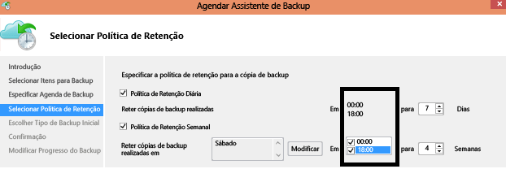

# Backup do Azure — Perguntas frequentes
Este artigo responde às perguntas frequentes sobre o serviço de Backup do Azure.

## Cofre dos serviços de recuperação

### Há algum limite para o número de cofres que podem ser criados em cada assinatura do Azure?
Sim. Crie até 500 cofres dos Serviços de Recuperação por região com suporte do Backup do Azure por assinatura. Se você precisar de cofres adicionais, crie outra assinatura.

### Há limites para o número de servidores/computadores que podem ser registrados em cada cofre?
Você pode registrar no máximo 1000 máquinas virtuais do Azure por cofre. Se estiver usando o agente de Backup do Microsoft Azure, você poderá registrar até 50 agentes MAB por cofre. E você pode registrar servidores DPM/servidores MAB 50 em um cofre.

### Se a minha organização tiver um cofre, como posso isolar dados de servidores diferentes no cofre ao restaurar dados?
Os dados do servidor que você deseja recuperar juntos devem usar a mesma frase secreta ao configurar o backup. Se você quiser isolar a recuperação para um servidor ou servidores específicos, use uma frase secreta somente para esse servidor ou servidores. Por exemplo, os servidores de recursos humanos podem usar uma senha de criptografia, os servidores de contabilidade podem usar outra senha e os outros servidores de armazenamento podem usar uma terceira senha.

### Posso mover meu cofre entre assinaturas?
Sim. Para mover um Cofre dos Serviços de Recuperação, consulte este [artigo](backup-azure-move-recovery-services-vault.md)

### Posso mover dados de backup para outro cofre?
Não. Os dados de backup armazenados em um cofre não podem ser movidos para um cofre diferente.

### Posso alterar de GRS para LRS depois de um backup?
Não. Um cofre do Recovery Services só pode alterar as opções de armazenamento antes que os backups sejam armazenados.

### Posso criar uma ILR (restauração no nível do item) para VMs com backup em um cofre dos Serviços de Recuperação?
- O ILR tem suporte para VMs do Azure com backup pelo backup de VM do Azure. Para saber mais, confira este [artigo](backup-azure-restore-files-from-vm.md)
- ILR não há suporte para pontos de recuperação online de VMs locais com suporte pelo servidor de backup do Azure ou o System Center DPM.

## Agente de Backup do Azure

### Onde posso encontrar perguntas comuns sobre o agente do Backup do Azure para o backup da VM do Azure?

- Para o agente em execução nas VMs do Azure, leia estas [Perguntas frequentes](backup-azure-vm-backup-faq.md).
- Para o agente usado para fazer backup de pastas de arquivos do Azure, leia estas [Perguntas frequentes](backup-azure-file-folder-backup-faq.md).

## Backup do VMware e Hyper-V

### Posso fazer backup de servidores do VMware vCenter para o Azure?
Sim. Você pode usar o Servidor de Backup do Azure para fazer backup dos hosts VMware vCenter Server e ESXi no Azure.

- [Saiba mais](backup-mabs-protection-matrix.md) sobre as versões compatíveis.
- [Siga estas etapas](backup-azure-backup-server-vmware.md) para fazer backup de um servidor VMware.

### É necessário uma licença separada para recuperar um cluster do VMware/Hyper-V local completo?
Você não precisa separar licenciamento para a proteção de VMware/Hyper-V.

- Se você for um cliente do System Center, use o System Center Data Protection Manager (DPM) para proteger as VMs do VMware.
- Se você não for um cliente do System Center, você pode usar o Servidor de Backup do Azure (pré-pago) para proteger as VMs VMware.

## Backup do DPM e do Servidor de Backup do Azure

### Há suporte para quais versões do DPM?
As versões compatíveis do DPM estão resumidas na [matriz de suporte](backup-azure-dpm-introduction.md#prerequisites-and-limitations). Recomendamos que você instale as atualizações mais recentes do DPM e execute a [versão mais recente](https://aka.ms/azurebackup_agent) do agente de Backup do Azure no servidor do DPM.

### Posso registrar o servidor em vários cofres?
Não. Um servidor do DPM ou do Backup do Azure pode ser registrado em apenas um cofre.

### Posso usar o servidor de Backup do Azure para criar um backup BMR (Recuperação Bare-Metal) para um servidor físico?  
Sim.

### Pode usar o DPM para fazer backup de aplicativos na pilha do Azure?
Não. Você pode usar o Backup do Azure para proteger o Azure Stack, o Backup do Azure não oferece suporte ao uso do DPM para fazer backup de aplicativos no Azure Stack.

### Se eu instalei o agente do Backup do Azure para proteger meus arquivos e pastas, posso instalar o System Center DPM para fazer backup de cargas de trabalho locais no Azure?
Sim. Mas você deve configurar o DPM primeiro e depois instalar o agente de Backup do Azure.  Instalar os componentes nesta ordem garante que o agente de Backup do Azure funcione com o DPM. Instalar o agente antes de instalar o DPM não é aconselhável e não há suporte para isso.

## Backup geral

### Há limites no agendamento de backup?
Sim.
- Você pode fazer backup de computadores Windows Server ou Windows até três vezes por dia. Você pode definir a política de agendamento para agendamentos diários ou semanais.
- Você pode fazer backup do DPM até duas vezes por dia. Você pode definir a política de agendamento para agendamentos diários, semanais, mensais e anuais.
- Você faz backup de VMs do Azure uma vez por dia.

### Há suporte para backup de quais sistemas operacionais?
O Backup do Azure dá suporte a esses sistemas operacionais para backup de arquivos e pastas, além de aplicativos protegidos usando o Servidor de Backup do Azure e o DPM.

**SO** | **SKU** | **Detalhes**
--- | --- | ---
Estação de trabalho | |
Windows 10 de 64 bits | Enterprise, Pro, Home | As máquinas devem estar executando os pacotes e as atualizações de serviços mais recentes.
Windows 8.1 de 64 bits | Enterprise, Pro | As máquinas devem estar executando os pacotes e as atualizações de serviços mais recentes.
Windows 8 de 64 bits | Enterprise, Pro | As máquinas devem estar executando os pacotes e as atualizações de serviços mais recentes.
Windows 7 de 64 bits | Ultimate, Enterprise, Professional, Home Premium, Home Basic, Starter | As máquinas devem estar executando os pacotes e as atualizações de serviços mais recentes.
Servidor | |
Windows Server 2019 64 bits | Standard, Datacenter, Essentials | Com os service packs/atualizações mais recentes.
Windows Server 2016 de 64 bits | Standard, Datacenter, Essentials | Com os service packs/atualizações mais recentes.
Windows Server 2012 R2 de 64 bits | Standard, Datacenter, Foundation | Com os service packs/atualizações mais recentes.
Windows Server 2012 de 64 bits | Datacenter, Foundation, Standard | Com os service packs/atualizações mais recentes.
Windows Storage Server 2016 de 64 bits | Standard, Workgroup | Com os service packs/atualizações mais recentes.
Windows Storage Server 2012 R2 de 64 bits | Standard, Workgroup, Essential | Com os service packs/atualizações mais recentes.
Windows Storage Server 2012 de 64 bits | Standard, Workgroup | Com os service packs/atualizações mais recentes.
Windows Server 2008 R2 SP1 de 64 bits | Standard, Enterprise, Datacenter, Foundation | Com as atualizações mais recentes.
Windows Server 2008 de 64 bits | Standard, Enterprise, Datacenter | Com as atualizações mais recentes.

Para backups do Linux na VM do Azure, o Backup do Azure oferece suporte para [a lista de distribuições endossadas pelo Azure](../virtual-machines/linux/endorsed-distros.md), exceto o principal sistema operacional Linux e sistema operacional de 32 bits. Outras distribuições personalizadas do Linux devem funcionar, contanto que o agente de VM esteja disponível na VM e exista suporte para Python.

### Há limites de tamanho para o backup de dados?
Os limites de tamanho são os seguintes:

Sistema operacional/computador | Limite de tamanho da fonte de dados
--- | --- 
Windows 8 ou superior | 54.400 GB
Windows 7 |1700 GB
Windows Server 2012 ou posterior | 54.400 GB
Windows Server 2008, Windows Server 2008 R2 | 1700 GB
VM do Azure | 16 discos de dados   Disco de dados de até 4095 GB

### Como é determinado o tamanho da fonte de dados?
A tabela a seguir explica como cada tamanho de fonte de dados é determinado.

**Fonte de dados** | **Detalhes**
--- | ---
Volume |A quantidade de dados incluída no backup da VM de volume único que está sendo submetida a backup.
Banco de dados do SQL Server |O tamanho de um único banco de dados SQL do qual está sendo feito o backup.
SharePoint | A soma dos bancos de dados de conteúdo e de configuração em um farm do SharePoint do qual está sendo feito o backup.
Exchange |Soma de todos os bancos de dados do Exchange em um servidor Exchange do qual está sendo feito o backup.
Estado do sistema/BMR |Cada cópia individual do BMR ou do estado do sistema da máquina da qual está sendo feito o backup.

### Há um limite na quantidade de dados de backup em um cofre dos Serviços de Recuperação?
Não há nenhum limite para a quantidade de dados das quais você pode fazer backup usando um cofre dos Serviços de Recuperação.

### Por que o tamanho dos dados transferidos para o cofre dos Serviços de Recuperação é menor do que os dados selecionados para backup?
Os dados dos quais é feito backup do Azure Backup Agent, DPM e Servidor de Backup do Azure são compactados e criptografados antes de serem transferidos. Com a compactação e a criptografia aplicadas, os dados no cofre são 30% a 40% menores.

### Posso excluir arquivos individuais de um ponto de recuperação no cofre?
Não, o Backup do Microsoft Azure não dá suporte a exclusão ou limpeza de itens individuais de backups armazenados.

### Se eu cancelar um trabalho de backup depois de iniciado, os dados de backup transferidos serão excluídos?
Não. Todos os dados transferidos para o cofre, antes do cancelamento do trabalho de backup, permanecem no cofre.

- O Backup do Azure usa um mecanismo de ponto de verificação para, ocasionalmente, adicionar pontos de verificação aos dados de backup durante o backup.
- Como há pontos de verificação nos dados de backup, o próximo processo de backup pode validar a integridade dos arquivos.
- O próximo trabalho de backup será incremental para os dados cujo backup foi realizado anteriormente. Os backups incrementais transferem apenas dados novos ou alterados, que equivalem à melhor utilização da largura de banda.

Se você cancelar um trabalho de backup para uma VM do Azure, os dados transferidos serão ignorados. O próximo trabalho de backup transfere dados incrementais do último trabalho de backup bem-sucedido.

## Retenção e recuperação

### As políticas de retenção para computadores do DPM e do Windows sem o DPM são as mesmas?
Sim, ambos têm políticas de retenção diárias, semanais, mensais e anuais.

### Posso personalizar as políticas de retenção?
Sim, você pode personalizar políticas. Por exemplo, você pode configurar os requisitos de retenção semanais e diários, mas não anuais e mensais.

### Posso usar períodos diferentes para agendamento de backup e políticas de retenção?
Não. As políticas de retenção só podem ser aplicadas em pontos de backup. Por exemplo, essas imagens mostram uma política de retenção para backups feitos às 12h e às 18h.

### Se um backup for mantido por um longo tempo, levará mais tempo para recuperar um ponto de dados mais antigo?  
Não. O tempo de recuperação do ponto mais antigo ou mais recente é o mesmo. Cada ponto de recuperação se comporta como um ponto completo.

### Se cada ponto de recuperação é como um ponto completo, isso afeta o armazenamento de backup total cobrável?
Os produtos típicos de ponto de retenção de longo prazo armazenam dados de backup como pontos completos.

    - Os pontos completos *não oferecem economia* de armazenamento, mas são mais fáceis e rápidos de restaurar.
    - As cópias incrementais *oferecem economia* de armazenamento, mas exigem que você restaure uma cadeia de dados, o que afeta o tempo de recuperação.

A arquitetura de armazenamento do Backup do Azure oferece o melhor dos dois recursos, armazenando dados de forma otimizada para restaurações rápidas e incorrendo em baixos custos de armazenamento. Isso garante que a largura de banda de entrada e saída seja usada com eficiência. A quantidade de armazenamento de dados e o tempo necessário para recuperar os dados são mantidos em um mínimo. Saiba mais sobre [backups incrementais](https://azure.microsoft.com/blog/microsoft-azure-backup-save-on-long-term-storage/).

### Há um limite para o número de pontos de recuperação que podem ser criados?
Você pode criar até 9999 pontos de recuperação por instância protegida. Uma instância protegida é um computador, servidor (físico ou virtual) ou carga de trabalho que faz backup de dados no Azure.

- Saiba mais sobre [backup e retenção](./backup-introduction-to-azure-backup.md#backup-and-retention).
- Saiba mais sobre [instâncias protegidas](./backup-introduction-to-azure-backup.md#what-is-a-protected-instance).

### Quantas vezes posso recuperar dados cujo backup foi feito no Azure?
Não há limite para o número de recuperações do Backup do Azure.

### Ao restaurar dados, eu pago pelo tráfego de saída do Azure?
Não. A recuperação é gratuita e você não é cobrado pelo tráfego de saída.

### O que acontece quando altero minha política de backup?
Quando uma nova política for aplicada, a agenda e a retenção da nova política serão seguidas.

- Se a retenção for estendida, os pontos de recuperação existentes serão marcados para mantê-los de acordo com a nova política.
- Se a retenção for reduzida, eles serão marcados para remoção no próximo trabalho de limpeza e subsequentemente excluídos.

## Criptografia

### Os dados são enviados para o Azure criptografados?
Sim. Os dados são criptografados no computador local usando o AES256. Os dados são enviados por um link HTTPS seguro. Os dados transmitidos na nuvem são protegidos por um link HTTPS entre o armazenamento e o serviço de recuperação. O protocolo iSCSI protege os dados transmitidos entre o serviço de recuperação e o computador de usuário. O túnel seguro é usado para proteger o canal iSCSI.

### Os dados de backup também são criptografados no Azure?
Sim. Os dados no Azure são criptografados em repouso.

- Para backup local, a criptografia em repouso é realizada usando a frase secreta que você fornece ao fazer backup no Azure.
- Para VMs do Azure, os dados são criptografados em repouso usando SSE (Criptografia do Serviço de Armazenamento).

A Microsoft não descriptografa os dados de backup em nenhum momento.

### Qual é o comprimento mínimo da chave de criptografia usada para criptografar os dados de backup?
A chave de criptografia deve ter pelo menos 16 caracteres, quando você estiver usando o agente de backup do Azure. Para VMs do Azure, não há nenhum limite para o comprimento das chaves usadas pelo KeyVault do Azure.

### O que acontecerá se eu inserir a chave de criptografia incorretamente? Posso recuperar os dados? A Microsoft pode recuperar os dados?
A chave usada para criptografar os dados de backup está presente apenas no seu site. A Microsoft não mantém uma cópia no Azure e não tem qualquer acesso à chave. Se você perder a chave, a Microsoft não poderá recuperar os dados de backup.

## Próximas etapas

Leia as outras perguntas frequentes:

- [Perguntas comuns](backup-azure-vm-backup-faq.md) sobre backups de VM do Azure.
- [Perguntas comuns](backup-azure-file-folder-backup-faq.md) sobre o agente do Backup do Azure
