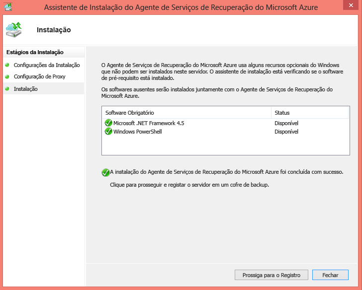
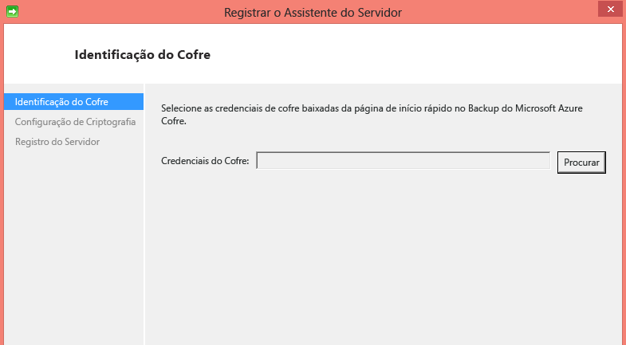
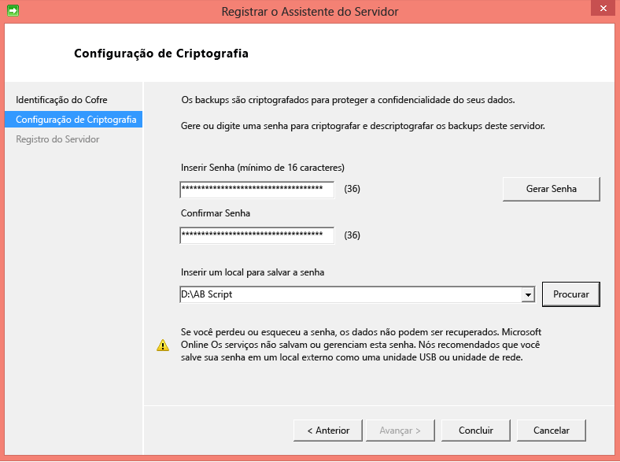
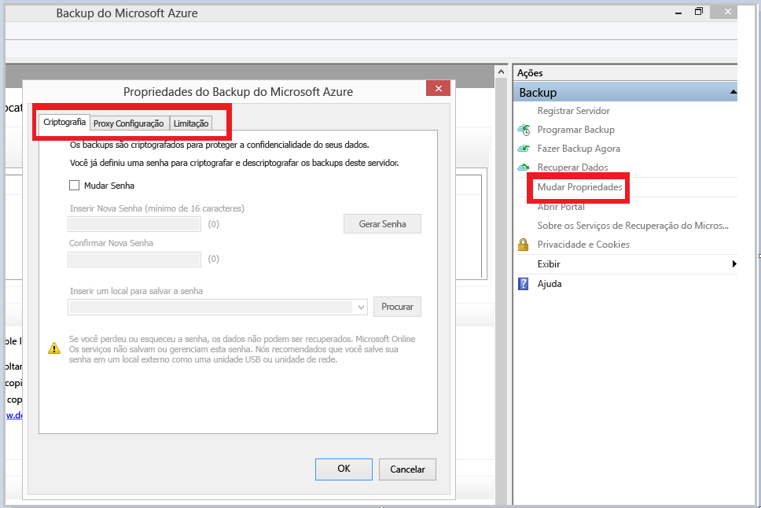
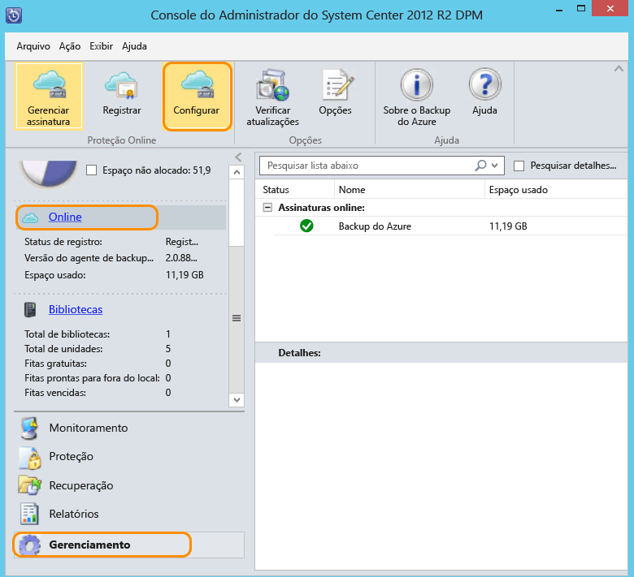

<properties
	pageTitle="Introdução ao backup do DPM do Azure | Microsoft Azure"
	description="Uma introdução ao backup de servidores de DPM usando o serviço de Backup do Azure"
	services="backup"
	documentationCenter=""
	authors="Nkolli1"
	manager="shreeshd"
	editor=""
	keywords="Gerenciador de proteção de dados do System Center, gerenciador de proteção de dados, backup do dpm"/>

<tags
	ms.service="backup"
	ms.workload="storage-backup-recovery"
	ms.tgt_pltfrm="na"
	ms.devlang="na"
	ms.topic="article"
	ms.date="05/10/2016"
	ms.author="trinadhk;giridham;jimpark;markgal"/>

# Preparando-se para fazer backup de cargas de trabalho no Azure com o DPM

> [AZURE.SELECTOR]
- [Servidor de Backup do Azure](backup-azure-microsoft-azure-backup.md)
- [SCDPM](backup-azure-dpm-introduction.md)
- [Servidor de Backup do Azure (clássico)](backup-azure-microsoft-azure-backup-classic.md)
- [SCDPM (clássico)](backup-azure-dpm-introduction-classic.md)

Este artigo fornece uma introdução ao uso do Backup do Microsoft Azure para proteger seus servidores e cargas de trabalho do Center Data Protection Manager. Lendo-o, você entenderá:

- Como funciona o backup do servidor DPM do Azure
- Os pré-requisitos para obter uma experiência positiva de backup
- Os erros típicos encontrados e como lidar com eles
- Cenários com suporte

> [AZURE.NOTE] O Azure tem dois modelos de implantação para a criação e o trabalho com recursos: [Gerenciador de Recursos e clássico](../resource-manager-deployment-model.md). Este artigo fornece informações e procedimentos para a restauração de VMs implantadas usando o modelo do Gerenciador de Recursos.

O System Center DPM faz backup dos dados de arquivos e aplicativos. O backup dos dados no DPM pode ser feito em fita, em disco, ou no Azure com o Backup do Microsoft Azure. O DPM interage com o Backup do Azure da seguinte maneira:

- **DPM implantado como servidor físico ou máquina virtual local** – se o DPM for implantado como servidor físico ou máquina virtual local Hyper-V, é possível fazer backup dos dados em um cofre dos Serviços de Recuperação além do backup em disco e em fita.
- **DPM implantado como máquina virtual do Azure** — No System Center 2012 R2 com atualização 3, o DPM pode ser implantado como máquina virtual do Azure. Se o DPM for implantado como uma máquina virtual do Azure, você pode fazer backup de dados em discos do Azure anexados à máquina virtual do DPM Azure, ou você pode descarregar o armazenamento de dados fazendo o backup em um cofre dos Serviços de Recuperação.

## Por que fazer backup de seus servidores DPM?

Os benefícios comerciais do uso do Backup do Azure para backup de servidores DPM são:

- Para implantação do DPM no local, você pode usar o Azure como uma alternativa para implantação de longo prazo em fita.
- Para implantações do DPM no Azure, o Azure Backup permite descarregar armazenamento do disco do Azure, permitindo escalar verticalmente armazenando dados mais antigos no cofre dos Serviços de Recuperação e novos dados no disco.

## Como funciona o backup do servidor DPM?
Para fornecer proteção de dados baseada em disco, o servidor DPM cria e mantém uma réplica, ou cópia, dos dados que estão nos servidores protegidos. As réplicas são armazenadas no pool de armazenamento, que consiste em um conjunto de discos no servidor DPM ou em um volume personalizado. Se você está protegendo os dados de arquivos ou dados de aplicativo, a proteção começa com a criação da réplica da fonte de dados. A réplica é sincronizada ou atualizada em intervalos regulares de acordo com as configurações que você definir. Quando você usa proteção baseada em disco de curto prazo e a proteção de longo prazo para a nuvem, o DPM pode fazer backup de dados xo volume de réplica para o cofre dos Serviços de Recuperação para que não haja nenhum impacto no computador protegido.

## Pré-requisitos
Prepare o Backup do Azure para fazer backup dos dados do DPM da seguinte maneira:

1. **Criar um cofre dos Serviços de Recuperação** – crie um cofre no portal do Azure.
2. **Baixar credenciais do cofre** – baixe as credenciais que você usa para registrar o servidor DPM no cofre dos Serviços de Recuperação.
3. **Instalar o Agente de Backup do Azure e registrar o servidor** – No Backup do Azure, instale o agente em cada servidor DPM e registre o servidor DPM no cofre dos Serviços de Recuperação.

### 1\. Criar um cofre dos Serviços de Recuperação
Para criar um cofre dos Serviços de Recuperação:

1. Entre no [Portal do Azure](https://portal.azure.com/).

2. No menu Hub, clique em **Procurar** e, na lista de recursos, digite **Serviços de Recuperação**. Quando você começar a digitar, a lista será filtrada com base em sua entrada. Clique em **Cofre dos Serviços de Recuperação**.

    

    A lista de cofres dos Serviços de Recuperação é exibida.

3. No menu **Cofres dos Serviços de Recuperação**, clique em **Adicionar**.

    

    A folha do cofre dos Serviços de Recuperação será aberta, solicitando que você forneça o **Nome**, a **Assinatura**, o **Grupo de recursos** e o **Local**.

    

4. Em **Nome**, insira um nome amigável para identificar o cofre. O nome precisa ser exclusivo para a assinatura do Azure. Digite um nome que contenha de 2 a 50 caracteres. Ele deve começar com uma letra e pode conter apenas letras, números e hifens.

5. Clique em **Assinatura** para ver a lista de assinaturas disponíveis. Se você não tiver certeza sobre qual assinatura usar, utilize a assinatura padrão (ou sugerida). Só haverá múltiplas opções se sua conta organizacional estiver associada a várias assinaturas do Azure.

6. Clique em **Grupo de recursos** para ver a lista dos Grupos de recursos disponíveis ou clique em **Novo** para criar um novo Grupo de recursos. Para obter informações completas sobre Grupos de recursos, confira [Visão geral do Azure Resource Manager](../resource-group-overview.md)

7. Clique em **Local** para selecionar a região geográfica do cofre.

8. Clique em **Criar**. Talvez demore um pouco para o cofre de Serviços de Recuperação ser criado. Monitore as notificações de status na área superior direita no portal. Depois que o cofre é criado, ele é aberto no portal.

### Definir replicação de armazenamento

A opção de replicação de armazenamento permite que você escolha entre o armazenamento com redundância geográfica e armazenamento com redundância local. Por padrão, seu cofre tem armazenamento com redundância geográfica. Deixe a opção definida como armazenamento com redundância geográfica se este for seu backup principal. Escolha o armazenamento com redundância local se quiser uma opção mais barata que não seja tão durável. Leia mais sobre as opções de armazenamento [com redundância geográfica](../storage/storage-redundancy.md#geo-redundant-storage) e [com redundância local](../storage/storage-redundancy.md#locally-redundant-storage) na [visão geral da replicação do Armazenamento do Azure](../storage/storage-redundancy.md).

Para editar a configuração de replicação de armazenamento:

1. Selecione seu cofre para abrir o painel do cofre e a folha Configurações. Se a folha **Configurações** não abrir, clique em **Todas as configurações** no painel do cofre.

2. Na folha **Configurações**, clique em **Infraestrutura de Backup** > **Configuração de Backup** para abrir a folha **Configuração de Backup**. Na folha **Configuração de Backup**, escolha a opção de replicação de armazenamento para seu cofre.

    

    Depois de escolher a opção de armazenamento para o cofre, você estará pronto para associar a VM ao cofre. Para iniciar a associação, você deverá descobrir e registrar as máquinas virtuais do Azure.

### 2\. Baixar as credenciais do cofre

O arquivo de credenciais do cofre é um certificado gerado pelo portal para cada cofre de backup. O portal, em seguida, carrega a chave pública no ACS (Serviço de Controle de Acesso). A chave privada do certificado é disponibilizada para o usuário como parte do fluxo de trabalho que é fornecido como uma entrada no fluxo de trabalho de registro do computador. Isso autentica o computador para enviar os dados de backup para um cofre identificado no serviço de Backup do Azure.

As credenciais do cofre são usadas somente durante o fluxo de trabalho de registro. É responsabilidade do usuário garantir que o arquivo de credenciais do cofre não seja comprometido. Se esse arquivo acabar em poder de qualquer usuário não autorizado, o arquivo de credenciais do cofre poderá ser usado para registrar outros computadores no mesmo cofre. No entanto, como os dados de backup são criptografados usando uma senha que pertence ao cliente, os dados de backup existentes não poderão ser comprometidos. Para atenuar esse problema, as credenciais do cofre são definidas para expirar em 48 horas. Você pode baixar as credenciais dos serviços de recuperação quantas vezes quiser, mas apenas o último arquivo de credencial do cofre será aplicável durante o fluxo de trabalho de registro.

O arquivo de credencial do cofre é baixado por meio de um canal seguro no Portal do Azure. O serviço de Backup do Azure não tem conhecimento da chave privada do certificado e a chave privada não é mantida no portal nem no serviço. Use as etapas a seguir para baixar o arquivo de credenciais do cofre para um computador local.

1. Entre no [Portal do Azure](https://portal.azure.com/).

2. Abra o cofre dos Serviços de Recuperação para o qual você deseja registrar o computador do DPM.

3. A folha de configurações abre por padrão. Se estiver fechada, clique em **Configurações** no painel do cofre para abrir a folha de configurações. Na folha Configurações, clique em **Propriedades**.

	

4. Na página Propriedades, clique em **Baixar** em **Credenciais de Backup**. O portal gera o arquivo de credencial de cofre, que fica disponível para download.

    

O portal gerará uma credencial de cofre usando uma combinação do nome do cofre e a data atual. Clique em **Salvar** para baixar as credenciais do cofre para a pasta de downloads da conta local ou selecione Salvar Como no menu Salvar para especificar um local para as credenciais do cofre. Demorará um minuto para que o arquivo seja gerado.

### Observação
- Certifique-se de que as credenciais do cofre sejam salvas em um local que pode ser acessado no seu computador. Se forem armazenadas em um compartilhamento de arquivos/SMB, verifique as permissões de acesso.
- O arquivo de credenciais do cofre é usado somente durante o fluxo de trabalho de registro.
- O arquivo de credenciais do cofre expira após 48 horas e pode ser baixado no portal.

### 3\. Instalar o Backup Agent

Após a criação do cofre de Backup do Azure, um agente deverá ser instalado em cada um dos computadores com o Windows (o Windows Server, o cliente do Windows, o servidor do System Center Data Protection Manager ou o computador do Azure Backup Server), o que permitirá o backup de dados e de aplicativos no Azure.

1. Abra o cofre dos Serviços de Recuperação para o qual você deseja registrar o computador do DPM.

2. A folha de configurações abre por padrão. Se ela estiver fechada, clique em **Configurações** para abrir a folha de configurações. Na folha Configurações, clique em **Propriedades**.

	

3. Na página de Configurações, clique em **Baixar** em **Agente de Backup do Azure**.

    

   Quando o agente for baixado, clique duas vezes em MARSAgentInstaller.exe para iniciar a instalação do Agente de Backup do Azure. Escolha a pasta de instalação e a pasta de rascunho necessárias para o agente. O local do cache especificado deve ter espaço livre, que é pelo menos 5% dos dados de backup.

4.	Se você usar um servidor proxy para se conectar à Internet, na tela **Configuração de Proxy**, insira os detalhes do servidor proxy. Se você usar um proxy autenticado, insira os detalhes de nome de usuário e senha nessa tela.

5.	O agente de Backup do Azure instala o .NET Framework 4.5 e o Windows PowerShell (se ele ainda não estiver disponível) para concluir a instalação.

6.	Depois que o agente estiver instalado, clique no botão **Prosseguir com o Registro** para continuar com o fluxo de trabalho.

    

7. Na tela de credenciais do cofre, procure e selecione o arquivo de credenciais do cofre que foi baixado anteriormente.

    

    O arquivo de credenciais do cofre é válido somente por 48 horas (após o download do portal). Se você encontrar qualquer erro nessa tela (por exemplo "o arquivo de credenciais do cofre fornecido expirou"), faça logon no Portal do Azure e baixe o arquivo de credenciais do cofre novamente.

    Certifique-se de que o arquivo de credenciais do cofre esteja disponível em um local que pode ser acessado pelo aplicativo de instalação. Se você encontrar erros relacionados a acesso, copie o arquivo de credenciais do cofre para um local temporário nesse computador e repita a operação.

    Se você encontrar um erro de credencial de cofre inválida (por exemplo, “Credenciais do cofre fornecidas inválidas”), significa que o arquivo está corrompido ou não tem as últimas credenciais associadas ao serviço de recuperação. Repita a operação depois de baixar um novo arquivo de credencial de cofre no portal. Esse erro normalmente será exibido se o usuário clicar na opção **Baixar credencial de cofre** no portal do Azure, em uma sequência rápida. Nesse caso, apenas o segundo arquivo de credencial de cofre é válido.

8. Na tela **Configuração de criptografia**, você pode gerar uma senha ou fornecer uma (mínio de 16 caracteres). Lembre-se de salvar a senha em um local seguro.

    

    > [AZURE.WARNING] Se a senha for perdida ou esquecida, a Microsoft não poderá ajudar na recuperação dos dados de backup. O usuário final é proprietário da senha de criptografia, isto é, a Microsoft não tem visibilidade da senha que é usada pelo usuário final. Salve o arquivo em um local seguro, pois ela é obrigatória durante uma operação de recuperação.

9. Depois de clicar no botão **Concluir**, o computador estará registrado com êxito no cofre e agora você estará pronto para iniciar o backup no Microsoft Azure.

10. Ao usar o Backup do Microsoft Azure autônomo, você pode modificar as configurações especificadas durante o fluxo de trabalho de registro clicando na opção **Alterar Propriedades** no snap-in do MMC no Backup do Azure.

    

    Como alternativa, ao usar o Data Protection Manager, é possível modificar as configurações especificadas durante o fluxo de trabalho de registro clicando na opção **Configurar** ao selecionar **Online** na guia **Gerenciamento**.

    

## Requisitos (e limitações)

- O DPM pode ser executado como servidor físico ou máquina virtual Hyper-V instalado no System Center 2012 SP1 ou System Center 2012 R2. Também pode ser executado como máquina virtual do Azure em execução no System Center 2012 R2 com pelo menos Pacote cumulativo de atualizações 3 do DPM 2012 R2 ou máquina virtual do Windows em VMWare em execução no System Center 2012 R2 com pelo menos Pacote cumulativo de atualizações 5.
- Se você estiver executando o DPM com o System Center 2012 SP1, instale o Rollup de atualização 2 do System Center Data Protection Manager SP1. Isso é necessário antes da instalação do Agente de Backup do Azure.
- O servidor DPM deve ter o Windows PowerShell e o .net Framework 4.5 instalados.
- O DPM pode fazer backup da maioria das cargas de trabalho no Backup do Azure. Para obter uma lista completa do que tem suporte, consulte os itens de suporte do Backup do Azure abaixo.
- Os dados armazenados no Backup do Azure não podem ser recuperados com a opção "copiar em fita".
- Você precisará de uma conta Azure com o recurso de Backup do Azure habilitado. Se você não tiver uma conta, poderá criar uma conta de avaliação gratuita em apenas alguns minutos. Leia sobre os [preços do Backup do Azure](https://azure.microsoft.com/pricing/details/backup/).
- O uso o Backup do Azure requer que o Agente de Backup do Azure esteja instalado nos servidores onde você deseja fazer backup. Cada servidor deve ter pelo menos 5% do tamanho dos dados de que está sendo feito backup, disponível como armazenamento local livre. Por exemplo, um backup de 100 GB de dados requer um mínimo de 5 GB de espaço livre na localização temporária.
- Os dados serão armazenados no armazenamento do cofre do Azure. Não há nenhum limite para a quantidade de dados de backup em um cofre de Backup do Azure, mas o tamanho de uma fonte de dados (por exemplo, máquina virtual ou banco de dados) não deve ultrapassar 54400 GB.

No Azure, é possível fazer backup dos seguintes tipos de arquivo:

- Criptografados (apenas backups completos)
- Compactados (suporte para backups incrementais)
- Esparsos (suporte para backups incrementais)
- Compactados e esparsos (tratados como esparsos)

E os seguintes não têm suporte:

- Não há suporte para servidores em sistemas de arquivo que diferenciam maiúsculas de minúsculas.
- Links físicos (ignorados)
- Pontos de nova análise (ignorados)
- Criptografados e compactados (ignorados)
- Criptografados e esparsos (ignorados)
- Fluxo compactado
- Fluxo esparso

>[AZURE.NOTE] No System Center 2012 DPM com SP1 em diante, é possível fazer backup de cargas de trabalho protegidas por DPM para o Azure usando o Backup do Microsoft Azure.

<!---HONumber=AcomDC_0803_2016-->