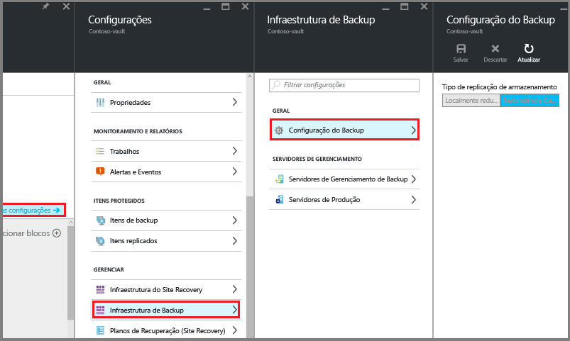

# <a name="install-and-upgrade-azure-backup-server"></a>Instalar e atualizar o Servidor de Backup do Azure
> [!div class="op_single_selector"]
> * [Servidor de Backup do Azure](backup-azure-microsoft-azure-backup.md)
> * [SCDPM](backup-azure-dpm-introduction.md)
>
>

Este artigo explica como preparar o ambiente para fazer backup de cargas de trabalho usando o MABS (Servidor de Backup do Microsoft Azure). Com o Servidor de Backup do Azure, você pode proteger cargas de trabalho do aplicativo como VMs do Hyper-V, o Microsoft SQL Server, o SharePoint Server, o Microsoft Exchange e os clientes do Windows em um único console.

> [!NOTE]
> O Servidor de Backup do Azure agora pode proteger VMs do VMware e fornece recursos de segurança aprimorada. Instale o produto, conforme explicado nas seções a seguir, e o último Agente de Backup do Azure. Para saber mais sobre como fazer backup de servidores do VMware com o Servidor de Backup do Azure, consulte o artigo [Usar o Servidor de Backup do Azure para fazer backup de um servidor do VMware](backup-azure-backup-server-vmware.md). Para saber mais sobre as funcionalidades de segurança, consulte a [documentação dos recursos de segurança de backup do Azure](backup-azure-security-feature.md).
>
>

O MABS implantado em uma VM do Azure pode fazer backup de VMs no Azure, mas elas devem estar no mesmo domínio para habilitar a operação de backup. O processo para fazer uma VM do Azure permanece o mesmo como fazer backup de VMs no local, no entanto, implantar o MABS no Azure tem algumas limitações. Para obter mais informações sobre as limitações, confira [DPM como uma máquina virtual do Azure](https://docs.microsoft.com/system-center/dpm/install-dpm?view=sc-dpm-1807#setup-prerequisites)

> [!NOTE]
> O Azure tem dois modelos de implantação para criar e trabalhar com recursos: [Resource Manager e clássico](../azure-resource-manager/resource-manager-deployment-model.md). Este artigo fornece informações e procedimentos para a restauração de VMs implantadas usando o modelo do Gerenciador de Recursos.
>
>

O Servidor de Backup do Azure herda grande parte da funcionalidade do backup das cargas de trabalho do Data Protection Manager (DPM). Este artigo tem um link com a documentação do DPM para explicar algumas das funcionalidades compartilhadas. Embora o Servidor de Backup do Azure compartilhe a mesma funcionalidade do DPM, o Servidor de Backup do Azure não faz backup em fita nem integra-se ao System Center.

## <a name="choose-an-installation-platform"></a>Escolher uma plataforma de instalação
A primeira etapa para colocar o Servidor de Backup do Azure em execução é configurar um Windows Server. Seu servidor pode estar no Azure ou ser local.

### <a name="using-a-server-in-azure"></a>Usando um servidor no Azure
Ao escolher um servidor para executar o Servidor de Backup do Azure, é recomendável começar com uma imagem de galeria do Windows Server 2012 R2 Datacenter, Windows Server 2016 Datacenter ou Windows Server 2019 Datacenter. O artigo [Criar sua primeira máquina virtual do Windows no portal do Azure](../virtual-machines/virtual-machines-windows-hero-tutorial.md?toc=%2fazure%2fvirtual-machines%2fwindows%2ftoc.json), fornece um tutorial para começar a trabalhar com a máquina virtual recomendada no Azure, mesmo se você nunca usou o Azure antes. Os requisitos mínimos recomendados para a máquina virtual (VM) do servidor devem ser: Standard A2 com 2 núcleos e 3.5 GB de RAM.

Proteger as cargas de trabalho com o Servidor de Backup do Azure tem muitas nuanças. O artigo [Instalar o DPM como uma máquina virtual do Azure](https://technet.microsoft.com/library/jj852163.aspx), ajuda a explicar essas nuanças. Antes de implantar o computador, leia este artigo na íntegra.

### <a name="using-an-on-premises-server"></a>Usando um servidor local
Se você não deseja executar o servidor de base no Azure, poderá executar o servidor em uma VM do Hyper-V, uma VM do VMware ou um host físico. Os requisitos mínimos recomendados para o hardware do servidor são dois núcleos e 4 GB de RAM. Os sistemas operacionais com suporte são listados na seguinte tabela:

| Sistema operacional | Plataforma | SKU |
|:--- | --- |:--- |
| Windows Server 2019 |64 bits |Standard, Datacenter, Essentials (MABS V3 e posterior) |
| Windows Server 2016 e SPs mais recentes |64 bits |Standard, Datacenter, Essentials (MABS V2 e posterior) |
| Windows Server 2012 R2 e SPs mais recentes |64 bits |Standard, Datacenter, Foundation |
| Windows Server 2012 e SPs mais recentes |64 bits |Datacenter, Foundation, Standard |
| Windows Storage Server 2012 R2 e SPs mais recentes |64 bits |Standard, Workgroup |
| Windows Storage Server 2012 e SPs mais recentes |64 bits |Standard, Workgroup |

Você pode eliminar duplicadas do armazenamento DPM usando a Eliminação de Duplicação do Windows Server. Saiba mais sobre como o [DPM e a eliminação de duplicação](https://technet.microsoft.com/library/dn891438.aspx) funcionam juntos quando implantados em VMs do Hyper-V.

> [!NOTE]
> O Servidor de Backup do Azure foi projetado para ser executado em um servidor dedicado de finalidade única. Você não pode instalar o Servidor de Backup do Azure em:
> - Um computador que esteja sendo executado como um controlador de domínio
> - Um computador no qual a função de Servidor de Aplicativos está instalada
> - Um computador que seja um servidor de gerenciamento do System Center Operations Manager
> - Um computador que o Exchange Server está executando
> - Um computador que seja um nó de um cluster

Sempre ingresse o Servidor de Backup do Azure em um domínio. Se você planeja mover o servidor para um domínio diferente, primeiro instale o Servidor de Backup do Azure e, em seguida, associe o servidor ao novo domínio. Mover uma máquina do Servidor de Backup do Azure existente para um novo domínio após a implantação *não tem suporte*.

Se você enviar dados de backup para o Azure ou mantê-los localmente, o Servidor de Backup do Azure deverá ser registrado com um cofre dos Serviços de Recuperação.

[!INCLUDE [backup-create-rs-vault.md](../../includes/backup-create-rs-vault.md)]

### <a name="set-storage-replication"></a>Definir replicação de armazenamento
A opção de replicação de armazenamento permite que você escolha entre o armazenamento com redundância geográfica e armazenamento com redundância local. Por padrão, os cofres dos Serviços de Recuperação usam armazenamento com redundância geográfica. Se este cofre for o primário, deixe a opção de armazenamento definida como armazenamento com redundância geográfica. Escolha o armazenamento com redundância local se quiser uma opção mais barata que não seja tão durável. Leia mais sobre as opções de armazenamento com [redundância geográfica](../storage/common/storage-redundancy-grs.md) e [redundância local](../storage/common/storage-redundancy-lrs.md) na [Visão geral da replicação do Armazenamento do Azure](../storage/common/storage-redundancy.md).

Para editar a configuração de replicação de armazenamento:

1. Selecione o cofre para abrir o painel do cofre e o menu Configurações. Se o menu **Configurações** não abrir, clique em **Todas as configurações** no painel do cofre.
2. No menu **Configurações**, clique em **Infraestrutura de Backup** > **Configuração de Backup** para abrir a folha **Configuração de Backup**. No menu **Configuração de Backup**, escolha a opção de replicação de armazenamento para o cofre.

    

    Depois de escolher a opção de armazenamento para o cofre, você estará pronto para associar a VM ao cofre. Para iniciar a associação, você deverá descobrir e registrar as máquinas virtuais do Azure.

## <a name="software-package"></a>Pacote de software
### <a name="downloading-the-software-package"></a>Baixando o pacote de software
1. Entre no [Portal do Azure](https://portal.azure.com/).
2. Se você já tiver um cofre dos Serviços de Recuperação aberto, vá para a etapa 3. Caso não tenha um cofre dos Serviços de Recuperação aberto, mas estiver no portal do Azure, no menu principal, clique em **Procurar**.

   * Na lista de recursos, digite **Serviços de Recuperação**.
   * Quando você começar a digitar, a lista será filtrada com base em sua entrada. Quando vir a opção **Cofres dos Serviços de Recuperação**, clique nela.

     

     A lista de cofres de Serviços de Recuperação aparecerá.
   * Na lista de cofres de Serviços de Recuperação, selecione um cofre.

     O painel de cofres selecionados será aberto.

     
3. A folha **Configurações** abre por padrão. Se ela estiver fechada, clique em **Configurações** para abrir a folha de configurações.

    
4. Clique em **Backup** para abrir o Assistente de Introdução.

    

    Na folha **Introdução ao backup** aberta, **Objetivos do Backup** será selecionada automaticamente.

    

5. Na folha **Objetivo de Backup** no menu suspenso **Onde sua carga de trabalho é executada**, selecione **Local**.

    

    No menu suspenso **Do que fazer você deseja fazer backup?**, selecione as cargas de trabalho que você deseja proteger com o Servidor de Backup do Azure e, em seguida, clique em **OK**.

    O assistente **Introdução ao backup** muda a opção **Preparar infraestrutura** para fazer backup de cargas de trabalho no Azure.

   > [!NOTE]
   > Se você desejar apenas fazer backup de arquivos e pastas, recomendamos o uso do agente de Backup do Azure e as seguintes diretrizes no artigo [Introdução: Fazer backup de arquivos e pastas](backup-try-azure-backup-in-10-mins.md). Se você quer proteger mais arquivos e pastas, ou se planeja expandir as necessidades de proteção futuramente, selecione estas cargas de trabalho.
   >
   >

    

6. Na folha **Preparar infraestrutura** que é aberta, clique nos links de **Download** para instalar o Servidor de Backup do Azure e baixar as credenciais do cofre. Você usa as credenciais do cofre durante o registro do Servidor de Backup do Azure para o cofre dos serviços de recuperação. Os links levam você para o Centro de Download, onde o pacote de software pode ser baixado.

    

7. Selecione todos os arquivos e clique em **Avançar**. Baixe todos os arquivos provenientes da página de download do Backup do Microsoft Azure e coloque todos os arquivos na mesma pasta.

    

    Como o tamanho do download de todos os arquivos juntos é superior a 3G, em um link de download de 10 Mbps link ele poderá levar até 60 minutos para ser concluído.

### <a name="extracting-the-software-package"></a>Extraindo o pacote de software
Depois de baixar todos os arquivos, clique em **MicrosoftAzureBackupInstaller.exe**. Isso iniciará o **Assistente de Instalação do Backup do Microsoft Azure** para extrair os arquivos de instalação para um local especificado. Continue no assistente e clique no botão **Extrair** para iniciar o processo de extração.

> [!WARNING]
> Pelo menos 4 GB de espaço livre são necessários para a extração dos arquivos de instalação.
>
>


Após concluir o processo de extração, marque a caixa para iniciar o *setup.exe* recém-extraído e começar a instalação do Servidor de Backup do Microsoft Azure e clique no botão **Concluir** .

### <a name="installing-the-software-package"></a>Instalando o pacote de software
1. Clique em **Backup do Microsoft Azure** para iniciar o assistente de instalação.

    
2. Na tela de Boas-Vindas, clique no botão **Avançar** . Isso o levará à seção *Verificações de Pré-Requisitos* . Nessa tela, clique em **Verificar** para determinar se os pré-requisitos de hardware e software do Servidor de Backup do Azure foram atendidos. Se todos os pré-requisitos forem atendidos com êxito, você verá uma mensagem indicando que o computador atende aos requisitos. Clique no botão **Avançar** .

    
3. O Servidor de Backup do Microsoft Azure exige o SQL Server Enterprise. Adicionalmente, o pacote de instalação do Servidor de Backup do Azure é fornecido em pacote com os binários apropriados do SQL Server necessários, caso você não queira usar o seu próprio SQL. Ao iniciar uma nova instalação do Servidor de Backup do Azure, você deverá escolher a opção **Instalar nova Instância do SQL Server com esta Instalação** e clicar no botão **Verificar e Instalar**. Depois que os pré-requisitos tiverem sido instalados com êxito, clique em **Avançar**.

    

    Se ocorrer uma falha com uma recomendação de reiniciar o computador, faça isso e clique em **Verificar Novamente**. Em caso de problemas de configuração do SQL, reconfigure o SQL de acordo com as diretrizes do SQL e tente instalar atualizar o MABS usando a instância existente do SQL.

   > [!NOTE]
   > O Servidor de Backup do Azure não funcionará com uma instância remota do SQL Server. A instância que está sendo usada pelo Servidor de Backup do Azure precisa ser local. Caso você esteja usando um servidor SQL existente para MABS, a configuração do MABS dará suporte apenas para uso de *instâncias nomeadas* do SQL Server.

   **Configuração manual**

   Ao usar a sua própria instância do SQL, certifique-se de adicionar builtin\Administradores na função SysAdmin para BD Mestre.

    **Configuração do SSRS com SQL 2017**

    Quando você estiver usando sua própria instância do SQL 2017, será necessário configurar o SSRS manualmente. Após a configuração do SSRS, verifique se a propriedade *IsInitialized* do SSRS está definida para *Verdadeiro*. Quando estiver configurado como Verdadeiro, o MABS assumirá que o SSRS já está configurado e ignorará a configuração do SSRS.

    Use os seguintes valores para a configuração do SSRS:

        - Service Account: ‘Use built-in account’ should be Network Service
        - Web Service URL: ‘Virtual Directory’ should be ReportServer_<SQLInstanceName>
        - Database: DatabaseName should be ReportServer$<SQLInstanceName>
        - Web Portal URL: ‘Virtual Directory’ should be Reports_<SQLInstanceName>

    [Saiba mais](https://docs.microsoft.com/sql/reporting-services/report-server/configure-and-administer-a-report-server-ssrs-native-mode?view=sql-server-2017) sobre a configuração do SSRS.

4. Forneça um local para a instalação dos arquivos do servidor de Backup do Microsoft Azure e clique em **Avançar**.

    

    O local temporário é um requisito para o backup do Azure. Verifique se o local temporário é de pelo menos 5% dos dados planejados para fazer backup na nuvem. Para proteção de disco, será necessário configurar discos separados após a conclusão da instalação. Para saber mais sobre pools de armazenamento, consulte [Configurar os pools de armazenamento e o armazenamento em disco](https://technet.microsoft.com/library/hh758075.aspx).
5. Forneça uma senha forte para as contas de usuário local restritas e clique em **Avançar**.

    
6. Selecione se você deseja usar o *Microsoft Update* para verificar se há atualizações e clique em **Avançar**.

   > [!NOTE]
   > É recomendável fazer o Windows Update ser redirecionado para o Microsoft Update, que oferece segurança e atualizações importantes para o Windows e outros produtos, como o Servidor de Backup do Microsoft Azure.
   >
   >

    
7. Examine o *Resumo das Configurações* e clique em **Instalar**.

    
8. A instalação acontece em fases. Na primeira fase, o Agente de Serviços de Recuperação do Microsoft Azure é instalado no servidor. O assistente também verifica a conectividade direta com a Internet. Se houver conectividade com a Internet, você poderá prosseguir com a instalação; caso contrário, será necessário fornecer detalhes de proxy para se conectar à Internet.

    A próxima etapa será configurar o Agente de Serviços de Recuperação do Microsoft Azure. Como parte da configuração, você precisará fornecer as credenciais do cofre para registrar a máquina no cofre dos Serviços de Recuperação. Você fornecerá uma senha para criptografar/descriptografar os dados enviados entre o Azure e seus locais. Você pode gerar automaticamente uma senha ou fornecer sua própria senha mínima de 16 caracteres. Prossiga com o assistente até o agente ser configurado.

    
9. Assim que o registro do Servidor de Backup do Microsoft Azure for concluído com êxito, o assistente de instalação geral prosseguirá na instalação e na configuração dos componentes do SQL Server e do Servidor de Backup do Azure. Após a conclusão da instalação do componente do SQL Server, os componentes do Servidor de Backup do Azure serão instalados.

    

Quando a etapa de instalação for concluída, os ícones da área de trabalho do produto também terão sido criados. Basta clicar duas vezes no ícone para iniciar o produto.

### <a name="add-backup-storage"></a>Adicionar armazenamento de backup
A primeira cópia de backup é mantida no armazenamento anexado ao computador do Servidor de Backup do Azure. Para saber mais sobre a adição de discos, consulte [Configurar os pools de armazenamento e o armazenamento em disco](https://docs.microsoft.com/azure/backup/backup-mabs-add-storage).

> [!NOTE]
> Você precisará adicionar armazenamento de backup mesmo se planejar enviar dados para o Azure. Na arquitetura atual do Servidor de Backup do Azure, o cofre do Backup do Azure mantém a *segunda* cópia dos dados, enquanto o armazenamento local mantém a primeira (e obrigatória) cópia de backup.
>
>

### <a name="install-and-update-the-data-protection-manager-protection-agent"></a>Instalar e atualizar o agente de proteção do Data Protection Manager

O MABS usa o agente de proteção do System Center Data Protection Manager. [Aqui estão as etapas](https://docs.microsoft.com/system-center/dpm/deploy-dpm-protection-agent?view=sc-dpm-1807) para instalar o agente de proteção nos servidores de proteção.

As seções a seguir descrevem como atualizar agentes de proteção para computadores clientes.

1. No Console do Administrador do Servidor de Backup, selecione **Gerenciamento** > **Agentes**.

2. No painel de exibição, selecione os computadores cliente para o qual você deseja atualizar o agente de proteção.

   > [!NOTE]
   > A coluna de **Atualizações de Agente** indica quando uma atualização do agente de proteção está disponível para cada computador protegido. No painel **Ações**, a ação de **Atualização** está disponível somente quando um computador protegido está selecionado e as atualizações estão disponíveis.
   >
   >

3. Para instalar agentes de proteção atualizados nos computadores selecionados, no painel **Ações**, selecione **Atualização**.

4. Para um computador cliente que não está conectado à rede, até que o computador esteja conectado à rede, a coluna do **Status do Agente** mostra um status de **Atualização Pendente**.

   Depois que um computador cliente está conectado à rede, a coluna **Atualizações de Agente** para o computador cliente mostra um status de **Atualizando**.

## <a name="move-mabs-to-a-new-server"></a>Mover o MABS para um novo servidor

Aqui são apresentadas as etapas, caso seja necessário mover o MABS para um novo servidor mantendo o armazenamento. Isso poderá ser feito somente se todos os dados estiverem no Armazenamento de Backup Moderno.


  > [!IMPORTANT]
  > - O novo nome do servidor deve ter o mesmo nome da instância original do Servidor de Backup do Azure. Você não pode alterar o nome da nova instância do Servidor de Backup do Azure se quiser usar o pool de armazenamento anterior e o banco de dados do Data Protection Manager para reter os pontos de recuperação.
  > - Você deve ter um backup do banco de dados do Data Protection Manager. Você precisará restaurar o banco de dados.

1. No painel de exibição, selecione os computadores cliente para o qual você deseja atualizar o agente de proteção.
2. Desligue o servidor de Backup do Azure original ou retire-o da rede.
3. Redefina a conta do computador no Active Directory.
4. Instale o Server 2016 no novo computador e dê a ele o mesmo nome de computador do servidor de Backup do Azure original.
5. Ingressar no domínio
6. Instale o servidor de Backup do Azure V2 ou posterior (mova os discos do pool de Armazenamento do DPM do servidor antigo e importe)
7. Restaure o DPMDB obtido na etapa 1.
8. Anexe o armazenamento do servidor de backup original ao novo servidor.
9. Do SQL, restaurar o DPMDB
10. Na linha de comando de administrador no novo servidor, vá para o diretório do local de instalação do Backup do Microsoft Azure e a pasta bin

    Exemplo de caminho: C:\Windows\System32 > cd "c:\Program Files\Microsoft Microsoft azure\dpm\dpm\bin do Azure\" 

11. Para o backup do Azure, execute DPMSYNC-SYNC

    Se você adicionou novos discos ao pool de armazenamento do DPM em vez de mover os antigos, em seguida, executados o DPMSYNC - Reallocatereplica

## <a name="network-connectivity"></a>Conectividade de rede
O Servidor de Backup do Azure requer conectividade com o serviço de Backup Azure para que o produto funcione com êxito. Para validar se o computador tem conectividade com o Azure, use o cmdlet ```Get-DPMCloudConnection``` no console do PowerShell do Servidor de Backup do Azure. Se a saída do cmdlet for TRUE, existe conectividade; caso contrário, não existe nenhuma conectividade.

Ao mesmo tempo, a assinatura do Azure deve estar em um estado íntegro. Para descobrir o estado de sua assinatura e gerenciá-la, faça logon no [portal da assinatura](https://account.windowsazure.com/Subscriptions).

Quando você souber o estado da conectividade do Azure e da assinatura do Azure, poderá usar a tabela abaixo para descobrir o impacto sobre a funcionalidade de backup/restauração oferecida.

| Estado de conectividade | Assinatura do Azure | Fazer backup no Azure | Fazer backup em disco | Restaurar do Azure | Restaurar do disco |
| --- | --- | --- | --- | --- | --- |
| Conectado |Ativo |Permitido |Permitido |Permitido |Permitido |
| Conectado |Expirado |Parado |Parado |Permitido |Permitido |
| Conectado |Provisionamento Cancelado |Parado |Parado |Parado e pontos de recuperação do Azure excluídos |Parado |
| Perda de conectividade > 15 dias |Ativo |Parado |Parado |Permitido |Permitido |
| Perda de conectividade > 15 dias |Expirado |Parado |Parado |Permitido |Permitido |
| Perda de conectividade > 15 dias |Provisionamento Cancelado |Parado |Parado |Parado e pontos de recuperação do Azure excluídos |Parado |

### <a name="recovering-from-loss-of-connectivity"></a>Recuperação de perda de conectividade
Se você tiver um firewall ou um proxy que esteja impedindo o acesso do Azure, precisará incluir os seguintes endereços de domínio na lista de permissões no perfil do firewall/proxy:

* `http://www.msftncsi.com/ncsi.txt`
* \*.Microsoft.com
* \*.WindowsAzure.com
* \*.microsoftonline.com
* \*.windows.net

Depois que a conectividade com o Azure tiver sido restaurada para o computador do Servidor de Backup do Azure, as operações que puderem ser executadas serão determinadas pelo estado de assinatura do Azure. A tabela acima tem detalhes sobre as operações permitidas depois que a máquina estiver "Conectada".

### <a name="handling-subscription-states"></a>Tratando os estados de assinatura
É possível fazer uma assinatura do Azure passar de um estado *Expirado* ou *Desprovisionado* para o estado *Ativo*. No entanto, isso terá algumas implicações no comportamento do produto enquanto o estado não for *Ativo*:

* Uma assinatura *Desprovisionada* perderá a funcionalidade durante o período em que estiver desprovisionada. Ao se tornar *Ativa*, a funcionalidade de backup/restauração do produto será reativada. Os dados de backup no disco local também poderão ser recuperados caso tenham sido mantidos por um período de retenção suficientemente grande. No entanto, os dados de backup no Azure serão irremediavelmente perdidos depois da assinatura entrar no estado *Desprovisionado* .
* Uma assinatura *Expirada* só perderá a funcionalidade até ficar *Ativa* novamente. Nenhum backup agendado para o período em que a assinatura estiver *Expirada* será executado.

## <a name="upgrade-mabs"></a>Upgrade do MABS
Use os procedimentos a seguir para fazer upgrade do MABS.

### <a name="upgrade-from-mabs-v2-to-v3"></a>Upgrade do MABS V2 para V3

> [!NOTE]
> 
> O MABS V2 não é um pré-requisito para instalar o MABS V3. No entanto, é possível fazer upgrade para MABS V3 somente do MABS V2.

Use as etapas a seguir para fazer upgrade do MABS:

1. Para fazer upgrade de MABS V2 para MABS V3, atualize o sistema operacional para Windows Server 2016 ou Windows Server 2019, se necessário.

2. Faça upgrade do servidor. As etapas são semelhantes à [instalação](#install-and-upgrade-azure-backup-server). No entanto, para configurações SQL, você terá uma opção para atualizar a instância do SQL para o SQL 2017 ou usar sua própria instância do SQL Server 2017.

   > [!NOTE]
   > 
   > Não saia enquanto a instância do SQL estiver sendo atualizada, a saída desinstalará a instância de relatório do SQL e, portanto, uma tentativa de atualização do MABS falhará.

   Aspectos importantes a serem observados:

   > [!IMPORTANT]
   > 
   >  Como parte do upgrade do SQL 2017, fazemos backup das chaves de criptografia do SQL e desinstalamos os serviços de relatório. Após o upgrade do servidor SQL, o serviço de geração de relatórios (14.0.6827.4788) será instalado e as chaves de criptografia serão restauradas.
   > 
   > Ao configurar o SQL 2017 manualmente, consulte a seção *Configuração do SSRS com SQL 2017* em Instalar instruções.

3. Atualize os agentes de proteção nos servidores protegidos.
4. Os backups devem continuar sem a necessidade de reiniciar os servidores de produção.
5. Agora, você pode começar a proteger seus dados. Se estiver atualizando para o Armazenamento de Backup Moderno, durante a proteção você também poderá escolher os volumes nos quais quer armazenar os backups e verificar o espaço provisionado. [Saiba mais](backup-mabs-add-storage.md).

> [!NOTE]
> 
> Se você estiver atualizando do MABS V1 para V2, verifique se o sistema operacional é Windows Server 2016 ou Windows Server 2012 R2. Para tirar proveito dos novos recursos como o Armazenamento de Backup Moderno do System Center 2016 Data Protection Manager, instale o Servidor de Backup V2 no Windows Server 2016. Antes de instalar ou fazer upgrade do Servidor de Backup V2, leia sobre os [pré-requisitos de instalação](https://docs.microsoft.com/system-center/dpm/install-dpm?view=sc-dpm-1807#setup-prerequisites) aplicáveis para MABS.

## <a name="troubleshooting"></a>solução de problemas
Se o servidor de Backup do Microsoft Azure falha com erros durante a fase de instalação (ou no backup ou na restauração), consulte o [documento de códigos de erro](https://support.microsoft.com/kb/3041338) para saber mais.
Você também pode consultar as [Perguntas frequentes relacionadas ao Backup do Azure](backup-azure-backup-faq.md)

## <a name="next-steps"></a>Próximas etapas
É possível obter informações detalhadas sobre como [preparar seu ambiente para o DPM](https://technet.microsoft.com/library/hh758176.aspx) no site do Microsoft TechNet. Ele também contém informações sobre as configurações com suporte, nas quais o Servidor de Backup do Azure pode ser implantado e usado. É possível usar uma série de [cmdlet do PowerShell](https://docs.microsoft.com/powershell/module/dataprotectionmanager/?view=systemcenter-ps-2016) para executar várias operações.

Você pode usar estes artigos para obter um entendimento mais profundo sobre a proteção da carga de trabalho usando o servidor de Backup do Microsoft Azure.

* [Backup do SQL Server](backup-azure-backup-sql.md)
* [Backup do servidor do SharePoint](backup-azure-backup-sharepoint.md)
* [Backup do servidor alternativo](backup-azure-alternate-dpm-server.md)
