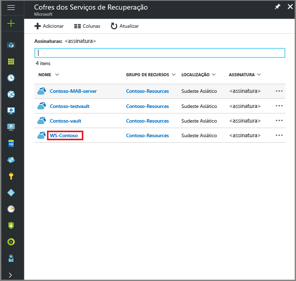
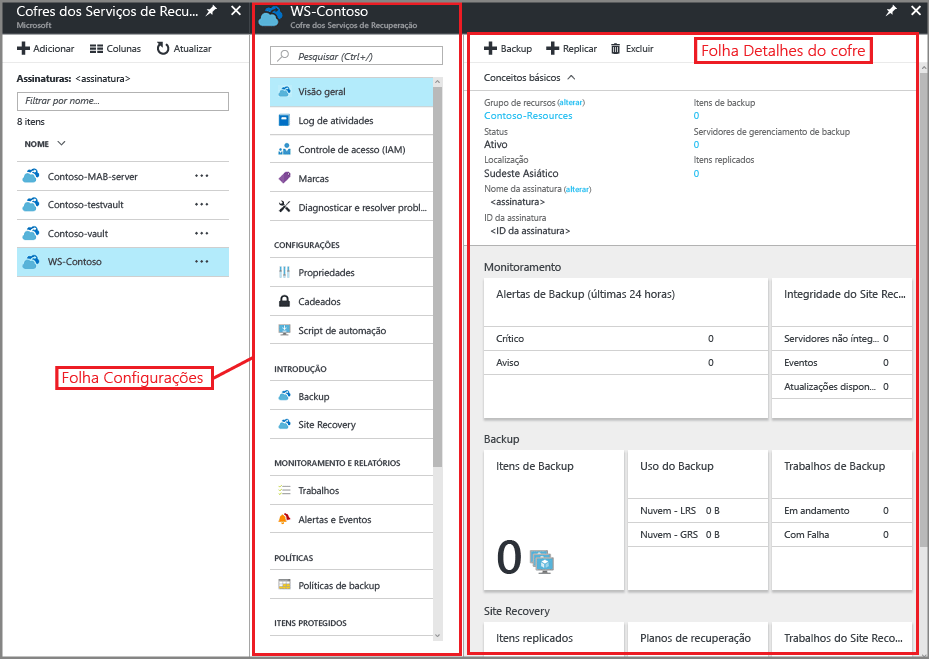
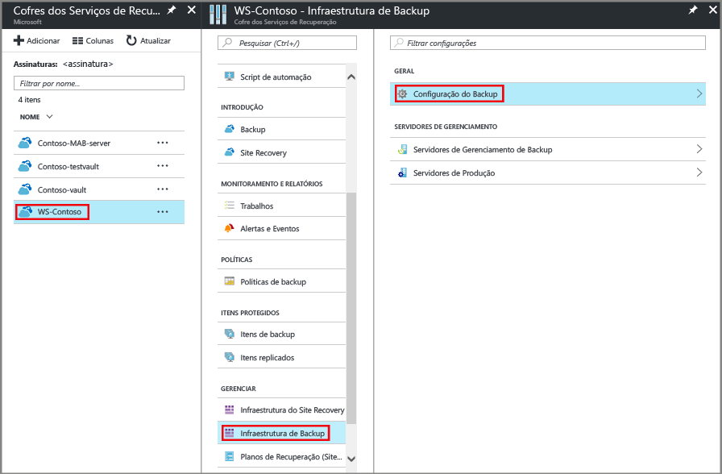
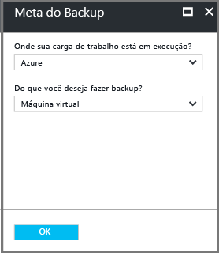
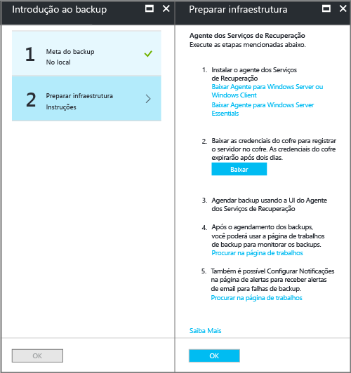
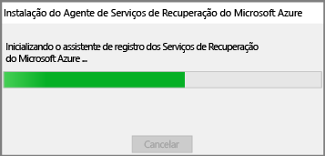
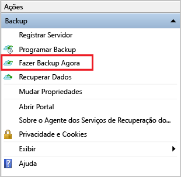

# Fazer backup de estado do sistema do Windows na implementação do Gerenciador de Recursos
Este artigo explica como fazer backup do estado do sistema Windows Server para o Azure. É um tutorial que pretende explicar os conceitos básicos.

Se você quiser saber mais sobre o Backup do Azure, leia esta [visão geral](backup-overview.md).

Se não tiver uma assinatura do Azure, crie uma [conta gratuita](https://azure.microsoft.com/free/) , que permitirá o acesso a qualquer serviço do Azure.

## Criar um cofre dos Serviços de Recuperação
Para fazer backup do Estado do Sistema do Windows Server, você precisa criar um cofre dos Serviços de Recuperação na região em que deseja armazenar os dados. Você também precisa determinar como deseja que o armazenamento seja replicado.

### Para criar um cofre de Serviços de Recuperação
1. Se ainda não tiver feito isso, entre no [Portal do Azure](https://portal.azure.com/) usando a sua assinatura do Azure.
2. No menu Hub, clique em **Todos os serviços** e na lista de recursos digite **Serviços de Recuperação** e clique em **Cofres dos Serviços de Recuperação**.

      

    Se houver cofres dos serviços de recuperação na assinatura, os cofres serão listados.
3. No menu **Cofres de Serviços de Recuperação**, clique em **Adicionar**.

    

    A folha do cofre dos Serviços de Recuperação será aberta, solicitando que você forneça o **Nome**, a **Assinatura**, o **Grupo de recursos** e o **Local**.

    

4. Em **Nome**, insira um nome amigável para identificar o cofre. O nome deve ser exclusivo para a assinatura do Azure. Digite um nome que contenha de 2 a 50 caracteres. Ele deve começar com uma letra e pode conter apenas letras, números e hifens.

5. Na seção **Assinatura**, use o menu suspenso para escolher a assinatura do Azure. Se você usar apenas uma assinatura, essa assinatura será exibida e você poderá pular para a próxima etapa. Se você não tiver certeza sobre qual assinatura usar, utilize a assinatura padrão (ou sugerida). Só haverá múltiplas opções se sua conta organizacional estiver associada a várias assinaturas do Azure.

6. Na seção **Grupo de recursos**:

    * selecione **Criar novo** se você quiser criar um Grupo de recursos.
    Ou
    * Selecione **Usar existente** e clique no menu suspenso para ver a lista de grupos de recursos disponíveis.

   Para obter informações completas sobre Grupos de recursos, confira a [Visão geral do Azure Resource Manager](../azure-resource-manager/resource-group-overview.md).

7. Clique em **Local** para selecionar a região geográfica do cofre. Essa escolha determina a região geográfica para a qual os dados de backup são enviados.

8. Na parte inferior da folha Cofre dos Serviços de Recuperação, clique em **Criar**.

    Talvez demore alguns minutos para o cofre de Serviços de Recuperação ser criado. Monitore as notificações de status na área superior direita do portal. Depois que o cofre é criado, ele aparece na lista de cofres dos Serviços de Recuperação. Se após alguns minutos, você não vir seu cofre, clique em **Atualizar**.

     

    Depois de ver seu cofre na lista de cofres dos Serviços de Recuperação, você estará pronto para configurar a redundância de armazenamento.

### Definir a redundância de armazenamento para o cofre
Quando você criar um cofre de Serviços de Recuperação, certifique-se de que a redundância de armazenamento esteja configurada da maneira desejada.

1. Na folha **Cofres dos Serviços de Recuperação**, clique no novo cofre.

    

    Quando você selecionar o cofre, a folha **Cofre de Serviços de Recuperação** será reduzida e a folha Configurações (*que tem o nome do cofre na parte superior*) e a folha de detalhes do cofre serão abertas.

    
2. Na folha de configurações do novo cofre, use o slide vertical para rolar para baixo até a seção Gerenciar e clique em **Infraestrutura de Backup**.
    A folha Infraestrutura de Backup é aberta.
3. Na folha Infraestrutura de Backup, clique em **Configuração de Backup** para abrir a folha **Configuração de Backup**.

    
4. Escolha a opção de replicação de armazenamento adequada para o cofre.

    

    Por padrão, seu cofre tem armazenamento com redundância geográfica. Se você usar o Azure como um ponto de extremidade de armazenamento de backup principal, continue a usar **Georredundante**. Se você não usar o Azure como um ponto de extremidade de armazenamento de backup principal, escolha **Localmente redundante**, que reduz os custos de armazenamento do Azure. Leia mais sobre as opções de armazenamento [com redundância geográfica](../storage/common/storage-redundancy-grs.md) e [com redundância local](../storage/common/storage-redundancy-lrs.md) nesta [Visão geral de redundância de armazenamento](../storage/common/storage-redundancy.md).

Agora que você criou um cofre, configure-o para fazer backup do Estado do Sistema do Windows.

## Configurar o cofre
1. Na folha do cofre dos Serviços de Recuperação (para o cofre recém-criado), na seção Introdução, clique em **Backup**, na folha **Introdução ao Backup**, selecione **Meta de Backup**.

    

    A folha **Meta de Backup** será aberta.

    

2. No menu suspenso **Onde sua carga de trabalho é executada?**, selecione **Local**.

    Você escolhe **Local** porque o Windows Server ou o computador do Windows é uma máquina física que não está no Azure.

3. No menu **Do que você deseja fazer backup?**, selecione **Estado do Sistema** e clique em **OK**.

    

    Depois de clicar em OK, uma marca de seleção aparece ao lado de **Meta de backup** e a folha **Preparar infraestrutura** será aberta.

    

4. Na folha **Preparar infraestrutura**, clique em **Baixar agente do Windows Server ou Windows Client**.

    

    Se você estiver usando o Windows Server Essential, opte por baixar o agente para o Windows Server Essential. Um menu pop-up solicitará que você execute ou salve MARSAgentInstaller.exe.

    

5. Clique em **Salvar** no menu pop-up de download.

    Por padrão, o arquivo **MARSagentinstaller.exe** será salvo em sua pasta Downloads. Quando o instalador for concluído, será exibido um pop-up perguntando se você deseja executar o instalador ou abrir a pasta.

    

    Você não precisa instalar o agente ainda. Você poderá instalar o agente depois de baixar as credenciais do cofre.

6. Na folha **Preparar infraestrutura**, clique em **Baixar**.

    

    As credenciais do cofre são baixadas para a pasta Downloads. Após o término do download das credenciais do cofre, você verá um pop-up perguntando se deseja abrir ou salvar as credenciais. Clique em **Salvar**. Se você clicar acidentalmente em **Abrir**, deixe a caixa de diálogo que tenta abrir as credenciais do cofre falhar. Não é possível abrir as credenciais do cofre. Vá para a próxima etapa. As credenciais do cofre estão na pasta Downloads.   

    
   > [!NOTE]
   > As credenciais do cofre devem ser salvas apenas em um local do Windows Server no qual você pretende usar o agente.
   >

[!INCLUDE [backup-upgrade-mars-agent.md](../../includes/backup-upgrade-mars-agent.md)]

## Instalar e registrar o agente

> [!NOTE]
> A habilitação do backup pelo portal do Azure ainda não está disponível. Use o agente de Serviços de Recuperação do Microsoft Azure para fazer backup do Estado do Sistema do Windows Server.
>

1. Localize e clique duas vezes no **MARSagentinstaller.exe** na pasta Downloads (ou em outro local salvo).

    O instalador fornece uma série de mensagens, pois extrai, instala e registra o agente dos Serviços de Recuperação.

    

2. Conclua o Assistente de Instalação do Agente do Serviços de Recuperação do Microsoft Azure. Para concluir o assistente, você precisa fazer o seguinte:

   * Escolher um local para a instalação e a pasta de cache.
   * Fornecer as informações de seu servidor proxy se você usar um servidor proxy para conectar-se à Internet.
   * Forneça os detalhes do seu nome de usuário e de sua senha se usar um proxy autenticado.
   * Forneça as credenciais do cofre baixado
   * Salve a senha de criptografia em um local seguro.

     > [!NOTE]
     > Se você perder ou esquecer a senha, a Microsoft não poderá ajudar a recuperar os dados de backup. Salve o arquivo em um local seguro. Isso é necessário para restaurar um backup.
     >
     >

Agora, o agente está instalado e seu computador está registrado no cofre. Você está pronto para configurar e agendar o backup.

## Fazer backup do Estado do Sistema do Windows Server
O backup inicial inclui duas tarefas:

* Agendar o backup
* Fazer backup do Estado do Sistema pela primeira vez

Para concluir o backup inicial, use o agente dos Serviços de Recuperação do Microsoft Azure.

> [!NOTE]
> Você pode fazer backup do Estado do Sistema no Windows Server 2008 R2 por meio do Windows Server 2016. O Backup do Estado do Sistema não tem suporte em SKUs do cliente. O Estado do Sistema não é mostrado como uma opção para clientes do Windows ou máquinas do Windows Server 2008 SP2.
>
>

### Para agendar o trabalho de backup

1. Abra o agente dos Serviços de Recuperação do Microsoft Azure Você pode localizá-lo pesquisando no seu computador por **Backup do Microsoft Azure**.

    

2. O agente dos Serviços de Recuperação, clique em **Agendar Backup**.

    

3. Na página de Introdução do Assistente de Agendamento de Backup, clique em **Avançar**.

4. Na tela Selecionar Itens para Backup, clique em **Adicionar Itens**.

5. Selecione **Estado do sistema** e, em seguida, clique em **OK**.

6. Clique em **Avançar**.

7. Selecione a frequência de Backup necessária e a política de retenção para os backups de Estado do Sistema nas próximas páginas.

8. Na página Confirmação, examine as informações e clique em **Concluir**.

9. Depois que o assistente terminar de criar o agendamento de backup, clique em **Fechar**.

### Para fazer backup do Estado do Sistema do Windows Server pela primeira vez

1. Certifique-se de que não existem atualizações pendentes para o Windows Server que exigem uma reinicialização.

2. No Agente dos Serviços de Recuperação, clique em **Fazer Backup Agora** para concluir a propagação inicial pela rede.

    

3. Selecione **Estado do Sistema** na tela **Selecionar Item de Backup** exibida e clique em **Avançar**.

4. Na página Confirmação, examine as configurações que o Assistente Fazer Backup Agora usará para fazer backup do computador. Em seguida, clique em **Fazer Backup**.

4. Clique em **Fechar** para fechar o assistente. Se você fechar o assistente antes da conclusão do processo de backup, o assistente continuará a ser executado em segundo plano.

Depois que o backup inicial for concluído, o status **Trabalho concluído** aparecerá no Console de backup.

  

## Perguntas?
Se você tiver dúvidas ou gostaria de ver algum recurso incluído, [envie-nos seus comentários](https://aka.ms/azurebackup_feedback).

## Próximas etapas
* Obtenha mais detalhes sobre o [backup de computadores que usam o Windows](backup-configure-vault.md).
* Agora que você fez backup do Estado do Sistema do Windows Server, [gerencie seus cofres e servidores](backup-azure-manage-windows-server.md).
* Se você precisar restaurar um backup, use este artigo para [restaurar os arquivos para um computador que usa o Windows](backup-azure-restore-windows-server.md).
