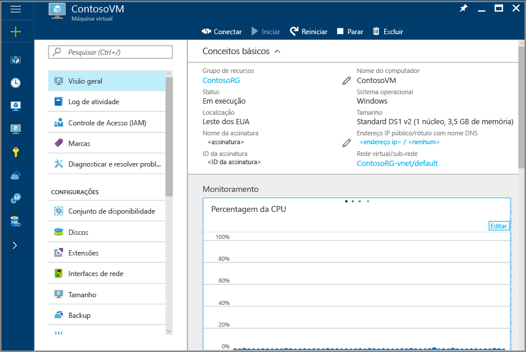
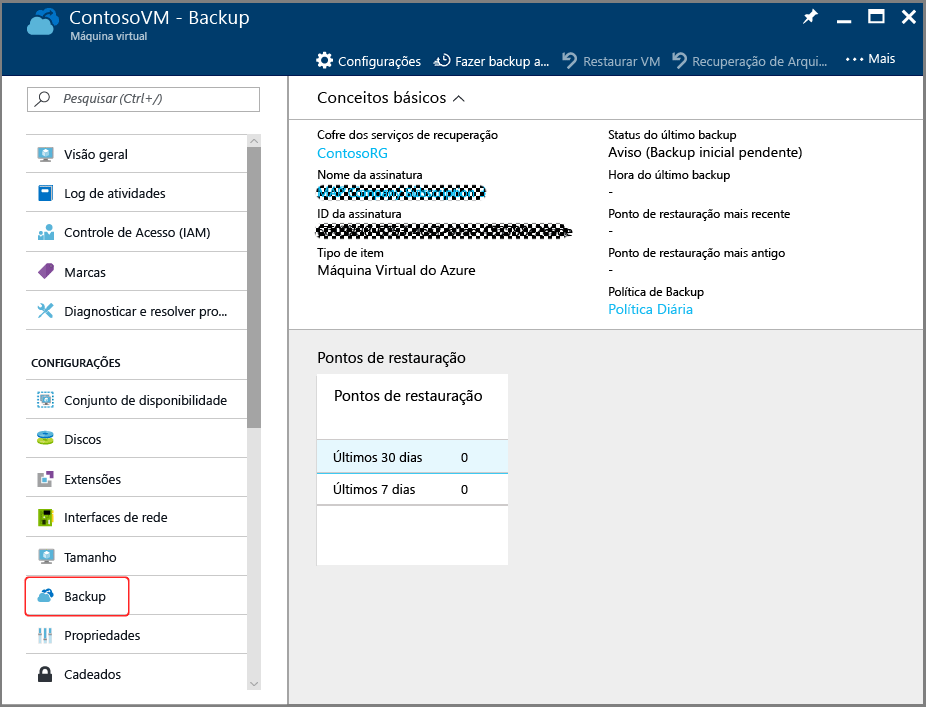
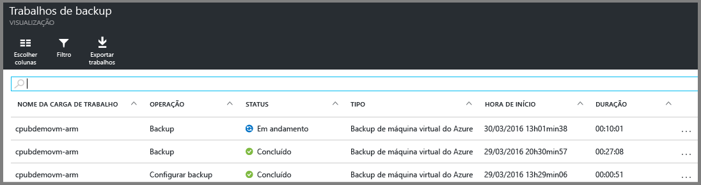

# Introdução: proteger VMs do Azure com um cofre de serviços de recuperação
> [!div class="op_single_selector"]
> * [Proteger VMs em um cofre de serviços de recuperação](backup-azure-vms-first-look-arm.md)
> * [Proteger VMs com um cofre de backup](backup-azure-vms-first-look.md)
>
>

Este tutorial apresenta as etapas para criar um cofre de Serviços de Recuperação e fazer backup de uma VM (máquina virtual) do Azure. Os cofres dos Serviços de Recuperação protegem:

* VMs implantadas com o Azure Resource Manager
* VMs clássicas
* VMs de armazenamento Padrão
* VMs de armazenamento Premium
* VMs criptografadas usando o Azure Disk Encryption, com BEK e KEK

Para saber mais sobre como proteger VMs de armazenamento Premium, confira [Backup e restauração de VMs de armazenamento Premium](backup-introduction-to-azure-backup.md#using-premium-storage-vms-with-azure-backup)

> [!NOTE]
> Este tutorial presume que você já tenha uma VM em sua assinatura do Azure e tenha tomado medidas para permitir que o serviço de backup acesse a VM.
>
>

[!INCLUDE [learn-about-Azure-Backup-deployment-models](../../includes/backup-deployment-models.md)]

Com base no número de VMs que você deseja proteger, pode começar de diferentes pontos de início. Se desejar fazer backup de várias máquinas virtuais em uma única operação, vá para o cofre de Serviços de Recuperação e inicie o backup do painel do cofre. Se tiver uma única VM para backup, você poderá fazer backup diretamente na folha de gerenciamento de VM.

## Configurar o Backup na folha de gerenciamento de VM
1. Entre no [Portal do Azure](https://portal.azure.com/).
2. No menu Ajuda, clique em **Mais Serviços** e, na lista de recursos, digite **Máquinas virtuais**.  É exibida a lista de máquinas virtuais. Na lista de máquinas virtuais, selecione uma máquina virtual da qual você deseja fazer backup. Isso abrirá a folha de gerenciamento de máquina virtual.
 

3. Na folha de gerenciamento de VM, clique na opção "Backup" presente no lado esquerdo em Configurações.

4. Isso abrirá a folha Habilitar Backup. Esta folha espera duas entradas: cofre de serviços de recuperação - um recurso de Backup do Azure, que é usado para armazenar os backups das VMs; uma Política de Backup - a política de Backup Especifica o agendamento de backups e por quanto tempo manter cópias de backup. Esta folha é fornecida com as opções padrão. Você pode personalizá-los de acordo com os requisitos de backup.

  

5. Para o cofre de Serviços de Recuperação, você pode selecionar um cofre existente ou criar um novo cofre. Se você estiver criando um novo cofre, ele será criado no mesmo grupo de recursos que a máquina virtual e o local será o mesmo que o da máquina virtual. Se quiser criar um cofre de serviços de recuperação com valores diferentes, [crie um cofre de serviços de recuperação](backup-azure-vms-first-look-arm.md#create-a-recovery-services-vault-for-a-vm) antes de clicar na opção Backup da Etapa&3; e selecioná-la nessa folha.

6. Na folha Política de Backup, selecione a política de backup que você deseja aplicar no cofre e clique em **OK**.
    

    Os detalhes da política padrão estão listados nos detalhes. Se você quiser criar uma política, selecione **Criar Nova** no menu suspenso. O menu suspenso também fornece uma opção para alternar a hora quando o instantâneo é criado. Para obter instruções sobre como definir uma política de backup, confira [Definindo uma política de backup](backup-azure-vms-first-look-arm.md#defining-a-backup-policy). Quando você clicar em **OK**, a política de backup será associada à máquina virtual.

7. Clique em "Habilitar Backup" para configurar o Backup na máquina virtual. Isso disparará uma implantação.

8. Você pode acompanhar o progresso da configuração por meio de notificações.

9. Após ser concluída a implantação para configurar o backup, clicar na opção "backup" na folha de gerenciamento de VM o leva à folha Item de Backup correspondente à VM da qual foi feito backup.

## Configurar Exibição do Backup do cofre de Serviços de Recuperação
De forma geral, veja as etapas que você concluirá.  

1. Criar um cofre de Serviços de Recuperação para uma VM.
2. Usar o portal do Azure para selecionar um Cenário, definir a Política e identificar os itens a serem protegidos.
3. Executar o backup inicial.

## Criar um cofre de Serviços de Recuperação para uma VM
Um cofre de Serviços de Recuperação é uma entidade que armazena todos os pontos de backup e recuperação criados ao longo do tempo. O cofre de Serviços de Recuperação também contêm a política de backup aplicada às VMs protegidas.

> [!NOTE]
> Fazer backup das VMs é um processo local. Não é possível fazer backup das VMs de um local para um cofre de Serviços de Recuperação em outro local. Portanto, para cada local do Azure com VMs que devem sofrer backup, pelo menos um cofre de Serviços de Recuperação deve existir nesse local.
>
>

Para criar um cofre dos Serviços de Recuperação:

1. Entre no [Portal do Azure](https://portal.azure.com/).
2. No menu Hub, clique em **Procurar** e, na lista de recursos, digite **Serviços de Recuperação**. Quando você começa a digitar, a lista é filtrada com base em sua entrada. Clique em **Cofre de Serviços de Recuperação**.

      

    A lista de cofres de Serviços de Recuperação será exibida.
3. No menu **Cofres de Serviços de Recuperação**, clique em **Adicionar**.

    

    A folha do cofre dos Serviços de Recuperação será aberta, solicitando que você forneça o **Nome**, a **Assinatura**, o **Grupo de recursos** e o **Local**.

    
4. Em **Nome**, insira um nome amigável para identificar o cofre. O nome deve ser exclusivo para a assinatura do Azure. Digite um nome que contenha de 2 a 50 caracteres. Ele deve começar com uma letra e pode conter apenas letras, números e hifens.
5. Clique em **Assinatura** para ver a lista de assinaturas disponíveis. Se você não tiver certeza sobre qual assinatura usar, utilize a assinatura padrão (ou sugerida). Só haverá múltiplas opções se sua conta organizacional estiver associada a várias assinaturas do Azure.
6. Clique em **Grupo de recursos** para ver a lista dos Grupos de recursos disponíveis ou clique em **Novo** para criar um Grupo de recursos. Para obter informações completas sobre Grupos de recursos, confira [Visão geral do Azure Resource Manager](../azure-resource-manager/resource-group-overview.md)
7. Clique em **Local** para selecionar a região geográfica do cofre. O cofre **deve** estar na mesma região que as máquinas virtuais que você deseja proteger.

   > [!IMPORTANT]
   > Se você não souber ao certo em qual local sua VM se encontra, feche a caixa de diálogo de criação do cofre e vá para a lista de Máquinas Virtuais no portal. Se você tiver máquinas virtuais em várias regiões, crie um cofre de Serviços de Recuperação em cada região. Crie o cofre no primeiro local antes de ir para o próximo local. Não é necessário especificar as contas de armazenamento para armazenar os dados de backup - o cofre de Serviços de Recuperação e o serviço de Backup do Azure cuidarão disso automaticamente.
   >
   >
8. Clique em **Criar**. Talvez demore um pouco para o cofre de Serviços de Recuperação ser criado. Monitore as notificações de status na área superior direita no portal. Depois que o cofre é criado, ele aparece na lista de cofres dos Serviços de Recuperação.

    

Agora que você criou o cofre, saiba como configurar a replicação de armazenamento.

### Definir replicação de armazenamento
A opção de replicação de armazenamento permite que você escolha entre o armazenamento com redundância geográfica e armazenamento com redundância local. Por padrão, seu cofre tem armazenamento com redundância geográfica. Deixe a opção definida como armazenamento com redundância geográfica se este for seu backup principal. Escolha o armazenamento com redundância local se quiser uma opção mais barata que não seja tão durável. Leia mais sobre as opções de armazenamento com [redundância geográfica](../storage/storage-redundancy.md#geo-redundant-storage) e [redundância local](../storage/storage-redundancy.md#locally-redundant-storage) na [Visão geral da replicação do Armazenamento do Azure](../storage/storage-redundancy.md).

Para editar a configuração de replicação de armazenamento:

1. Selecione seu cofre para abrir o painel do cofre e a folha Configurações. Se a folha **Configurações** não abrir, clique em **Todas as configurações** no painel do cofre.
2. Na folha **Configurações**, clique em Infraestrutura de **Backup** > **Configuração de Backup** para abrir a folha **Configuração de Backup**. Na folha **Configuração de Backup** , escolha a opção de replicação de armazenamento para seu cofre.

    

    Depois de escolher a opção de armazenamento para o cofre, você estará pronto para associar a VM ao cofre. Para iniciar a associação, você deverá descobrir e registrar as máquinas virtuais do Azure.

## Selecionar a meta de backup, definir a política e os itens a serem protegidos
Antes de registrar uma VM em um cofre, execute o processo de descoberta para garantir que todas as novas máquinas virtuais adicionadas à assinatura sejam identificadas. O processo consulta o Azure quanto à lista de máquinas virtuais na assinatura, juntamente com informações adicionais, como o nome do serviço de nuvem e a região. No portal do Azure, o cenário se refere ao que você vai colocar no cofre de serviços de recuperação. A Política é o agendamento para quando e com que frequência os pontos de recuperação serão feitos. A Política também inclui o período de retenção dos pontos de recuperação.

1. Se você já tiver um cofre dos Serviços de Recuperação aberto, vá para a etapa 2. Se você não tiver um cofre dos Serviços de Recuperação aberto, mas estiver no portal do Azure, no menu Hub, clique em **Procurar**.

   * Na lista de recursos, digite **Serviços de Recuperação**.
   * Quando você começa a digitar, a lista é filtrada com base em sua entrada. Quando vir a opção **Cofres de Serviços de Recuperação**, clique nela.

       

     A lista de cofres de Serviços de Recuperação aparecerá.
   * Na lista de cofres de Serviços de Recuperação, selecione um cofre.

     O painel de cofres selecionados será aberto.

     
2. No menu do painel de cofres, clique em **Backup** para abrir a folha Backup.

    

    Quando a folha for aberta, o serviço de Backup pesquisará novas VMs na assinatura.

    
3. Na folha Backup, clique em **Meta de backup** para abrir a folha Meta de Backup.

    
4. Na folha Meta de Backup, defina **Onde está a carga de trabalho em execução** no Azure, **Do que você deseja fazer backup** na máquina Virtual e clique **OK**.

    A folha Meta de Backup fecha e a folha Política de Backup abre.

    
5. Na folha Política de Backup, selecione a política de backup que você deseja aplicar no cofre e clique em **OK**.

    

    Os detalhes da política padrão estão listados nos detalhes. Se você quiser criar uma política, selecione **Criar Nova** no menu suspenso. O menu suspenso também fornece uma opção para alternar a hora quando o instantâneo é criado para 19h. Para obter instruções sobre como definir uma política de backup, confira [Definindo uma política de backup](backup-azure-vms-first-look-arm.md#defining-a-backup-policy). Quando você clicar em **OK**, a política de backup será associada ao cofre.

    Em seguida, escolha as VMs para associar ao cofre.
6. Escolha as máquinas virtuais para associar à política especificada e clique em **Selecionar**.

    

    Se você não vê a VM desejada, verifique se ela existe no mesmo local do Azure que o cofre dos Serviços de Recuperação.
7. Agora que você definiu todas as configurações para o cofre, na folha Backup, clique em **Habilitar Backup** na parte inferior da página. Isso implanta a política para o cofre e as VMs.

    

## Backup inicial
Após a implantação de uma política de backup na máquina virtual, isso não significa que os dados sofreram backup. Por padrão, o primeiro backup agendado (como definido na política de backup) é o backup inicial. Até que o backup inicial ocorra, o Status do Último Backup na folha **Trabalhos de Backup** aparece como **Aviso (backup inicial pendente)**.

A menos que o backup inicial esteja prestes a começar, é recomendável que você execute **Fazer Backup Agora**.

Para executar o **Backup Agora**:

1. No painel do cofre, no bloco **Backup**, clique em **Máquinas Virtuais do Azure**  
    

    A folha **Itens de Backup** será aberta.
2. Na folha **Itens de Backup**, clique com o botão direito do mouse no cofre do qual deseja fazer backup e clique em **Fazer backup agora**.

    

    O trabalho de Backup será disparado.  

    
3. Para saber se o backup inicial foi concluído, no painel do cofre, no bloco **Trabalhos de Backup**, clique em **Máquinas virtuais do Azure**.

    

    A folha Trabalhos de Backup será aberta.
4. Na folha Trabalhos de Backup, você pode ver o status de todos os trabalhos.

    

   > [!NOTE]
   > Como parte da operação de backup, o serviço de Backup do Azure emite um comando para a extensão de backup em cada VM para limpar todas as gravações e capturar um instantâneo consistente.
   >
   >

    Quando o trabalho de backup for concluído, o status será *Concluído*.

[!INCLUDE [backup-create-backup-policy-for-vm](../../includes/backup-create-backup-policy-for-vm.md)]

## Instalar o Agente de VM na máquina virtual
Essas informações são fornecidas quando necessário. O Agente de VM do Azure deve ser instalado na máquina virtual do Azure para a extensão de Backup funcionar. Contudo, se sua VM foi criada a partir da galeria do Azure, o Agente de VM já estará presente na máquina virtual. As VMs migradas dos datacenters locais não teriam o Agente de VM instalado. Nesse caso, o Agente de VM precisa ser instalado. Se você tiver problemas para fazer backup da VM do Azure, verifique se o Agente de VM do Azure está instalado corretamente na máquina virtual (veja a tabela abaixo). Se você criar uma VM personalizada, [verifique se a caixa de seleção **Instalar o Agente de VM** está marcada](../virtual-machines/virtual-machines-windows-classic-agents-and-extensions.md?toc=%2fazure%2fvirtual-machines%2fwindows%2fclassic%2ftoc.json) antes da máquina virtual ser provisionada.

Saiba mais sobre o [Agente de VM](https://go.microsoft.com/fwLink/?LinkID=390493&clcid=0x409) e [como instalá-lo](../virtual-machines/virtual-machines-windows-classic-manage-extensions.md?toc=%2fazure%2fvirtual-machines%2fwindows%2fclassic%2ftoc.json).

A tabela a seguir oferece informações adicionais sobre o Agente de VM para VMs do Windows e do Linux.

| **Operação** | **Windows** | **Linux** |
| --- | --- | --- |
| Instalação do agente de VM |<li>Baixe e instale o [agente MSI](http://go.microsoft.com/fwlink/?LinkID=394789&clcid=0x409). Você precisa de privilégios de Administrador para concluir a instalação. <li>[Atualize a propriedade de VM](http://blogs.msdn.com/b/mast/archive/2014/04/08/install-the-vm-agent-on-an-existing-azure-vm.aspx) para indicar que o agente está instalado. |<li> Instale o [agente Linux](https://github.com/Azure/WALinuxAgent) mais recente do GitHub. Você precisa de privilégios de Administrador para concluir a instalação. <li> [Atualize a propriedade de VM](http://blogs.msdn.com/b/mast/archive/2014/04/08/install-the-vm-agent-on-an-existing-azure-vm.aspx) para indicar que o agente está instalado. |
| Atualizar o Agente de VM |Atualizar o agente de VM é tão simples quanto reinstalar os [Binários do Agente de VM](http://go.microsoft.com/fwlink/?LinkID=394789&clcid=0x409).  Verifique se nenhuma operação de backup está em execução enquanto o agente de VM está sendo atualizado. |Siga as instruções em [Atualizando o agente de VM do Linux ](../virtual-machines/virtual-machines-linux-update-agent.md?toc=%2fazure%2fvirtual-machines%2flinux%2ftoc.json).  Verifique se nenhuma operação de backup está em execução enquanto o agente de VM está sendo atualizado. |
| Validação da instalação do Agente de VM |<li>Navegue até a pasta *C:\WindowsAzure\Packages* na VM do Azure. <li>Você deve encontrar o arquivo WaAppAgent.exe presente.<li> Clique com o botão direito do mouse no arquivo, vá para **Propriedades** e selecione a guia **Detalhes**. O campo Versão do Produto deve ser 2.6.1198.718 ou mais recente. |N/D |

### Extensão de backup
Assim que o Agente de VM for instalado na máquina virtual, o serviço Backup do Azure instalará a extensão de backup no Agente de VM. O serviço do Backup do Azure atualiza e corrige perfeitamente a extensão de backup sem intervenção adicional do usuário.

A extensão de backup será instalada pelo serviço Backup se a VM estiver em execução. Uma VM em execução oferece uma maior chance de obter um ponto de recuperação consistente com o aplicativo. No entanto, o serviço do Backup do Azure continuará a realizar o backup da VM mesmo quando ela estiver desativada e a extensão não puder ser instalada. Isso é conhecido como VM Offline. Nesse caso, o ponto de recuperação será *consistente com a falha*.

## Informações sobre solução de problemas
Se você tiver problemas para realizar algumas das tarefas neste artigo, confira as [Diretrizes da solução de problemas](backup-azure-vms-troubleshoot.md).

## Preços
O backup da VM do Azure será cobrado com base no modelo de Instâncias Protegidas. Saiba mais sobre o [Preço do Backup](https://azure.microsoft.com/pricing/details/backup/)

## Perguntas?
Se você tiver dúvidas ou gostaria de ver algum recurso incluído, [envie-nos seus comentários](http://aka.ms/azurebackup_feedback).

<!--HONumber=Dec16_HO2-->

