# Fazer backup de máquinas virtuais do Azure em cofres dos Serviços de Recuperação
> [!div class="op_single_selector"]
> * [Proteger VMs em um cofre de serviços de recuperação](backup-azure-vms-first-look-arm.md)
> * [Proteger VMs com um cofre de backup](backup-azure-vms-first-look.md)
>
>

Este tutorial apresenta as etapas para criar um cofre de Serviços de Recuperação e fazer backup de uma VM (máquina virtual) do Azure. Os cofres dos Serviços de Recuperação protegem:

* VMs implantadas com o Azure Resource Manager
* VMs clássicas
* VMs de armazenamento Padrão
* VMs de armazenamento Premium
* VMs em execução em discos gerenciados
* VMs criptografadas usando o Azure Disk Encryption, com BEK e KEK
* Backup consistente de aplicativos de VMs do Windows que usam o VSS, e de VMs do Linux que usam scripts personalizados pré e pós-instantâneo

Para saber mais sobre como proteger VMs de Armazenamento Premium, confira o artigo [Backup e restauração de VMs de Armazenamento Premium](backup-introduction-to-azure-backup.md#using-premium-storage-vms-with-azure-backup). Para obter mais informações sobre o suporte para VMs de disco gerenciado, consulte [Backup e restauração de VMs em discos gerenciados](backup-introduction-to-azure-backup.md#using-managed-disk-vms-with-azure-backup). Para saber mais sobre a estrutura pré e pós-script para backup de uma VM do Linux, confira [Backup consistente de aplicativos de VM do Linux que usam pré e pós-script] (https://docs.microsoft.com/azure/backup/backup-azure-linux-app-consistent).

Para saber mais sobre o que você pode incluir no backup e o que não pode, consulte [aqui](backup-azure-vms-prepare.md#limitations-when-backing-up-and-restoring-a-vm)

> [!NOTE]
> Este tutorial presume que você já tenha uma VM em sua assinatura do Azure e tenha tomado medidas para permitir que o serviço de backup acesse a VM.
>
>

[!INCLUDE [learn-about-Azure-Backup-deployment-models](../../includes/backup-deployment-models.md)]

Dependendo do número de máquinas virtuais que você deseja proteger, é possível começar de diferentes pontos de partida. Se você quiser fazer backup de várias máquinas virtuais em uma única operação, acesse o Cofre de Serviços de Recuperação e [inicie o trabalho de backup no painel do cofre](backup-azure-vms-first-look-arm.md#configure-the-backup-job-from-the-recovery-services-vault). Se quiser fazer backup de uma única máquina virtual, inicie o trabalho de backup na folha de gerenciamento da VM.

## Configurar o trabalho de backup na folha de gerenciamento da VM

Use as etapas a seguir para configurar o trabalho de backup na folha de gerenciamento da máquina virtual no Portal do Azure. Essas etapas não se aplicam às máquinas virtuais no portal clássico.

1. Entre no [Portal do Azure](https://portal.azure.com/).
2. No menu do Hub, clique em **Mais Serviços** e, na caixa de diálogo Filtrar, digite **Máquinas virtuais**. A lista de recursos é filtrada enquanto você digita. Ao ver Máquinas virtuais, selecione-a.

  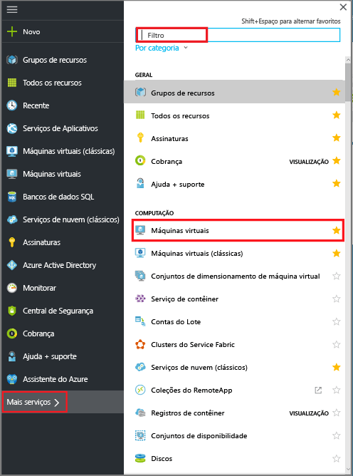

  A lista de VMs (máquinas virtuais) na assinatura é exibida.

  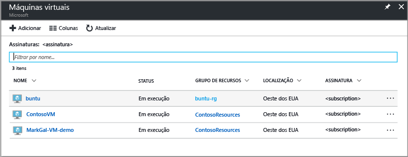

3. Na lista, selecione uma VM da qual fazer backup.

  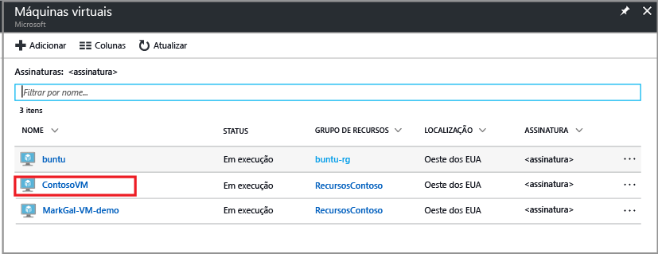

  Ao selecionar a VM, a lista de máquinas virtuais desloca-se para a esquerda e a folha de gerenciamento e o painel da máquina virtual são abertos.  
 

4. Na folha de gerenciamento da VM, na seção **Configurações**, clique em **Backup**.  

  

  A folha Habilitar backup.

  

5. Para o cofre de Serviços de Recuperação, clique em **Selecionar existente** e escolha o cofre na lista suspensa.

  

  Se não houver cofres de Serviços de Recuperação ou se você desejar usar um novo cofre, clique em **Criar novo** e forneça o nome para o novo cofre. Um novo cofre é criado no mesmo Grupo de Recursos e no mesmo local que a máquina virtual. Se desejar criar um cofre de Serviços de Recuperação com valores diferentes, consulte a seção sobre como [criar um cofre dos Serviços de Recuperação](backup-azure-vms-first-look-arm.md#create-a-recovery-services-vault-for-a-vm).

6. Para exibir os detalhes da política de Backup, clique em **Política de Backup**.

  A folha **Política de Backup** é aberta e os detalhes da política selecionada são fornecidos. Se houver outras políticas, use o menu suspenso para escolher uma política de backup diferente. Se você quiser criar uma política, selecione **Criar Nova** no menu suspenso. Para obter instruções sobre como definir uma política de backup, confira [Definindo uma política de backup](backup-azure-vms-first-look-arm.md#defining-a-backup-policy). Para salvar as alterações na política de backup e retornar à folha Habilitar Backup, clique em **OK**.

  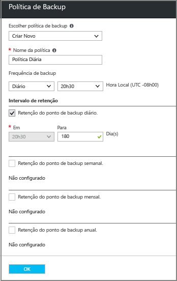

7. Na folha Habilitar backup, clique em **Habilitar Backup** para implantar a política. A implantação da política a associa ao cofre e às máquinas virtuais.

  

8. Você pode acompanhar o progresso da configuração através das notificações que aparecem no portal. O exemplo a seguir mostra que a Implantação foi iniciada.

  

9. Depois que a configuração for concluída, na folha de gerenciamento de VM, clique em **Backup** para abrir a folha Item de Backup e exibir os detalhes.

  

  Até que o backup inicial seja concluído, o **Status do último backup** é mostrado como **Aviso (Backup inicial pendente)**. Para ver quando o próximo trabalho de backup agendado ocorrerá, em **Política de Backup**, clique no nome da política. A folha Política de Backup é aberta e mostra a hora do backup agendado.

10. Para executar um trabalho de Backup e criar o ponto de recuperação inicial, na folha Cofre de Backup, clique em **Fazer Backup Agora**.

  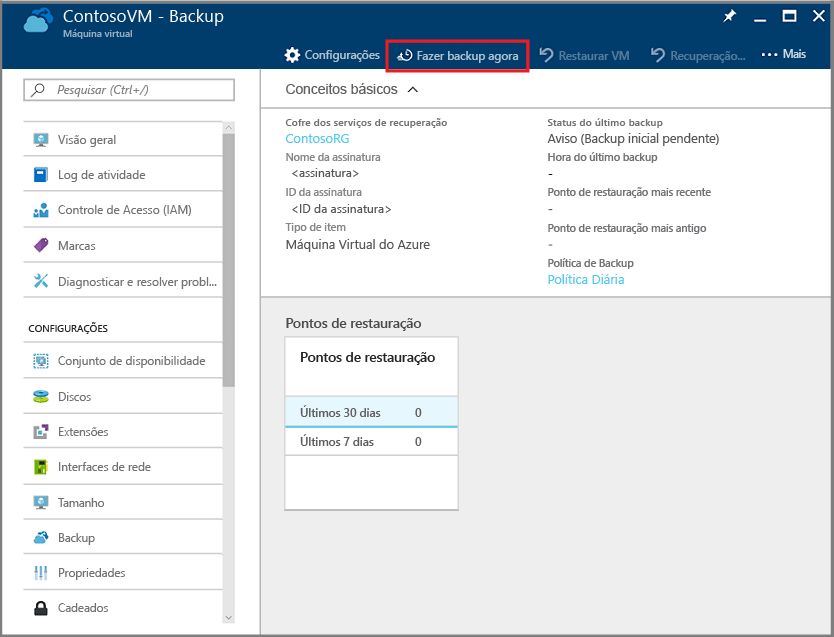

  A folha Fazer Backup Agora é aberta.

  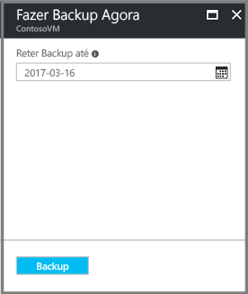

11. Na folha Fazer Backup Agora, clique no ícone de calendário, use o controle de calendário para selecionar o último dia de retenção desse ponto de recuperação e clique em **Fazer Backup**.

  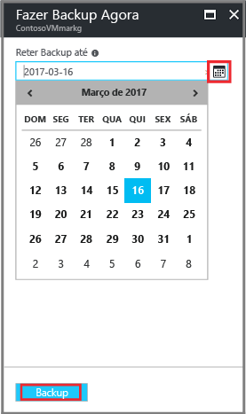

  As notificações de implantação informam que o trabalho de backup foi disparado, e que você pode monitorar o andamento do trabalho na página de Trabalhos de Backup.

## Configurar o trabalho de backup no Cofre de Serviços de Recuperação
Para configurar o trabalho de backup, conclua as etapas a seguir.  

1. Crie um cofre dos Serviços de Recuperação para uma máquina virtual.
2. Use o Portal do Azure para selecionar um Cenário, definir a Política de backup e identificar os itens a serem protegidos.
3. Executar o backup inicial.

## Criar um cofre de Serviços de Recuperação para uma VM
Um cofre de Serviços de Recuperação é uma entidade que armazena todos os pontos de backup e recuperação criados ao longo do tempo. O cofre de Serviços de Recuperação também contêm a política de backup aplicada às VMs protegidas.

> [!NOTE]
> Fazer backup das VMs é um processo local. Não é possível fazer backup das VMs de um local para um cofre de Serviços de Recuperação em outro local. Portanto, para cada local do Azure com VMs que devem sofrer backup, pelo menos um cofre de Serviços de Recuperação deve existir nesse local.
>
>

Para criar um cofre de Serviços de Recuperação:

1. Se ainda não tiver feito isso, entre no [portal do Azure](https://portal.azure.com/) usando a sua assinatura do Azure.
2. No menu do Hub, clique em **Mais Serviços** e, na caixa de diálogo Filtrar, digite **Serviços de Recuperação**. A lista de recursos é filtrada enquanto você digita. Quando vir a opção cofres dos Serviços de Recuperação na lista, clique nela.

      

    Se houver cofres dos Serviços de Recuperação na assinatura, os cofres serão listados.

    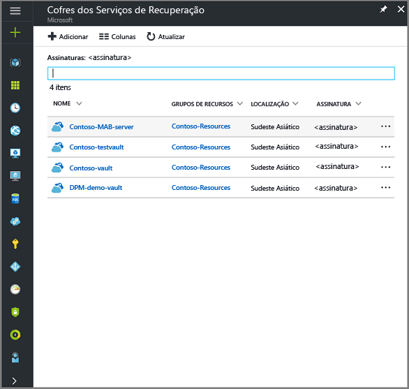
3. No menu **Cofres de Serviços de Recuperação**, clique em **Adicionar**.

    

    A folha do cofre dos Serviços de Recuperação será aberta, solicitando que você forneça o **Nome**, a **Assinatura**, o **Grupo de recursos** e o **Local**.

    

4. Em **Nome**, insira um nome amigável para identificar o cofre. O nome deve ser exclusivo para a assinatura do Azure. Digite um nome que contenha de 2 a 50 caracteres. Ele deve começar com uma letra e pode conter apenas letras, números e hifens.

5. Na seção **Assinatura**, use o menu suspenso para escolher a assinatura do Azure. Se você usar apenas uma assinatura, essa assinatura será exibida e você poderá pular para a próxima etapa. Se você não tiver certeza sobre qual assinatura usar, utilize a assinatura padrão (ou sugerida). Só haverá múltiplas opções se sua conta organizacional estiver associada a várias assinaturas do Azure.

6. Na seção **Grupo de recursos**:

    * selecione **Criar novo** se você quiser criar um Grupo de recursos.
    Ou
    * Selecione **Usar existente** e clique no menu suspenso para ver a lista de grupos de recursos disponíveis.

  Para obter informações completas sobre Grupos de recursos, confira a [Visão geral do Azure Resource Manager](../azure-resource-manager/resource-group-overview.md).

7. Clique em **Local** para selecionar a região geográfica do cofre. Essa escolha determina a região geográfica para a qual os dados de backup são enviados.

  > [!IMPORTANT]
  > Se você não souber ao certo em qual local sua VM se encontra, feche a caixa de diálogo de criação do cofre e vá para a lista de Máquinas Virtuais no portal. Se você tiver máquinas virtuais em várias regiões, crie um cofre de Serviços de Recuperação em cada região. Crie o cofre no primeiro local antes de ir para o próximo local. Não é necessário especificar as contas de armazenamento usadas para armazenar os dados do backup - o cofre dos Serviços de Recuperação e o serviço de Backup do Azure cuidarão do armazenamento automaticamente.
  >

8. Na parte inferior da folha Cofre dos Serviços de Recuperação, clique em **Criar**.

    Talvez demore alguns minutos para o cofre de Serviços de Recuperação ser criado. Monitore as notificações de status na área superior direita do portal. Depois que o cofre é criado, ele aparece na lista de cofres dos Serviços de Recuperação. Se após alguns minutos, você não vir seu cofre, clique em **Atualizar**.

     

    Depois de ver seu cofre na lista de cofres dos Serviços de Recuperação, você estará pronto para configurar a redundância de armazenamento.

Agora que você criou o cofre, saiba como configurar a replicação de armazenamento.

### Definir replicação de armazenamento
A opção de replicação de armazenamento permite que você escolha entre o armazenamento com redundância geográfica e armazenamento com redundância local. Por padrão, seu cofre tem armazenamento com redundância geográfica. Se o cofre dos Serviços de Recuperação for seu backup primário, deixe a opção de replicação do armazenamento definida para armazenamento com redundância geográfica. Escolha o armazenamento com redundância local se quiser uma opção mais barata que não seja tão durável. Leia mais sobre as opções de armazenamento com [redundância geográfica](../storage/common/storage-redundancy.md#geo-redundant-storage) e [redundância local](../storage/common/storage-redundancy.md#locally-redundant-storage) na [Visão geral da replicação do Armazenamento do Azure](../storage/common/storage-redundancy.md).

Para editar a configuração de replicação de armazenamento:

1. Na folha **Cofres dos Serviços de Recuperação**, selecione o novo cofre.

  

  Quando você seleciona o cofre, a folha Configurações (*que tem o nome do cofre na parte superior*) e a folha de detalhes do cofre abrem.

  

2. Na folha de configurações do novo cofre, use o slide vertical para rolar para baixo até a seção Gerenciar e clique em **Infraestrutura de Backup**.
    A folha Infraestrutura de Backup é aberta.
3. Na folha Infraestrutura de Backup, clique em **Configuração de Backup** para abrir a folha **Configuração de Backup**.

    
4. Escolha a opção de replicação de armazenamento adequada para o cofre.

    

    Por padrão, seu cofre tem armazenamento com redundância geográfica. Se você usar o Azure como um ponto de extremidade de armazenamento de backup principal, continue a usar **Georredundante**. Se você não usar o Azure como um ponto de extremidade de armazenamento de backup principal, escolha **Localmente redundante**, que reduz os custos de armazenamento do Azure. Leia mais sobre as opções de armazenamento [com redundância geográfica](../storage/common/storage-redundancy.md#geo-redundant-storage) e [com redundância local](../storage/common/storage-redundancy.md#locally-redundant-storage) nesta [Visão geral de redundância de armazenamento](../storage/common/storage-redundancy.md).

## Selecionar a meta de backup, definir a política e os itens a serem protegidos
Antes de registrar uma VM em um cofre, execute o processo de descoberta para garantir que todas as novas máquinas virtuais adicionadas à assinatura sejam identificadas. O processo consulta o Azure quanto à lista de máquinas virtuais na assinatura, juntamente com informações adicionais, como o nome do serviço de nuvem e a região. No portal do Azure, o cenário se refere ao que você vai colocar no cofre de serviços de recuperação. A Política é o agendamento para quando e com que frequência os pontos de recuperação serão feitos. A Política também inclui o período de retenção dos pontos de recuperação.

1. Se você já tiver um cofre dos Serviços de Recuperação aberto, vá para a etapa 2. Caso contrário, no menu do Hub, clique em **Mais serviços** e, na lista de recursos, digite **Serviços de Recuperação** e clique em **Cofres de Serviços de Recuperação**.

      

    A lista de cofres de Serviços de Recuperação aparecerá.

    

    Na lista de cofres de serviços de recuperação, selecione um cofre para abrir seu painel.

     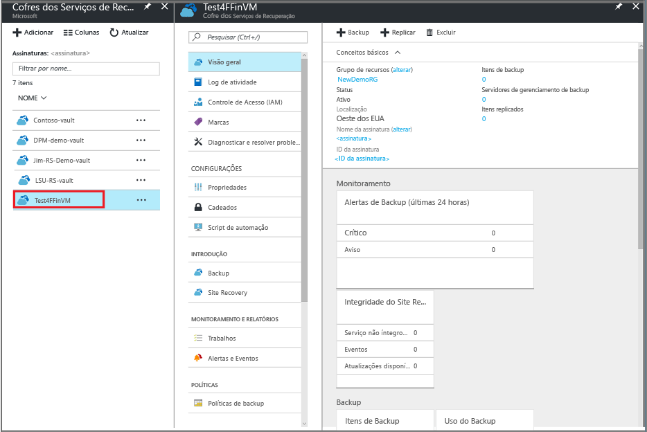

2. No menu do painel do cofre, clique em **Backup** para abrir a folha de backup.

    

    Abra as folhas de Backup e as folhas de Meta de backup.

    
3. Na folha Meta de Backup, no menu suspenso **Onde sua carga de trabalho é executada**, escolha Azure. No menu suspenso **Do que você deseja fazer backup**, escolha Máquina virtual e, em seguida, clique em **OK**.

    Essas ações registram a extensão da VM com o cofre. A folha Meta de backup fecha e a folha **Política de Backup** abre.

    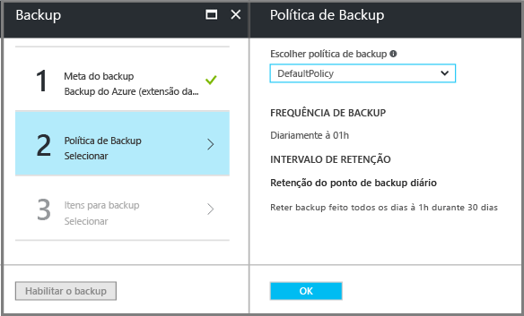

4. Na folha Política de backup, selecione a política de backup que você deseja aplicar ao cofre.

    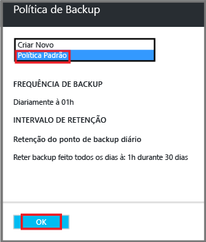

    Os detalhes da política padrão estão listados no menu suspenso. Se você quiser criar uma política, selecione **Criar Nova** no menu suspenso. Para obter instruções sobre como definir uma política de backup, confira [Definindo uma política de backup](backup-azure-vms-first-look-arm.md#defining-a-backup-policy).
    Clique em **OK** para associar a política de backup com o cofre.

    A folha Política de backup fecha e a folha **Seleção de máquinas virtuais** abre.
5. Na folha **Selecionar máquinas virtuais**, escolha as máquinas virtuais que serão associadas à política especificada e clique em **OK**.

    

    A máquina virtual selecionada é validada. Se não encontrar as máquinas virtuais que esperava, verifique se elas existem no mesmo local do Azure que o cofre de Serviços de Recuperação. O local do cofre dos serviços de recuperação é exibido no painel do cofre.

6. Agora que você definiu todas as configurações para o cofre, na folha Backup, clique em **Habilitar Backup** para implantar a política ao cofre e às VMs. A implantação da política de backup não cria o ponto de recuperação inicial para a máquina virtual.

    

Depois de habilitar o backup com êxito, a sua política de backup será executada no prazo especificado. No entanto, prossiga para iniciar o primeiro trabalho de backup.

## Backup inicial
Após a implantação de uma política de backup na máquina virtual, isso não significa que os dados sofreram backup. Por padrão, o primeiro backup agendado (como definido na política de backup) é o backup inicial. Até que o backup inicial ocorra, o Status do Último Backup na folha **Trabalhos de Backup** aparece como **Aviso (backup inicial pendente)**.

A menos que o backup inicial esteja prestes a começar, é recomendável que você execute **Fazer Backup Agora**.

Para executar o trabalho de backup inicial:

1. No painel do cofre, clique no número em **Itens de Backup**, ou clique no bloco **Itens de Backup**.  
  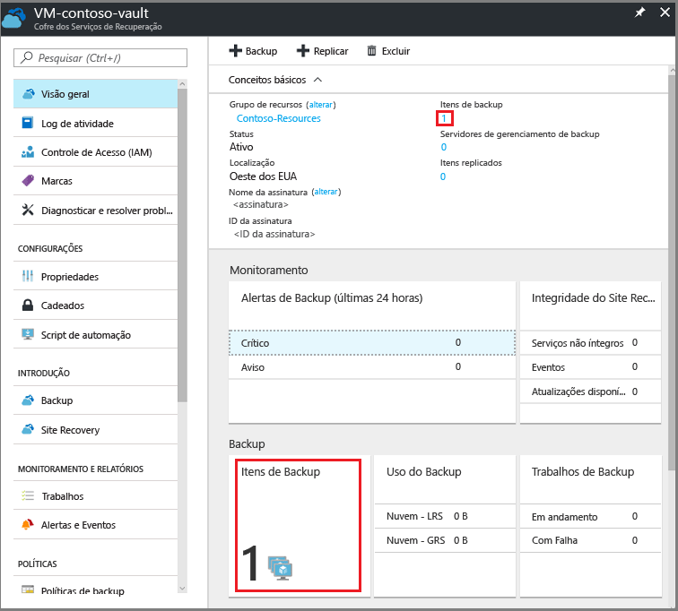

  A folha **Itens de Backup** será aberta.

  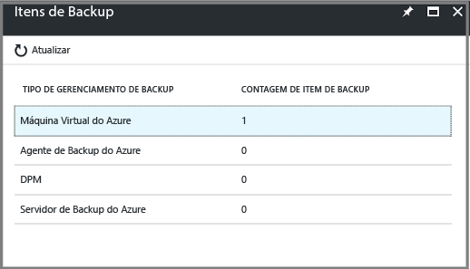

2. Na folha **Itens de Backup**, selecione o item.

  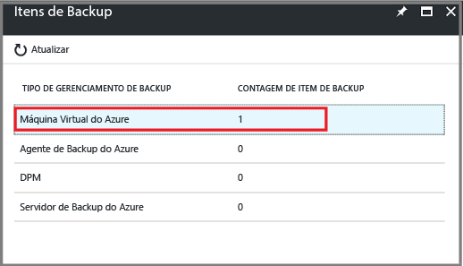

  A lista **Itens de Backup** será aberta.  

  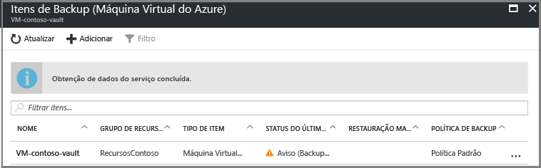

3. Na lista **Itens de Backup**, clique nas reticências **...** para abrir o menu de contexto.

  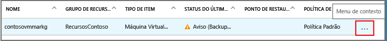

  O menu de contexto é exibido.

  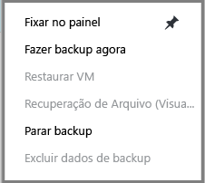

4. No menu de contexto, clique em **Fazer backup agora**.

  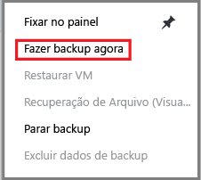

  A folha Fazer Backup Agora é aberta.

  

5. Na folha Fazer Backup Agora, clique no ícone de calendário, use o controle de calendário para selecionar o último dia de retenção desse ponto de recuperação e clique em **Fazer Backup**.

  

  As notificações de implantação informam que o trabalho de backup foi disparado, e que você pode monitorar o andamento do trabalho na página de Trabalhos de backup. Dependendo do tamanho da VM, a criação do backup inicial pode demorar um pouco.

6. Para exibir ou rastrear o status do backup inicial, no painel do cofre, no bloco **Trabalhos de Backup**, clique em **Em andamento**.

  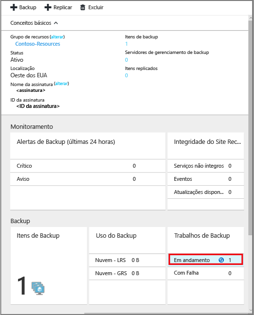

  A folha Trabalhos de Backup será aberta.

  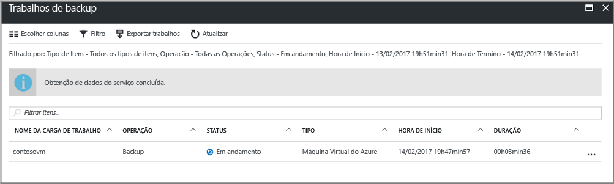

  Na folha **Trabalhos de backup** , você pode ver o status de todos os trabalhos. Verifique se o trabalho de backup de sua VM ainda está em andamento ou se já foi concluído. Após a conclusão do trabalho de backup, o status será *Concluído*.

  > [!NOTE]
  > Como parte da operação de backup, o serviço de Backup do Azure emite um comando para a extensão de backup em cada VM para limpar todas as gravações e capturar um instantâneo consistente.
  >
  >

[!INCLUDE [backup-create-backup-policy-for-vm](../../includes/backup-create-backup-policy-for-vm.md)]

## Instalar o Agente de VM na máquina virtual
Essas informações são fornecidas quando necessário. O Agente de VM do Azure deve ser instalado na máquina virtual do Azure para a extensão de Backup funcionar. Contudo, se sua VM foi criada a partir da galeria do Azure, o Agente de VM já estará presente na máquina virtual. As VMs migradas dos datacenters locais não teriam o Agente de VM instalado. Nesse caso, o Agente de VM precisa ser instalado. Se você tiver problemas para fazer backup da VM do Azure, verifique se o Agente de VM do Azure está instalado corretamente na máquina virtual (veja a tabela a seguir). Se você criar uma VM personalizada, [verifique se a caixa de seleção **Instalar o Agente de VM** está marcada](../virtual-machines/windows/classic/agents-and-extensions.md?toc=%2fazure%2fvirtual-machines%2fwindows%2fclassic%2ftoc.json) antes da máquina virtual ser provisionada.

Saiba mais sobre o [Agente de VM](https://go.microsoft.com/fwLink/?LinkID=390493&clcid=0x409) e [como instalá-lo](../virtual-machines/windows/classic/manage-extensions.md?toc=%2fazure%2fvirtual-machines%2fwindows%2fclassic%2ftoc.json).

A tabela a seguir oferece informações adicionais sobre o Agente de VM para VMs do Windows e do Linux.

| **Operação** | **Windows** | **Linux** |
| --- | --- | --- |
| Instalação do agente de VM |<li>Baixe e instale o [agente MSI](http://go.microsoft.com/fwlink/?LinkID=394789&clcid=0x409). Você precisa de privilégios de Administrador para concluir a instalação. <li>[Atualize a propriedade de VM](http://blogs.msdn.com/b/mast/archive/2014/04/08/install-the-vm-agent-on-an-existing-azure-vm.aspx) para indicar que o agente está instalado. |<li> Instale o [agente Linux](https://github.com/Azure/WALinuxAgent) mais recente do GitHub. Você precisa de privilégios de Administrador para concluir a instalação. <li> [Atualize a propriedade de VM](http://blogs.msdn.com/b/mast/archive/2014/04/08/install-the-vm-agent-on-an-existing-azure-vm.aspx) para indicar que o agente está instalado. |
| Atualizar o Agente de VM |Atualizar o agente de VM é tão simples quanto reinstalar os [Binários do Agente de VM](http://go.microsoft.com/fwlink/?LinkID=394789&clcid=0x409).  Verifique se nenhuma operação de backup está em execução enquanto o agente de VM está sendo atualizado. |Siga as instruções em [atualizando o agente de VM Linux](../virtual-machines/linux/update-agent.md?toc=%2fazure%2fvirtual-machines%2flinux%2ftoc.json).  Verifique se nenhuma operação de backup está em execução enquanto o agente de VM está sendo atualizado. |
| Validação da instalação do Agente de VM |<li>Navegue até a pasta *C:\WindowsAzure\Packages* na VM do Azure. <li>Você deve encontrar o arquivo WaAppAgent.exe presente.<li> Clique com o botão direito do mouse no arquivo, vá para **Propriedades** e selecione a guia **Detalhes**. O campo Versão do Produto deve ser 2.6.1198.718 ou mais recente. |N/D |

### Extensão de backup
Assim que o Agente de VM for instalado na máquina virtual, o serviço Backup do Azure instalará a extensão de backup no Agente de VM. O serviço do Backup do Azure atualiza e corrige perfeitamente a extensão de backup sem intervenção adicional do usuário.

O serviço de Backup instala a extensão de backup, mesmo se a VM não estiver em execução. Uma VM em execução oferece uma maior chance de obter um ponto de recuperação consistente com o aplicativo. No entanto, o serviço do Backup do Azure continuará a realizar o backup da VM mesmo quando ela estiver desativada e a extensão não puder ser instalada. Esse tipo de backup é conhecido como VM Offline, e o ponto de recuperação possui *controle de falhas*.

## Informações sobre solução de problemas
Se você tiver problemas para realizar algumas das tarefas neste artigo, confira as [Diretrizes da solução de problemas](backup-azure-vms-troubleshoot.md).

## Preços
O custo do backup de VMs do Azure tem base no número de instâncias protegidas. Para ter uma definição de uma instância protegida, confira [O que é uma instância protegida](backup-introduction-to-azure-backup.md#what-is-a-protected-instance). Para obter um exemplo de cálculo de custos do backup de uma máquina virtual, confira [Como são calculadas as instâncias protegidas](backup-azure-vms-introduction.md#calculating-the-cost-of-protected-instances). Consulte a página de Preços do Backup do Azure para saber os [Preços do Backup](https://azure.microsoft.com/pricing/details/backup/).

## Perguntas?
Se você tiver dúvidas ou gostaria de ver algum recurso incluído, [envie-nos seus comentários](http://aka.ms/azurebackup_feedback).

