# Introdução: Fazendo backup de máquinas virtuais do Azure
> [!div class="op_single_selector"]
> * [Proteger VMs em um cofre de serviços de recuperação](backup-azure-vms-first-look-arm.md)
> * [Proteger as VMs do Azure com um cofre de backup](backup-azure-vms-first-look.md)
>
>

Este tutorial explica as etapas para fazer backup de uma VM (máquina virtual) do Azure em um cofre de backup do Azure. Este artigo descreve o modelo clássico ou o modelo de implantação do Service Manager para fazer backup de máquinas virtuais. Se você estiver interessado em fazer backup de uma VM em um cofre de Serviços de Recuperação que pertence a um grupo de recursos, confira [Introdução: proteger VMs em um cofre de serviços de recuperação](backup-azure-vms-first-look-arm.md). Para concluir este tutorial com êxito, estes pré-requisitos devem existir:

* Você criou uma VM em sua assinatura do Azure.
* A VM tem conectividade com os endereços IP públicos do Azure. Para obter informações adicionais, veja [Conectividade de rede](backup-azure-vms-prepare.md#network-connectivity).

Para fazer backup de uma VM, há cinco etapas principais:  

 Criar um cofre de backup ou identifique um cofre de backup existente.  
 Usar o portal Clássico do Azure para descobrir e registrar as máquinas virtuais.  
 Instalar o Agente de VM.  
 Criar a política para proteger as máquinas virtuais.  
 Executar o backup.

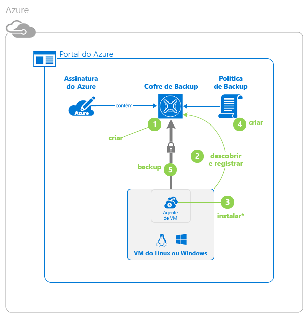

> [!NOTE]
> O Azure tem dois modelos de implantação para criar e trabalhar com recursos: [Gerenciador de Recursos e Clássico](../azure-resource-manager/resource-manager-deployment-model.md). Este tutorial é para uso com as VMs que podem ser criadas no portal Clássico do Azure. O serviço de Backup do Azure dá suporte a VMs baseadas no Gerenciador de Recursos. Para obter detalhes sobre como fazer backup de VMs em um cofre de serviços de recuperação, confira [Introdução: proteger VMs em um cofre de serviços de recuperação](backup-azure-vms-first-look-arm.md).
>
>

## Etapa 1 - Criar um cofre de backup para uma VM
O cofre de backup é uma entidade que armazena todos os pontos de backups e de recuperação criados ao longo do tempo. O cofre de backup também contém as políticas de backup que serão aplicadas às máquinas virtuais incluídas no backup.

1. Entre no [portal Clássico do Azure](http://manage.windowsazure.com/).
2. No canto inferior esquerdo do portal do Azure, clique em **Novo**

    
3. No Assistente de Criação Rápida, clique em **Serviços de Dados** > **Serviços de Recuperação** > **Cofre de Backup** > **Criação Rápida**.

    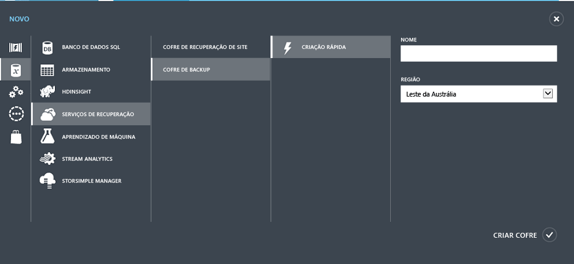

    O assistente solicitará o **Nome** e a **Região**. Se você administrar mais de uma assinatura, será exibida uma caixa de diálogo para que escolha a assinatura.
4. Em **Nome**, insira um nome amigável para identificar o cofre. O nome precisa ser exclusivo para a assinatura do Azure.
5. Em **Região**, selecione a região geográfica para o cofre. O cofre **deve** estar na mesma região que as máquinas virtuais a serem protegidas.

    Se não souber em qual região a VM existe, feche o assistente e clique em **Máquinas Virtuais** na lista de serviços do Azure. A coluna Local fornece o nome da região. Se você tiver máquinas virtuais em várias regiões, crie um cofre de backup em cada região.
6. Se não houver uma caixa de diálogo de **Assinatura** no assistente, vá para a próxima etapa. Se você trabalha com várias assinaturas, selecione uma assinatura para associar ao novo cofre de backup.

    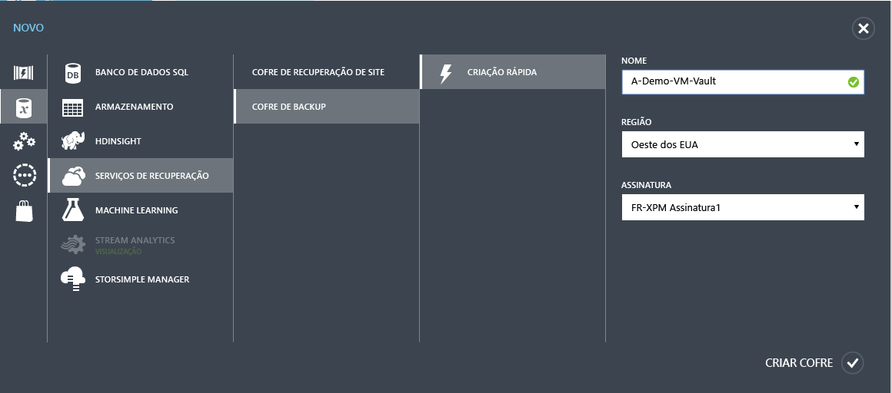
7. Clique em **Criar cofre**. Pode levar algum tempo para que o cofre de backup seja criado. Monitore as notificações de status na parte inferior do portal.

    

    Uma mensagem confirma que o cofre foi criado com êxito. Ele é listado na página **Serviços de recuperação** como **Ativo**.

    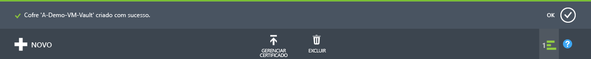
8. Na lista de cofres na página **Serviços de Recuperação**, selecione o cofre que você criou para iniciar a página **Início Rápido**.

    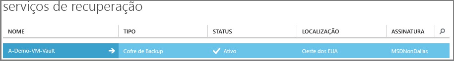
9. Na página **Início Rápido**, clique em **Configurar** para abrir a opção de replicação de armazenamento.
    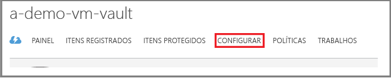
10. Na opção **replicação de armazenamento** , escolha a opção de replicação para o cofre.

    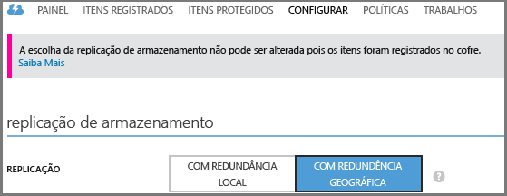

    Por padrão, seu cofre tem armazenamento com redundância geográfica. Escolha o armazenamento com redundância geográfica se esse for seu backup principal. Escolha o armazenamento com redundância local se quiser uma opção mais barata que não seja tão durável. Leia mais sobre as opções de armazenamento com redundância geográfica e redundância local na [Visão geral da replicação do Armazenamento do Azure](../storage/storage-redundancy.md).

Depois de escolher a opção de armazenamento para o cofre, você estará pronto para associar a VM ao cofre. Para iniciar a associação, descubra e registre as máquinas virtuais do Azure.

## Etapa 2 - Descobrir e registrar máquinas virtuais do Azure
Antes de registrar a VM em um cofre, execute o processo de descoberta para identificar novas VMs. Isso retorna uma lista de máquinas virtuais na assinatura, juntamente com informações adicionais, como o nome do serviço de nuvem e a região.

1. Entrar no [portal Clássico do Azure](http://manage.windowsazure.com/)
2. No portal clássico do Azure, clique em **Serviços de Recuperação** para abrir a lista de cofres dos Serviços de Recuperação.
    
3. Na lista de cofres, escolha o cofre para fazer backup de uma VM.

    Quando você seleciona o cofre, ele é aberto na página **Início Rápido**
4. No menu do cofre, clique em **Itens Registrados**.

    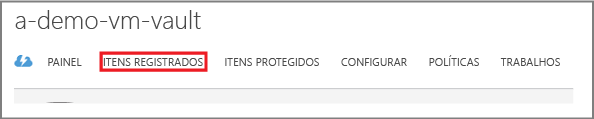
5. No menu **Tipo**, selecione **Máquina Virtual do Azure**.

    
6. Clique em **DESCOBRIR** na parte inferior da página.
    

    O processo de descoberta pode ser executado por alguns minutos, enquanto as máquinas virtuais estão sendo tabuladas. Há uma notificação na parte inferior da tela que informa você de que o processo está sendo executado.

    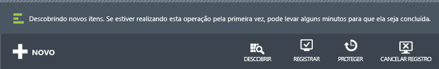

    As alterações de notificação quando o processo é concluído.

    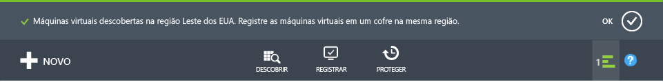
7. Clique em **REGISTRAR** na parte inferior da página.
    
8. No menu de atalho **Registrar Itens** , selecione as máquinas virtuais que você deseja registrar.

   > [!TIP]
   > Várias máquinas virtuais podem ser registradas ao mesmo tempo.
   >
   >

    Um trabalho é criado para cada máquina virtual selecionada.
9. Clique em **Exibir Trabalho** na notificação para ir para a página **Trabalhos**.

    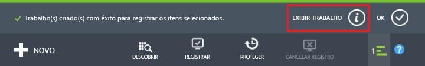

    A máquina virtual também aparece na lista de itens registrados junto com o status da operação de registro.

    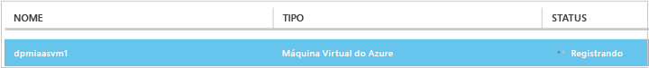

    Quando a operação for concluída, o status será alterado para refletir o estado *registrado* .

    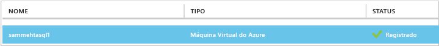

## Etapa 3 - Instalar o agente de VM na máquina virtual.
O Agente de VM do Azure deve ser instalado na máquina virtual do Azure para a extensão de Backup funcionar. Se sua VM tiver sido criada da galeria do Azure, o agente de VM já estará presente na VM. Você pode pular para [proteção de suas VMs](backup-azure-vms-first-look.md#step-4---create-the-backup-policy).

Se sua VM tiver migrado de um datacenter local, a VM provavelmente não terá o agente instalado. Você deve instalar o Agente de VM na máquina virtual antes de continuar a proteger a VM. Para obter etapas detalhadas sobre como instalar o Agente de VM, confira a [seção Agente de VM do artigo Backup de VMs](backup-azure-vms-prepare.md#vm-agent).

## Etapa 4 - Criar a política de backup
Antes de disparar o trabalho de backup inicial, defina a agenda de quando os instantâneos de backup serão feitos. A agenda de quando os instantâneos de backup são criados e por quanto tempo esses instantâneos serão mantido compõem a política de backup. As informações de retenção se baseiam no esquema de rotação de backup Avô-pai-filho.

1. Navegue até o cofre de backup, em **Serviços de Recuperação** no Portal Clássico do Azure e clique em **Itens Registrados**.
2. Selecione **Máquina Virtual do Azure** no menu suspenso.

    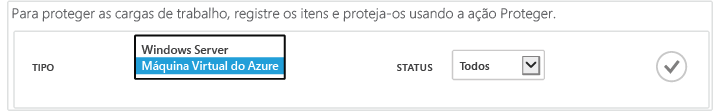
3. Na parte inferior da página, clique em **PROTEGER** .
    

    O **assistente Proteger Itens** é mostrado e lista *apenas* as máquinas virtuais registradas e não protegidas.

    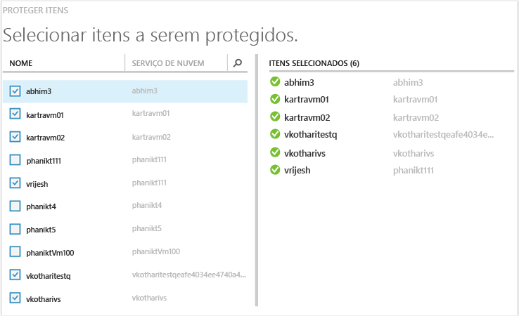
4. Selecione as máquinas virtuais que deseja proteger.

    Se houver duas ou mais máquinas virtuais com o mesmo nome, use o Serviço de Nuvem para distinguir entre elas.
5. No menu **Configurar proteção** , escolha uma política existente ou crie uma nova política para proteger as máquinas virtuais que você identificou.

    Os novos cofres de Backup têm uma política padrão associada ao cofre. Essa política usa um instantâneo diário a cada noite, e o instantâneo diário é mantido por 30 dias. Cada política de backup pode ter várias máquinas virtuais associadas a ela. No entanto, a máquina virtual só pode estar associada a apenas uma política de cada vez.

    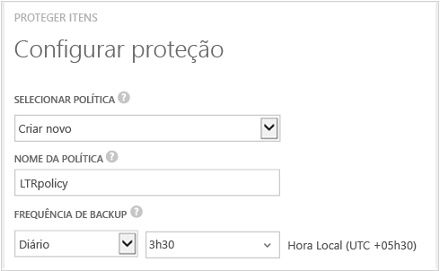

   > [!NOTE]
   > Uma política de backup também inclui um esquema de retenção para os backups agendados. Se você selecionar uma política de backup, não será possível modificar as opções de retenção na próxima etapa.
   >
   >
6. Em **Intervalo de Retenção** , defina o escopo diário, semanal, mensal e anual para os pontos de backup específicos.

    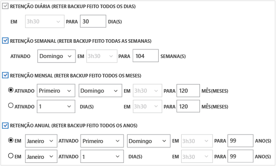

    A política de retenção especifica o período de armazenamento de um backup. Você pode especificar políticas de retenção diferentes com base em quando o backup é feito.
7. Clique em **Trabalhos** para exibir a lista de trabalhos de **Configurar Proteção**.

    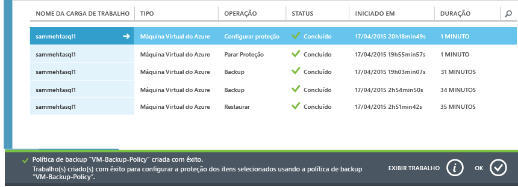

    Agora que a política foi estabelecida, vá para a próxima etapa e execute o backup inicial.

## Etapa 5 - Backup inicial
Após uma máquina virtual ser protegida com uma política, você poderá exibir essa relação na guia **Itens Protegidos** . Até que o backup inicial ocorra, o **Status de Proteção** será mostrado como **Protegido – (backup inicial pendente)**. Por padrão, o primeiro backup agendado é o *backup inicial*.

Para começar o backup inicial agora:

1. Na página **Itens Protegidos**, clique em **Fazer Backup Agora** na parte inferior da página.
    

    O serviço de Backup do Azure cria um trabalho de backup para a operação de backup inicial.
2. Clique na guia **Trabalhos** para exibir a lista de trabalhos.

    

    Após a conclusão do backup inicial, o status da máquina virtual na guia **Itens Protegidos** é *Protegida*.

    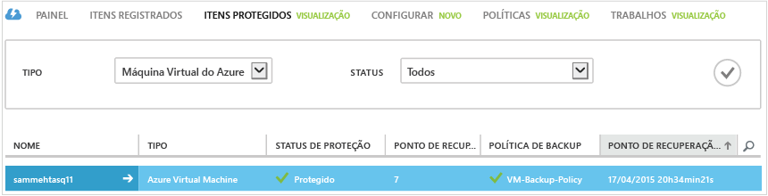

   > [!NOTE]
   > O backup de máquinas virtuais é um processo local. Você não pode fazer backup de máquinas virtuais de uma região em um cofre de backup em outra região. Assim, para todas as regiões do Azure que tenham VMs que precisem de backup, pelo menos um cofre de backup deverá ser criado nessa região.
   >
   >

## Próximas etapas
Agora que você já fez um backup de uma VM, há várias etapas subsequentes pode poderiam ser interessantes. A etapa mais lógica é se familiarizar com a restauração de dados para uma máquina virtual. No entanto, há tarefas de gerenciamento que o ajudarão a entender como manter os dados seguros e minimizar os custos.

* [Gerenciar e monitorar suas máquinas virtuais](backup-azure-manage-vms.md)
* [Restaurar máquinas virtuais](backup-azure-restore-vms.md)
* [Diretrizes de solução de problemas](backup-azure-vms-troubleshoot.md)

## Perguntas?
Se você tiver dúvidas ou gostaria de ver algum recurso incluído, [envie-nos seus comentários](http://aka.ms/azurebackup_feedback).

<!--HONumber=Nov16_HO4-->

