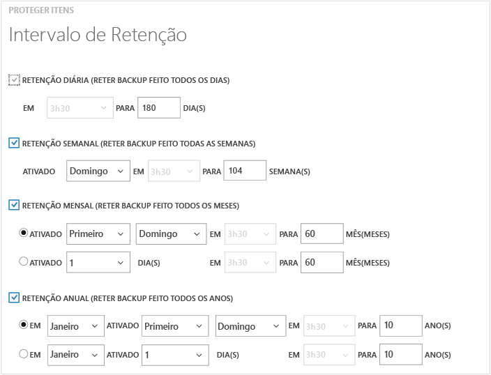

<properties
	pageTitle="Fazendo backup de máquinas virtuais do Azure | Microsoft Azure"
	description="este artigo fornece os procedimentos para fazer backup de uma máquina virtual do Azure."
	services="backup"
	documentationCenter=""
	authors="Jim-Parker"
	manager="jwhit"
	editor=""/>

<tags
	ms.service="backup"
	ms.workload="storage-backup-recovery"
	ms.tgt_pltfrm="na"
	ms.devlang="na"
	ms.topic="hero-article"
	ms.date="10/23/2015"
	ms.author="trinadhk; aashishr; jimpark; markgal"/>

# Fazendo backup de máquinas virtuais do Azure
Este artigo fornece os procedimentos para fazer backup de máquinas virtuais existentes no Azure, para protegê-las de acordo com as políticas de backup e de retenção da sua empresa.

Primeiro, há algumas coisas que você precisa fazer antes de poder fazer backup de uma máquina virtual do Azure. Se ainda não tiver feito isto, conclua os [pré-requisitos](backup-azure-vms-prepare.md) para preparar o ambiente para o backup de VM antes de continuar.

Se você estiver procurando informações sobre o [planejamento da sua infraestrutura de backup de VM no Azure](backup-azure-vms-introduction.md) ou de [máquinas virtuais do Azure](https://azure.microsoft.com/documentation/services/virtual-machines/), siga estes links para obter essas informações.

Fazer o backup de máquinas virtuais do Azure envolve três etapas principais:

>[AZURE.NOTE]O backup de máquina virtual é local. Você não pode fazer backup de máquinas virtuais de uma região em um cofre de backup em outra região. Assim, pelo menos um cofre de backup deve ser criado para cada região do Azure com VMs que precisam de backup.

## Etapa 1 - Descobrir máquinas virtuais do Azure
O processo de descoberta sempre deve ser executado como a primeira etapa para garantir que qualquer nova máquina virtual adicionada à assinatura seja identificada. O processo consulta o Azure quanto à lista de máquinas virtuais na assinatura, juntamente com informações adicionais, como o nome do Serviço de Nuvem e a Região.

1. Navegue até o cofre de backup, em **Serviços de Recuperação** no portal do Azure e clique em **Itens Registrados**.

2. Selecione **Máquina Virtual do Azure** no menu suspenso.

    

3. Clique em **DESCOBRIR** na parte inferior da página. 

    O processo de descoberta pode ser executado por alguns minutos, enquanto as máquinas virtuais estão sendo tabuladas. Há uma notificação na parte inferior da tela que informa você de que o processo está sendo executado.

    

    As alterações de notificação quando o processo é concluído.

    

##  Etapa 2 - Registrar as máquinas virtuais do Azure
Você registra uma máquina virtual do Azure para associá-la ao serviço Backup do Azure. Normalmente, é uma atividade realizada uma única vez.

1. Navegue até o cofre de backup, em **Serviços de Recuperação** no portal do Azure e clique em **Itens Registrados**.

2. Selecione **Máquina Virtual do Azure** no menu suspenso.

    

3. Clique em **REGISTRAR** na parte inferior da página. 

4. No **menu de atalho Registrar Itens**, selecione as máquinas virtuais que você deseja registrar. Se houver duas ou mais máquinas virtuais com o mesmo nome, use o serviço de nuvem para distinguir entre elas.

    >[AZURE.TIP]Várias máquinas virtuais podem ser registradas ao mesmo tempo.

    Um trabalho é criado para cada máquina virtual selecionada.

5. Clique em **Exibir Trabalho** na notificação para ir para a página **Trabalhos**.

    

   A máquina virtual também aparece na lista de itens registrados junto com o status da operação de registro.

    

    When the operation completes, the status will change to reflect the *registered* state.

    

## Etapa 3 - Proteger máquinas virtuais do Azure
Agora você pode configurar uma política de backup e de retenção para a máquina virtual. Várias máquinas virtuais podem ser protegidas em escala usando uma única ação de proteção.

Os cofres do Backup do Azure criados depois e3 maio de 2015 poderão vir com uma política padrão incorporada ao cofre. Essa política padrão é fornecida com uma retenção padrão de 30 dias e agendamento de backup de uma vez por dia.

1. Navegue até o cofre de backup em **Serviços de Recuperação** no portal do Azure e clique em **Itens Registrados**.
2. Selecione **Máquina Virtual do Azure** no menu suspenso.

    

3. Na parte inferior da página, clique em **PROTEGER**.

    O **assistente Proteger Itens** é exibido. Esse assistente lista apenas as máquinas virtuais registradas e não protegidas. Aqui você seleciona as máquinas virtuais que deseja proteger.

    Se houver duas ou mais máquinas virtuais com o mesmo nome, use o serviço de nuvem para distinguir entre elas.

    >[AZURE.TIP]Você pode proteger várias máquinas virtuais de uma só vez.

    

4. Escolha um **agendamento de backup** para fazer o backup das máquinas virtuais que você selecionou. Escolha um conjunto existente de políticas ou defina um novo.

    Cada política de backup pode ter várias máquinas virtuais associadas a ela. No entanto, a máquina virtual só pode estar associada a apenas uma política em um determinado ponto no tempo.

    

    >[AZURE.NOTE]Uma política de backup também inclui um esquema de retenção para os backups agendados. Se você selecionar uma política de backup, não será possível modificar as opções de retenção na próxima etapa.

5. Escolha um **intervalo de retenção** a ser associado aos backups.

    

    A política de retenção especifica o período de tempo para armazenar um backup e você pode especificar diferentes políticas de retenção com base em quando o backup é feito. Por exemplo, um ponto de backup criado no final de cada trimestre talvez precise ser preservado por um período maior (para fins de auditoria), enquanto o ponto de backup feito diariamente, que funciona como um ponto de recuperação operacional, só deverá ser preservado por 90 dias.

    

    Nesta imagem de exemplo:

    - **Política de retenção diária**: os backups diários são armazenados por 30 dias.
    - **Política de retenção semanal**: os backups semanais aos domingos serão armazenados por 104 semanas
    - **Política de retenção mensal**: os backups mensais no último domingo do mês serão armazenados por 120 meses
    - **Política de retenção anual**: os backups no primeiro domingo de cada mês de janeiro serão armazenados por 99 anos.

    Um trabalho é criado para configurar a política de proteção e associar as máquinas virtuais a essa política para cada máquina virtual selecionada.

6. Clique na guia **Trabalho** e escolha o filtro correto para exibir a lista de trabalhos do tipo **Configurar Proteção**.

    

## Backup inicial
Uma vez protegida com uma política, a máquina virtual será exibida na guia **Itens Protegidos** com o status *Protegida (pendente de backup inicial)*. Por padrão, o primeiro backup agendado é o *backup inicial*.

Para disparar o backup inicial imediatamente após a configuração de proteção:

1. Clique no botão **Fazer Backup Agora** na parte inferior da página **Itens Protegidos**.

    O serviço de Backup do Azure cria um trabalho de backup para a operação de backup inicial.

2. Clique na guia **Trabalhos** para exibir a lista de trabalhos.

    

>[AZURE.NOTE]Como parte da operação de backup, o serviço de Backup do Azure emite um comando para a extensão de backup em cada máquina virtual para limpar todas as gravações e capturar um instantâneo consistente.

Após a conclusão do backup inicial, o status da máquina virtual na guia **Itens Protegidos** será *Protegida*.

## Exibindo detalhes e status do backup
Depois de protegido, a contagem de máquina virtual também aumenta no resumo da página **Painel**. A página **Painel** também mostra o número de trabalhos das últimas 24 horas que obtiveram *êxito*, que *falharam* e que ainda estão *em andamento*. Clicar em qualquer categoria detalhará tal categoria na página **Trabalhos**.

Os valores no painel são atualizados a cada 24 horas.

## Solucionar erros
Se você tiver problemas durante o backup da sua máquina virtual, dê uma olhada nestas diretrizes de [solução de problemas](backup-azure-vms-troubleshoot.md) para obter ajuda.

## Próximas etapas

- [Gerenciar e monitorar suas máquinas virtuais](backup-azure-manage-vms.md)
- [Restaurar máquinas virtuais](backup-azure-restore-vms.md)

<!---HONumber=Nov15_HO1-->